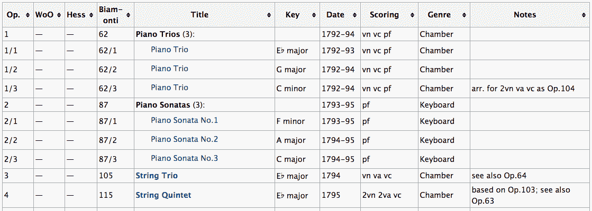
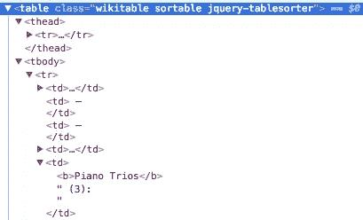
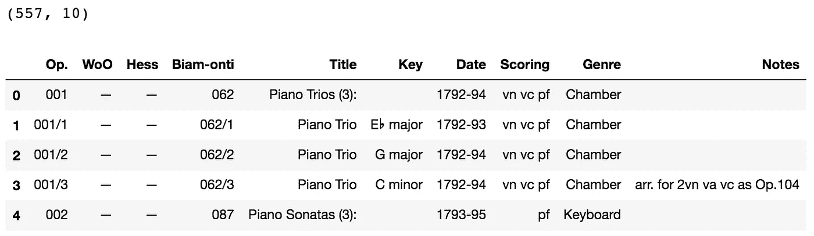
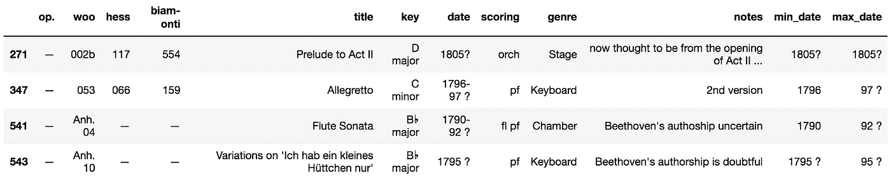
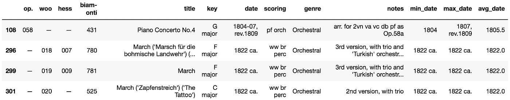
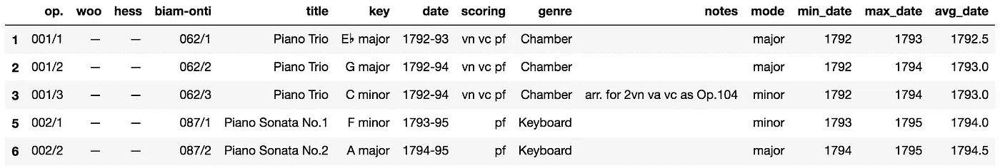

# 可视化贝多芬的全部作品，第一部分:从 IMSLP 中收集和清理数据

> 原文：<https://towardsdatascience.com/visualizing-beethovens-oeuvre-part-i-scraping-and-cleaning-data-from-imslp-77ecb124002d?source=collection_archive---------3----------------------->


这篇文章是我写的一个简短教程系列的第一部分，记录我在一个个人兼职项目中的进展，我希望在这个项目中分析和可视化贝多芬的全部作品。这个项目的目标是探索音乐和情感之间的联系，同时也尝试不同的可视化音乐数据的方法，特别是关于颜色。

自从我开始玩数据，我就想找到新的有趣的方法来结合我对音乐和数据的兴趣。最近很好奇音乐艺术家在整个职业生涯中是如何发展变化的。这个问题的一个方面是，我特别感兴趣的是，艺术家使用的调式是否会随着时间而改变，如果是这样，这些改变是否有任何可以解释的模式，可以追溯到传记的细节。很多人在乐理中遇到的第一个想法就是“大调=快乐”和“小调=悲伤”的联想。显然，这是对音乐带给我们的感受的过于简化的简化，但这些咒语在帮助年轻音乐家区分两种模式方面的有效性表明了音乐和情感的普遍性。

更进一步，在古典音乐中，理论家和作曲家早就[讨论过不同的调有不同的特征的观点](http://biteyourownelbow.com/keychar.htm)。最近，我也成了雅各布·科利尔的粉丝，他[形容](https://www.youtube.com/watch?v=syXeVa_Rl0I)他对音高的习得和对和弦的理解强烈植根于他自己的抽象感觉，随着时间的推移，他学会了适应这些感觉。作为一名音乐家，我自己主观上也经历过这种情况，我当然也有朋友有类似的感受。比如 Db 专业，因为一些莫名其妙的原因，一直让我觉得“自省”。这种联想似乎相当主观和个性化，但我很好奇它们是否在创作过程和基调选择过程中对作曲家和词作者产生了某种影响，无论是在意识还是潜意识层面。

为了研究这些观点，我决定钻研路德维希·范·贝多芬的全部作品，在大学最后一个学期，我上了一门名为“浪漫时代的音乐”的课，对他的音乐有了新的欣赏。贝多芬的全部作品特别适合这种类型的分析，因为贝多芬的生活和作品被很好地记录了下来。学者们将贝多芬的一生典型地划分为三个时期(T3)，他的作品被很好地组织到不同的目录(T5)中(T4)。此外，至少有一些证据表明，贝多芬意识到不同的调有不同的特点，并在选择他的调号时考虑到了它们的情感属性。虽然贝多芬的数据点较少，因为他没有像莫扎特或巴赫等其他巨人那样发表过很多作品，但他在历史上因是情感大师而受到尊敬，这更符合我第一轮分析的目标。我特别感兴趣的是，看看我们是否能从贝多芬的早年和晚年的比较中收集到什么信息。贝多芬晚年开始丧失听力，最终死于抑郁症和酗酒。

在本文中，我将介绍我为这个项目获取数据的过程，并将数据转换成适合 Python 3 分析的形式。对于数据科学家来说，这个过程并不是工作中最迷人的部分，但根据我的经验，它通常是最重要的(也是最耗时的)。为了简洁起见，在本演练中我将只介绍我的代码的主要亮点，但是您可以在我的 [GitHub](https://github.com/mzhang13/visualizing_beethoven_oeuvre) 上找到我的完整的、带注释的 Jupyter 笔记本，其中记录了本文涉及的所有内容，以及我的所有失败和成功。

## 查找和搜集数据

在研究了音乐学家如何从历史上组织贝多芬的全部作品后，我试图找到一个包含他的作品的完整数据库的资源。虽然[维基百科](https://en.wikipedia.org/wiki/List_of_compositions_by_Ludwig_van_Beethoven)有一个广泛的、维护良好的贝多芬作品页面，但我决定使用[国际乐谱图书馆项目](http://imslp.org/) (IMSLP)来收集数据进行分析，主要是因为贝多芬的全部作品已经以表格形式存在于他们的网站上，有多个目录系统。作为参考，这是他们桌子的样子。



Source: [http://imslp.org/wiki/List_of_works_by_Ludwig_van_Beethoven](http://imslp.org/wiki/List_of_works_by_Ludwig_van_Beethoven)

为了抓取这个表格，我使用了[美汤](https://www.crummy.com/software/BeautifulSoup/)，这是一个强大的 Python 包，用于从网站抓取数据。首先，我检索了网页的 HTML，将其转换为一个 BeautifulSoup 对象，该对象可用于通过 HTML 元素和属性访问信息。

```
import requestsimport pandas as pd
from bs4 import BeautifulSoupurl = "http://imslp.org/wiki/List_of_works_by_Ludwig_van_Beethoven"
page = requests.get(url)
soup = BeautifulSoup(page.text, 'html.parser')
```

为了找出从“汤”中提取我感兴趣的数据的最佳方式，我检查了页面上的 table 元素本身，看看它是如何组织的。似乎是一个巨大的容器元素，行的元素包含单元格的父元素轻松访问)。

| 元素，列名的 | 元素(未显示，但可以通过向下进入 |



On Google Chrome, you can do this by right clicking => “Inspect”

为了便于阅读，我首先将 table 元素存储为它自己的变量。使用它，我然后遍历它的行以获得所有的和单元格，因为在这里调用 findAll()会返回一个元素列表，这些元素匹配传递到函数中的任何标签。方便的是，这两种单元格类型都有一个. text 属性，我可以调用它从每个单元格中获取文本。在这个过程中，我做了一些清理，最终得到了一个列表列表(2D 数组)，它很容易就变成了熊猫数据帧。

```
table = soup.find("table")table_text = []

for row in table.findAll("tr"):
    cells = row.findAll(["th", "td"])
 *# Remove new line from each string in the process*
    cell_contents = [cell.text.replace("\n", "") for cell in cells]
    table_text.append(cell_contents)raw_works = pd.DataFrame(table_text[1:], columns = table_text[0])
```



Initial DataFrame stored in “raw_works” and its shape

看起来和原始网页上的表格一模一样！然而，刮削只是这一过程的第一步。在我尝试从数据中提取任何有趣的东西之前，数据需要被清理得更多。

## 清理和争论数据

首先，我将所有的列名都变成小写，然后删除没有日期的行，因为这些行对我的目的没有用(而且，它们中的许多都有注释，表明作者是可疑的)。类似地，没有键的行也没有用，所以我删除了它们，这样 IMSLP 就可以用它们来表示组合组。

```
df = raw_works.copy() # Generally, I like to preserve the original
df.columns = [column.lower() for column in df.columns]len(df[df["date"] == ""]) # 10
df = df[df["date"] != ""]len(df[df["key"] == ""]) # 146
df = df[df["key"] != ""]
```

由于我的探索和想象主要与随着时间的推移调与调式的变化有关，我想看看贝多芬的全部作品中表现了哪些调。

```
df["key"].nunique()
df["key"].unique()
```


Looks like we got some multi-key action… I’ll deal with this next time

请记住，这些键分类并不意味着整个作品始终保持相同的键(事实上，很可能不是这样)；更确切地说，它们只是指出了贝多芬选择并列为作品基础的主调。看起来贝多芬更喜欢远离有 4 个以上临时记号的键，F#大调和 Bb 小调除外…让我们来调查一下。

```
len(df[df["key"] == "F♯ major"]) # 1
len(df[df["key"] == "B♭ minor"]) # 1df[df["key"] == "B♭ minor"]
```


Translation: “To Hope”

根据资料，贝多芬只写过一首 Bb 小调的曲子，我觉得有点奇怪，所以我决定跟进。看《安蝶·霍夫农》的[分数](http://imslp.org/wiki/An_die_Hoffnung,_Op.32_(Beethoven,_Ludwig_van))，好像这首曲子其实是 Eb 大调，于是进去做了一个快速的手动修复。

```
df.loc[df[“key”] == Bb minor”, “key”] = “Eb major”
```

F#大调单首曲子是贝多芬的[《泰雷兹》钢琴奏鸣曲](https://www.hyperion-records.co.uk/tw.asp?w=W14432)，所以那里不需要做任何改动。

为了将每个组合分为大调或小调，我以函数的形式写出了一些条件逻辑，应用于我的“key”列，暂时将罕见的多键异常视为“other”。

```
def decide_key(key):
    if "major" in key:
        if "minor" not in key:
            return "major"
        else:
            return "other"
    elif "minor" in key:
        if "major" not in key:
            return "minor"
        else:
            return "other"
    else:
        return Nonedf["mode"] = df["key"].apply(decide_key)
```

接下来，让我们看看日期。

```
df["date"].min(), df["date"].max()
```

> (‘ -’, ‘ — ‘)

看起来有些非数字文本值漏掉了，所以我使用一些正则表达式匹配对“date”列进行了过滤，以确保我的 DataFrame 只包含“date”列中的值至少包含一个数字的行。

```
df = df[df["date"].apply(lambda x: bool(re.search("[0-9]", x)))]
df["date"].min(), df["date"].max()
```

> (‘1782’, ‘1826’)

太好了！但是，正如您从数据帧头部的早期图片中看到的，许多日期值似乎是范围而不是具体年份，因为贝多芬作品的确切时间并不总是为人所知。

作为一个临时解决方案，我决定创建新的日期栏，以他的作品的最小、最大和平均年份为特色，为自己提供最大的灵活性，以便我可以在以后决定我到底想如何处理这个问题。为了实现这一点，我使用了一点字符串解析，依赖于所有范围都遵循“XXXX-YY”格式的假设，允许我将“-”传递给 str.split()函数以获得破折号前后的数字。因为 str.split()返回由传入的分隔符分隔的字符串列表，所以查找最小日期很简单，因为我可以只取列表的第一个值。最大日期有点棘手，因为我必须从字符串的第一部分提取世纪，然后将它添加到第二部分，同时还要考虑范围格式变为“XXXX-YYYY”的偶然情况，因为组合跨越了从 18 世纪到 19 世纪的过渡

```
# Just so I know how many dates are ranges first
len(df[df["date"].str.contains("-")]) # 167df["min_date"] = df["date"].apply(lambda x: x.split("-")[0] if "-" in x else x)# Need to add the first two characters for second part of range
df["max_date"] = df["date"].apply(lambda x: x[0:2] + x.split("-")[1] if "-" in x else x)# Need to fix of turn of century exception
df["max_date"] = df["max_date"].apply(lambda x: x[2:] if len(x) == 6 else x) #
```

在获得最小和最大年份之后，我想将这些字符串转换成整数，这样我就可以找到它们的中点，但是当我尝试时，我得到了一些错误，暴露了一些我必须解决的新的数据输入障碍。很快地看了一眼，似乎我的一些日期有问号，表明对确切的日期甚至日期范围的一些不确定性。

```
df[df["date"].str.contains("\?")]
```



?

由于注释表明其中一些已经是可疑的条目，并且只有极少数的日期具有这种模糊性，所以我决定暂时将它们从我的数据中删除。

```
df = df[~df["date"].str.contains("\?")]
```

在尝试了另一种到整数的转换后，我发现一些日期仍然有非数字字符。

```
# Create a list of all possible characters for the standard date range convention used here
chars_to_match = [str(x) for x in list(range(10)) + ["-"]]df[df["date"].apply(lambda x: any(char not in chars_to_match for char in x))]
```



(ca. = circa, rev. = revision)

幸运的是，没有太多的行有这个问题，所以我决定半手工地修复这些讨厌的异常，在原始日期列的值中保留额外的信息。

```
df["min_date"] = df["min_date"].str.replace(" ca.", "")
df["max_date"] = df["max_date"].str.replace(" ca.", "")df.loc[df["max_date"].str.contains("rev"), "max_date"] = 1807
```

瞧啊。这个修复允许我最终将最小和最大年份转换为整数，并取它们的平均值来创建我的“avg_date”列。

```
df["min_date"] = df["min_date"].apply(int)
df["max_date"] = df["max_date"].apply(int)df["avg_date"] = (df["min_date"] + df["max_date"]) / 2
```

让我们看看我的最终数据框架。

```
df.head()
```



(I have a feeling that there will still be a lot of manual work ahead…)

正如我提到的，有一些小的清理步骤和检查，我选择不包括在本文中，需要注意的新事物总是会出现，所以这里显示的最终数据帧不一定是我将在本项目的其余部分中使用的确切数据帧。当然，这里没有显示的任何更改或添加都将保留在这个项目的 [Github 库](https://github.com/mzhang13/visualizing_beethoven_oeuvre)中。

在我的下一篇文章中，我将解决如何更深入地分析和可视化这些数据的问题。我边走边写，所以我还不确定我最后的努力会把我带到哪里，但我脑海中有一些想法(例如，旭日图，“滚动讲述”时间线，动画回放示例)。敬请期待下篇文章一探究竟！

*如果你是我作品的粉丝，请👏下面这篇文章。如果你想了解我正在做的任何事情的最新进展，一定要关注我的* [*推特*](https://twitter.com/mzhang13) *！*