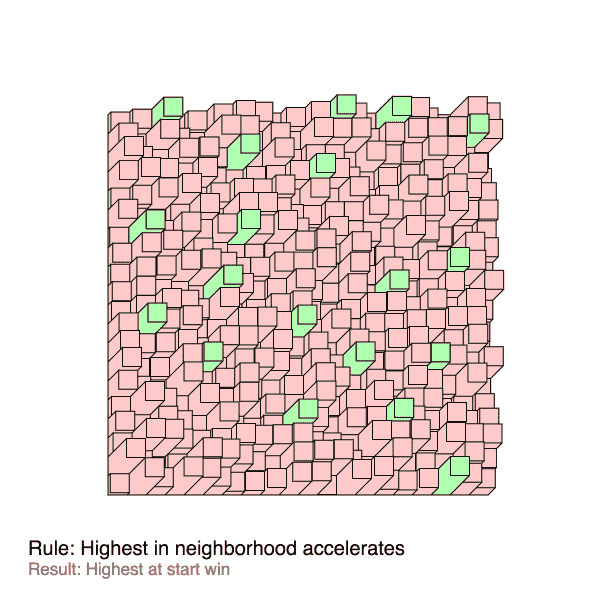
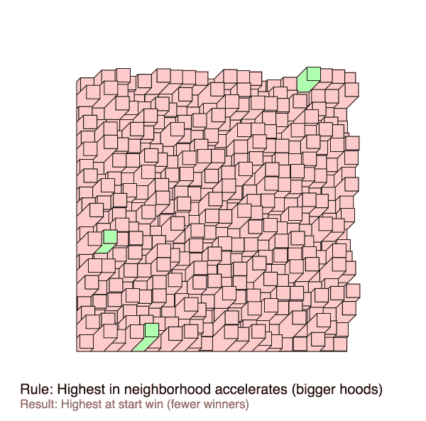
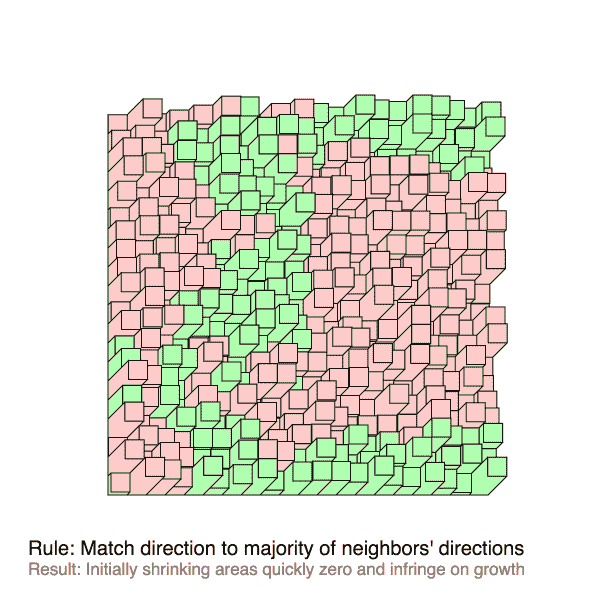
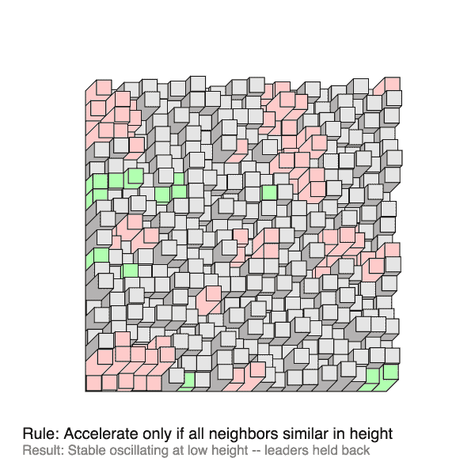
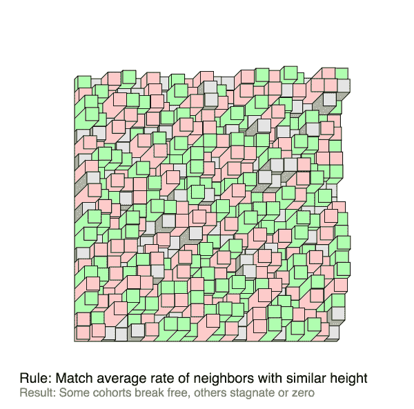

# 可视化竞争和协作

> 原文：<https://towardsdatascience.com/visualizing-competition-collaboration-7e1b38f99f2a?source=collection_archive---------0----------------------->

我最近一直在欣赏扎克·利伯曼的《T2》草图，并开始思考类似的基于细胞的动画，在这些动画中，细胞与邻近的其他细胞进行动态互动。我尝试了各种竞争和合作的互动方式。回想起来，这些结果让人想起进化捕食者/猎物模拟([就像这些](https://www.google.com/search?q=evolution+simulation+predator+prey&tbm=isch&tbs=rimg:CSQwpHwqHAs-IjiGnNjbN9BCxsxczqdju3iAEyEN0dQuIZEghNQGqap4jg1PjQlSMnoWApGilcMPCZoZ3fjjg53vGCoSCYac2Ns30ELGEdDk8zJ5owAoKhIJzFzOp2O7eIARG7RPcPmZIqsqEgkTIQ3R1C4hkRGFkYxWyAo-IioSCSCE1AapqniOEfZ4Fylv-FLcKhIJDU-NCVIyehYRFNf_1N2G2jDkqEgkCkaKVww8JmhHZjFOsIt-k_1SoSCRnd-OODne8YEZxEOQ6pqQ_1e&tbo=u&sa=X&ved=0ahUKEwjOqbShgdbRAhVNkRQKHSMXDpoQ9C8ICQ&biw=973&bih=635&dpr=2))——我发现越来越多的城市景观可视化有点引人注目(尽管没有扎克的草图那么有审美趣味)。

所有实验的规则/限制:

*   所有细胞都被初始化为小的随机高度和小的随机生长率(正和负)
*   如果所有单元都没有高度，或者任何单元达到 100(有时永远不会达到)，则模拟结束
*   每个细胞的动态完全由一个函数描述，该函数传递细胞的状态及其所有邻居，并返回其生长率的单一变化(可以是向上、向下或零)
*   当生长率下降(变得更负)时，细胞被染成红色，当生长率上升时，细胞被染成绿色。否则为灰色。
*   邻域大小可以变化(这里它们的半径在 1 到 5 之间)

每一个都标有所用规则的叙述和结果的解释。由于随机初始化，其中一些在每次运行时看起来非常不同。

## 琐碎的审判

## 稍微有趣一点

外卖:

*   在某些情况下，将一个概念(我对动态如何工作的假设)转化为预期的结果是非常困难的。动力系统直觉不好？
*   许多复杂的规则很快崩溃为琐碎的结果——建立平衡(以创造稳定性)有时是具有挑战性的。
*   闪烁是逻辑卡在两种状态之间的线上的结果——缓冲器或动量的某种实现会有所帮助。

代码(都是用 [paper.js](http://paperjs.org) 做的)这里是[这里是](https://github.com/onejgordon/sketches/blob/master/wip/sketches/competition.js)。