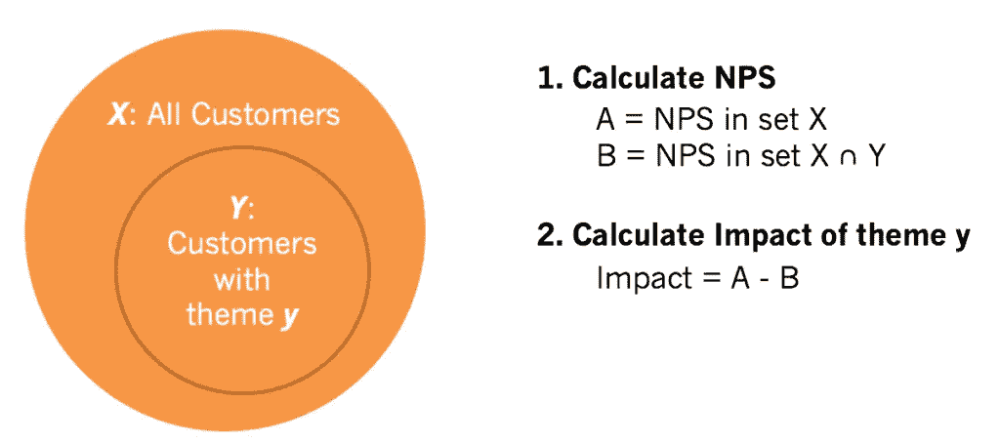
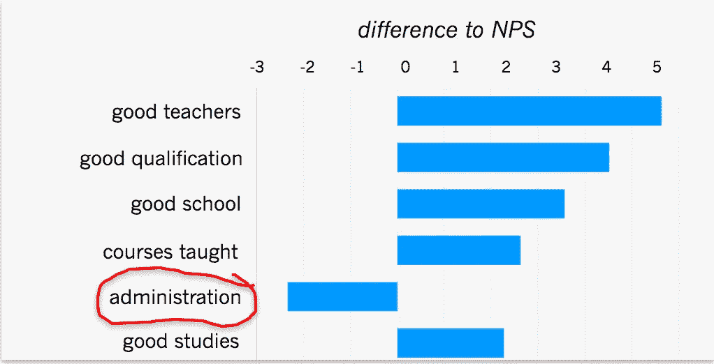
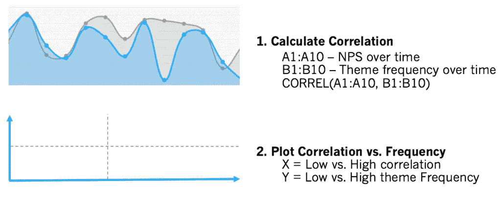
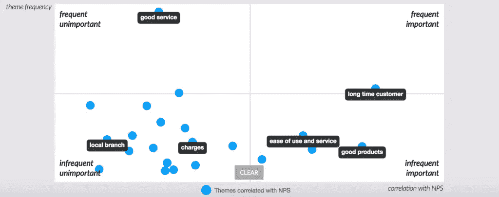
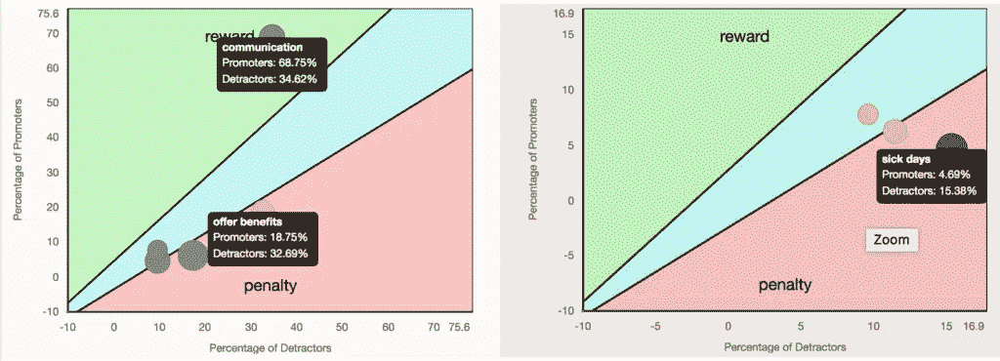

# 可视化客户反馈:单词云的三种替代方案

> 原文：<https://towardsdatascience.com/visualizing-customer-feedback-three-alternatives-to-word-clouds-defc73e8e503?source=collection_archive---------4----------------------->

今年早些时候，我写过关于[为什么单词云很烂](http://www.getthematic.com/post/word-clouds-harm-insights/)的文章。**有没有更好的可视化客户反馈的方法？**是的，有，最棒的是，您甚至可以使用 Excel 来创建这些可视化效果——如果您正确地表示数据的话。

在这篇文章中，你将学习三种简单而有效的可视化客户反馈的方法。

在 Thematic，我们通过与客户洞察专家密切合作，发明了这三种技术。如果你关心数据，如果你想知道顾客在说什么，请继续读下去。

# 为可视化准备客户反馈

客户反馈有两种形式:分数和文本。分数很容易。它们总是可以用数字表示，对于如何将它们组合成所有客户的总分，有不同的方法:

*   平均值(例如星星的数量)
*   从高分的百分比中减去低分的百分比，例如净推介值(NPS)或客户满意度(CSAT)

为了简单起见，让我们假设我们将使用 NPS。

谈到文本，我们需要根据代码框架，首先用一个或多个主题对每个响应进行编码。主题是一个单个或多个单词的概念。它应该在数据集的上下文中有意义。

例如，假设我们的数据集包含大学生对以下问题的回答:“你向朋友或同事推荐我们学校的可能性有多大？”

*   **无意义主题:**大学，学生，素质，好，学习，第一年
*   **好主题:**行政，校园，课程，学校声誉，好大学

代码框架是包含这些主题的平面列表或层次结构。查看[我们的指南，了解如何手工编写调查回复](http://www.getthematic.com/coding-open-ended-questions/)。或者，该任务可以使用[文本分析](http://www.getthematic.com/net-promoter-score-verbatims/)自动完成。

# 可视化 1。影响

这种观想回答了这个问题:“每个主题对我的总分有什么影响？”首先，您需要进行以下计算:

1.  计算总 NPS
2.  计算不包含该主题的响应子集中的 NP
3.  从 A 中减去 B

*使用这个简单的公式计算主题对 NPS 的影响*

现在您可以可视化这些数据，以条形图的形式列出每个主题:

*显现对 NPS 影响的差异*

这种可视化显示了每个主题的相对影响，无论是积极的还是消极的。在这个具体示例中，通过解决管理问题，NPS 至少可以提高 2 个百分点。

# 可视化 2。关键驱动因素分析

这个可视化回答了这样一个问题:“随着时间的推移，哪些主题与我分数的下降和上升紧密相关？”

首先，我们需要比较两个数字序列:一段时间内的 NP 和一段时间内的主题频率。使用 Excel，您可以很容易地计算两个序列之间的相关性，这可以是正的(主题越多，NPS 越高，见下图)，也可以是负的(主题越多，NPS 越低)。

第二，你需要根据主题与 NPS 相关性的绝对值来绘制主题频率。

*主题与名词短语的相关性*

最终的可视化效果可能如下所示:

*核电厂的主要驱动因素*

它表明，大多数主题并不频繁，并且与名词短语的相关性很低。在这个例子中，忠诚和好的产品推动了 NPS，但是大多数其他主题并不重要。

# 可视化 3。奖励和惩罚

这个可视化回答了以下问题:

1.  “我服务的哪些特点让客户感到满意，因此他们会给我更高的分数？”
2.  “客户对我的服务有哪些期望，如果我没有实现，就用较低的分数来惩罚我？”

对于每个主题，只需计算支持者和反对者的百分比，然后将这些值绘制如下:

*NPS 分析的奖罚计算*

推广者比例较高的主题是我们的奖励因素，而贬低者比例较高的主题是惩罚因素。在这个例子中，公司在沟通方面超出了客户的预期。然而，在客户对病假等福利的期望方面，它表现不佳。

即使是最准确的词云，其提供的洞察力也是有限的。它回答了这个问题:“人们谈论什么？”——以一种非常模糊的方式。

我们在这里展示的三种可视化效果为更有针对性的问题提供了答案:

*   每个主题对我的总分有什么影响？
*   随着时间的推移，哪些主题与我分数的下降和上升紧密相关？
*   就客户期望而言，我们在哪些方面表现出色，在哪些方面表现不佳？

在这三种情况下，您都需要有一个与每个评论相关联的满意度分数。此外，主题需要足够有意义，以便从客户调查受访者提供的答案中得出结论。

如果你的角色是寻找深入的客户洞察，这些可视化提供了一个起点。下一步，你可以采访客户，找出他们思考背后的原因。

在惩罚和奖励的例子中，您可以调查为什么客户对利益有某些期望。你也可以想出如何更好地管理这些期望。