# 使用 lyus 可视化邮政编码级别的数据

> 原文：<https://towardsdatascience.com/visualizing-data-at-the-zip-code-level-with-folium-d07ac983db20?source=collection_archive---------2----------------------->

## 洛杉矶餐馆的 Python EDA 和带有 regex 和 GeoJSONs 的市场检查

包含地理数据(如纬度、经度和 FIPS 代码)的数据集非常适合通过像 Folium 这样的制图包进行可视化。虽然州代码和 FIPS 县代码在制图包中广泛使用，但我想在使用 GeoJSON 时绘制邮政编码级别的数据。

为此，我们查看了洛杉矶县餐馆和市场检查数据集。有两个单独的 csv 文件可用:一个用于[检验记录](https://data.lacounty.gov/Health/LOS-ANGELES-COUNTY-RESTAURANT-AND-MARKET-INSPECTIO/6ni6-h5kp)，一个用于[违规记录](https://data.lacounty.gov/Health/LOS-ANGELES-COUNTY-RESTAURANT-AND-MARKET-VIOLATION/8jyd-4pv9)。

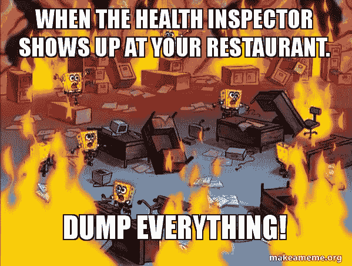

从高层来看这个过程是什么样的？

1.  清理数据
2.  转换违规记录并与检查记录合并
3.  找到合适的 GeoJSON
4.  可视化一些数据

## 1 清理数据

让我们从将 csv 文件加载到数据框中开始，看看我们有哪些变量。

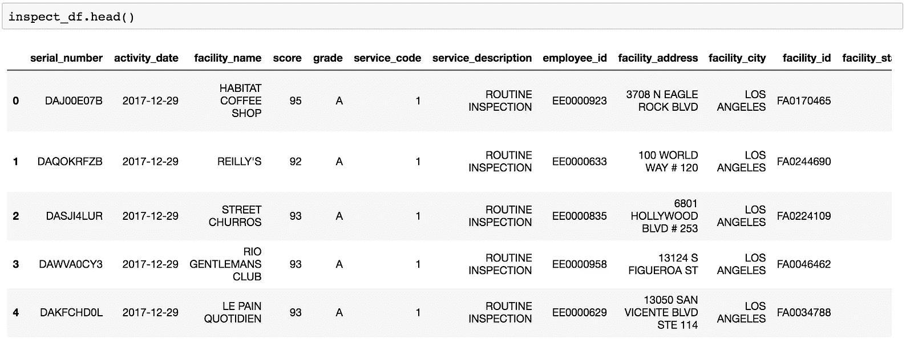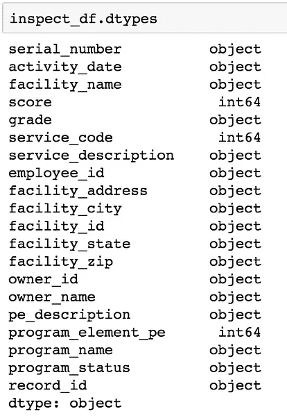

Data frame for inspections

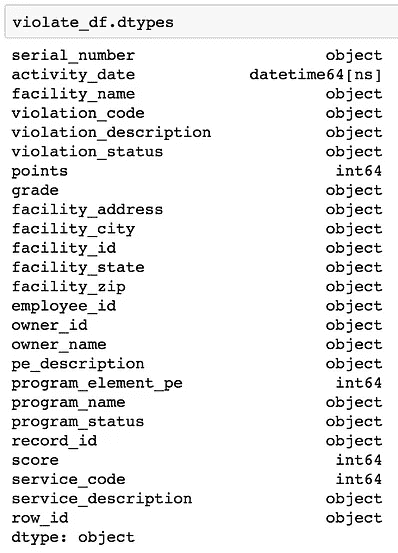

Data frame for violations

**日期时间对象**

“activity_date”列是一个字符串，我们将运行一个 apply 函数，将它们转换为两个表中的 datetime 对象。

**邮政编码**

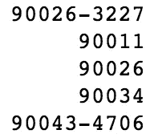

查看一下独特的邮政编码，会发现许多邮政编码在通常的 5 位数字后面附加了 4 位数字。这些数字主要用于 USPS 邮件分拣。出于分析目的，我们只保留前 5 位数字。

**违规中的异常值**

查看违规代码会发现代码大多以“F”开头。好像有几个以‘W’开头的只出现一两次。当与违规描述匹配时，它们是前面没有违规编号的唯一描述。此外，有些甚至没有导致扣分。由于它们仅构成 272，801 个违例中的 17 个条目，我们可以安全地删除它们。

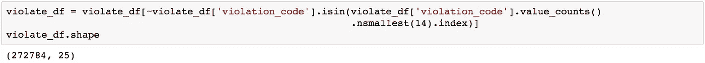

**用正则表达式创建新特征**

Nope, I still can’t

当查看“pe_description”列时，记录看起来像这样:“餐厅(0-30)座位中度风险”。

它似乎描述了 3 个不同的事情:它是什么类型的机构，它可以容纳多少人，以及风险水平。

为了更好地表示数据，我们用 regex 和 string split 编写了三个 helper 函数来创建新的特性变量。

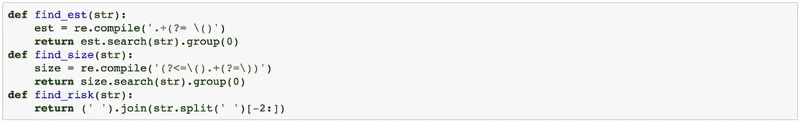

这里使用的两个正则表达式语句的简要描述:

为了提取机构的类型，我们希望得到第一个左括号之前的所有内容。因此正则表达式的形式是**。+(?= ()**

我们把这个分解一下:
**。+ →** 这个匹配，返回任意字符，继续。使用“+”意味着它必须至少匹配一次。
**(？= ()→** 这是一个前瞻，表示字符串以' ('结尾，并且不会返回左括号。

为了提取机构的规模，我使用了 regex **(?< =()。+(?=))**

我们把这个也分解一下:
**(？< =() →** 这是一个 lookbehind，表示字符串以不会返回的开括号开始。
**。+ →** 如上，返回任意字符并继续。
**(？=)→**和上面一样，一个指示字符串以不会返回的右括号结束的 lookahead。

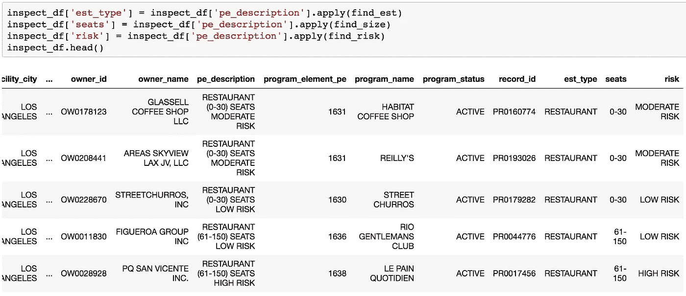

The end result

## 2 转换违章记录并与检查记录合并

单个违规行为似乎并不能告诉我们关于某个特定地点的太多信息。让我们从违规数据帧创建一个新的数据帧，它代表所有不同的违规以及每个设施点的每个违规的总数。

首先，我们通过设施 id 和违规代码对违规数据帧进行分组。然后，我们通过计数进行汇总，找出每个设施违反特定规则的总次数。

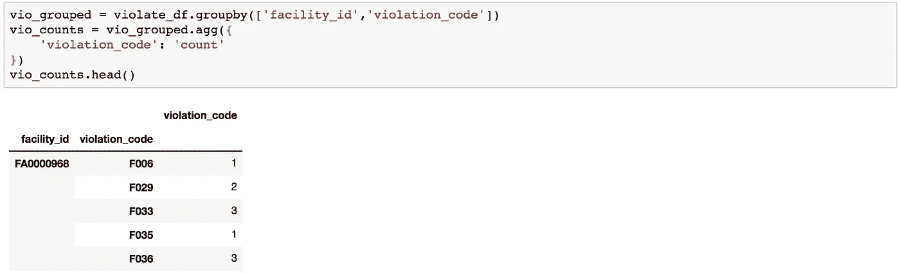

我们把这个新的数据框拆开。然后，我们转置结果数据帧，使违规代码现在是列。索引被重置，因此 facility_id 也是一个单独的列。

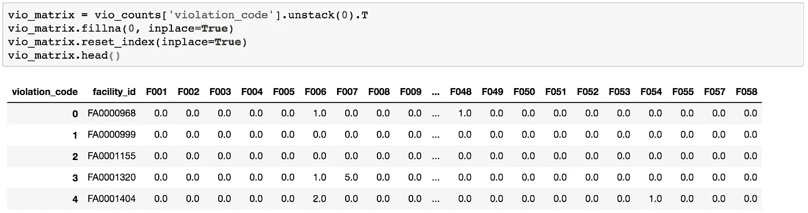

然后，我们将这个新矩阵与检查数据框合并，这样我们现在就有了每个设施 id 所有违规的总实例记录。

## 3 找到合适的 GeoJSON

为了在 follow 中按邮政编码绘制数据，我们需要一个 GeoJSON 来表示每个邮政编码的边界。幸运的是，洛杉矶时报有一个。

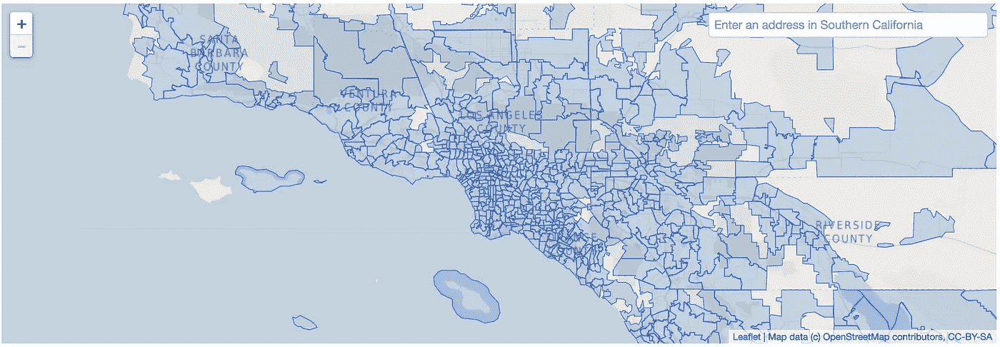

看看这个 GeoJSON 代表的邮政编码就知道有 800 多个邮政编码；其中大部分是没有用的，只会使生成的地图变得杂乱。因此，我们试图过滤掉不相关的邮政编码，使地图更加清晰。

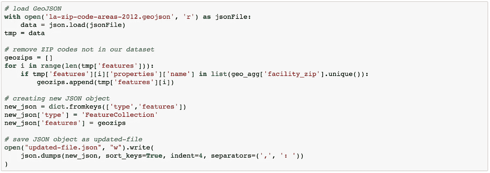

有了这个更新的 JSON，我们现在可以查看一些地理分布。

## 4 可视化一些数据

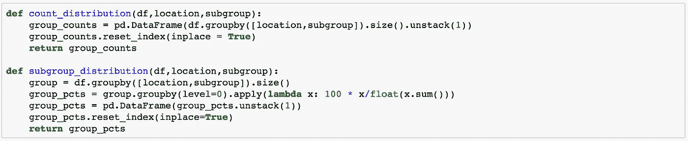

我们在这里创建两个辅助函数来帮助我们创建数据框。第一个 count_distribution 函数返回每个位置(邮政编码)的子组的总计数。

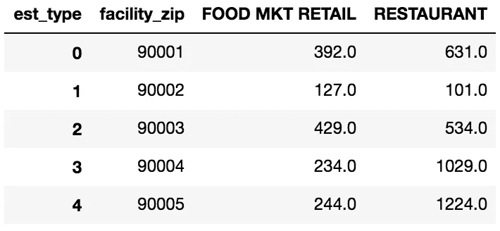

Lots of restaurants in 90004 and 90005

subgroup_distribution 函数返回每个位置(邮政编码)的每个子组的百分比表示。

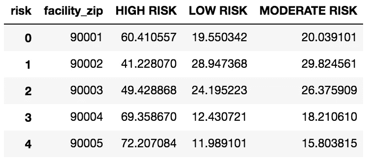

Almost 70% of facilities in 90004 are high risk

然后我们创建辅助函数来创建叶子地图。

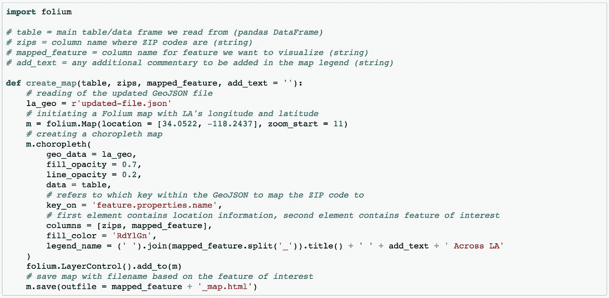

助手功能完成后，让我们开始可视化数据。

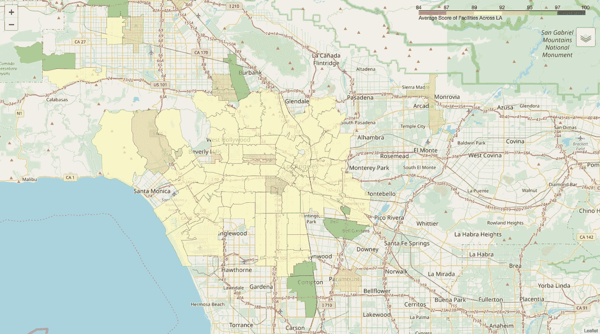

Average score of facilities in each ZIP code

洛杉矶中心区在这些检查上做得不好。

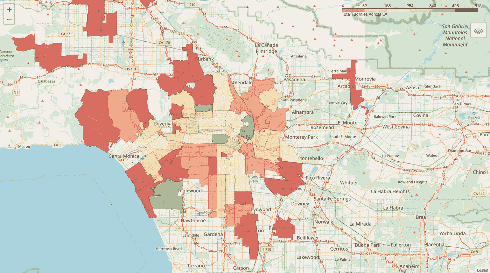

Total facilities in each ZIP code

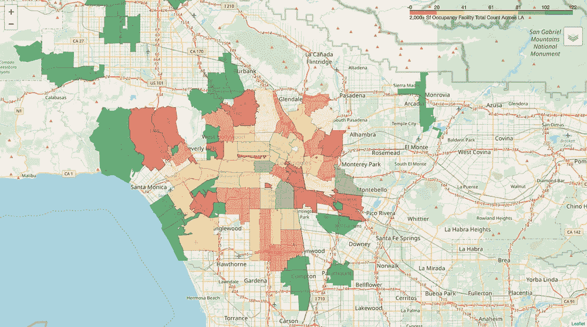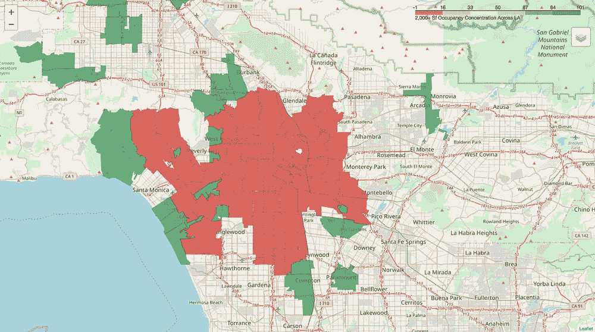

Total facilities for 2000+ occupancy and representation of 2000+ occupancy in each ZIP code

像体育馆和多功能厅这样的大型设施似乎离洛杉矶市中心很远。从集中图可以看出，这样的大型设施是该一般区域中仅有的设施。

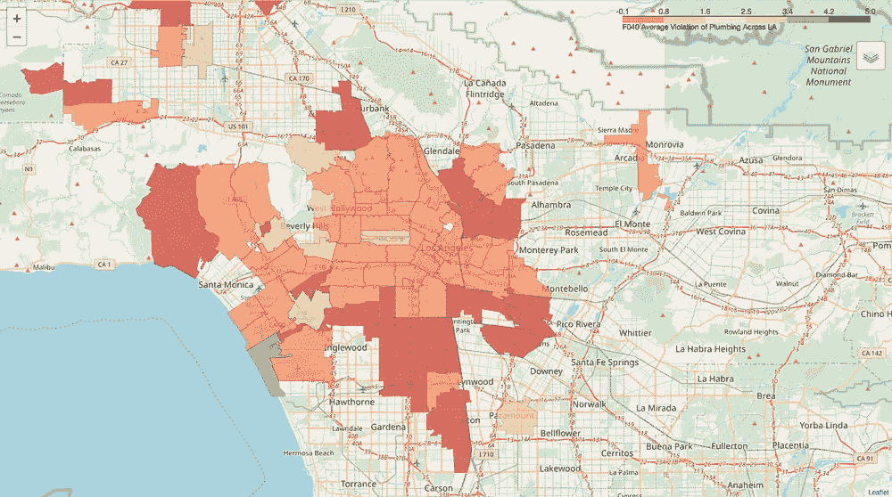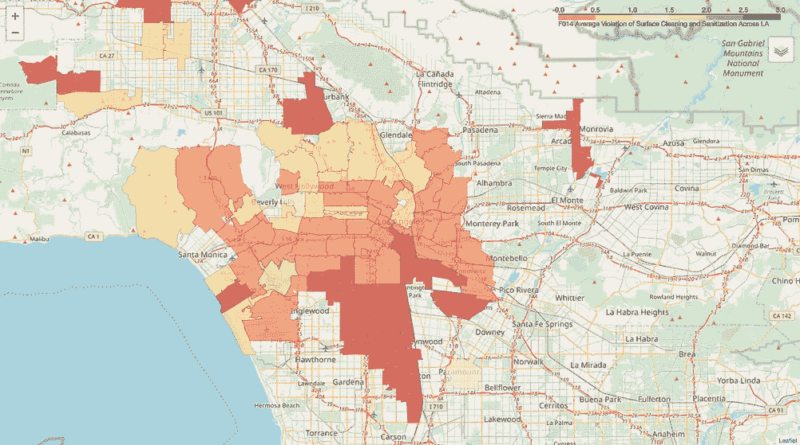

Average violations with plumbing violations and food contact surface cleanliness violations

让我们来看看两个比较常见的违规行为:管道和食物接触面清洁度。计算每个邮政编码的设施对特定违规代码的平均违规次数。

从右边的地图来看，Marina Del Rey 周围的区域似乎是每个设施管道违规发生率最高的区域。

与此同时，西洛杉矶学院周围的邮政编码似乎有更高的两种类型的违规发生率。

## **改进和后续步骤**

1.  我当然希望对这些检查进行“队列分析”,看看随着时间的推移，哪些方面得到了改善或恶化。
2.  如果能获得更多关于每个单独设施的信息，将会很有意义，因为这些设施的性质可能与特定的违规行为密切相关。例如，一个小的家庭经营的街头小吃摊可能与斯台普斯中心有不同的违规行为。Foursquare API 可以用来做这件事。

一如既往，代码可以在我的 [Github](https://github.com/finnqiao/la_restaurant_inspection) 上找到。我还查看了一些相关数据，它们不在这个特定 EDA 的范围内。一如既往，请随时通过 [LinkedIn](https://www.linkedin.com/in/finn-qiao-6186a8103/) 联系！