# 使用 Azure Databricks 和 Power BI Desktop 可视化数据

> 原文：<https://towardsdatascience.com/visualizing-data-with-azure-databricks-and-power-bi-desktop-845b0e317dc6?source=collection_archive---------4----------------------->

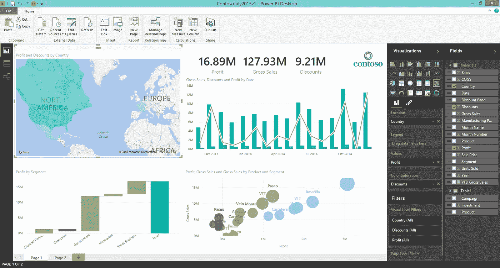

[Azure Databricks](https://docs.azuredatabricks.net/index.html) 是一项强大的技术，它通过提供一个两个学科的用户都可以轻松理解和利用的工作流，帮助统一数据工程师和数据科学家之间的分析流程。数据工程师可以使用它来创建有助于向数据科学家提供数据的工作，然后数据科学家可以使用 Databricks 作为工作台来执行高级分析。

然而，在现实生活中，以可理解的格式交付数据以提供可操作的见解的需求扩展了数据工程师和科学家的需求。考虑到这一点，我们怎么能指望营销人员、销售人员和企业高管理解并利用 Azure Databricks 等综合分析平台来执行日常任务呢？

幸运的是，我们可以将 Azure Databricks 中的集群连接到 BI 工具，如 Power BI。本教程的目的是帮助您了解如何使用 Azure Databricks 和 Power BI 来完成数据可视化任务，以及如何将 Databricks 中的集群连接到 Power BI

本教程中使用的技术:

*   Azure 数据块
*   [电源 BI 桌面](https://powerbi.microsoft.com/en-us/desktop/)

对于本教程，我将假设您知道如何使用 Databricks UI 来创建笔记本。我还假设您对 PySpark 以及如何在 Databricks 中创建集群有基本的了解。

**获取我们的数据**

对于这个演示，我将使用 Python 在 Databricks 中编写脚本。Python 中有一些非常酷的数据 viz 库，我将向您展示如何在 Databricks 笔记本中使用它们。

此外，我将使用 Azure Databricks 附带的一个预加载数据集，这样我就不必浪费时间解释如何将数据导入 Databricks，我在这篇[博客文章](https://medium.com/@willvelida/databases-and-tables-in-azure-databricks-cdf49ca33702)中对此进行了介绍。

让我们首先创建一个 Python 笔记本并加载我们的数据集。编写以下代码:

```
# load our data into Databricks
ourData = "/databricks-datasets/Rdatasets/data-001/csv/ggplot2/diamonds.csv"# create a dataframe for that data
diamonds = spark.read.format("csv").option("header", "true").option("inferSchema", "true").load(ourData)
```

如果编译成功，我们应该会看到以下输出:


让我们摆弄一下我们的数据，这样我们就可以使用不同类型的视觉效果。让我们先看看我们的数据，看看我们在处理什么:

```
display(diamonds)
```

我们应该在 Databricks 笔记本中看到下表:

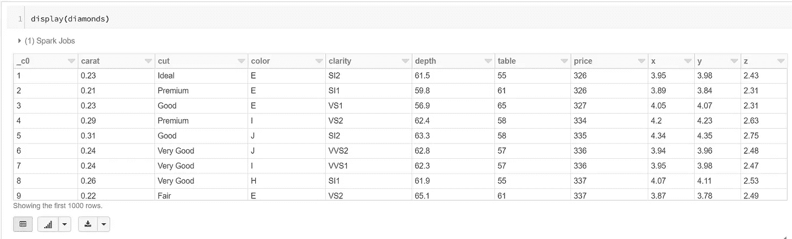

如您所见，每当我们在 Databricks 中运行 display()函数时，我们将在数据集中获得 1000 行的限制。

**可视化数据块中的数据**

既然我们已经在 Databricks 中定义了不同的数据框架(比如说速度快了 5 倍)，我们可以开始试验不同类型的数据可视化。我们知道我们有哪些列，它们是什么数据类型，以及我们的钻石数据框架中有什么类型的数据，所以让我们从一些聚合开始。

首先，让我们按颜色将钻石分组，并显示它们的平均价格。我们将通过编写以下代码为此创建一个新的数据框:

```
# Group by color
diamonds_color = diamonds.groupBy('color').avg("price")
display(diamonds_color)
```

当我们执行代码时，我们得到了一个表格，但是你看到表格底部的条形图按钮了吗？这个按钮允许我们可视化我们的数据。在本例中，我使用了一个基本的条形图，但我将介绍使用该功能可以做些什么。

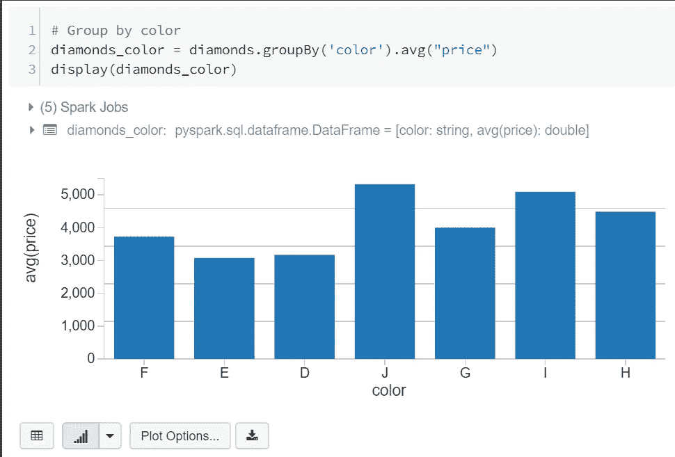

在 Azure Databricks 中，我们可以创建不同类型的可视化，如下图所示:

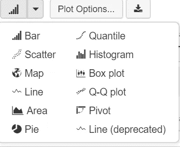

不是所有东西都可以是条形图的，对吗？

我们也可以使用“绘图选项”自定义我们的绘图

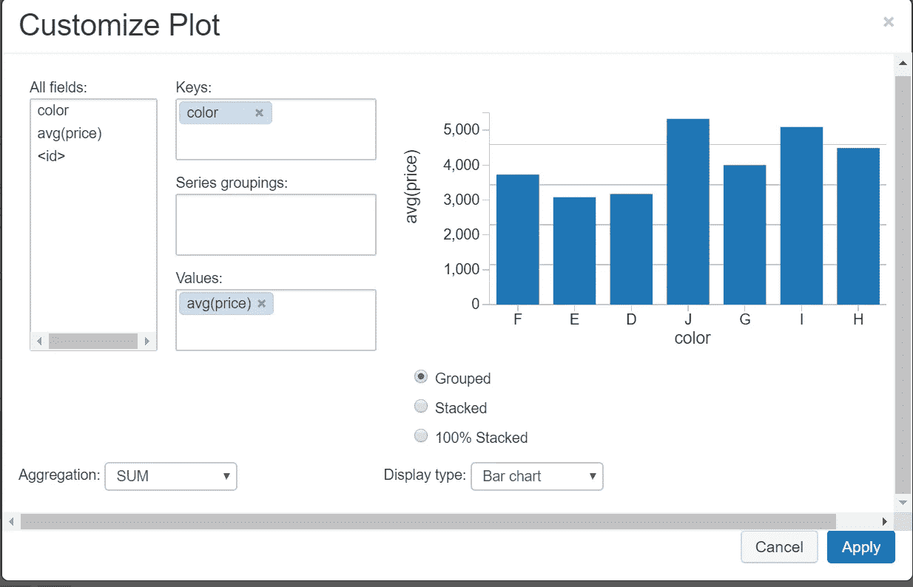

这是一个非常基本的例子，但是使用这个特性，我们可以定制我们想要在图表中使用的字段、键、值、组、聚合类型以及图表的显示方式。

让我们探讨另一个例子。在 databricks 笔记本的另一个代码块中编写以下代码:

```
# depth to carat
depthVcarat = diamonds.select("depth", "carat")
display(depthVcarat)
```

在这个数据框中，我们希望了解钻石的深度与其克拉值之间是否存在关系。让我们创建一个散点图，看看是否有:

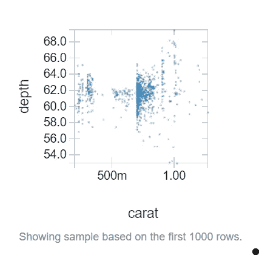

看起来不像。

既然我们已经在 Databricks 笔记本中获得了一些很酷的可视化效果，我们可以将它们整合到一个非常整洁的仪表板中。

为此，我们可以使用笔记本中的下拉菜单，显示**视图:代码**，然后单击**新仪表板:**

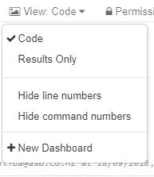

在这里，我们可以移动我们的视觉效果来创建一个如下所示的仪表板:

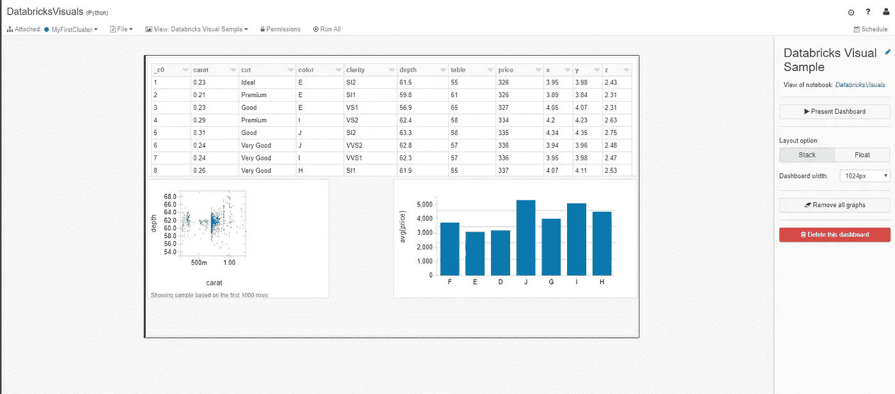

在这里，我们可以移动我们的视觉效果，以适应我们的仪表板。控件非常简单，我们可以选择布局选项(堆叠或浮动)和仪表板宽度。

仪表板可以在数据块中非常简单，也可以更加复杂。我们可以做一个快速的模拟，就像我们刚刚制作的那样，或者我们通过创建一个计划的作业来刷新它，从而增加一些复杂性。例如，如果我们创建一个为流式作业提供视觉效果的仪表板，我们可以创建一个经常更新它的作业。

虽然 Databricks 中的可视化工具很好，但它们不如 Power BI 全面。现在让我们将数据连接到 Power BI。

**将数据块连接到 Power BI Desktop**

Power BI 提供交互式数据可视化，使用户能够创建报告和仪表板。使用 Azure Databricks，您可以为所有业务用户带来性能优势。特别是，您可以使用 DirectQuery 将处理责任卸载给 Azure Databricks，它将处理我们在 Power BI 中不一定需要的大量数据。

Power BI 带有一个内置的 Spark 连接器，允许我们连接到数据块中的集群。为了连接到您的集群，您需要[在数据块中生成一个个人访问令牌](https://docs.azuredatabricks.net/api/latest/authentication.html)。

首先，让我们将钻石数据帧保存为 Databricks 中的全局表。全局表可用于所有集群。

```
# save diamonds dataframe as a global table
diamonds.write.saveAsTable("diamonds")
```

让我们通过检查我们的数据选项卡来确认我们的表已经被创建:

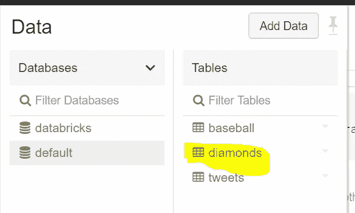

太好了，现在我们已经保存了我们的表，让我们将它连接到 Power BI。首先，我们需要获得我们的 JDBC (Java 数据库连接)服务器地址。转到集群 UI，选择要连接的集群。在编辑页面上，向下滚动并选择 **JDBC/ODBC** 选项卡。

在这里，我们看到了一系列需要连接到 Power BI 的值。我故意对您隐藏我的值，但您需要以下格式的地址:

```
https://<server-host>:<port>/sql/protocol/o/<key>/<key>
```

最后的两个键会在你的 JDBC 网址文本框中，所以只需复制并粘贴这些值。

一旦你有了网址，进入 Power BI，点击工具栏中的**获取数据**，然后点击**更多…**

在获取数据对话框中，我们需要寻找 **Spark (beta)** 连接器:

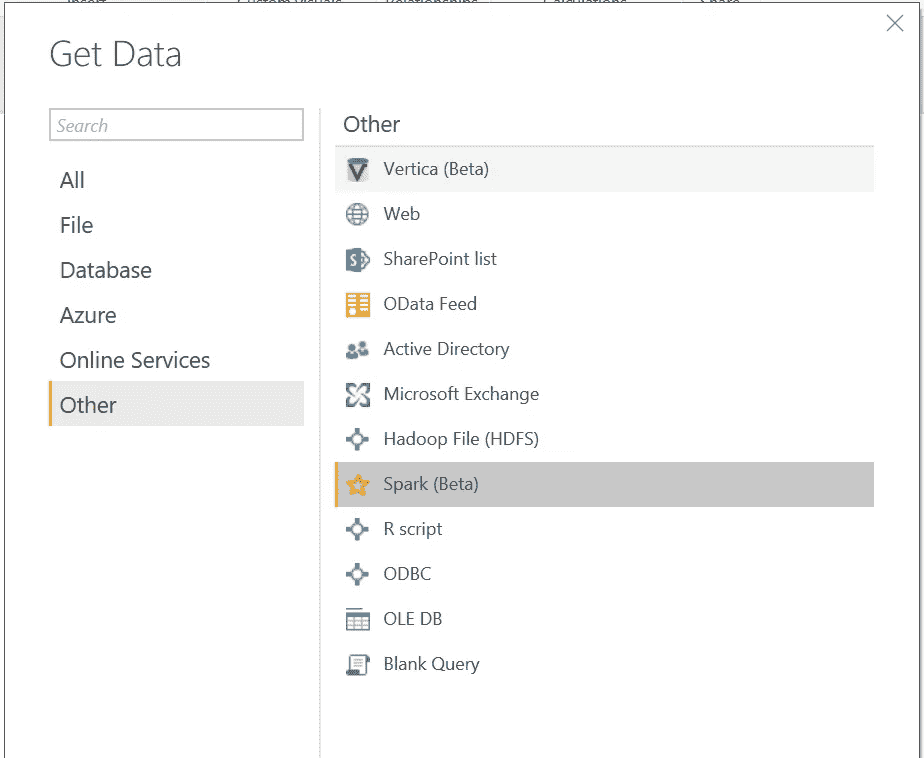

点击**连接。**输入我们之前构建的 URL，使用 HTTP 作为协议，选择 **DirectQuery** 作为数据连接方式。这将允许我们将处理任务卸载给 Spark(如前所述)。

现在，我们需要登录集群。使用“令牌”作为用户名，使用令牌作为密码(确保在执行此操作之前已经生成了令牌)。点击**连接**连接到您的集群。

如果一切正常，您应该能够在 Navigator 对话框中看到所有的表。选择钻石表，您将看到我们的数据预览:

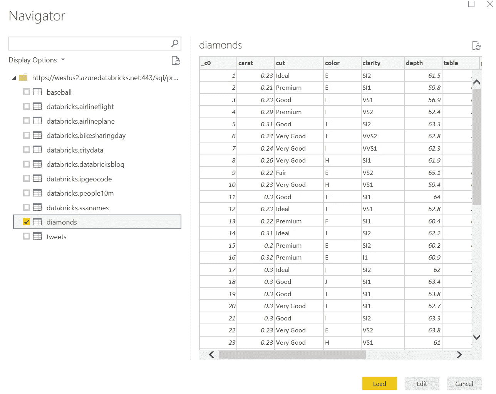

我们可以像在 Power BI 中编辑任何数据源一样编辑我们的数据导入，或者我们可以将它全部加载进来。还是做后者吧！点击**加载**开始。

**处理 Power BI 中的数据**

现在我们的 Databricks 表在 Power BI 中可用了，我们可以开始创建一些非常棒的可视化。

在“字段”选项卡中，我们可以看到导入的表格及其相应的列:

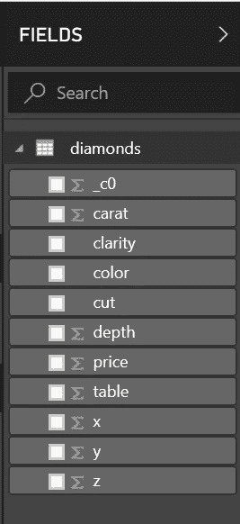

让我们尝试创建我们在 Databricks 中制作的每种颜色平均价格的条形图。在字段选项卡中，选中颜色和价格复选框，将这些字段插入到我们的仪表板中。

现在，我们想为我们的可视化选择一个“堆积柱形图”。我们需要改变一些东西来使我们的图表看起来更好。在 visualizations 选项卡中，我们希望将轴设置为 color，为图例选择颜色，并将值设置为 price 列的平均值。应该是这样的:

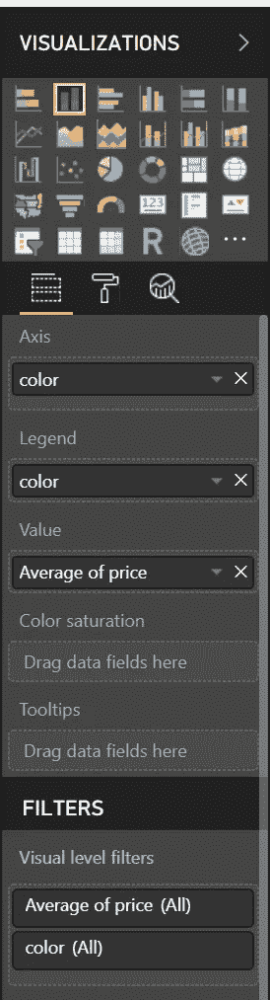

我们的最终结果应该是这样的:

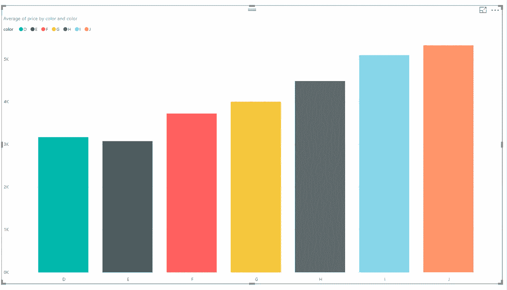

这是我们在这里创建的一个非常简单的示例，但是希望您现在已经了解了在 Power BI 中从数据块导入数据的基础知识

**结论**

在这篇博文中，我们采用了一个简单的 csv 文件(它已经为我们加载到 Azure Databricks 中了！)并用 Python 把它变成了一个数据框，并在上面应用了一些很酷的可视化效果。然后，我们将数据帧保存为表格，将集群连接到 Power BI，并在表格上应用一些可视化。

你可能想知道为什么我们实际上在两个不同的地方做可视化。Databricks 是数据工程师和数据科学家在统一的分析工作流中合作的一个很好的工具，但不是所有的业务用户都能够使用 Databricks 这样的工具，并且使用 Power BI(实际上是一个带有 jetpack 的拖放工具)这样的简单工具来满足他们的报告需求会舒服得多。

这个例子将云中的数据拉回到 Power BI Desktop 中。一个更具成本效益的策略是使用 Power BI Online 这样的工具，这样数据就可以保存在云中，所以在生产场景中要记住这一点。

我希望你能从本教程中获得一些价值。如果你有任何问题，请在评论中提问。