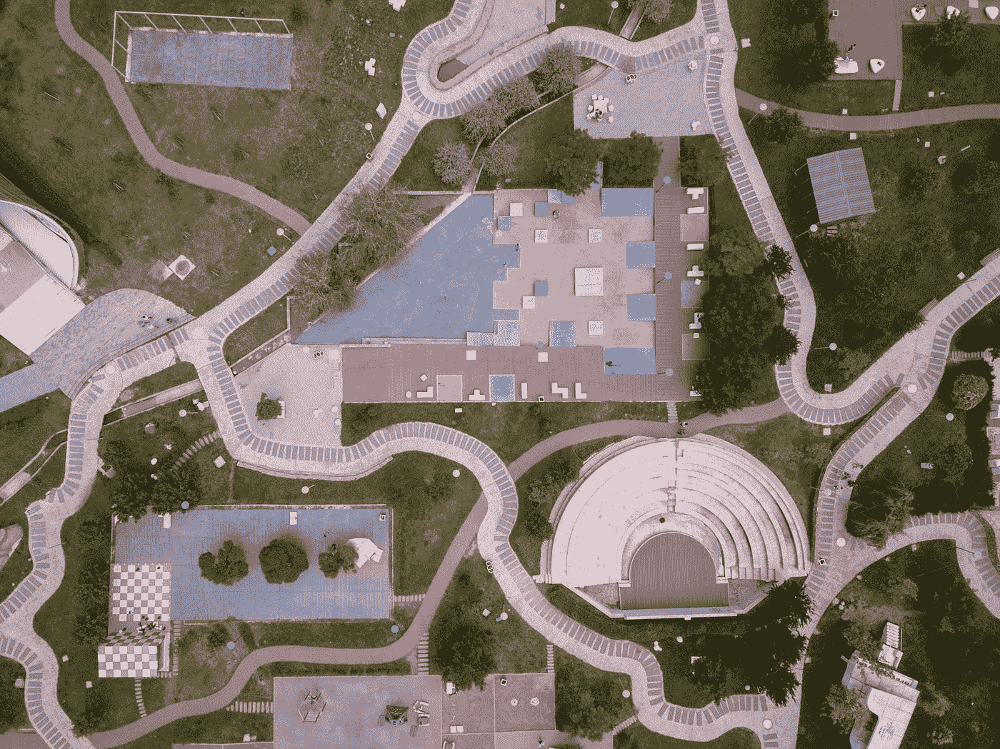
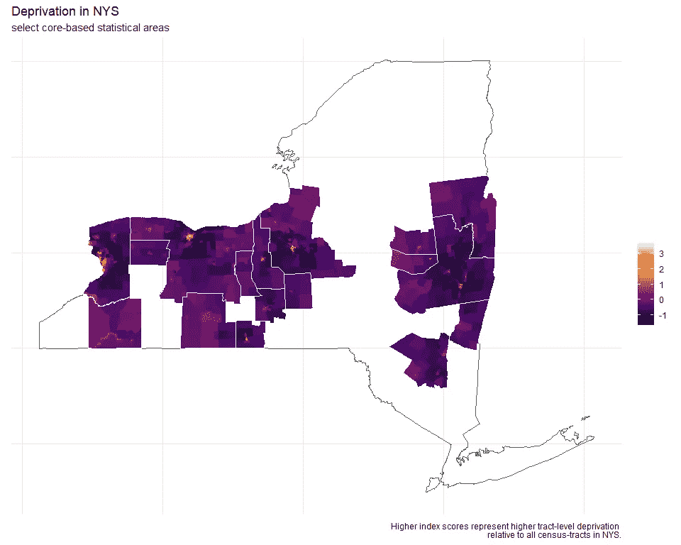
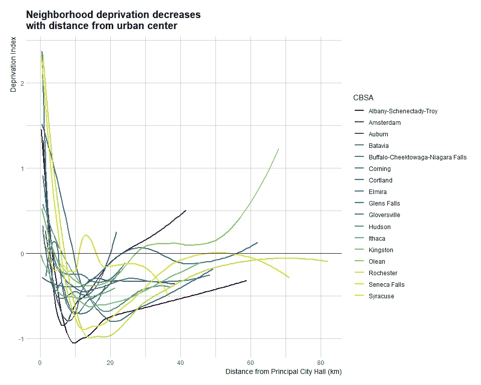
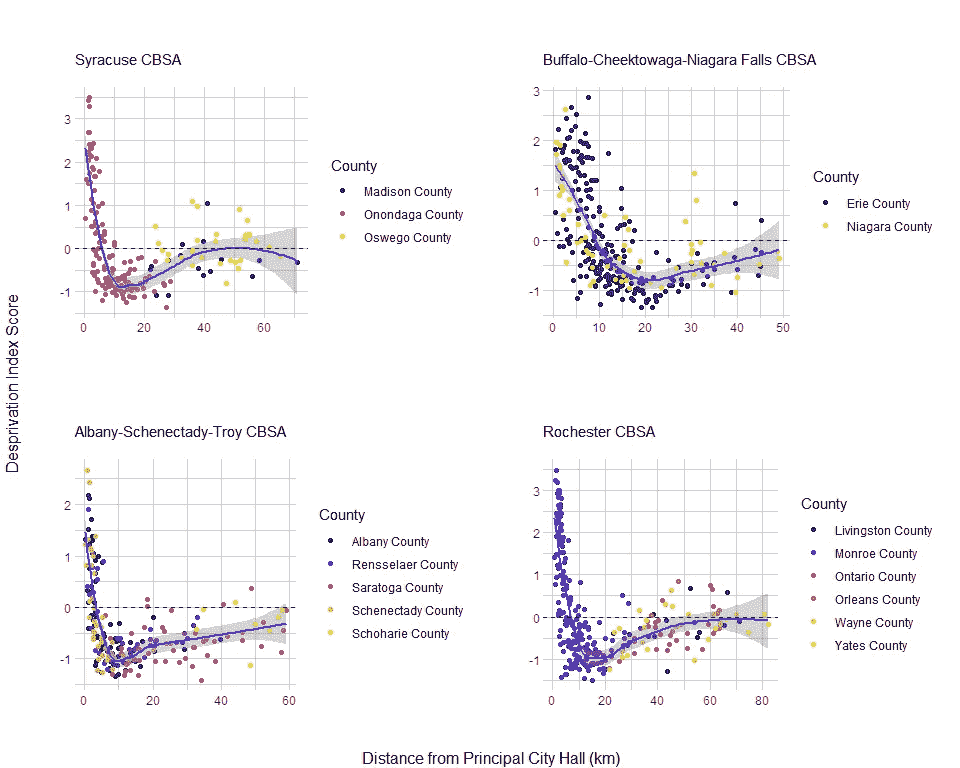
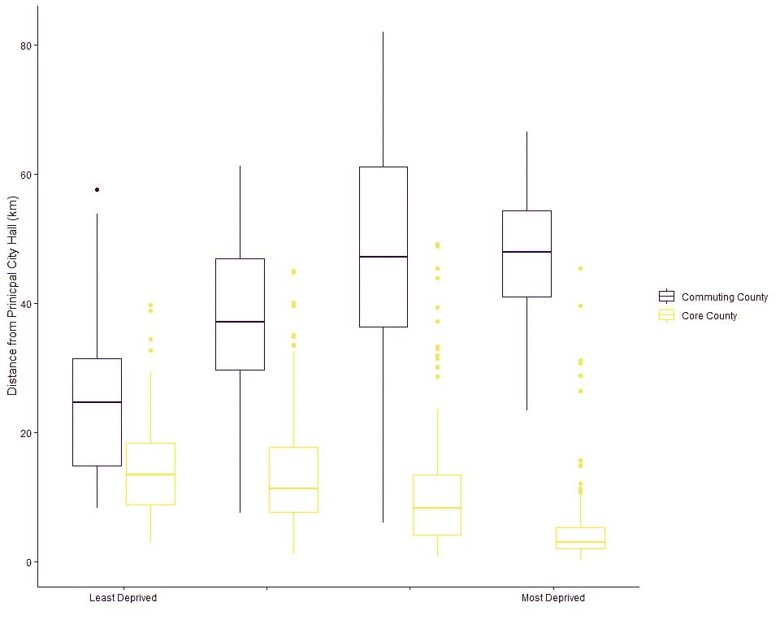

# 纽约州贫困的可视化距离剖面图

> 原文：<https://towardsdatascience.com/visualizing-distance-profiles-of-deprivation-in-new-york-state-2c0a35260f38?source=collection_archive---------11----------------------->

“aerial photography of city” by [Sergey Kuznetsov](https://unsplash.com/@cr0t?utm_source=medium&utm_medium=referral) on [Unsplash](https://unsplash.com?utm_source=medium&utm_medium=referral)

距离剖面图有助于探索城市地区的人口特征。它们被广泛应用于城市人口统计学和社会学研究。追溯到 20 世纪 20 年代和芝加哥学派的模型。他们认为，每个主要城市都是从市中心向同心圆[扩展的。](https://transportgeography.org/?page_id=4908)

source: [https://transportgeography.org/?page_id=4908](https://transportgeography.org/?page_id=4908)

我偶然看到了这篇论文， [*，这是一个可再现的框架，用于可视化美国大都市地区的人口统计距离剖面图*](https://link.springer.com/article/10.1007/s40980-018-0042-7) ，它将带您了解在 r 创建距离剖面图的工作流程。我发现它很有趣，并且熟悉所需的软件包，因此，我决定创建纽约州[邻里贫困](/a-census-based-deprivation-index-using-r-7aa738da697c)的距离剖面图。

## 数据准备

在能够计算距离之前有相当多的准备工作。这里就不展示代码了，都贴在 [GitHub](https://github.com/iecastro/NYS_CBSA) 里了。简而言之:

1.  我首先必须获得 NYS、纽约人口普查区和美国城市的空间文件。
2.  过滤纽约地铁
3.  创建贫困指数并加入人口普查区域
4.  对纽约市内的人口普查区域进行空间过滤

到目前为止，我一直在交替使用 *metros* 。事实上，大都市和小城市地区是有区别的。也有基于核心的统计地区(CBSA)的定义，指的是大都市或微地区，以及组合统计地区(CSA)，指的是大都市和微地区。还有主要统计区域(PSA ),即所有 CSA 加上不属于 CSA 的 cbsa。很头疼，真的。

此外，[联邦统计系统](https://en.wikipedia.org/wiki/Federal_Statistical_System_of_the_United_States)为这些地区创造产品和收集数据，然而，不知何故，这些定义是由白宫的[预算办公室](https://www.whitehouse.gov/sites/whitehouse.gov/files/omb/bulletins/2017/b-17-01.pdf)创造的。

反正我跑题了。因此，在过滤和连接数据后，我可以绘制出 CBSAs 的贫困水平。(这张地图不包括纽约的所有 CBSAs)

## 距离轮廓

你可以看到每个城市核心是如何从该州的其他地方脱颖而出的(亮色=高度剥夺)。它确实类似于同心环模型，在这种情况下，剥夺水平在核心处最高，并随着距离的增加而减少。真正富裕的社区/人口普查区也是如此。索引是相对于整个状态的。因此，与该州的所有人口普查区域相比，城市核心区拥有高度贫困和富裕的区域，而不仅仅是它们各自的 CBSA。

然而，要创建距离简档，我们需要测量距离。为此，我必须查找每个 CBSA 的主要市政厅的坐标。这有点耗时，但是谷歌帮了大忙。所以不像听起来那么可怕。一旦所有的坐标都被收集起来，它们必须被转换成简单的特征并被投影。因为，你知道，地球是圆的。

测量了从每个主要市政厅到人口普查区质心的距离。参考文章提供了一些实现这一点的详细代码。奥尔巴尼和布法罗 CBSAs 都有多个主要城市，因此，坐标是为每个城市绘制的，距离是从最近的城市开始测量的。

我不知道你怎么想，但是，我发现这个情节真的很令人满意。

oohh, spaghetti plot

这些数据向我们展示了一个非常有趣的动态。剥夺感在靠近市中心(内城)的地方确实很高，在靠近郊区的地方急剧下降；然后在离市中心大约 10 公里的地方，贫困又开始增加，但是没有达到城市中心的水平。

我想进一步探索这些数据，所以我把重点缩小到了四个主要的北部地区(当然，我刚刚在*四个*之后写的一切都是高度主观和武断的)。[纽约州北部是什么？](https://www.washingtonpost.com/news/the-fix/wp/2016/04/19/so-what-is-upstate-new-york-exactly/?utm_term=.744abe9b3fe3)

## 纽约北部

为了探索进一步的模式，我绘制了 CBSA 每个县的距离与贫困的关系图。在拥有几个主要城市的奥尔巴尼和布法罗地区，这种关系非常简单——剥夺感随着离市政厅的距离而减少。然而，在锡拉丘兹和罗彻斯特 CBSAs，我们看到了一种模式，即主要县(分别为奥农达加和门罗)的人口普查区代表了贫困得分的范围，而通勤县的人口普查区没有达到同样高的贫困或富裕水平。

Larger, individual plots are posted in GitHub

为了更直观，我将每个县(跨越四个 CBSAs)分为核心县(T0)或通勤县(T2)，并将剥夺分数转换为四分位数。通过这样做，很明显，CBSA 最贫困的人口普查区是那些离核心最近和最远的人口普查区。这是有道理的，通勤县中较远的区域往往是非常乡村化的，而较近的通勤区域是发达的，因为它们邻近核心县。

## 现在怎么办？

我不知道，正如我承诺的，这只是试探性的。我认为在健康研究中使用这些方法是有潜力的，可以突出差异或者评估医疗服务的可及性，但是需要正确的数据。

感谢阅读！

*如果你觉得这很有趣，我建议阅读* [*参考文章*](https://link.springer.com/article/10.1007/s40980-018-0042-7#Sec7) *。我的* [*网站*](https://iecastro.github.io/) *上也有这篇文章的一个版本。*