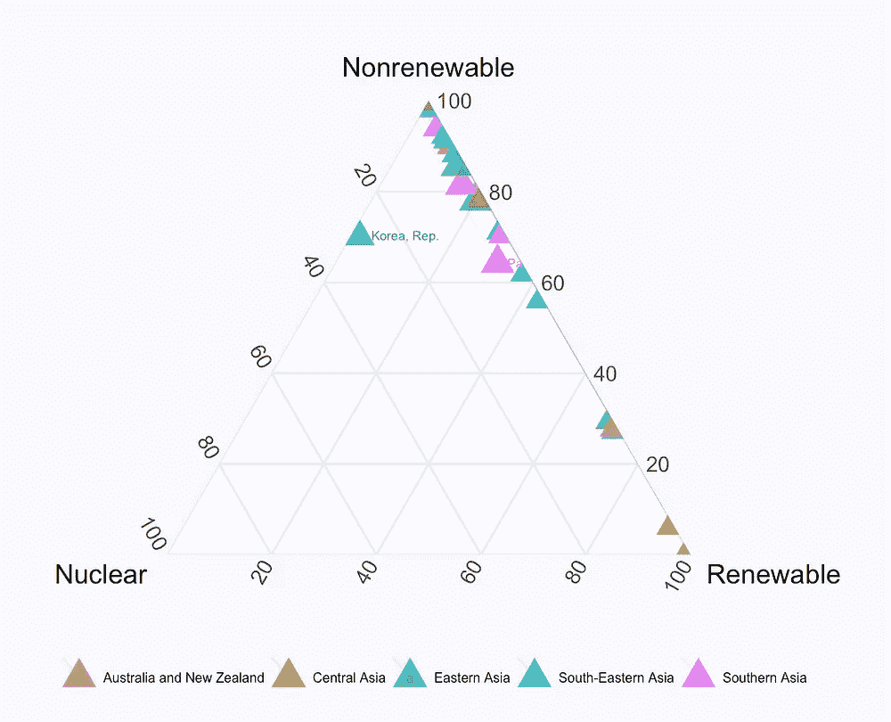
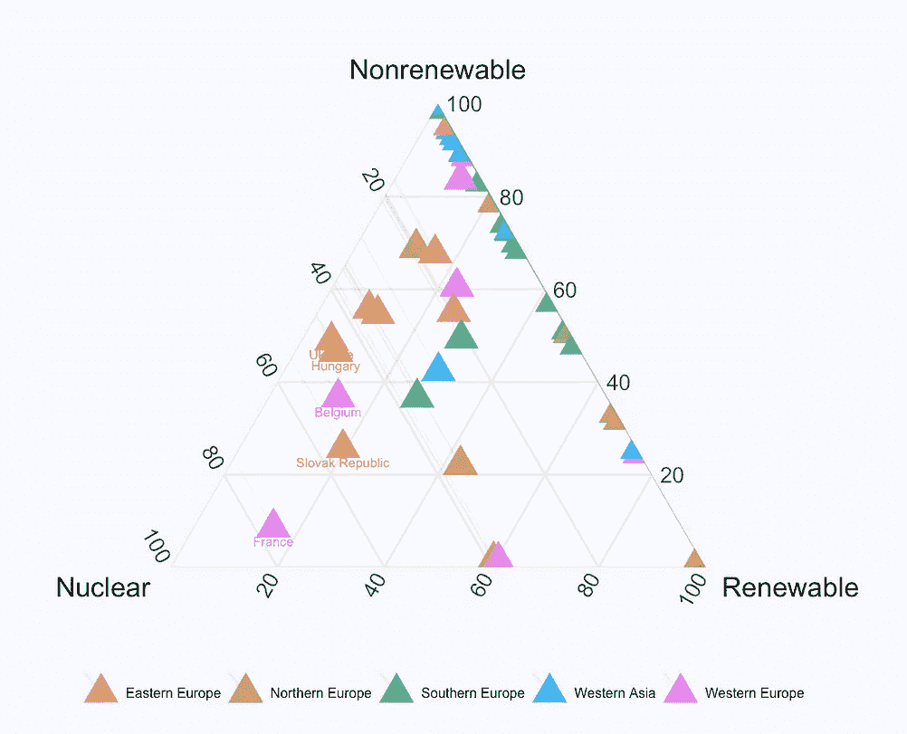
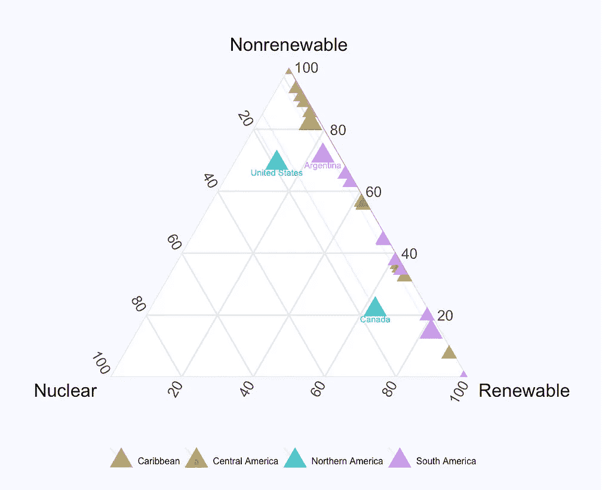
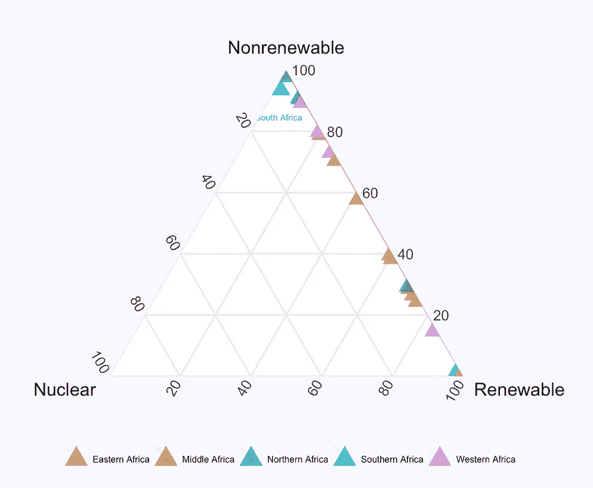

# 可视化世界各地的能源组合

> 原文：<https://towardsdatascience.com/visualizing-energy-mix-around-the-world-fd457f462c84?source=collection_archive---------11----------------------->

利用世界发展指标，我将各个国家和地区的能源组合(可再生能源、不可再生能源、核能)形象化。



(L) Asia-Pacific (R) Europe and Middle East



(L) Americas (R) Africa

在使用核动力源发电方面，我们可以观察到:

*   欧洲使用高比例的核能，最高的是法国，76%的电力来自核能
*   在其他大洲，美国/加拿大/韩国/南非在本地区使用核能的比例最高(基于 2012 年最完整的国家列表数据)

关于可再生能源，这些国家在本地区使用可再生能源(包括水电)的比例最高:阿尔巴尼亚、塔吉克斯坦、尼泊尔、巴拉圭、莫桑比克，据报告为 99%以上。

我们也可以看到不可再生能源仍然是主流，但在每个地区都有国家向可再生能源发展。

为了生成三元图，我使用了 gtern 包:

```
ggtern(df, aes(x = Nuclear, y = Nonrenewable, z = Renewable, col=region)) +
    geom_point(shape = 17, alpha=0.8, size = 5) + 
    geom_Lmark(alpha=0.1)
```

这是我关于数据科学和视觉故事的[# 100 日项目](https://medium.com/@yanhann10)的第 48 天。我的 [github](https://github.com/yanhann10/opendata_viz) 上的全部代码。感谢阅读。欢迎新主题的建议和反馈。