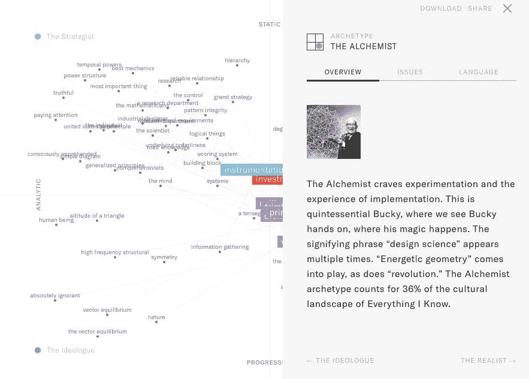
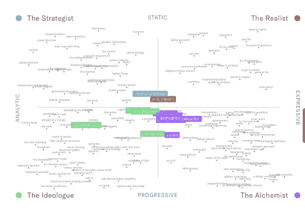

# 想象我所知道的一切

> 原文：<https://towardsdatascience.com/visualizing-everything-i-know-8400fe4f824f?source=collection_archive---------10----------------------->

## 使用[文化映射数据可视化](https://everythingiknow.scenariodna.com/culture-map/)(点击此链接转到交互式可视化仪表板)来分析巴克明斯特·富勒的[我所知道的一切](https://www.bfi.org/about-fuller/resources/everything-i-know)的抄本，这是 1975 年录制的 42 小时大声思考系列讲座。

## 语言反映思想

如果你还不知道工程图标巴克明斯特富勒的生活，没有比现在更合适的时间来了解。富勒 1895 年出生于马萨诸塞州的米尔顿，是设计创新和系统思维的杰出代表。在 20 世纪 40 年代末，他推广了网格穹顶作为建筑结构的使用。他的设计过程是一个有机的过程——与其说是灵光一现，不如说更像是音乐的四分之一。

作为一名前海军士兵，他非常熟悉航海和海洋，并经常被引用来解释平衡帆的概念。(船上的平衡翼是一个微型方向舵——稍微移动它就可以移动整艘船。)他一直在寻找意义，并相信他一生的工作应该是全人类的财产。[1969 年，美国人文主义者协会授予他年度人文主义者](http://simbeck-hampson.blogspot.com/2013/01/richard-buckminster-fuller-1969.html)。

> *“有史以来所有人类共有的是什么？问题，问题，解决问题。我们是来解决问题的，”*

## 先见之明的谈话

在 1975 年 1 月的最后两周，巴基发表了一系列 12 次演讲，时间跨度 42 小时，讨论了他所知道的一切。讲座被录像——最近由巴克明斯特富勒研究所转录。他们详细描述了迫使他理解世界的事件，他的主要发明，如 1927 年的 Dymaxion house，以及他的开拓性观点。

Buckminster Fuller — Everything I Know — session 01 — January 20, 1975

巴基总是着眼于大局，在他 1975 年系列的第二部分中，他问观众，“纵观历史，所有人的共同点是什么？问题，问题，解决问题。我们在这里是为了解决问题，”我们解决问题的共性是富勒经过多年思考和观察得出的简单结论。然而，通过*我所知道的一切*可以证明，解决问题本身并不那么简单。为什么？因为解决问题是为了理解人性。正确解决真正的问题是真正的创新，它需要一个归纳研究的过程。

归纳法和演绎法的主要区别在于，演绎法是关于假设和测试的，而归纳法关注的是从数据中产生新的想法。通常使用演绎法。当想法在测试阶段失败时，它们就被搁置了。有了归纳，这个想法会随着它的上下文发展——本质上是修剪制表符。

## 视觉无障碍

在《我所知道的一切》系列中，巴克明斯特·富勒详细阐述了他的归纳研究过程——但该系列以一种面向学术读者的形式存在。在我们这个时代腐败的世界里，缺乏即时性会扼杀好的想法，我们想解开巴基为我们其他人说的话。我们怎样才能使巴基一生的知识更容易和更广泛地被获取，为所有学科的战略家提供重要的信息来帮助理解巴基的意图？强调系统方法是一回事，但这意味着什么——必须是谁，他们需要遵循的计划是什么？

为了弄清问题的真相，我们使用自然语言处理技术处理了*我所知道的一切*的文字记录，以逐段识别巴基话语的潜在含义并进行评分。基于能指，他的会议带领我们通过框架，调查，仪器，校准，系统化，修剪标签，阴谋，编排，实现，投资，原则，愿景。

然后，我们通过会话获取这些能指，并根据我们的符号矩阵绘制出最能说明问题的能指。我们使用[我们的专利矩阵](http://patft.uspto.gov/netacgi/nph-Parser?Sect2=PTO1&Sect2=HITOFF&p=1&u=/netahtml/PTO/search-bool.html&r=1&f=G&l=50&d=PALL&RefSrch=yes&Query=PN/9002755)来观察语言群是如何发挥作用的，导致意识形态的原型。它展示了巴基的认知框架及其演变的真相和紧张局势的有形可视化。

## 通过代码和原型定义

在巴克明斯特·富勒和《我所知道的一切》系列中，出现了四个不同的原型。**空想家**，**炼金术士**，**现实主义者**，**军事家**。每个原型都是基于从文本中的能指升起的人类代码。代码是原型似乎天生遵循的指导原则。从这些原型中，强烈的视觉和技术显现出来，被接受的时代精神的批判性也显现出来。每个原型都生活在巴基对他所知道的一切的记忆中。在他的一生中，他是各种原型的融合。**炼金术士**，他最舒服的地方——试验网格圆顶的人，因素最突出。**现实主义者**，他对权力结构和融资的现实论述最少。

**理论家**

理论家肩负着**责任**和**同步**。Bucky 坚持他的核心原则，即有机和固有的做事方式。他使用象征性的短语，如“持续的紧张”、“整体思维”和“视线”在《我所知道的一切》的文化景观中，空想家原型约占 27%。

**炼金术士**

炼金术士渴望**实验**和**实施**的经验。这是典型的巴基，我们看到巴基亲自动手，他的魔术在这里发生。意义短语“设计科学”多次出现。“能量几何”和“革命”都发挥了作用。**炼金术士**原型占了*我所知道的一切*的文化景观的 36%。

**现实主义者**

现实主义者由**生存能力**和**可扩展性**的代码驱动。这是考验他人的现实。它包括“工具”和“有权力的人”等意符。在巴克明斯特富勒的例子中，它没有超越对他的核心更关键的原型。现实主义原型被限制在“我所知的一切”( T42)文化景观的 16%。这很奇怪，因为生存能力和可伸缩性是专业领域的常用词，然而如果引入得太早，它们就会缺乏创新。

**军师**

战略家原型是由**庄严**和**正直**的代码驱动的。巴基希望自己的努力对世界有意义。这个原型允许未来的计划和未来的验证。这就是意符出现的地方，比如“逻辑事物”、“注意”和“模式完整性”**战略家**占*我所知道的一切*的文化景观的 21%。

## 可行的计划

通过看到原型，除了他自己的成功和尝试，我们可以讨论巴基如何看待世界上的事情。一个人从意识形态开始，渴望实验，接受现实，并不断制定策略。归根结底，真正的问题是人们害怕过程创新，因为他们不理解它，或者害怕它会有抑制性，如果做得正确，这是不正确的。似乎目前我们做得不对。对于与*我所知道的一切相关的每个问题，*我们还追踪了巴克明斯特·富勒被引为灵感的专利。奇怪的是，申请的专利没有一项被批准。

1975 年，巴基告诉我们如何让创新贯穿我所知道的一切。我们让它看得见。我们将以巴基的挑衅来结束，“显然我们有一个很大的缓冲空间来犯错，但我要说，这个缓冲空间即将结束。缓冲即将结束……”趁我们还有时间，让我们开始重新审视我们的研究实践，让巴基的思想更广泛地传播开来。创新不应落后于我们。

*   蒂姆·斯托克和玛丽·莱娜·图波特