# 基于 Keras 的卷积神经网络中间激活可视化

> 原文：<https://towardsdatascience.com/visualizing-intermediate-activation-in-convolutional-neural-networks-with-keras-260b36d60d0?source=collection_archive---------1----------------------->


在本文中，我们将使用 Keras 和 Python 来训练一个简单的[卷积神经网络，以完成分类任务。为此，我们将使用一组非常小而简单的图片，包括 100 张圆形图片、100 张正方形图片和 100 张三角形图片，这些图片是我在 Kaggle 中找到的。这些将被分成训练集和测试集(工作目录中的文件夹)并传送到网络。](https://en.wikipedia.org/wiki/Convolutional_neural_network)

最重要的是，我们将复制 Franç ois Chollet 在他的书 [Deep Learning with Python](https://www.manning.com/books/deep-learning-with-python) 中的一些工作，以便了解我们的层结构如何根据每个中间激活的可视化来处理数据，这包括显示网络中卷积和池层输出的特征地图。

> 这意味着我们将可视化每个激活层的结果。

我们将进行得非常快，因为我们在这里并不专注于用 Keras 做 CNN 的详细解释。

让我们首先导入所有需要的库:

```
%matplotlib inlineimport glob
import matplotlib
from matplotlib import pyplot as plt
import matplotlib.image as mpimg
import numpy as np
import imageio as im
from keras import models
from keras.models import Sequential
from keras.layers import Conv2D
from keras.layers import MaxPooling2D
from keras.layers import Flatten
from keras.layers import Dense
from keras.layers import Dropout
from keras.preprocessing import image
from keras.preprocessing.image import ImageDataGenerator
from keras.callbacks import ModelCheckpoint
```

这些是我们的训练图像:

## 环

```
images = []
for img_path in glob.glob('training_set/circles/*.png'):
    images.append(mpimg.imread(img_path))plt.figure(figsize=(20,10))
columns = 5
for i, image in enumerate(images):
    plt.subplot(len(images) / columns + 1, columns, i + 1)
    plt.imshow(image)
```

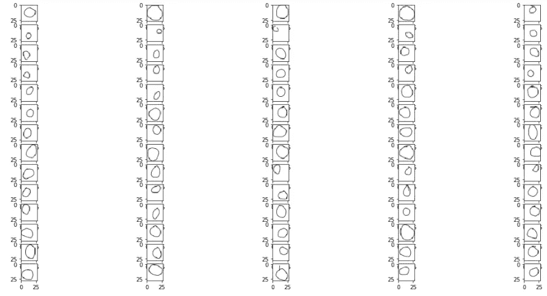

## **正方形**

(代码和上面差不多，完整代码见[这里](https://github.com/gabrielpierobon/cnnshapes/blob/master/README.md))

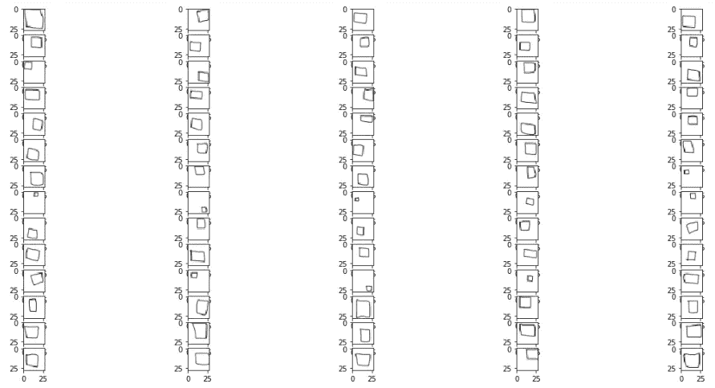

## 三角形

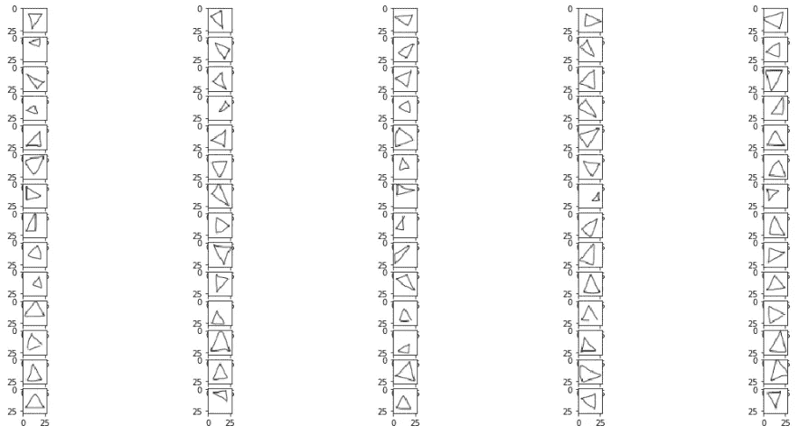

图像形状是 28 像素乘 28 像素的 RGB 比例(尽管它们可能只是黑白的)。

现在让我们继续进行卷积神经网络的构建。通常，我们用`Sequential()`开始模型:

```
# Initialising the CNN
classifier = Sequential()
```

我们指定我们的卷积层，并添加`MaxPooling`进行下采样，添加`Dropout`防止过度拟合。我们使用`Flatten`，并以 3 个单元的`Dense`层结束，每个类一个(圆形[0]，正方形[1]，三角形[1])。我们指定`softmax`作为我们最后的激活函数，这是为多类分类建议的。

```
# Step 1 - Convolution
classifier.add(Conv2D(32, (3, 3), padding='same', input_shape = (28, 28, 3), activation = 'relu'))
classifier.add(Conv2D(32, (3, 3), activation='relu'))
classifier.add(MaxPooling2D(pool_size=(2, 2)))
classifier.add(Dropout(0.5)) # antes era 0.25# Adding a second convolutional layer
classifier.add(Conv2D(64, (3, 3), padding='same', activation = 'relu'))
classifier.add(Conv2D(64, (3, 3), activation='relu'))
classifier.add(MaxPooling2D(pool_size=(2, 2)))
classifier.add(Dropout(0.5)) # antes era 0.25# Adding a third convolutional layer
classifier.add(Conv2D(64, (3, 3), padding='same', activation = 'relu'))
classifier.add(Conv2D(64, (3, 3), activation='relu'))
classifier.add(MaxPooling2D(pool_size=(2, 2)))
classifier.add(Dropout(0.5)) # antes era 0.25# Step 3 - Flattening
classifier.add(Flatten())# Step 4 - Full connection
classifier.add(Dense(units = 512, activation = 'relu'))
classifier.add(Dropout(0.5)) 
classifier.add(Dense(units = 3, activation = 'softmax'))
```

对于这种类型的图像，我可能会构建一个过于复杂的结构，这一点在我们查看特征地图时会很明显，但是，对于本文来说，它有助于我准确展示每个图层将做什么。我确信我们可以用更少的层次和更少的复杂性获得相同或更好的结果。

让我们来看看我们的模型总结:

```
classifier.summary()
```

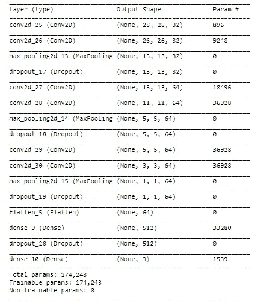

我们利用`rmsprop`作为我们的优化器、`categorical_crossentropy`作为我们的损失函数来编译模型，并且我们指定`accuracy`作为我们想要跟踪的度量:

```
# Compiling the CNN
classifier.compile(optimizer = 'rmsprop',
                   loss = 'categorical_crossentropy', 
                   metrics = ['accuracy'])
```

此时，我们需要将我们的图片转换成模型可以接受的形状。为此，我们使用`ImageDataGenerator`。我们启动它，并用`.flow_from_directory`来填充我们的图像。工作目录中有两个主要文件夹，称为`training_set`和`test_set`。其中每个都有 3 个子文件夹，分别叫做`circles`、`squares`和`triangles`。我已经向`training_set`发送了每种形状的 70 张图片，向`test_set`发送了 30 张图片。

```
train_datagen = ImageDataGenerator(rescale = 1./255)
test_datagen = ImageDataGenerator(rescale = 1./255)training_set = train_datagen.flow_from_directory('training_set',
                                                 target_size = (28,
                                                 28),
                                                 batch_size = 16,
                                                 class_mode =
                                                     'categorical')test_set = test_datagen.flow_from_directory('test_set',
                                            target_size = (28, 28),
                                            batch_size = 16,
                                            class_mode =
                                                 'categorical')
```

该模型将训练 30 个时期，但我们将使用`ModelCheckpoint`来存储最佳表现时期的权重。我们将指定`val_acc`作为用于定义最佳模型的指标。这意味着我们将保留测试集上在准确性方面得分最高的时期的权重。

```
checkpointer = ModelCheckpoint(filepath="best_weights.hdf5", 
                               monitor = 'val_acc',
                               verbose=1, 
                               save_best_only=True)
```

## 训练模型

现在是训练模型的时候了，这里我们包括了`callback`到`checkpointer`

```
history = classifier.fit_generator(training_set,
                                   steps_per_epoch = 100,
                                   epochs = 20,
                                   callbacks=[checkpointer],
                                   validation_data = test_set,
                                   validation_steps = 50)
```

该模型训练 20 个时期，并在时期 10 达到其最佳性能。我们得到以下消息:

> ` Epoch 00010: val_acc 从 0.93333 提高到 0.95556，将模型保存到 best_weights.hdf5 `中

在此之后，对于下一个时段，模型没有改进，因此时段 10 的权重是存储的权重——这意味着我们现在有一个存储该特定时段的权重的`hdf5`文件，其中测试集的准确度为 95.6%

我们将确保我们的分类器装载了最好的权重

```
classifier.load_weights('best_weights.hdf5')
```

最后，让我们保存最终模型以备后用:

```
classifier.save('shapes_cnn.h5')
```

## 显示训练过程中的损耗和精度曲线

现在让我们检查一下我们的模型在 30 个时期的表现:

```
acc = history.history['acc']
val_acc = history.history['val_acc']
loss = history.history['loss']
val_loss = history.history['val_loss']epochs = range(1, len(acc) + 1)plt.plot(epochs, acc, 'bo', label='Training acc')
plt.plot(epochs, val_acc, 'b', label='Validation acc')
plt.title('Training and validation accuracy')
plt.legend()plt.figure()plt.plot(epochs, loss, 'bo', label='Training loss')
plt.plot(epochs, val_loss, 'b', label='Validation loss')
plt.title('Training and validation loss')
plt.legend()plt.show()
```

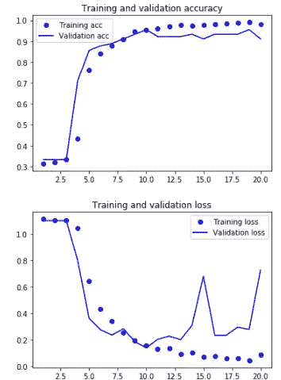

我们可以看到，在纪元 10 之后，模型开始过度拟合。不管怎样，我们保留了性能最好的 epoch 的结果。

## 班级

现在让我们弄清楚分配给每个图形集的类别号，因为这是模型产生预测的方式:

圆:0
正方形:1
三角形:2

## 预测看不见的图像的类别

通过训练和存储我们的模型，我们可以从测试集中加载一个简单的看不见的图像，并查看它是如何分类的:

```
img_path = 'test_set/triangles/drawing(2).png'img = image.load_img(img_path, target_size=(28, 28))
img_tensor = image.img_to_array(img)
img_tensor = np.expand_dims(img_tensor, axis=0)
img_tensor /= 255.plt.imshow(img_tensor[0])
plt.show()print(img_tensor.shape)
```

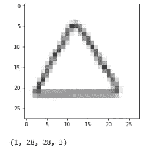

```
# predicting images
x = image.img_to_array(img)
x = np.expand_dims(x, axis=0)images = np.vstack([x])
classes = classifier.predict_classes(images, batch_size=10)
print("Predicted class is:",classes)**> Predicted class is: [2]**
```

预测是类[2]，它是一个三角形。

到目前为止一切顺利。我们现在进行这篇文章最重要的部分

# 可视化中间激活

引用弗朗索瓦·乔莱(Franç ois Chollet)在他的书《用 Python 进行深度学习》(这一节我会大量引用他的话):

中间激活*“有助于理解连续的 convnet 层如何转换其输入，以及初步了解各个 convnet 滤波器的意义。”*

*“conv nets 所学的表征非常适合可视化，很大程度上是因为它们是视觉概念的表征。可视化中间激活包括在给定特定输入的情况下，显示网络中各种卷积和池化图层输出的特征地图(图层的输出通常称为其激活，即激活函数的输出)。这给出了输入如何被分解成由网络学习的不同滤波器的视图。每个通道对相对独立的要素进行编码，因此可视化这些要素地图的正确方法是将每个通道的内容独立绘制为 2D 图像。”*

接下来，我们将获得一个输入图像——一个三角形的图片，而不是网络被训练的图像的一部分。

*“为了提取我们想要查看的特征地图，我们将创建一个 Keras 模型，该模型将成批图像作为输入，并输出所有卷积和池层的激活。为此，我们将使用 Keras 类模型。使用两个自变量实例化模型:输入张量(或输入张量列表)和输出张量(或输出张量列表)。产生的类是一个 Keras 模型，就像顺序模型一样，将指定的输入映射到指定的输出。使模型类与众不同的是，它允许具有多个输出的模型，而不像顺序输出。”*

## 从输入张量和输出张量列表实例化模型

```
layer_outputs = [layer.output for layer in classifier.layers[:12]] 
# Extracts the outputs of the top 12 layersactivation_model = models.Model(inputs=classifier.input, outputs=layer_outputs) # Creates a model that will return these outputs, given the model input
```

当输入图像时，该模型返回原始模型中的层激活值。

## 在预测模式下运行模型

```
activations = activation_model.predict(img_tensor) 
# Returns a list of five Numpy arrays: one array per layer activation
```

例如，这是图像输入的第一卷积层的激活:

```
first_layer_activation = activations[0]
print(first_layer_activation.shape)**(1, 28, 28, 32)**
```

这是一张 28 × 28 的特征图，有 32 个通道。让我们尝试绘制原始模型的第一层的激活的第四个通道

```
plt.matshow(first_layer_activation[0, :, :, 4], cmap='viridis')
```

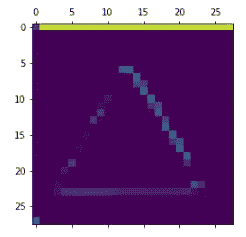

甚至在我们试图解释这种激活之前，让我们画出同一图像在每一层的所有激活

## 在每个中间激活中可视化每个通道

这部分的完整代码可以在[这里](https://github.com/gabrielpierobon/cnnshapes/blob/master/README.md)找到

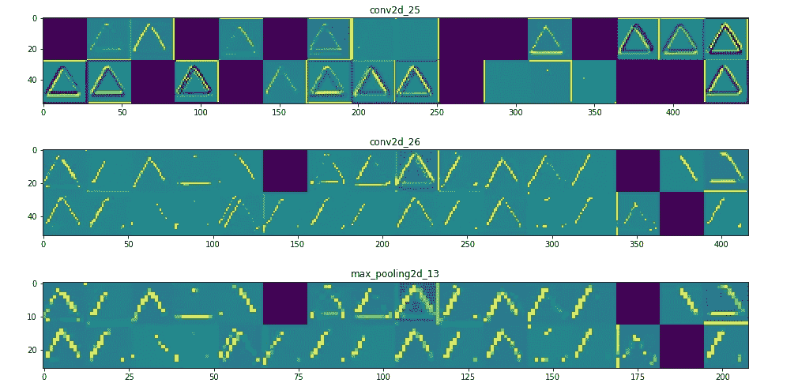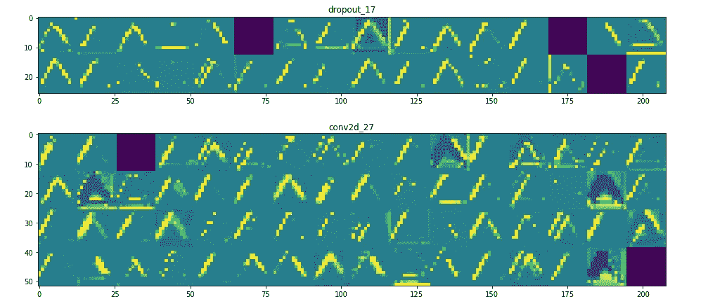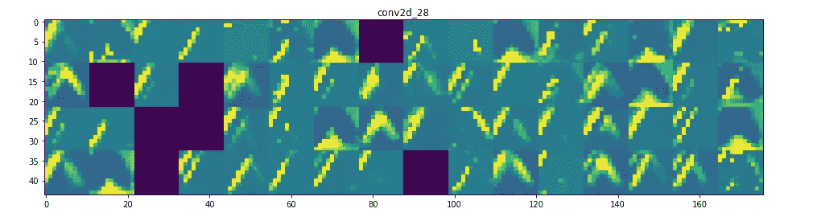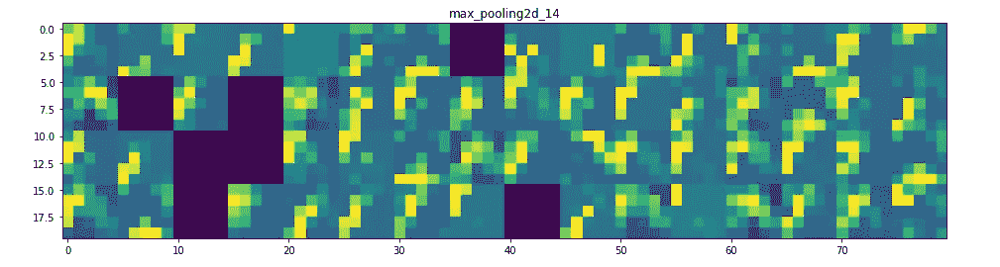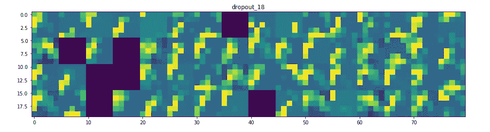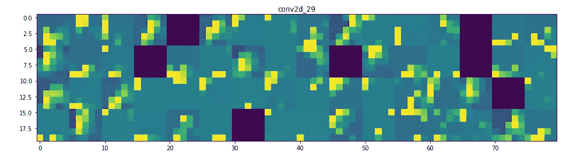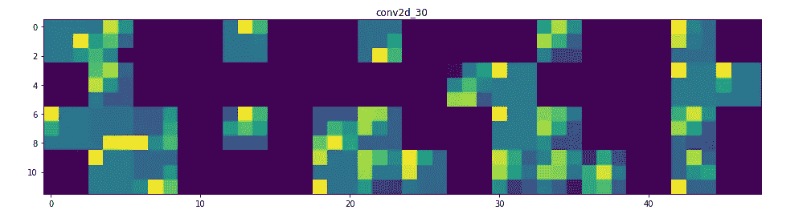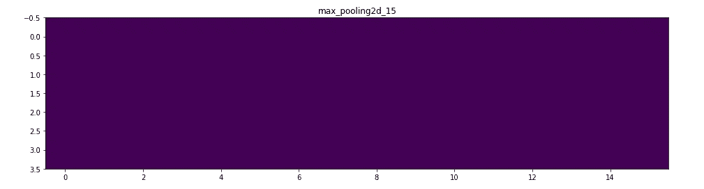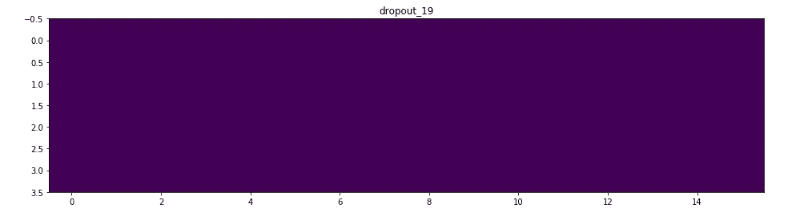

这就是了！让我们试着解释一下发生了什么:

*   第一层可以说是保留了三角形的完整形状，尽管有几个滤镜没有被激活，留为空白。在该阶段，激活保留了初始图片中几乎所有的信息。
*   随着我们越来越深入，激活变得越来越抽象，越来越难以视觉解释。他们开始编码更高层次的概念，如单个边框、角和角度。更高的呈现携带越来越少的关于图像的视觉内容的信息，以及越来越多的关于图像类别的信息。
*   如上所述，模型结构过于复杂，以至于我们可以看到我们最后的层实际上根本没有激活，在这一点上没有什么需要学习的。

原来就是这样！我们已经看到了卷积神经网络如何发现一些基本图形中的模式，以及它如何将信息从一层传递到另一层。

[完整代码在此](https://github.com/gabrielpierobon/cnnshapes/blob/master/README.md)。