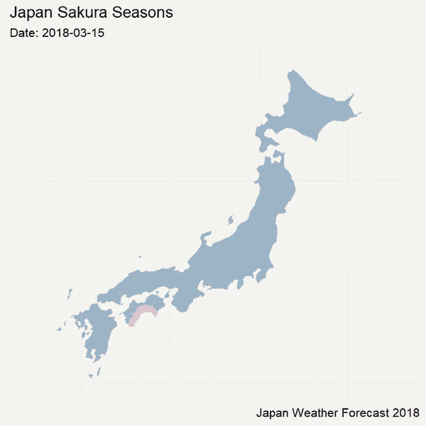
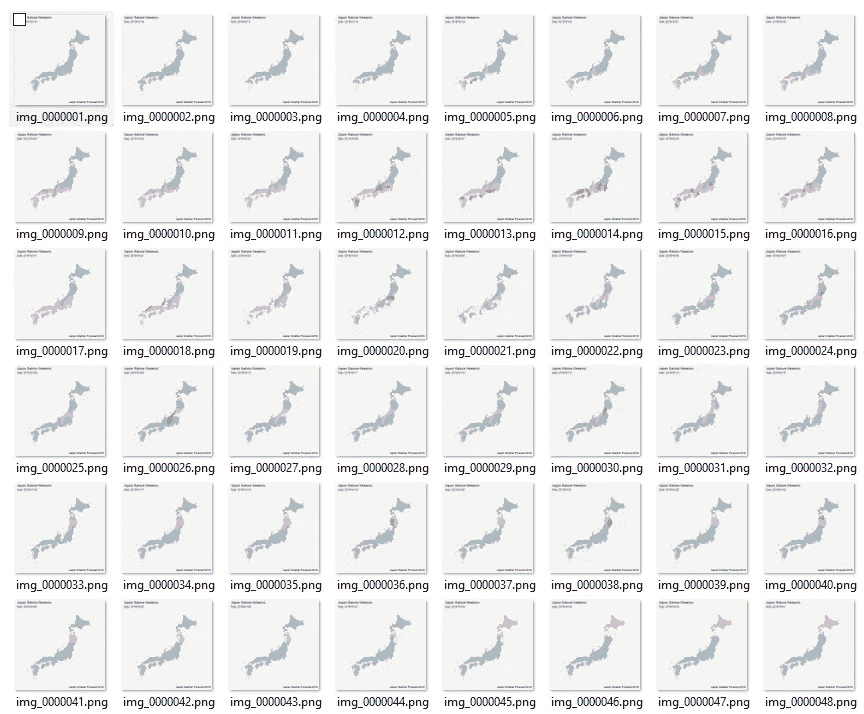
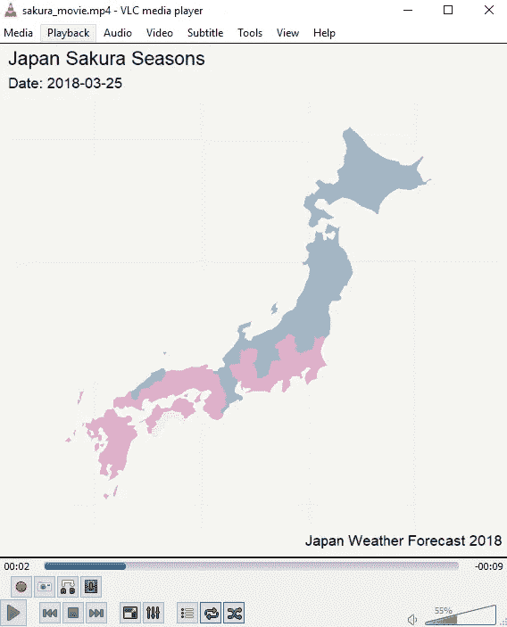

# 可视化 2018 年日本樱花季预测——尽在 R

> 原文：<https://towardsdatascience.com/visualizing-japan-cherry-blossom-season-forecast-2018-doing-it-all-in-r-8b0ef46a6762?source=collection_archive---------14----------------------->

另一种用于教育目的的动画数据可视化体验，利用 FFmpeg 将图像转换为 MP4


最近，我怀着无比的喜悦第一次访问了日本。这次旅行是对日本美丽迷人的风景、历史和丰富文化的完美介绍。我非常怀念的一件事是能够看到樱花。所以我决定把它作为这次可视化的主题。

四处寻找数据集(最好是带日期的 geojson)，不幸的是没有这样的可用数据集。

没问题。我决定从 2018 年 JR 铁路通行证的[官方预报网页](https://www.jrailpass.com/blog/japan-cherry-blossom-forecast)建立一个简单的网络抓取。它包括下载一个表，然后将该表映射到日本地区的名称。有一些必要的数据清理操作，以确定开花、完全开花和花期结束。幸运的是，官方预报网页给了我所需的开花前 1 周和开花后 1 周的假设:

> “请记住，**大多数花一旦开始开花，通常需要一周的时间达到盛开**，而**的盛开也要持续一周左右”(JR 铁路通行证博客)**

下面是我们将构建的体验的结果。



这种方法不使用任何库。目标是帮助人们更好地理解幕后发生的事情。电影是一系列静止的图像，当一个图像一个图像地播放时，会产生运动的错觉。本教程将通过生成 55 张图片(每天一张)来做同样的事情，并将使用 FFmpeg 将它们转换成一部电影(2 行代码)。


Sallie Gardner at a Gallop — made by Eadweard Muybridge in 1878

# 使用 R:

我们将跳过步骤 0 (webscraping 和数据清理以创建数据集),专注于步骤 1 到 3——加载文件、生成图像并将其转换为电影。


**步骤 1——加载并准备文件**

我们将使用 2 个文件:1)从 JR 铁路通道获得的数据集和来自日本的 Geojson 文件，我们将把它们转换成带有每个地区名称的数据帧。

```
#Step 1 - Loading datasets
myurl<-'[https://raw.githubusercontent.com/tristanga/Visualizing-Japan-cherry-blossom-season-forecast-2018/master/sakura_2018.csv](https://raw.githubusercontent.com/tristanga/Visualizing-Japan-cherry-blossom-season-forecast-2018/master/sakura_2018.csv)['](https://raw.githubusercontent.com/tristanga/Visualizing-Japan-cherry-blossom-season-forecast-2018/master/sakura_2018.csv')
sakuradf<- read.csv(myurl)
sakuradf$sakura <- as.factor(sakuradf$sakura)#Loading geojson Japan map and convert it into dataframe
myurl <- '[https://raw.githubusercontent.com/tristanga/Visualizing-Japan-cherry-blossom-season-forecast-2018/master/Japan.json](https://raw.githubusercontent.com/tristanga/Visualizing-Japan-cherry-blossom-season-forecast-2018/master/Japan.json)['](https://raw.githubusercontent.com/tristanga/Visualizing-Japan-cherry-blossom-season-forecast-2018/master/Japan.json')
map_japan <- geojson_read(myurl,  what = "sp")
map_japan.df <- fortify(map_japan)#Adding the name to the region
myid <- as.data.frame(map_japan@data)
myid$id <- seq.int(nrow(myid))-1
myid <- myid  %>% select(id, name)
map_japan.df <- merge(map_japan.df, myid,  by.x="id", by.y="id")
```

**步骤 2 —生成 55 幅图像**



我们首先必须创建一个包含所有唯一日期的过滤器。由于像冲绳这样的一些地区在使用的 geojson 地图上看不太清楚，所以最好从樱花预测的第 65 天开始一直到结束，而不是第 1 天。

要从 ggplot 获得更好的结果，需要 ggplot 的主题(参见 theme_map)。

然后，从第 65 天到最后创建一个简单的循环，过滤当天的内容并与 JSON 合并，然后将图像保存到地图文件夹中。

```
#Step 2 - Generating 55 images#Creating a filter of all the dates
mydates =unique(sakuradf$date)#Displaying only the last 55 days of the season (skipping Okinawa region)
startdate = 65
enddate = length(mydates)#Generating a style
theme_map <- function(base_size = 12) {
  theme_minimal() +
    theme(
      axis.line = element_blank(),
      axis.text.x = element_blank(),
      axis.text.y = element_blank(),
      axis.ticks = element_blank(),
      axis.title.x = element_blank(),
      axis.title.y = element_blank(),
      # panel.grid.minor = element_line(color = "#ebebe5", size = 0.2),
      panel.grid.major = element_line(color = "#ebebe5", size = 0.2),
      panel.grid.minor = element_blank(),
      plot.background = element_rect(fill = "#f5f5f2", color = NA), 
      panel.background = element_rect(fill = "#f5f5f2", color = NA), 
      legend.position = 'None', legend.title = element_blank(),
      panel.border = element_blank()
    )
}#Creating a loop to filter on each day, generate a chart and saving 55 images in a map folder
for (x in startdate:enddate){
  my_x = mydates[x]
  print(paste("The year is", my_x))
  sakuradf_x <- sakuradf %>% filter(date == my_x)
  map_japan.df_x <- merge(map_japan.df, sakuradf_x,  by.x="name", by.y="name")
  japanplot <- ggplot(map_japan.df_x) +
    geom_polygon(aes(x = long, y = lat, fill = sakura, group = group)) +
    theme_map()+scale_fill_manual(values=c("4"='#d2618c',"3"='#e3adcb' , "2"="#f7e0f4", "1"="#9db6c7")) +
    ylim(30,46)+ 
    xlim(127,148)+ 
    labs(x = NULL, 
         y = NULL, 
         title = "Japan Sakura Seasons", 
         subtitle = paste("Date: ", my_x, sep=""),
         caption = "Japan Weather Forecast 2018")
  filename <- paste0("maps/img_" , str_pad(x-64, 7, pad = "0"),  ".png")
  ggsave(filename = filename, plot = japanplot, width = 5, height = 5, dpi = 150, type = "cairo-png")
}
```

**步骤 3 —从图像到电影**

只要你下载了 FFmeg 并解压到本地文件夹，比如 C:/ffmpeg，只需要简单的几行代码就可以创建电影。如果您没有 FFmeg，可以从以下网址下载:

 [## FFmpeg

### Stanislav Dolganov 设计并实现了无损运动估计和补偿的实验支持。

www.ffmpeg.org](https://www.ffmpeg.org/) 

```
#Step 3 - Creating a movie from the images (please note that ffmeg is on my C:/)
makemovie_cmd <- paste0("C:/ffmpeg/bin/ffmpeg -framerate 5 -y -i ", paste0(getwd(), "/maps/img_%7d.png"),  " -r 56 -pix_fmt yuv420p ",  paste0(getwd(), "/maps/"), "sakura_movie.mp4")
system(makemovie_cmd)
```

然后在地图文件夹中创建一个 sakura_movie.mp4。你可以在 [Github](https://github.com/tristanga/Visualizing-Japan-cherry-blossom-season-forecast-2018) 上找到完整的代码和文件。

[](https://github.com/tristanga/Visualizing-Japan-cherry-blossom-season-forecast-2018) [## 特里斯坦加/可视化-日本-樱花-季节-预测-2018 年

### 可视化-日本-樱花-季节-预测-2018 -另一个用于教育目的的动画数据可视化

github.com](https://github.com/tristanga/Visualizing-Japan-cherry-blossom-season-forecast-2018) 

如果你喜欢这个可视化效果，别忘了用文章页面上的鼓掌按钮鼓掌👏。每篇帖子最多可以鼓掌 50 次。如果您有任何问题，请随时通过 [LinkedIn](https://www.linkedin.com/in/tristanganry/) 联系我。

