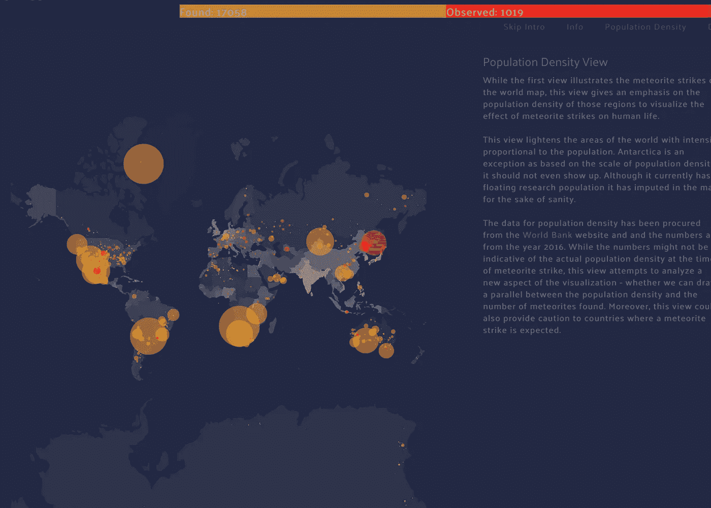

# 在 D3 中可视化陨石撞击

> 原文：<https://towardsdatascience.com/visualizing-meteorite-strikes-in-d3-7c679e5072df?source=collection_archive---------12----------------------->

Meteorite shower

> 如果没有木星清理早期的太阳系，地球将会布满流星碰撞的痕迹。我们每天都会遭受小行星的撞击。如果没有木星，CNN 演播室可能会变成一个巨大的陨石坑。—加来道雄

作为 JavaScript 和 D3 的业余爱好者，我想挑战自己，创建一个使用 D3.js 和 jQuery 的强大功能来构建数据集的动画可视化的页面。

# 数据

为了让所有这些工作起来，我必须结合 3 个不同的数据集——

*   json 格式的地理空间数据
*   csv 格式的陨石数据
*   csv 格式的人口密度数据

我加入了 geo-json 文件和人口密度文件，并添加了人口密度(每平方英尺。km)到每个国家的 geo-json 文件。然后我用陨石数据在地图上标出陨石。

# 设计

可视化大致分为 3 个部分—

*   页眉
*   地图或可视化
*   右边的故事

## 页眉

顾名思义，标题包含标题和 3 个补间属性——发现和观察到的陨石的年份和数量，根据地图上正在进行的动画进行插值。可视化中的动画从最古老的年份开始到最近的年份，年份滚动跟踪这一点，随着动画的进行，发现和观察到的陨石的计数累积显示在发现和观察滚动中。

## 地图或可视化

该地图包含整个可视化-一个互动的地图，陨石，动画等。，我使用 bootstrap 来帮助将不同的部分组织成网格，并使用 jQuery 和 d3 来实现交互性和动画。动画从最古老的一年开始，将流星坠落并撞击地球的相应坐标可视化。我还为攻击本身添加了一个效果，使地面上的接触可视化。这也有助于在非常小的陨石的情况下，确定它最终撞击的位置。

## 故事

story carousel 由按钮和信息组成，用于切换可视化效果并提供详细信息。有 4 个按钮可以显示理解可视化及其重要性的信息，也可以改变渲染。

*   **信息按钮**默认选择，以便用户获得可视化的介绍。
*   **跳过介绍按钮**，跳过动画，一次载入所有陨石。
*   **人口密度**按钮根据各自区域的人口密度改变地图的不透明度。
*   **数据按钮**显示用于可视化的数据集信息。

请注意，从“人口密度”中选择不同的按钮会将地图恢复到其原始设置。

Population Density view on Meteorite Strikes

下面是一个现场 [**演示**](http://bl.ocks.org/sharad-vm/raw/af74ae5932de1bcf5a39b0f3f849d847/#view) 。

# 反光

虽然我喜欢创建这个可视化，但我想承认 SVG 的性能问题，处理这么多的圆圈和动画本身。在这方面，我尝试过用 Canvas 代替 SVG，使可视化速度更快。请记住 canvas 的一个缺点，我不能直接添加一个工具提示，并且必须使用一个变通方法来添加第二个隐藏的 Canvas，以使工具提示工作，以及进行这些更改所涉及的时间，我正在考虑在未来的项目中用 Canvas 替换 SVG。有了 SVG，可视化可以完美地用于其他任何事情。

# 资源

*   [块](https://bl.ocks.org/)
*   [费尔特龙](http://feltron.com/)
*   [D3 —动画&交互](http://synthesis.sbecker.net/articles/2012/07/10/learning-d3-part-3-animation-interaction)
*   [动画数据—彼得·库克](http://animateddata.co.uk/)
*   [HTML5 —画布教程](https://www.html5canvastutorials.com/tutorials/html5-canvas-circles/)

# 反馈

如果您有任何反馈，请随时在这里留下您的评论或通过 [**LinkedIn**](https://www.linkedin.com/in/sharad-mv/) 联系我。