# 可视化模型 101，使用 R

> 原文：<https://towardsdatascience.com/visualizing-models-101-using-r-c7c937fc5f04?source=collection_archive---------8----------------------->

## 你已经有了一个模型，现在呢？


## 开场白

这是(*差点*)我上一篇关于 ***“模型选择 101，使用 R”的直接续篇:*** ( *我大概应该把这个做成一个系列吧？*)

[](https://medium.com/@peter.nistrup/model-selection-101-using-r-c8437b5f9f99) [## 型号选择 101，使用 R

### 使用 R 对简单模型选择进行快速标记

medium.com](https://medium.com/@peter.nistrup/model-selection-101-using-r-c8437b5f9f99) 

因此，如果您还没有，请检查一下，因为大多数示例将使用来自该分析的**相同数据**和**模型**。

也就是说，这是一个**续集**以及一个 **101** 本身，这意味着— *就像上一篇文章—* 一样，这将主要是**介绍性的。**如果您想自己下载数据并跟随本文，请直接阅读本文末尾！

如果你喜欢这篇文章并想看更多，请务必关注我的简介**[**！**](https://medium.com/@peter.nistrup)**

## **我们在做什么？**

**在这篇文章中，我们将看看你用你的模型得到的一些可视化的发现，比如给定解释变量对我们的反应变量的边际效应。**

**我们将会制作这样的美丽情节:**

**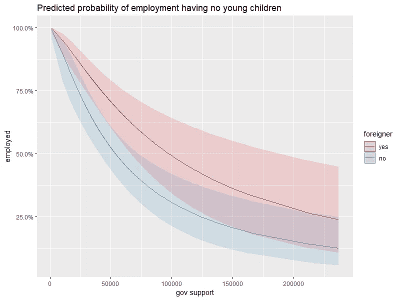**

***Who knew that if you receive no government support at all you’re forced into employment :O***

# **准备我们的数据和模型**

**我们必须做一些整理工作，为适当的可视化准备我们的数据和模型:**

```
dat$gov.support <- exp(dat$gov.support)
dat$employed <- factor(dat$employed, levels(dat$employed)[c(2,1)])
```

****第一个命令**对我们的*‘gov . support’*值应用 exp()变换，这是因为**值在原始数据中默认为对数变换**。我们这样做的原因是，当我们用*‘log(gov . support)’*拟合模型时，我们得到**与上一篇文章相同的结果**，但是我们得到了*‘back’*的额外好处——转换我们的数据，我将在后面展示！**

****第二个命令**简单地交换了我们的分类响应变量*‘employed’*的顺序，这样我们的模型拟合将默认为拟合*‘employed = =“yes”’*，即使没有明确定义它。这很重要，因为现在我们可以不用**一个“逻辑”响应变量**来拟合我们的模型，该变量检查*是否被使用== "yes"'* 。**

**这意味着上一篇文章中的基本模型是这样创建的:**

```
fit.1 <- glm(employed == "yes" ~ ., data = dat, family = binomial)
```

****现在我们这样定义:****

```
fit.1 <- glm(employed ~ . - gov.support + log(gov.support), data = dat, family = binomial)
summary(fit.1)
```

**请注意，我们没有为响应变量定义逻辑条件，我们用变量的对数变换替换了新的指数变换' *gov.support* '，以恢复到我们的初始模型:**

**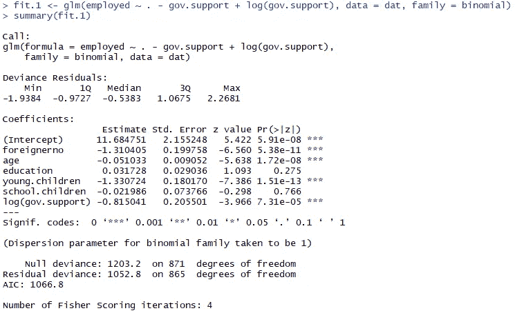**

**如上所述，我们在进行“*清理*”之前，得到了与上一篇文章完全相同的摘要。**

**我想做的最后一件事是重新定义我们的因素变量，使其更加清晰:**

```
dat$zero.young.children <- factor(dat$young.children == 0)dat$zero.school.children <- factor(dat$school.children == 0)dat$zero.children <- factor(dat$young.children + dat$school.children == 0)
```

**这意味着我们的**最终拟合**看起来像这样:**

```
glm(employed ~ foreigner 
                 + log(gov.support) 
                 + age 
                 + school.children 
                 + zero.young.children 
                 + zero.school.children
                 + zero.children
                 + I(age^2) 
                 + foreigner:age 
                 + foreigner:zero.children
                 + age:school.children 
                 + log(gov.support):zero.young.children, 
family = binomial, data = dat)
```

# **现在让我们制作一些情节！**

**让我们先画出我觉得最有趣的东西，即“*”和“ ***gov.support*** ”之间的关系。***

***为此，我使用了一个名为“sjPlot”的非常出色的软件包:***

```
*library("sjPlot")
plot_model(full.fit, type = “pred”, terms = c(“gov.support”))*
```

***给了我们这个情节:***

***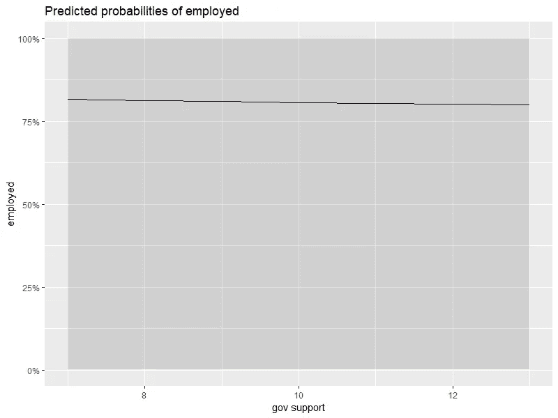***

*****完全** **无用**！这是怎么回事？为了方便起见,' plot_model '给出了以下错误:***

******

***这正是我们需要转换数据的原因！让我们再试一次:***

```
*plot_model(full.fit, type = “pred”, terms = c(“gov.support [exp]”))*
```

***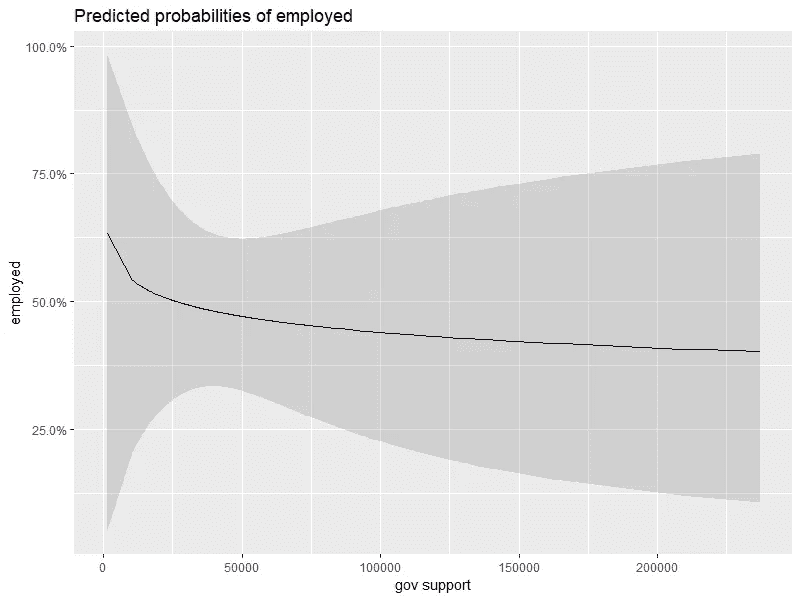***

***这几乎是毫无用处的，**现在发生了什么？*****

***让我们试着看看我们的模型，以及它如何试图捕捉数据中的**关系。有几种不同的方法可以做到这一点，但我们先来看看完整模型的系数:*****

***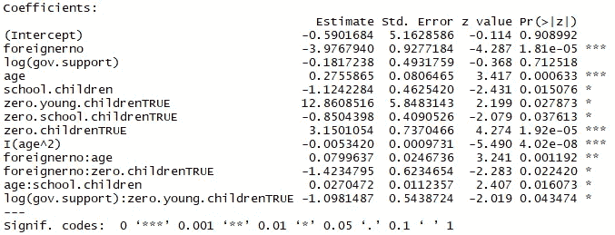***

***看到这个，你首先注意到的是什么？对我来说，它是因子变量*‘零.年轻.儿童’*的**系数**几乎是 **13** ！虽然这不一定是个问题，但是让我们来看看系数的置信区间:***

```
*confint(full.fit)*
```

***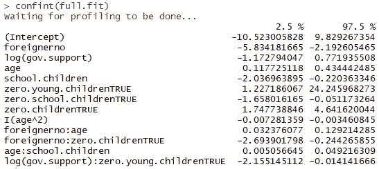***

***对，这看起来像麻烦！看看这个跨度，这意味着我们的边际效应图将会有巨大的置信区间。这很可能是我们的图有如此大的置信区间的原因。***

***sjPlot 也可以绘制这些:***

```
*plot_model(full.fit, transform = NULL, show.values = TRUE, axis.labels = “”, value.offset = .4)*
```

***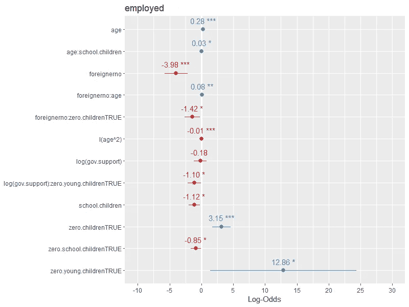***

***这使得很容易看出，因子变量' *zero.young.children'* '在制作任何真正有把握的图时是很成问题的**。*****

***让我们走一点弯路，创建一个更简单的模型，没有任何变量交互，结果我们得到的是:***

```
*simple.fit <- glm(employed ~ foreigner 
 + age 
 + zero.young.children 
 + zero.children 
 + log(gov.support) 
 + I(age^2), family = binomial, data = dat)
summary(simple.fit)*
```

***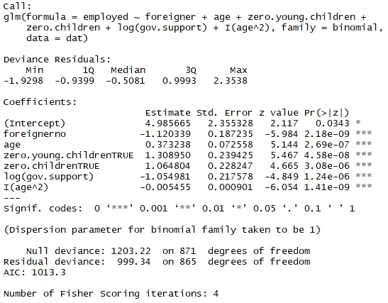***

***在 **AIC** 中有一点点增加，这不是一件好事，但也不算太多，而且**我们通过使用这个模型获得了很多简单性**！*(如果我们用****BIC****来衡量性能，我们实际上发现这款车型更好，因为****【BIC****对复杂车型的处罚更严厉！****1047 vs 1068****)****

***让我们看看新的系数:***

```
*plot_model(simple.fit, transform = NULL, show.values = TRUE, axis.labels = “”, value.offset = .4)*
```

******

*****这个好看多了！让我们尝试使用这个模型再次制作我们的情节！*****

```
*plot_model(simple.fit, type = “pred”, terms = c(“gov.support [exp]”))*
```

***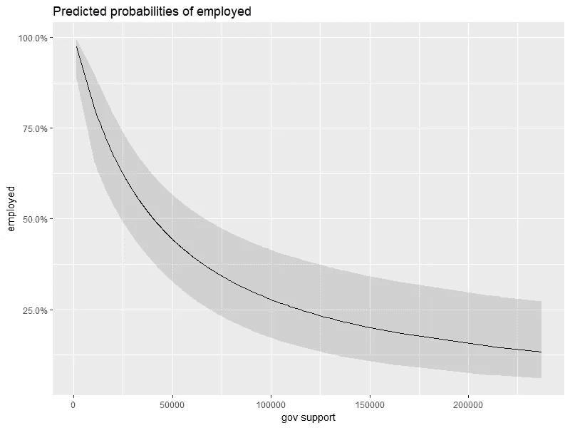***

***不错，**有用的东西！**所以很明显，你获得的政府支持越多，被雇用的可能性就越低。这颇有点直观的感觉！**外国人**和**非外国人**的区别如何？嗯 *plot_model* 也让这变得非常简单，只需将它添加为一个术语即可！：***

```
*plot_model(simple.fit, type = “pred”, terms = c(“gov.support [exp]”, “foreigner”))*
```

***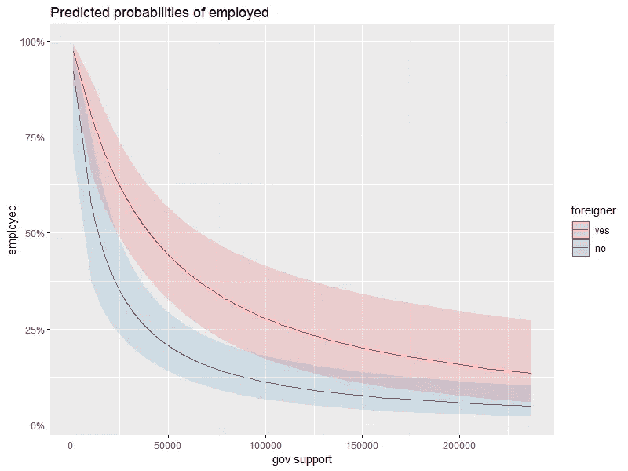***

*****这简直易如反掌！因此，这个模型表明，在其他变量相同的情况下，外国人比非外国人更有可能被雇用。*****

*****年龄**怎么样？这需要一个稍微不同的方法，因为我们并不真的假设与年龄有严格的正或负关系，这就是为什么权力转换 I(年龄)是有意义的。也就是说，我们不期望雇佣一个 10 岁的人，也不期望雇佣一个 70 岁的人，但是我们期望雇佣一个 30 岁的人。***

***遗憾的是，sjPlot 不太喜欢这种权力转换(或者说我是个不会做的笨蛋)，所以我用“jtools”包来代替:***

```
*effect_plot(simple.fit, pred = age, data = dat, interval = TRUE)*
```

******

***因此，就业似乎在 30 岁左右达到“顶峰”，然后就消失了，这也有很多直观的感觉！***

***现在生孩子呢？：***

```
*plot_model(simple.fit, type = “pred”, terms = c(“gov.support [exp]”, “zero.children”))*
```

***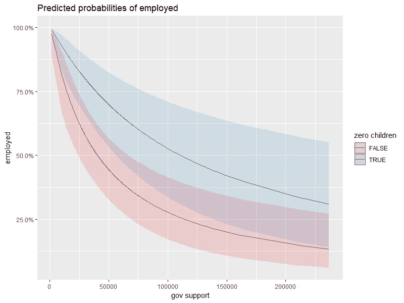***

*****惊喜惊喜！**不生孩子会让你更有可能被雇佣和进入市场！***

***现在这可能看起来有点落后，但是让我们试着**比较我们的图和我们的模型**的系数，试着理解它！(我是视觉学习者，所以这对我来说很有意义，该死！):***

***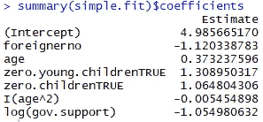***

***分类变量*外国人*、*零.孩子*和*零.年轻.孩子*很容易解释，成为**非外国人** ( *外国人编号*)会降低你被 **1.12** 雇用的对数几率，没有任何小孩会使你的对数几率提高 **1.31** ，没有任何小孩会使它提高 你必须考虑到无论何时*零.童*为**真**时*零.童*也是如此，基本上给对数概率一个**“累积改进”**。***

***更高的*年龄*提高了你被**雇佣的对数几率 0.37** ，但是几率也会随着*年龄* * - **0.0055** 而下降，这意味着什么？这只是一个凹 2。次数多项式，有点类似于我们的年龄图，即我们看到一个最初的上升，然后是一些最大值，然后下降。***

***就是这样！我们已经成功地以直观的方式复制了系数的值，**干得好**。***

# ***结束语***

***如果您想继续，请从这里获取数据:[https://github . com/pela 15 AE/statmod/blob/master/employment _ data . txt](https://github.com/pela15ae/statmod/blob/master/employment_data.txt)由于是丹麦语，您可以运行下面的代码来翻译所有变量名和分类值:***

```
*names(dat) <- c(“employed”, “foreigner”, “gov.support”, “age”, “education”, “young.children”, “school.children”)
levels(dat$employed)[1] <- “yes”
levels(dat$employed)[2] <- “no”
levels(dat$foreigner)[1] <- “yes”
levels(dat$foreigner)[2] <- “no”*
```

***另外，看看高维数据的数据可视化:***

***[](https://medium.com/@peter.nistrup/principal-component-analysis-pca-101-using-r-361f4c53a9ff) [## 主成分分析(PCA) 101，使用 R

### 一次提高一个维度的可预测性和分类能力！使用 2D 图“可视化”30 个维度！

medium.com](https://medium.com/@peter.nistrup/principal-component-analysis-pca-101-using-r-361f4c53a9ff)*** 

# ***结束语***

***如果你想看和了解更多，一定要关注我的 [**媒体**](https://medium.com/@peter.nistrup) 🔍**[**碎碎念**](https://twitter.com/peternistrup) 🐦*****

*****[](https://medium.com/@peter.nistrup) [## 彼得·尼斯特鲁普-中等

### 阅读彼得·尼斯特拉普在媒介上的作品。数据科学、统计和人工智能...推特:@PeterNistrup，LinkedIn…

medium.com](https://medium.com/@peter.nistrup)*****