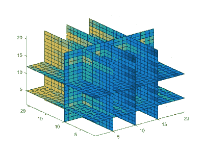
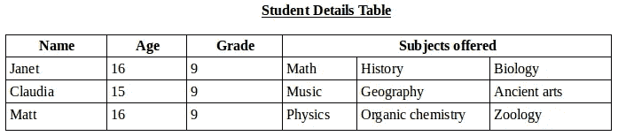

# 可视化多维数组

> 原文：<https://towardsdatascience.com/visualizing-multi-dimensional-arrays-a1027dcb02fa?source=collection_archive---------4----------------------->



A conceptual model of a multi-dimensional array

如果你在 5、6 年前问我对多维数组的看法，我会说它们是最简单的概念，但是实现起来最复杂，因为当我想到多维数组时，我的脑海中就会出现上面的“架构奇迹”。

那是很久以前，在我发现最简单的方法之前，就像理解 *1+1 = 2* 一样简单，去实现它们。好吧，虽然你们中的一些人可能已经很清楚了，这听起来可能是一个微不足道的任务，但这个概念中有一部分需要澄清，就像我几年前做的那样。所以系好安全带，我们走。

让我们从最基本的开始。什么是数组？

数组的原始定义只是说

> 数组是一种存储介质，可以保存固定数量的单一类型的值

虽然这部分是对的，但现在不再是了。考虑到我手头选择的编程语言，我认为我们可以扩展这个定义，并将其修改到新的水平。

JavaScript 提供了非常有用的特性，允许动态创建数组，这意味着数组的大小可以在以后决定，甚至不必固定。当要存储到阵列的数据数量改变时，它可以被修改，或者递增或者递减。

我们可能都注意到了，在某些时候，创建线性一维或二维数组的动力。让我们来创建多维数组。

多维数组，在我看来是数组中的数组。让我们讨论一个数组，用一个表格来直观地说明这一点。

假设您有一个简单的表，其中需要存储学生的详细信息，如*姓名*、*年龄*、*年级*和*提供的科目*。现在，由于我们必须存储许多学生的详细信息，很明显这已经是一个二维数组，上面的详细信息将以下面的方式映射。


A two-dimensional representation of the Student Details Table

在一定程度上，这张表似乎足以从中获取信息。但是，如果最后一列(保存了提供的主题的*)也被细分为如下所示，那么它将被认为更加干净和高效。*



A multi-dimensional representation of the Student Details Table

这也为我们提供了操纵这些学科子学科细节的特权。那么，我们如何实现这一点呢？

我们把映射上面学生详细信息的数组叫做“ *studentArray* ”。我们将为这个数组创建骨架。

```
**var** noOfStudentRecords=100;
**var** noOfColumns = 4;
**var** studentArray = [];
**for**(**var** x = 0; x < noOfStudentRecords; x++)
{
    studentArray[x] = [];
    **for**(**var** y = 0; y < noOfColumns; y++)
    {
        **if**(y==3)
        {
            studentArray[x][y]= **new** Array[3];
        }
    }
}
```

在上面的代码中，我们将第三列指定为一个新数组:因此， ***一个数组在另一个数组*** 中创建了一个 ***多维数组*** 。

这是创建多维数组的一个非常基本的解释。在更复杂的情况下，我们可以将这些单独的主题分成更多的类别，以容纳更多的细节，应用与上面相同的概念，只是在不同的维度上。