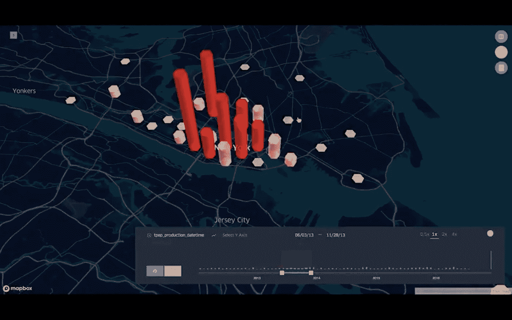
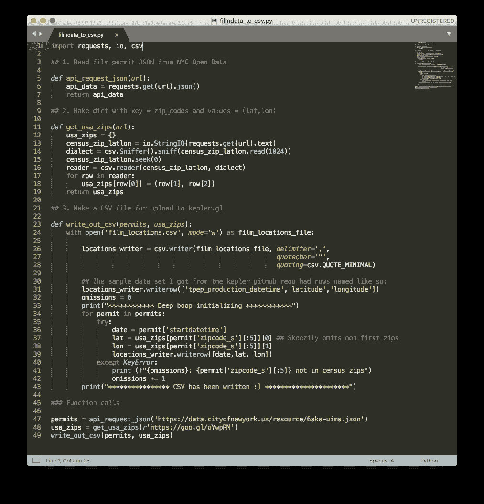

# 可视化纽约市电影许可证数据

> 原文：<https://towardsdatascience.com/visualizing-nyc-film-permit-data-e7c0aa24285?source=collection_archive---------11----------------------->

More on this later

## 鸽笼和博格

你，一个有时有趣，有时有创造力的人。你，有时涉猎艺术，也许甚至在或多或少的创造性或艺术性的职业中谋生。你告诉某人，也许是一个大家庭成员，也许是一个有点疏远的大学朋友，也许是在喝咖啡的时候，你已经离开了你看起来可能很酷，也许看起来很稳定的工作，去参加一个为期几个月的全职、面对面的编码训练营。

然后，你的同伴会礼貌而严肃地回答，用很多话来说:

> 哦哇。太棒了。那么…你已经彻底放弃了你所有的梦想？你正在**向科技行业进行艰难的职业转型？你终于承认你的文科学士一文不值了？** Rekt。你不会怀念至少看起来很酷吗？我是轻量级的，通过你的家庭来替代生活。开心地说服人们新兵训练营是有效的。嗯，我应该做一个吗？

我是从文卡特什·拉奥的《绝命毒师》中剽窃来的:软件正在吞噬世界。我们可以认为软件不是一个独立于其他行业的行业，而是每一个其他行业之上的新的一层。

当我说“在…之上”时，我显然不是指“优于”我的意思是，你能想到的几乎每一个行业都在成为，或将成为，拥有软件超能力的电子人。最终，每个行业中的每个实体都将不得不尽可能最好地创建和使用，或者至少是恰当地使用软件工具，否则就会被那些这样做的人(更好更快地)所超越。这既不是辩论，也不是新闻。

新兵训练营和他们的崇拜者/憎恨者应该避免本能地认为新兵训练营是“转向科技行业”的途径。更有用的是，把它们看作是把我们自己抽象到我们所从事的任何行业的软件层的机会。

我的大多数同学都来自这样或那样的行业，而不是直接来自学院。我们已经走进了这个领域，亲眼目睹了应用软件的最佳创造者和实现者，在他们各自的领域里，正在取得胜利。现在，我们正试图在我们工业化的自我之上，安装一些类似博格的功能——反过来，将这些功能带回丰富我们所了解和喜爱的行业。

Obligatory gif // Where my BioShock fans @

也许不是。至少，我们应该认识到，我们过去的经历已经不可逆转地塑造了我们，我们应该尽可能积极地接受这一点。你永远不知道你碰巧知道的东西，无论是通过学术研究还是职业辛劳，什么时候会派上用场，即使你正试图进入新的领域和经历。

虽然我*在一个灰色墙壁、没有窗户的房间里工作了近两年，上了十几个小时的夜班，*收集了宝贵的*深层领域知识，*充实了我的 [IMDb 档案](https://www.imdb.com/name/nm4574526/)，但我并没有完全成为我在学校时梦想成为的创意艺术家。在一家大型电影后期制作公司做数字日报操作员需要每天日出后睡觉，日落后醒来，在一些周末也是如此，这是不太自然的。

from mixinglight.com — I pretty much lived my life in a room like this one

这留下了某些可以说是重要的东西:社交生活？暴露在日光下？一份与在曼哈顿从事一份有创造性但技术要求高的工作相称的薪水？免费的办公室小吃？一般比较绿的草？这是我决定参加数据科学训练营的动力。我既没有创作自己的电影，也没有为电影制作人提供有用的工具。至少我可以和保罗·达诺共用一个冰箱。

我不会放弃对电影的热爱，也不会制作电影，但我正在一个不断发展的领域中寻找一种新的谋生方式。我们生活在一个网飞掌管好莱坞的世界，即使是在实体的意义上。你知道网飞的《纸牌屋》第一季是怎么诞生的吗？

> 通过分析观众数据——想想 3000 万次“播放”，400 万次评级，300 万次搜索——该公司能够[确定在英国播出的原版《纸牌屋》](https://www.wired.com/2012/11/netflix-data-gamble/)的粉丝也在观看由凯文·史派西主演、大卫·芬奇执导的电影——从[*CIO.com*](https://www.cio.com/article/3207670/big-data/how-netflix-built-a-house-of-cards-with-big-data.html)

看到了吗？数据科学完全适用于我的专业领域。我会想办法把它绑回去的。你会喜欢的，我保证。故事就是一切。

也就是说，下面是我第一次尝试运用数据科学工具来创造一些关于电影制作的有趣的东西。

## 可视化纽约市公开电影许可证数据

我最好的朋友迈克是一名数据科学家。不久前，迈克告诉我优步推出了一款漂亮的新开源工具，名为 [kepler.gl](https://kepler.gl/#/demo) 。他说，它提供了超级简单、超级容易的数据可视化。他说，不需要编程经验。

那太好了，因为现阶段我的编程经验非常少。不幸的是，事实证明，与我热爱的电影制作行业相关的数据集并不总是完美格式化并准备好输入到预建的数据 viz 工具中，因此，由于没有任何解析和重塑数据集的编程技能，我只能使用开普勒登录页面上提供的六个左右的演示。真扫兴。

然而，现在我进入了熨斗学校(T1)的数据科学训练营(T3)的第三周。从我很小的时候起，计算机就帮助我做有创造性的事情，但只是通过像 Adobe 制作的那些预建的 GUI 应用程序。只有在专注于 Python 几个星期，或者如果算上课程准备工作的话，可能几个月之后，在经验丰富的讲师的指导下，我才开始感觉到在数据方面的幼稚能力。**该是一些蹒跚学步的婴儿的时候了。**

一位同学(对查尔斯大喊)带我去了纽约市开放数据中心[，在它的数千个重要的和社会相关的数据集中，还有一个 API，提供了在该市备案的电影许可记录。该列表中归档的每个许可包括关于每个电影或电视制作的日期、邮政编码和每个制作保留的街道名称的信息。](https://opendata.cityofnewyork.us/)

我立刻想用开普勒将这些完全品牌化的时间/地理数据可视化。我想看到所有被允许的电影作品在纽约地区的地图上出现和消失，就像延时摄影中的水痘一样。开普勒很适合这类事情。

不幸的是，开普勒不接受像这样的文本字符串:“24 街和 26 街之间的百老汇”——作为有效的地理坐标。我认为可以用[谷歌的地理编码 API](https://developers.google.com/maps/documentation/geocoding/intro) 来实现，但是我在最后期限内要尽快做出一些像样的东西，所以我只是将许可数据中的邮政编码转换成经纬度坐标，而不是街道名称描述。不是最准确的地理信息，但绝对是最方便的。自然语言处理将不得不等待。

我写了一个 [python 脚本](https://github.com/boscacci/Visualizing-NYC-Film-Permit-Data)，从这些纽约市的许可证记录中提取，对照人口普查局的所有邮政编码目录交叉引用每个许可证提供的邮政编码，并将其与相应的纬度/经度配对。

然后，该脚本写出一个. csv 文件，其中包含按日期排列的所有许可坐标。这个文件可以上传到 kepler.gl，以查看有趣的热图或 hex-bin 可视化的高调纽约电影制作活动！下面的例子:

NYC Film Permits: Heatmap-Timelapsed via Kepler.gl

如果你想在自己的网络浏览器中玩可视化，请访问我的 GitHub repo sitory:你所要做的就是下载 repo 中的“nyc _ film _ permits.json ”,并将其上传到[开普勒演示网站](https://kepler.gl/#/demo)。

 [## boscacci/可视化-纽约市-电影-许可-数据

### 对 kepler.gl 的修补通过创建一个帐户来促进 boscacci/Visualizing-NYC-Film-Permit-Data 的发展…

github.com](https://github.com/boscacci/Visualizing-NYC-Film-Permit-Data) 

我希望这是一种鼓励，任何有适当动机的呆子都可以相对快速地使用一些预建的数据可视化工具:您不必学习像 plotly 或 matplotlib 这样的图形库来获得一个可爱的十六进制热图延时，您可以将它作为 react 对象嵌入到任何网页上。我们真的站在巨人的肩膀上。