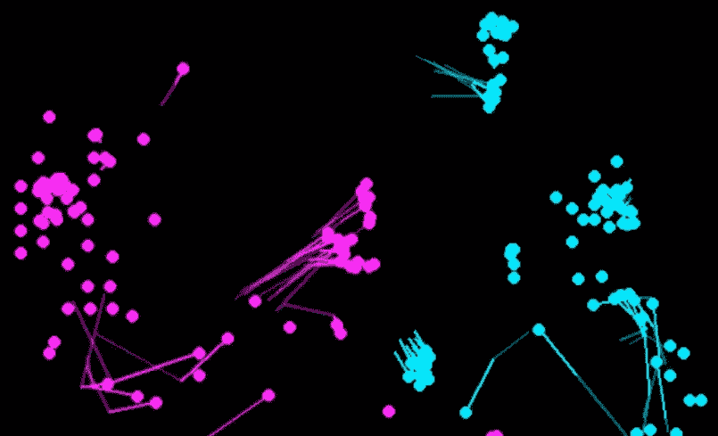

# 用 R 可视化职业星际争霸

> 原文：<https://towardsdatascience.com/visualizing-professional-starcraft-with-r-598b5e7a82ac?source=collection_archive---------5----------------------->



Snapshot of a Protoss vs Terran Match

自从我开始为《星际争霸:育雏战争》进行数据挖掘专业回放以来，已经过去了将近十年。在最近试用了 R 中的新动画包后，我想重新访问这个数据集，看看我是否可以用 [gganimate](https://github.com/thomasp85/gganimate) 和 [tweenr](https://github.com/thomasp85/tweenr) 包使用其中一些回放制作一个有趣的可视化效果。结果就是下面的视频:

Terran vs Zerg

这篇博文讲述了我创作这个视频的 R 脚本。用于生成该可视化的所有数据和代码都可以在 [Github](https://github.com/bgweber/StarCraftMining/tree/master/viz) 上获得。我通过观看星际争霸中的回放并使用 [BWAPI](https://github.com/bwapi/bwapi) 每 5 秒输出一次游戏状态的快照来生成数据集。这里也可以使用可用的数据集。这个过程的结果是，我最终得到了以下格式的 CSV 文件:

```
**frame,pID,unitID,x,y** 0,0,12,3792,864
0,0,19,3744,858
0,0,30,3704,864
0,0,34,3808,834
0,0,64,3768,864
```

该文件指定了游戏帧或刻度计数、控制该单元的玩家的 ID、用于跟踪该单元的游戏内标识符以及该单元的位置。虽然包含单位类型和状态变量(如健康)会很有用，但这些数据为可视化军队的移动提供了一个起点。数据集包括建筑物和移动单位，但不包括中立单位和结构。

```
**# libraries** library(ggplot2)
library(gganimate)
library(ggforce)
library(tweenr)
library(dplyr)
```

如前所述，我使用 gganimate 和 tweenr 库来创建可视化。gganimate 对于在 R 中创建动画图很有用，而 tweenr 提供了在动画中的不同捕捉点之间进行插值的方法。ggplot2 用于创建实际绘图，ggforce 用于设计绘图样式，dplyr 用于设置数据。

```
**# video settings** fps <- 24
nframes <- 5000
```

我为视频回放定义了两个参数。第一个 *fps* 是输出视频的帧速率，第二个 *nframes* 是视频的总长度。视频的长度将为*n 帧/fps* 秒。

```
**# load the replay data** df <- read.csv("PvT.csv") **# lag the x and y coordinates to plot lines of movement** 
df <-  df %>%  group_by(unitID) %>%  
    mutate(x1 = dplyr::lag(x, n = 1, default = NA),         
           x2 = dplyr::lag(x, n = 2, default = NA), 
           y1 = dplyr::lag(y, n = 1, default = NA),
           y2 = dplyr::lag(y, n = 2, default = NA))
```

下一步是加载和转换数据。加载的数据帧包括每个单位在特定游戏时间的 x 和 y 位置，但我也想延迟这些值，以便在坐标之间画线。我使用 dplyr 和 mutate 来使 x 和 y 位置分别滞后 5 秒和 10 秒。

```
**# set up graphics** df$colour <- ifelse(df$pID == 0, 'RED', 'GREEN')
df$time <- df$frame / fps
df$ease = 'linear'
df$size = 5
df$alpha = 1 **# Use tweenr** dt <- tween_elements(df, 'time', 'unitID', 'ease', nframes=nframes)
```

然后，我为绘图设置附加参数，包括单位的颜色和大小，以及用于动画的插值类型。最后一步使用 tweenr 构建一个数据帧，在输入数据帧的不同状态之间进行插值。

```
**# animate with gganimate** p <- ggplot(data = dt) +  
    geom_point(aes(x=0, y=0, size=10, alpha=0, frame = .frame)) +   
    geom_segment(aes(x=x1, y=y1, xend=x2, yend=y2, size=1, 
                 alpha=0.5, frame = .frame, color = colour)) +   
    geom_segment(aes(x=x, y=y, xend=x1, yend=y1, size=1, alpha=1,
                 frame = .frame, color = colour)) +   
    geom_point(aes(x=x, y=y, size=size, alpha=alpha, frame = .frame,
                 color = colour)) +   
    scale_size(guide = 'none') +   
    scale_colour_identity() +   
    scale_alpha(range = c(0, 1), guide = 'none') +     
    ggforce::theme_no_axes()
```

下一步是创建数据图，包括线和点。第一个几何点用于缩放点的大小，第二个几何点用于绘制单位。两个 geom_segment 调用用于在单元的当前和过去位置之间画线。旧的轨迹比新的轨迹颜色浅( *alpha = 0.5* )。代码块的其余部分修改了绘图的样式。

```
**# output the video** animation::ani.options(interval = 1/fps)
gganimate(p, "output.mp4", ani.width=640, ani.height=640 
    ,title_frame = FALSE)
```

最后一步是创建动画情节的视频。我将视频大小设置为 640×640 像素，并禁用了视频顶部的帧计数器。也可以输出 gif 和网页。该脚本的结果显示在下面的示例视频中。渲染可能需要相当长的时间。

Protoss vs Terran

视频显示了神族(红色)对人族(绿色)游戏中的部队移动。视频的开头显示了侦察阶段和最初的冲突。稍后，你可以在地图上看到人族玩家放置蜘蛛雷的位置。在神族玩家拿出一个扩张点并获得地图中间的控制权后，比赛结束。

[本·韦伯](https://www.linkedin.com/in/ben-weber-3b87482/)是 Zynga 的首席数据科学家。我们正在[招聘](https://www.zynga.com/careers/positions/categories/data-analytics-user-research)！

Zerg vs Protoss