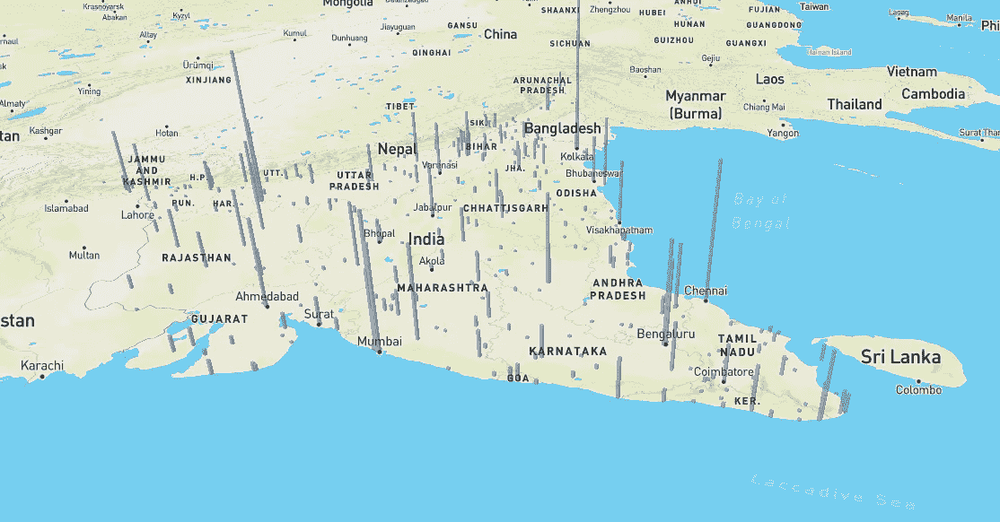
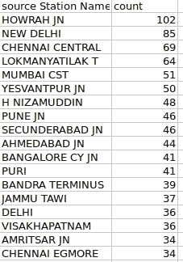
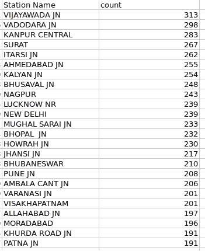
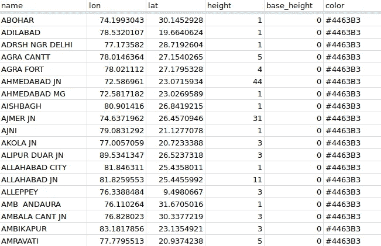
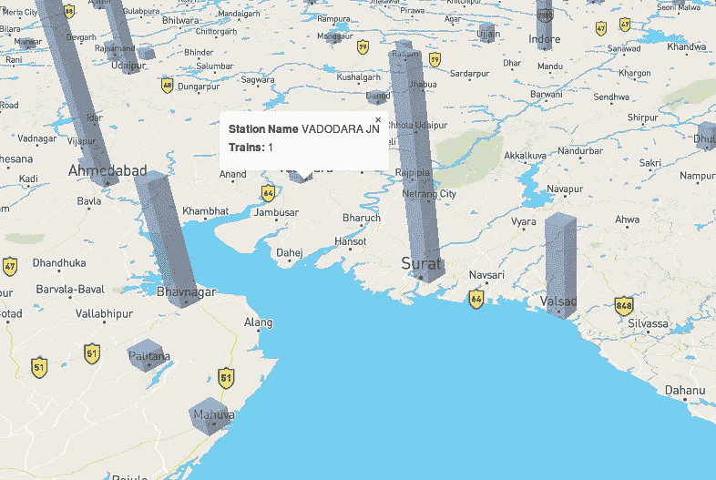
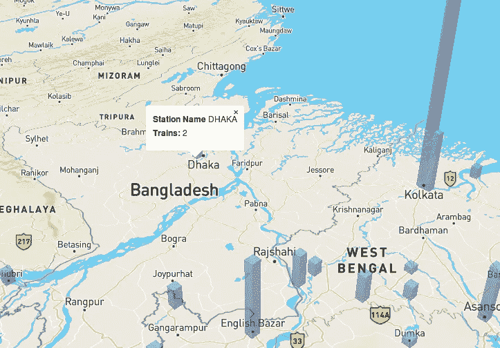
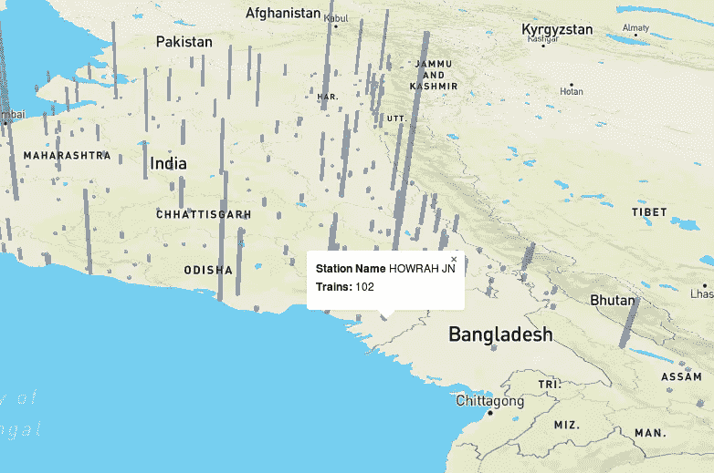
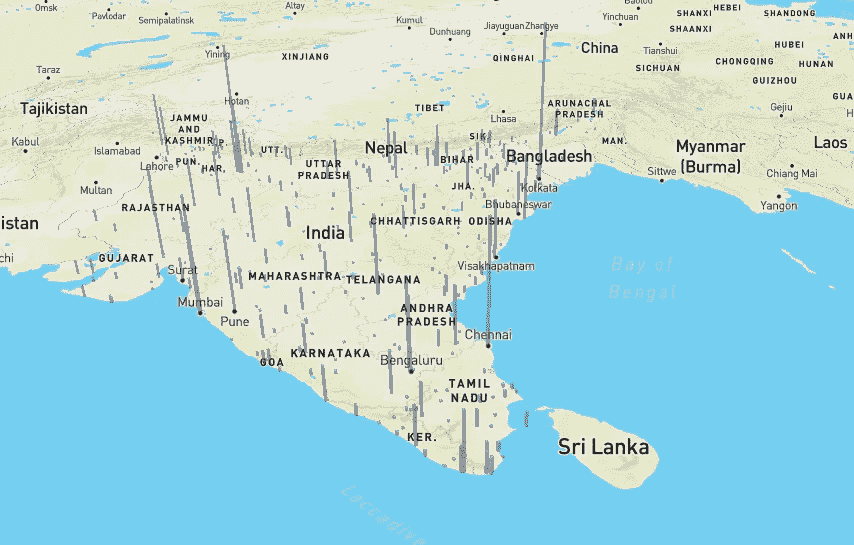

# 三维可视化印度铁路

> 原文：<https://towardsdatascience.com/visualizing-the-indian-railways-in-3d-22738404fea4?source=collection_archive---------4----------------------->

> *本文描述了作为 IDC 交互式数据可视化课程一部分的地理可视化项目的概念、流程、见解和扩展。*

最后，我有了这个三维可视化。



# 概念

这个概念是将印度铁路网上每个车站始发的列车形象化。这将允许用户比较数字，甚至根据他们的位置得出结论。目标是能够使 viz 有洞察力，并且必须至少遵循威廉·克利夫兰的三个视觉操作，即检测、组装和估计。这些都在课程中讨论过。你也可以看看这个由[约翰·劳瑟](https://www.linkedin.com/in/jrauser/)做的[展示](https://www.slideshare.net/JohnRauser/how-humans-see-data)。他涵盖了关于数据感知的非常有趣的方面。在他的演讲的第 115 页提到了克利夫兰的模型。我想，如果我能在车站的位置制作 3d 条形图，那么高度将代表源列车的数量。

简而言之，可视化参数如下(基于 Isabel Meirelles 在 [Design for information](http://isabelmeirelles.com/book-design-for-information/) 中的描述标签):

*   **国家**印度
*   **媒介**在线互动应用
*   **域**运输
*   **任务**提供从车站出发的列车的比较
*   **结构**代表始发列车数量的车站位置的 3D 突出

我还想，如果我们可以制作一个“粗略的”等高线地图，对到达一个地方的难易程度进行“编码”。这将基于从通过的列车数量、停止时间和特定车站一天中的时间得出的指数。等高线将被绘制成倒置的，这样，如果一个地方有较少的火车经过，它的高度将会更高，因为它很难到达。我觉得这也会给轮廓带来一些物理属性。想象一下，有人坐在地上，说 **A** 很难到达一个车站，因为只有一列火车经过，而说 **B** 却很容易到达，因为有 10 列火车经过。因此，“A”将显示得比“B”高。一个冰可以在虚拟现实中探索它。在我们拥有的短时间内，我无法找到实现这一点的工具。

# 过程

该流程包括:

*   来源和清理数据
*   获得有用的数据
*   将数据转换成 geojson
*   地图上的展示

选择的武器是:R、Python、Mapbox 和 Google Sheets

**采购和清洁数据**数据由[data.gov.in](https://data.gov.in/catalog/indian-railways-train-time-table-0)提供。使用的格式是 csv。我用了 R 代码的这个[来源](https://rstudio-pubs-static.s3.amazonaws.com/105630_ac3d5832cb8c4c98bbc7f85d84de4ec9.html)作为参考。

**导出有用数据**

首先，我使用 R Studio 读取 R 中的数据。

```
library(readr)
timetable <- read_csv("C:/Users/my pc/Downloads/isl_wise_train_detail_03082015_v1.csv")
```

接下来，我制作了火车的子集。因此，我可以捕捉已经到达目的地的火车。

```
timetable.srs.dest <- subset(timetable, timetable$`station Code` == timetable$`Destination station Code`)
```

利用`dplyr`库，我对数据进行了分组和汇总。然后我把文件写成 CSV 格式。

```
library(dplyr)
traingp<-group_by(timetable.srs.dest,`source Station Name`)
trainsfromStation<-summarise(traingp,count=n())
trainsfromStation
arrange(trainsfromStation,desc(count))
write.csv(trainsfromStation,"NumbOfTrainsoriginating.csv")
```



我还做了一些其他的探索性分析，比如每站经过的列车。

```
trainflux<-group_by(timetable,`Station Name`)
trainflux
trainfluxCount<-summarise(trainflux,count=n())
trainfluxCount
arrange(trainfluxCount,desc(count))
arrange(trainfluxCount,count)
write.csv(trainfluxCount,"trainsstoppingperstation.csv")
```


停止时间和每个站点的平均停止时间。这可以让你了解一个电视台有多忙。由于我的 n00by R 技能，这并不像看起来那么简单。首先，使用`Distance !=0`移除所有源站和目的站。由于提到时间的方式很有趣，我不得不去掉所有时间向量中的单引号。为此，我使用了`gsub`。然后，我必须将字符转换成 POSIXlt 日期格式。这将启用使用`difftime`的时间计算。使用 difftime，我为 HaltTime 创建了一个新的矢量，分辨率为分钟。有人告诉我，这些步骤只需在 excel 中点击几下。

```
trainNoSource=subset(timetable,dataset$Distance!=0)
trainNoSource$`Arrival time`<- gsub("'",'',trainNoSource$`Arrival time`)
trainNoSource$`Departure time`<- gsub("'",'',trainNoSource$`Departure time`)
trainNoSource$`Arrival time`<-strptime(trainNoSource$`Arrival time`,format = ("%H:%M:%S"))
trainNoSource$`Departure time`<-strptime(trainNoSource$`Departure time`,format = ("%H:%M:%S"))
trainNoSource$`Halt Time`<-as.difftime(trainNoSource$`Departure time`-trainNoSource$`Arrival time`,format = "%H:%M:%S",units="mins")
```

接下来，我删除了停车时间小于 0 的列车，并按照车站对它们进行分组。我移除了到达和离开的向量。然后我研究了平均停顿时间。

```
trainNoSource=subset(trainNoSource,trainNoSource$`Halt Time`>=0)
trainNoSource$`Arrival time`<-NULL
trainNoSource$`Departure time`<-NULL
trainNoSource_grpstation<-group_by(trainNoSource,`Station Name`)
trainNoSource_haltTimes<-summarise(trainNoSource_grpstation,count=n(),totalhalt=sum(trainNoSource_grpstation$`Halt Time`))
arrange(trainNoSource_haltTimes,desc(count))
trainNoSource_haltTimes<-summarise(trainNoSource_grpstation,count=n(),totalhalt=sum(`Halt Time`))
arrange(trainNoSource_haltTimes,desc(count))
arrange(trainNoSource_haltTimes,desc(totalhalt))
trainNoSource_haltTimes$`avgstop`<-trainNoSource_haltTimes$totalhalt/trainNoSource_haltTimes$'count'
arrange(trainNoSource_haltTimes,desc(avgstop))
write.csv(trainNoSource_haltTimes,"avgHaltTimeperstation.csv")
```



**将数据转换成 geojson**

csv 文件被上传到 google sheets。我使用了[awesome tables](https://chrome.google.com/webstore/detail/geocode-by-awesome-table/cnhboknahecjdnlkjnlodacdjelippfg?hl=en)Google sheets 插件将站点代码转换成纬度和经度值。

不幸的是，使用 mapbox 进行挤出的文档非常少。仅仅是[一个例子](https://www.mapbox.com/mapbox-gl-js/example/3d-extrusion-floorplan/)，它花了我相当长的时间去工作。从例子 [geojson](https://www.mapbox.com/mapbox-gl-js/assets/data/indoor-3d-map.geojson) 来看，似乎需要一个`height`、`base height`和`color`属性。我不想太复杂，所以我选择了单一颜色。我构建了如下的 [google sheet](https://docs.google.com/spreadsheets/d/11PcWeaLH1PImgipF80lmdjKiA19Tn-BFoyatt3i5hMg/edit?usp=sharing) 文件。



然后，我使用 [geojson.io](http://geojson.io/) 将 csv 转换成 geojson 文件。也可以使用[地图框工作室](https://www.mapbox.com/studio/)进行同样的操作。

这似乎足够了，但是

> 我一点也不知道

“拉伸”属性只能应用于多边形。如何将点转换成多边形？这可能不是在凌晨 3:45 问的最相关的问题。但不幸的是，它是！`Python`前来救援。感谢一些[以前的作品](https://s3-us-west-2.amazonaws.com/rohitgupta/main.html)。

当“我写了一个剧本”变得和“我洗了个澡”一样平常的时候，我写了一个剧本。

该脚本将简单地把这些点转换成一个固定大小的正方形。geoJSON 规格表[很有帮助。这个过程是以这个点作为正方形的中心，然后以循环的方式计算角点。](https://tools.ietf.org/html/rfc7946#section-3.1.6)

**在地图上展示**

到早上 6 点，我已经在 mapbox studio 中完成了地图上的所有多边形。为了突出高度，我将车次乘以 7000，因为它似乎对视觉检测有很大影响，有助于估计。我后来使用了地图框的例子，并修改了它来添加工具提示。

结果就在这里主持[了](http://rohitg.in/DataViz/index.html)。项目在此[回购](https://github.com/IndianTinker/DataViz)。如果我错了，请随时纠正我。

# 洞察力

我们在课堂讨论中获得的一些见解是:

*   瓦多拉只有一趟始发列车，但有 298 趟列车经过



*   有从达卡始发的国际列车



*   霍拉启动的火车最多



*   随着越来越多的列车从边界始发，列车从外到内移动。



# 扩展ˌ扩张

*   使用颜色通道采用冗余，以允许用户知道列车始发的范围。一种颜色代表 1–10、10–20 等。
*   再加一层乘火车路过
*   看看是否能发现洞察力，如果火车能和人口一起被可视化。

希望这有所帮助！

干杯，

Rohit

*最初发表于 http://rohitg.in/2017/09/10/DataViz/*[和](http://rohitg.in/2017/09/10/DataViz/)并使用[http://markdowntomedium.com](http://markdowntomedium.com)转换为媒介