# 用 Python 可视化人群的疯狂

> 原文：<https://towardsdatascience.com/visualizing-the-madness-of-crowds-with-python-1a81aaa22784?source=collection_archive---------17----------------------->

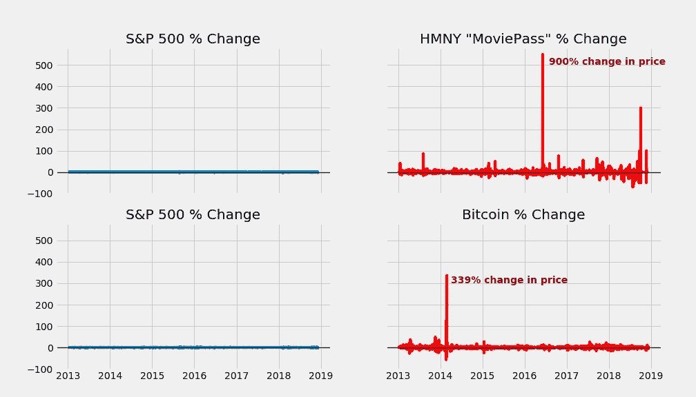

Which would you have invested in?

我们将数据科学中的事物可视化的根本原因不仅仅是为了展示漂亮的图片，而是为了表达不容易理解的想法。

我脑海中不断闪现的一个想法(无意双关)是资产价格泡沫:当股票、黄金或房地产等资产的价格以前所未有的幅度脱离其基本面驱动因素时。

值得注意的是[资产泡沫](https://en.wikipedia.org/wiki/Charles_P._Kindleberger)不一定排除非金融工具。大规模金融泡沫的最早例子之一发生在[郁金香](https://en.wikipedia.org/wiki/Tulip_mania)市场:

*   形象归功于洛特·范·多恩

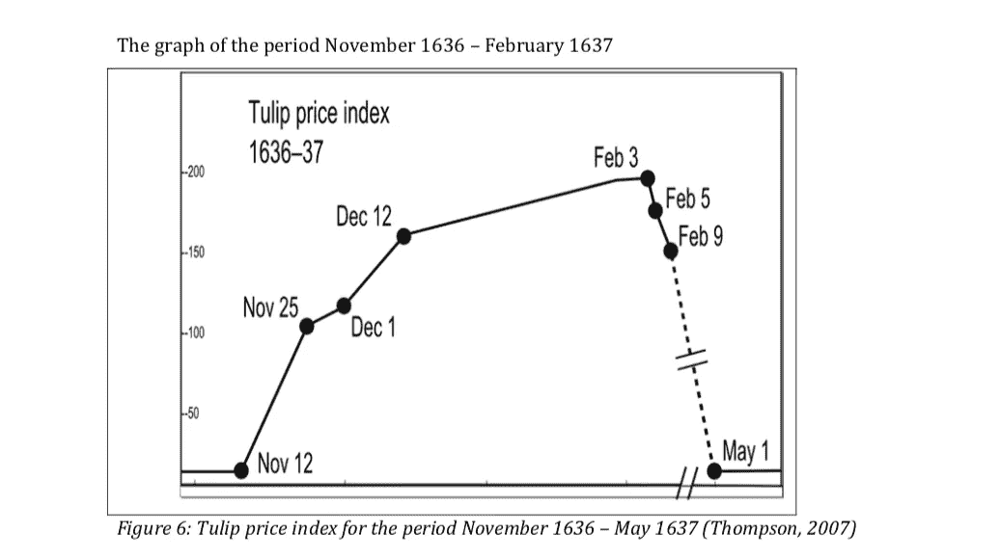

Readers who may be confused by the idea of a Tulip Bubble may want to check [this](https://www.npr.org/sections/thesalt/2016/08/26/491236253/ramen-noodles-are-now-the-prison-currency-of-choice) out

在本帖中，我们将通过一些典型的金融时间序列来了解资产泡沫的一些显著特征。

除了用于数据分析的标准库之外，我们还将使用一个新的库。所以，事不宜迟，让我们启动 Jupyter 笔记本:

```
import pandas as pd
import numpy as np
import matplotlib.pyplot as plt# New library
import pandas_datareader.data as webimport datetime
```

为了分析金融资产，业内的标准做法是将投资业绩与一些基准进行比较，如标准普尔 500 指数，该指数由在纽约证券交易所和纳斯达克上市的 500 家美国大型市值公司组成。我们的行动计划将是比较两种资产(比特币和 Helios and Matheson 股票)与标准普尔 500 的已知泡沫历史。

在这里，我们将为标准普尔 500 创建一个熊猫数据框架，以及比特币(加密货币)和 Helios and Matheson(股票代码:HMNY)的数据集，Helios and Matheson 是支持 [MoviePass](https://en.wikipedia.org/wiki/MoviePass) 的上市公司。我们数据框架的主要利益变量是*‘调整收盘’*，这是针对股票分割等事件调整的常规价格，因此更准确地反映了现实。

## 我们的数据框架:

1.  标准普尔 500 指数
2.  比特币
3.  电影通行证库存

我们还要确保我们考察的所有变量都在同一个时间框架内，在这个例子中是从 2013 年到 2018 年。因此，我们所有的数据框架将在该时间框架内作为其各自的指数，每日频率作为频率。

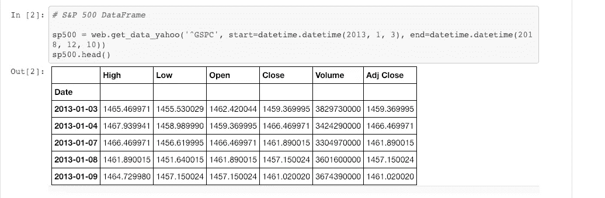

所有数据帧将具有 1496 行和 6 列的形状。

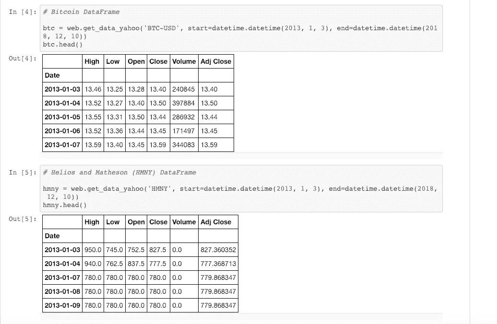

我们要做的第一件事是检查表格格式的数据，看看我们是否可以收集一些见解:

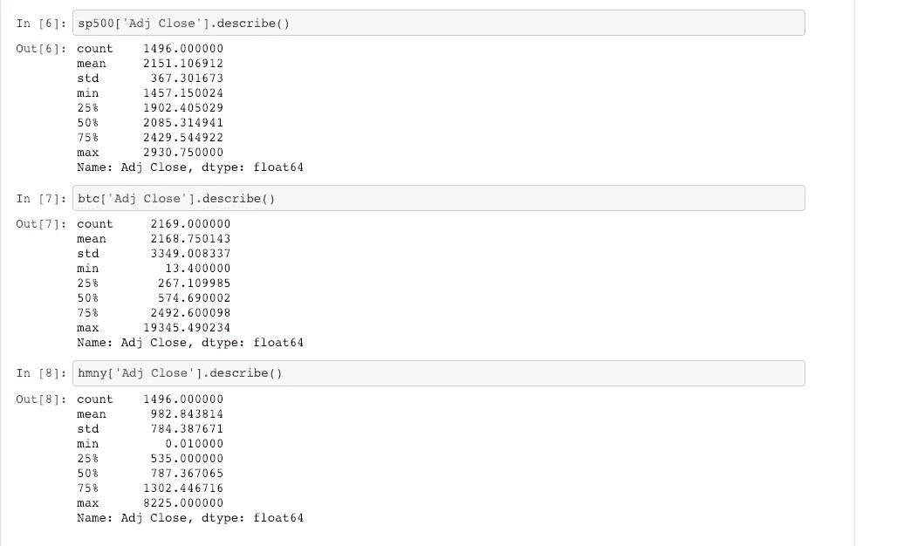

通过查看平均值、中值和标准差，我们知道:

1.  标准普尔 500 看起来很正常，有相似的平均值和中值，标准差大约是平均值的 17%。
2.  比特币的平均值约为中值的 4 倍，这表明它向右倾斜，而标准差要大得多
3.  与比特币类似，MoviePass 股票的均值大于中值，标准差几乎与均值一样大。

我们可以通过对调整后的收盘价做一些简单的直方图来证实我们的直觉:

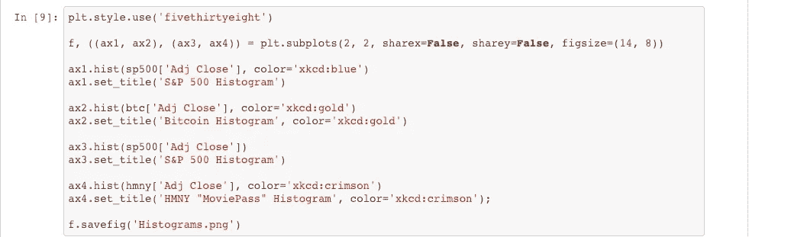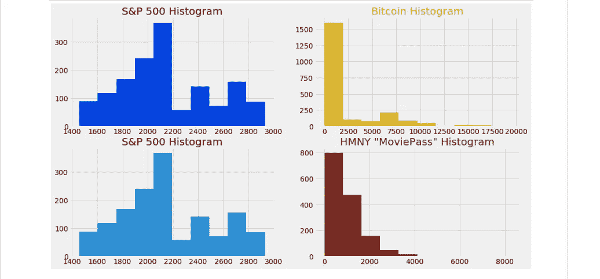

直方图证实了比特币和 MoviePass 相对于标准普尔 500 的某种正态分布具有偏斜分布。

但是无论是直方图还是表格数据摘要都不能告诉我们是否存在泡沫。我们可能会一行一行地检查所有的数据集，但是那将会是枯燥、乏味和反 pythonic 的。

让我们做更多的可视化:

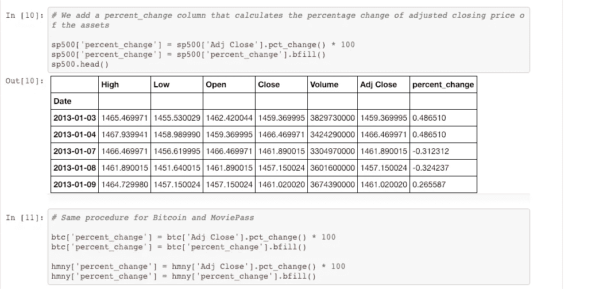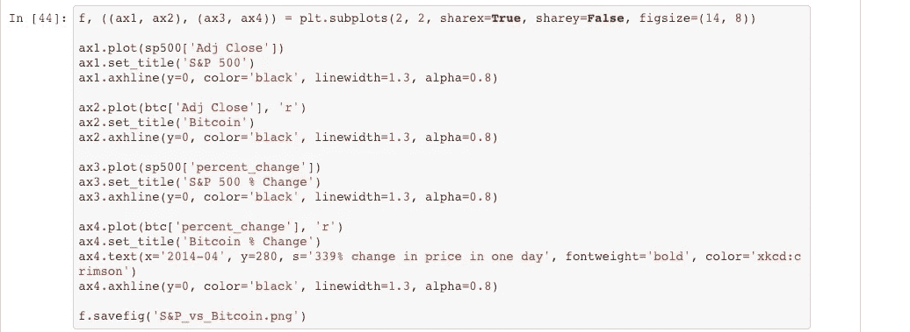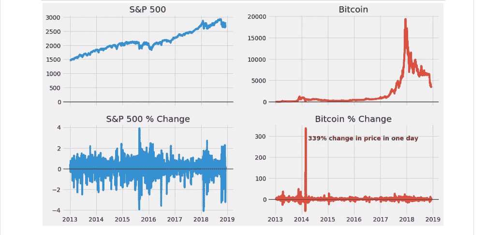

在这里，我们第一次真正直观地确认了资产泡沫，将比特币的价格与标准普尔 500 价格进行了比较:经典的曲棍球棒模式，超高速上涨，然后以同样的速度下跌，如果不是更快的话。

下图显示了每日百分比变化。请注意比特币在 2014 年 2 月 14 日经历了 339%的价格上涨。

接下来我们来看看 MoviePass 股票:

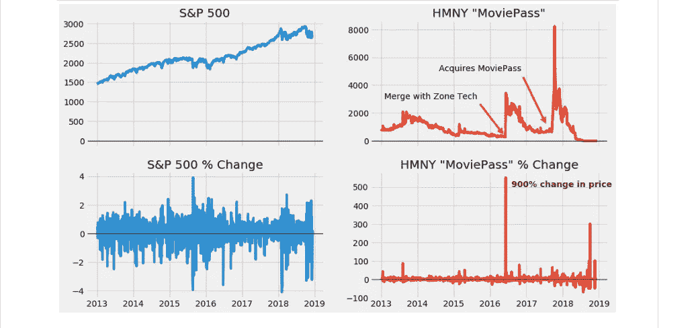

我们再次看到了相同的曲棍球棒模式，但这一次 MoviePass 股票显示了至少两种不同的泡沫状价格行为，在 2016 年 6 月 7 日，价格绝对惊人地上涨了 900%。

虽然表格数据确实给了我们数据集的简明摘要，但只有通过可视化数据，我们才能全面了解价格动态变化中的戏剧性事件。

通常，为了向大众传达一个观点，一个高影响力的视觉效果比一千篇只有少数人能理解的学术论文更有用。

让我们来看看资产的波动性:

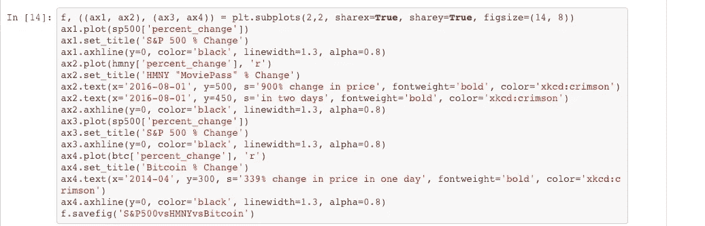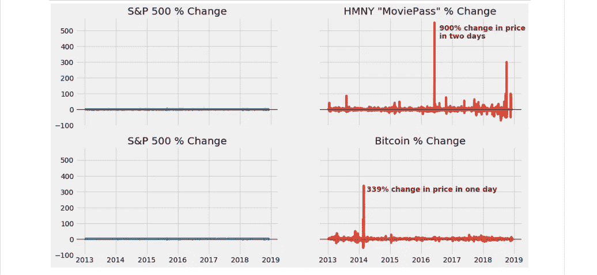

上面的图显示了价格的变化，并给我们提供了价格波动的有力线索。用相同的 y 轴缩放，它们表明比特币和 MoviePass 股票可能是普通投资者可能希望远离的高于平均水平的风险资产。

## **预测？也许**

关于可视化的最后一点是预测。在查看数据集时，我脑海中萦绕的一个问题是，有人能通过可视化工具仅查看过去的数据来预测资产价格泡沫吗？

做到这一点的一个方法，或者至少，得到一个关于时间序列可预测性的线索，是使用[均值回复](https://en.wikipedia.org/wiki/Mean_reversion_(finance))的概念。

让我们再来看看《标准普尔 500》的情节，与《比特币》和《电影通行证》的情节相比。

我们实际上将使用雅虎愿意给我们的所有数据，并扩展我们当前的数据框架。同时，我们将为我们的每项资产创建一个新列，该列将记录从一个时期到下一个时期的*【Adj Close】*价格特征的变化。

新列将被称为*‘调整收盘差异’*，根据定义，它是前移一个周期的*‘调整收盘’*与当前的*‘调整收盘’*之间的差异，也称为一个系列的**第一差异**。


尽管比特币和 MoviePass 的价格历史并不像标准普尔 500 那样久远，但视觉效果仍然揭示了重要的见解。

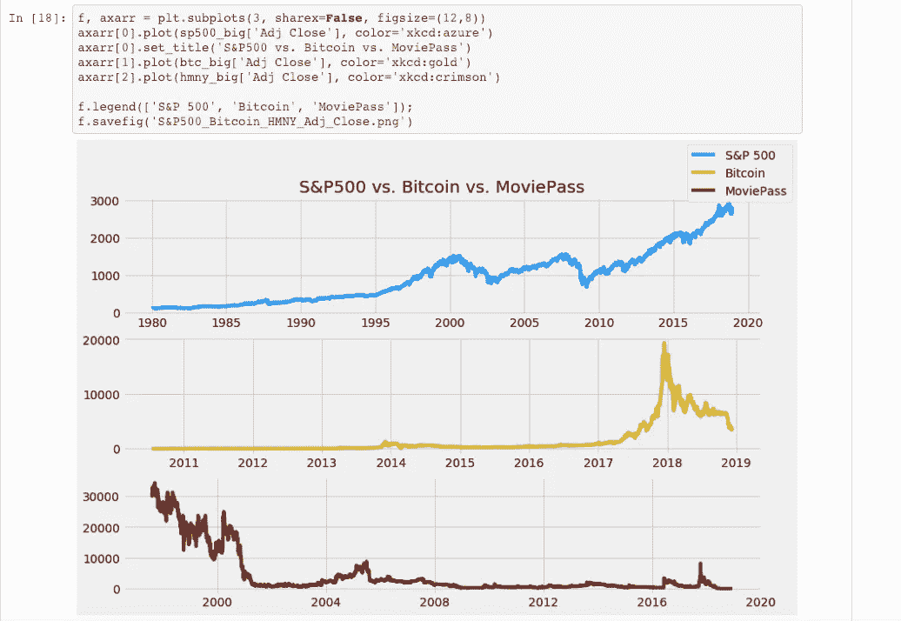

首先，标准普尔 500 的时间序列图显示了长期的上升趋势。

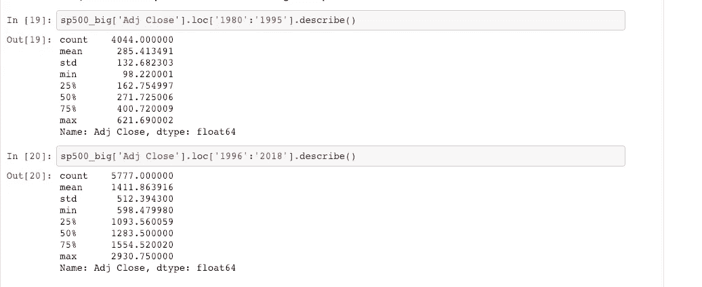

第二，如果我们比较标准普尔 500 从时间段(1980-1995)到时间段(1996-2018)的“Adj Close”价格的平均值，在数量上有很大的差异。

这两个观察告诉我们的是，标准普尔 500 的时间序列数据属于一类称为**非平稳**数据的时间序列数据。

非平稳数据的两个定义特征是:

1.  非常数意味着跨越不同的时间段
2.  非常数意味着即使取不同时期均值的差值，均值的变化也是非常的

如果平均值的变化是恒定的(长时间围绕同一点上下波动)，则由于不同时间段的不同平均值而不稳定的时间序列数据可以变为稳定的。

为什么这很重要？

因为与非平稳时间序列相反，平稳时间序列会回归均值，因此可以用统计方法进行分析，例如预测。

如果你检查 2011 年至 2017 年比特币的调整后收盘价，它类似于众所周知的随机漫步，没有明确的趋势，直到你到达 2017 年至 2018 年期间。

同样的情况也适用于 2003 年至 2018 年左右 MoviePass 股票的调整后收盘价。

如上所述，判断一个时间序列是否可以平稳，从而均值回复的一种方法是，像我们在这里做的那样，查看价格的**一阶差**。

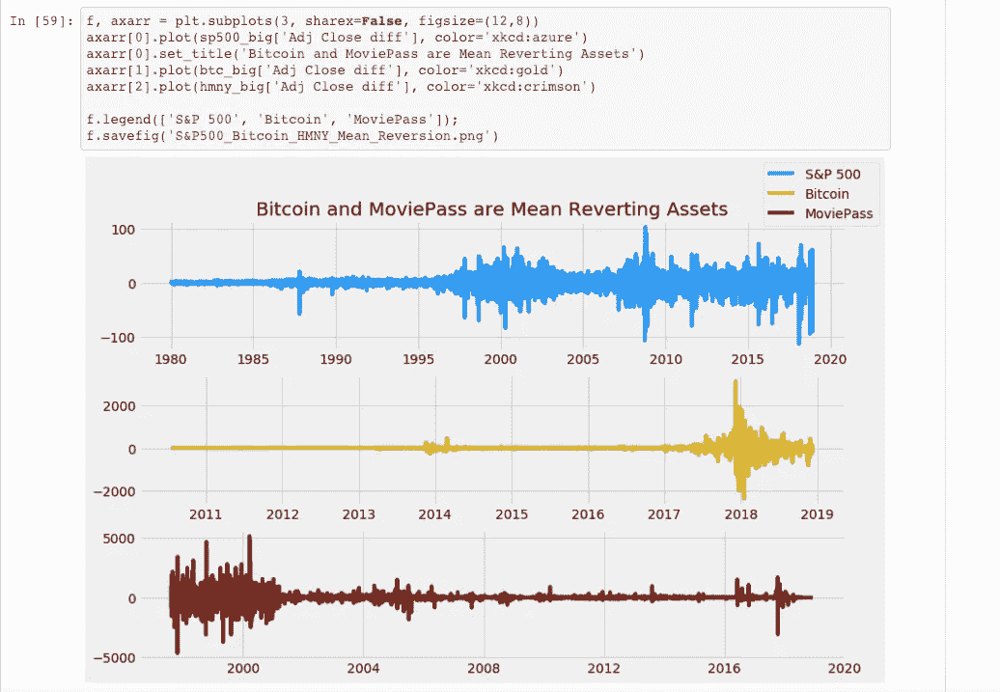

如上图所示，标准普尔 500 指数的均值明显不是平稳的，因为即使是**首差**也有增加的趋势。

此外，似乎有一些强有力的证据表明，比特币和 MoviePass 股票都是稳定的，因此意味着它们的大部分价格历史都在回归。

因此，对于一般投资者来说，投资于具有以下特征的资产可能并不明智:

1.  长期均值回复特性和
2.  价格以前所未见的幅度上涨(曲棍球棒模式),没有充分的理由
3.  易挥发的

归根结底，视觉的最终力量不在于它们提供了确凿的证据，而在于它们为我们的研究提供了必要的指导，并为普通人提供了易于理解的信息。

你可以在这里找到完整的代码和数据。