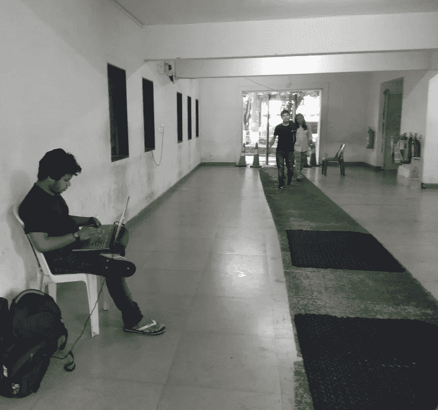
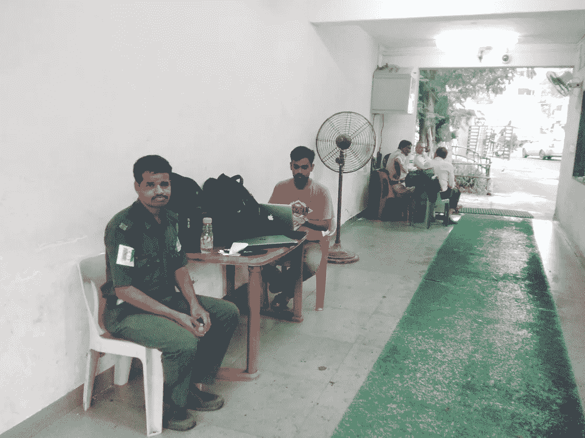
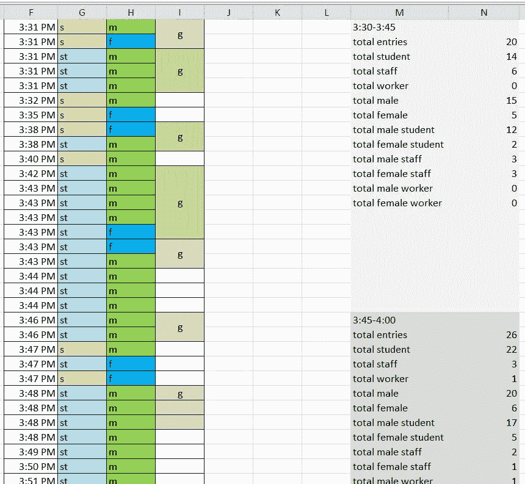
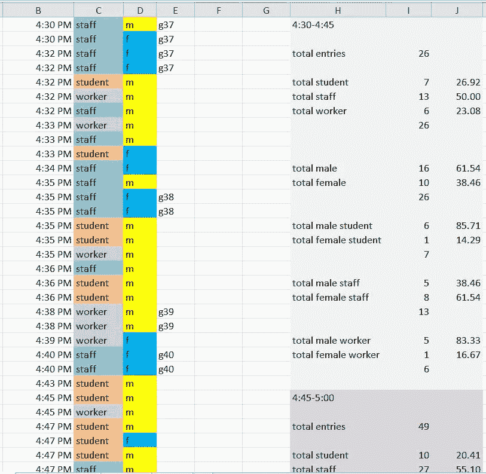
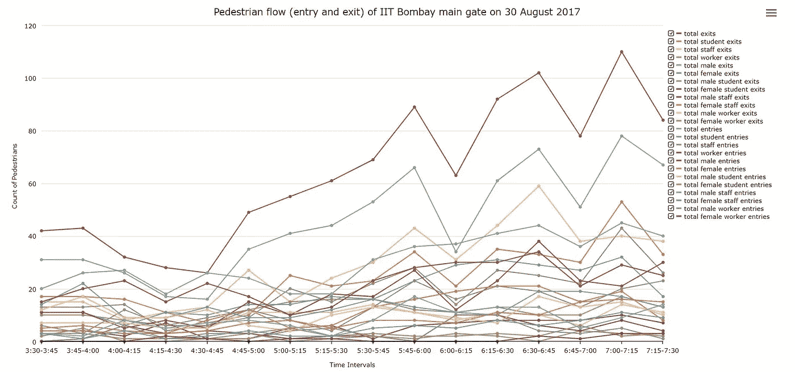
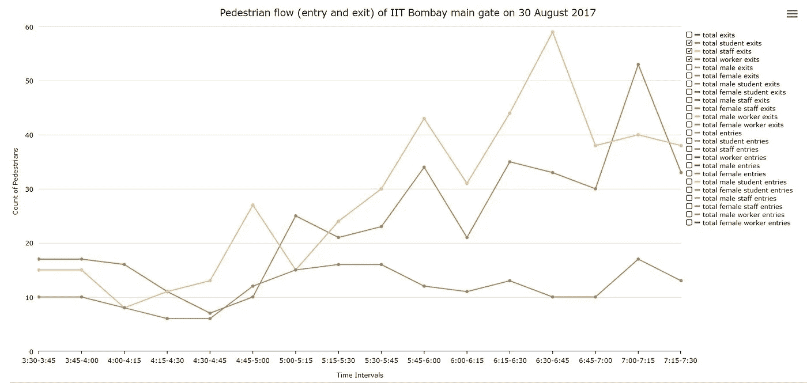
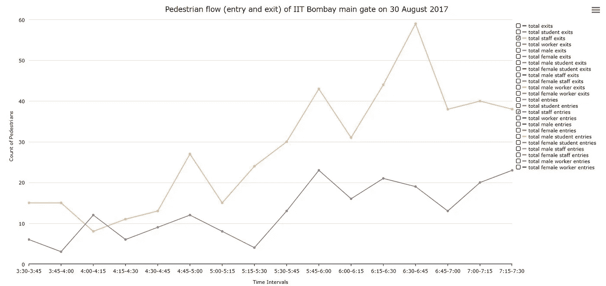

# 想象穿过 IIT 孟买(主门)的行人流量

> 原文：<https://towardsdatascience.com/visualizing-the-pedestrian-flow-through-the-iit-bombay-main-gate-4104cb904a82?source=collection_archive---------5----------------------->

2017 年 8 月 30 日进行了一项调查，以研究通过 IIT 孟买大门安检的人流量。IDC 的两名学生正在记录数据。一个在入口侧，另一个在出口侧，在电子表格上实时输入行人数据。

(Left: Sukant Maharana — Logging the pedestrian entries) (Right : Jonathan Mathew —Logging the pedestrian exits)

Left: Logging, clustering, and counting each clusters of the pedestrian entries Right : Same for the pedestrian exits

记录的行人数据参数有—
时间、类别(学生/职员/工人)、性别，如果他们成群结队而来，那么一组有多少人。我们把总的统计数据制成表格。
要计算的变量有:

总出入境人数
总学生出入境人数
总职工出入境人数
总职工出入境人数
总男性出入境人数
总女性出入境人数
总男学生出入境人数
总女学生出入境人数
总男职工出入境人数
总女职工出入境人数
总男职工出入境人数
总女职工出入境人数

在任何给定时间，这相当于 12x2=24 行数据

这是 2017 年 8 月 30 日下午 3:30 到 7:30 录的 4 个小时。然后他们被分成 15 分钟的数据组。因此，创建了 4x4=16 个数据仓/簇/列来可视化。这样我们就得到了一个图表，总共有 24 条线在 15 分钟的 X 方向上以 16 个间隔移动，结果绘制了 24x16=384 个点。

**点击下面的链接，查看上图的互动版**

 [## [折线图]基本

### 编辑描述

www.arkadesignstudio.in](http://www.arkadesignstudio.in/iitb%20data/main/main.html) 

**关于图表**

该图表在 X 轴上绘制了 15 分钟的时间间隔，在 Y 轴上绘制了进出的人数。有一系列复选框负责显示或隐藏每一行。我们可以控制哪个看哪个不看。

**绘图和分析—所有 24 行**

在这段时间里，大部分住在校外的人回家，教职员工外出购物和进行日常必要的活动，住在校外的学生回家，而一些住校生也去校外与朋友共度夜晚。

**绘图和分析—总出入量**

棕色线显示总出口，而天蓝色线显示总入口。这包括所有进出大门的行人、学生、职员和工人。我们可以看到，在超过 4 小时的时间内(从下午 3:30 到晚上 7:30)，行人的数量总体上有所增加。出口的数量远远多于入口。我们发现，在下午 6 点和 7 点的前一刻钟左右，入口和出口都出现了峰值。

我们可以看到，下午 4:30-4:45 是教职员工和学生最繁忙的工作时间，他们需要收拾一天的工作。人们大约在 4:45-5:00 开始离开。

**绘图和分析——学生、职员和工人的总出口**

黄线显示员工总出口，而棕色线显示学生总出口，绿线显示工人总出口。在学生和员工之间可以看到良好的相关性，因为他们都有或多或少相同的时间表，但在工人中却不同，因为他们有突然的时间表。这些曲线仍然遵循比例增减的模式。

**绘图与分析—全体员工出入**

黄线显示五线谱出口，而紫线显示五线谱入口。
进出人员数量有较好的增减比例。这是因为大量的住宿员工外出当地购买夜宵，并在 15-30 分钟内返回。

请随时**回复这篇博文**或直接给我回复关于这个研究项目的**建议**或关于任何**有趣项目**的**信息**。

读者好
我是 Arka Majhi，IIT 孟买 IDC 设计学科的硕士研究生。作为学术工作的一部分，我做了一个关于数据可视化的练习。

**同时查看我的作品集和资源库**

**设计作品集**:[https://www.behance.net/arkamajhi4d63](https://www.behance.net/arkamajhi4d63)

**建筑作品集【http://spadelhi.org/arkamajhi/】:**

**工作室网站**:[http://arkadesignstudio.in/](http://arkadesignstudio.in/)

通过喜欢和张贴你对我的项目的建设性意见来支持我。提前感谢。将等待您的回复。