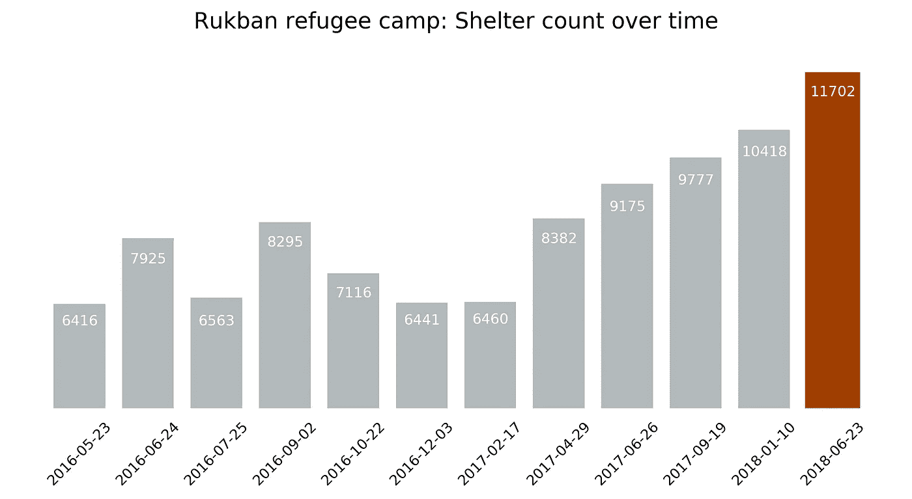
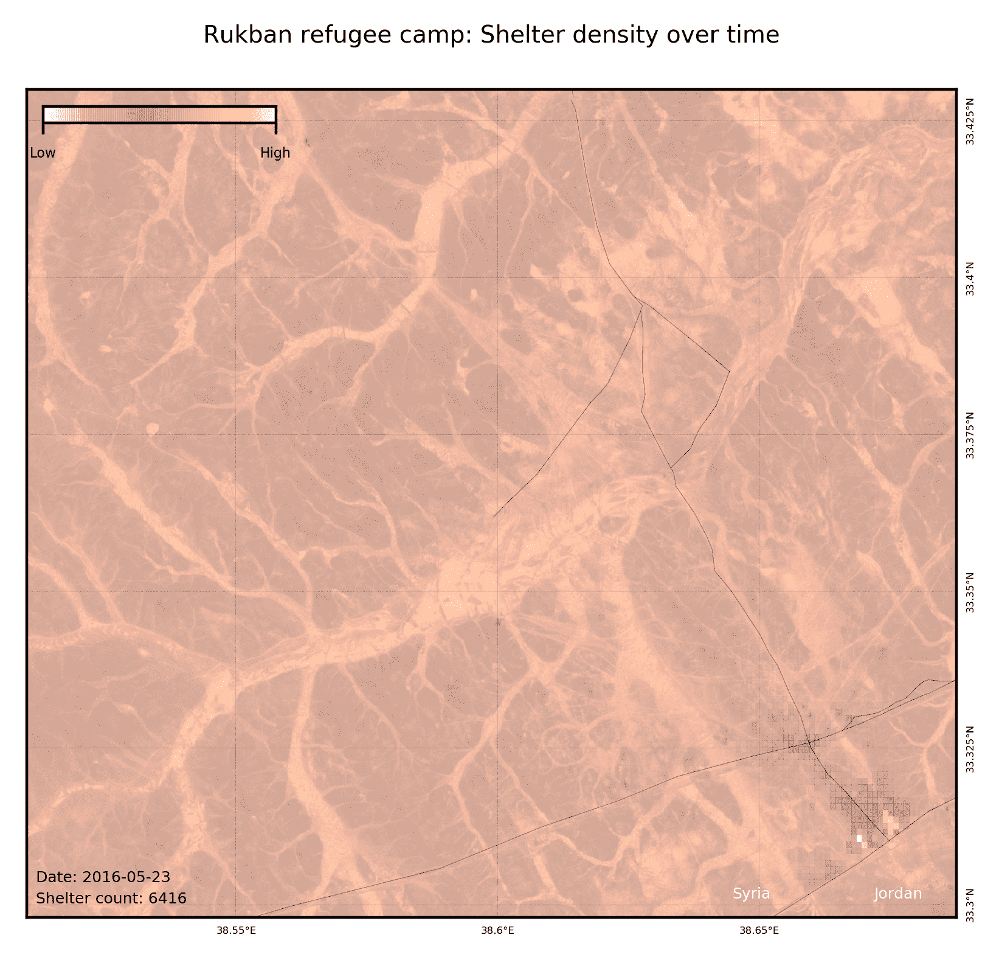

# 想象叙利亚-约旦边境的难民危机

> 原文：<https://towardsdatascience.com/visualizing-the-refugee-crisis-at-the-syrian-jordanian-border-70526b60fb12?source=collection_archive---------12----------------------->

## 我在 2016 年到 2018 年间绘制了 Rukban 难民营的地图。继续阅读，了解更多。

Rukban 是叙利亚和约旦边境的无人区。2014 年，该地区成为逃离叙利亚内战[的难民的居住地。](https://en.wikipedia.org/wiki/Syrian_Civil_War)

[联合国卫星项目](https://en.wikipedia.org/wiki/UNOSAT)自 2014 年底以来一直在记录鲁克班地区的收容所数量。现有数据涵盖了过去两年，最近一次统计是在上个月发布的。

本文探讨了 2016 年 5 月至 2018 年 6 月期间联合国卫星项目关于 Rukban 难民营的数据。

我在图 1 中绘制了庇护所数量随时间的变化。截至 2018 年 6 月，共有 11，702 个庇护所。自 2016 年 12 月以来，收容所的数量一直在增加。

Figure 1

在图 2 中，我绘制了 2016 年 5 月至 2018 年 6 月之间十二个不同时间点的避难所密度。

Figure 2

最后，我很好奇从太空看 Rukban 避难所是什么样子。因此，我使用了大约在联合国卫星项目评估完成时拍摄的公开卫星图像。图像如图 3 所示。遮蔽物是图像右下四分之一处最明显的暗像素和亮像素。

Figure 3

# 关于这篇文章

*   *阅读* [*本*](https://gitlab.com/eejj/rukban-refugee-camp#data-sources) *了解我在这篇文章中使用的三个数据源的更多细节。*
*   *要重现图 2 & 3 使用* [*这段源代码*](https://gitlab.com/eejj/rukban-refugee-camp) *(Python)。*
*   *在图 3 中，我使用了 Sentinel-2 l1c 级产品。您可以使用经过大气校正的 l2a 产品来获得更加一致的图像。*
*   *如果你有任何问题，请在下面的评论区留言或发送给我:*[*anajjar@protonmail.com*](mailto: anajjar@protonmail.com)