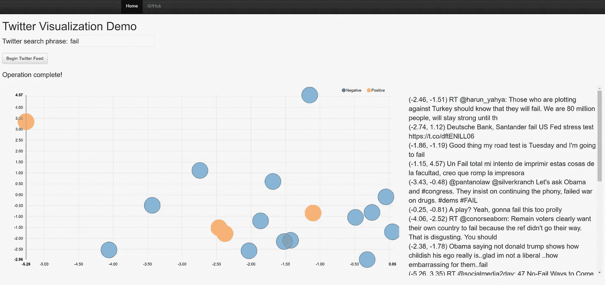

# 使用 Python 可视化 Tweet 矢量

> 原文：<https://towardsdatascience.com/visualizing-tweet-vectors-using-python-e528358bce68?source=collection_archive---------0----------------------->

*此内容最初出现在* [*好奇洞察*](http://www.johnwittenauer.net) 上

我尝试了很多不同的技术。我发现，拥有使用各种概念、语言、库、工具等的经验。当试图解决问题时，会导致更稳健的思考。如果你不知道某样东西的存在，那么当它有助于你使用时，你就不能使用它！有很多方法可以获得这些经验。人们可以在网上找到几乎任何可以想象的主题的精彩内容。但是我发现理解一项技术的最好方法是尝试用它来建造一些东西。

我的最新目标是 Python 生态系统中的一篮子不同的库，涵盖 web 开发、缓存、异步消息传递和可视化等内容。由于我是一名数据科学家，我加入了一个机器学习组件只是为了好玩。为了探索这些技术，我创建了一个半实用的应用程序，它从 Twitter 流中读取，解析推文，并进行一些机器学习魔法，以对推文的情绪进行评分，并将其投影到二维网格中，其中具有相似内容的推文将彼此更接近地出现。它使用异步消息传递或多或少地实时完成所有这些工作。

这篇博文的剩余部分将展示如何从头开始构建它。为了对它的功能和涉及的技术保持完全透明，下面是我将演示如何构建的组件:

*   使用 Flask +标准前端工具(Bootstrap，JQuery 等)在 Python 中进行基本的 web 开发。)
*   使用 Celery 和 Redis 的异步、可链接的任务队列
*   使用 Socket-IO 在 Flask 和连接的客户端之间进行基于事件的实时通信
*   使用模式过滤/解析 Twitter 流
*   使用 NVD3 的流式实时可视化
*   使用 Scikit-learn 和 Gensim (word2vec)进行情感分析和单词嵌入

这里有一张完成后的应用程序的截图。


我们为什么要这么做？这个应用程序有什么实际的、真实的目的吗？大概不会。但是这很有趣也很简洁，希望你能学到很多东西。如果这听起来很有趣，那么继续读下去！

(注:完成的应用程序位于 [**此处**](https://github.com/jdwittenauer/twitter-viz-demo) 。请经常参考这个，因为我可能会在整个帖子中省略一些细节)。

## 设置

首先，让我们讨论一下运行应用程序所需的设置。除了可以工作的 Python 解释器之外，您还需要安装应用程序使用的一系列库。您还需要知道如何执行一些任务，比如启动 Redis、启动 Celery 和运行 Flask 服务器。幸运的是，这些都很容易做到。我在项目的 [**自述文件**](https://github.com/jdwittenauer/twitter-viz-demo/blob/master/README.md) 中写下了详细的说明。遵循这些步骤，您应该可以开始运行了。

## 情感和词向量模型

现在让我们建立情绪和词向量模型来转换推文。我们将使用 [**这个 Twitter 情感数据集**](http://thinknook.com/wp-content/uploads/2012/09/Sentiment-Analysis-Dataset.zip) 作为两个模型的训练数据。第一步是读入数据集，并使用 TF-IDF 进行一些预处理，将每条 tweet 转换为单词包表示。

```
print('Reading in data file...')  
data **=** pd.read_csv(path **+** 'Sentiment Analysis Dataset.csv',  
                   usecols**=**['Sentiment', 'SentimentText'], error_bad_lines**=**False)print('Pre-processing tweet text...')  
corpus **=** data['SentimentText']  
vectorizer **=** TfidfVectorizer(decode_error**=**'replace', strip_accents**=**'unicode',  
                             stop_words**=**'english', tokenizer**=**tokenize)
X **=** vectorizer.fit_transform(corpus.values)  
y **=** data['Sentiment'].values
```

注意，我们使用了一个定制的标记器，用于处理 tweets 中常见的模式。我从克里斯托弗·波茨写的 的 [**脚本中借用了这一点，并对其稍作修改(最终版本在“脚本”文件夹中)。接下来，我们可以训练情感分类器和 word2vec 模型。**](http://sentiment.christopherpotts.net/code-data/happyfuntokenizing.py)

```
print('Training sentiment classification model...')  
classifier **=** MultinomialNB()  
classifier.fit(X, y)print('Training word2vec model...')  
corpus **=** corpus.map(**lambda** x: tokenize(x))  
word2vec **=** Word2Vec(corpus.tolist(), size**=**100, window**=**4, min_count**=**10, workers**=**4)  
word2vec.init_sims(replace**=**True)
```

这应该运行得很快，因为训练数据集不是很大。我们现在有一个模型可以读取一条推文，并将其情绪分为积极或消极，另一个模型可以将推文中的单词转换为 100 维向量。但我们仍然需要一种方法来使用这些 100 维向量在二维网格上空间绘制推文。为此，我们将对单词向量进行 PCA 变换，只保留前两个主成分。

```
print('Fitting PCA transform...')  
word_vectors **=** [word2vec[word] **for** word **in** word2vec.vocab]  
pca **=** PCA(n_components**=**2)  
pca.fit(word_vectors)
```

最后，我们将把所有这些工件保存到磁盘上，以便以后可以从 web 应用程序中调用它们。

```
print('Saving artifacts to disk...')  
joblib.dump(vectorizer, path **+** 'vectorizer.pkl')  
joblib.dump(classifier, path **+** 'classifier.pkl')  
joblib.dump(pca, path **+** 'pca.pkl')  
word2vec.save(path **+** 'word2vec.pkl')
```

## Web 应用程序初始化

现在我们已经准备好了所有需要的模型，我们可以开始应用程序的实质性工作了。首先，一些初始化。这段代码只在 Flask 服务器启动时运行一次。

```
# Initialize and configure Flask
app **=** Flask(__name__)  
app.config['SECRET_KEY'] **=** 'secret'  
app.config['CELERY_BROKER_URL'] **=** 'redis://localhost:6379/0'  
app.config['CELERY_RESULT_BACKEND'] **=** 'redis://localhost:6379/0'  
app.config['SOCKETIO_REDIS_URL'] **=** 'redis://localhost:6379/0'  
app.config['BROKER_TRANSPORT'] **=** 'redis'  
app.config['CELERY_ACCEPT_CONTENT'] **=** ['pickle']# Initialize SocketIO
socketio **=** SocketIO(app, message_queue**=**app.config['SOCKETIO_REDIS_URL'])# Initialize and configure Celery
celery **=** Celery(app.name, broker**=**app.config['CELERY_BROKER_URL'])  
celery.conf.update(app.config)
```

这里有一大堆事情要做，所以让我们把它分解一下。我们已经创建了一个名为“app”的变量，它是 Flask 的一个实例，并设置了一些配置项来做一些事情，比如告诉它使用 Redis 作为代理(注意，“config”只是一个键/值对的字典，我们可以将它用于 Flask 不需要的其他设置)。我们还创建了一个 SocketIO 实例，它是来自 [**Flask-SocketIO**](https://github.com/miguelgrinberg/Flask-SocketIO) 集成库的一个类，基本上用 SocketIO 支持包装 Flask。最后，我们创建了 Celery 应用程序，并更新了它的配置设置，以使用我们为 Flask 定义的“config”字典。

接下来，我们需要将之前创建的模型加载到内存中，以便应用程序可以使用它们。

```
# Load transforms and models
vectorizer **=** joblib.load(path **+** 'vectorizer.pkl')  
classifier **=** joblib.load(path **+** 'classifier.pkl')  
pca **=** joblib.load(path **+** 'pca.pkl')  
word2vec **=** Word2Vec.load(path **+** 'word2vec.pkl')
```

最后，我们将创建一些助手函数，使用这些模型对推文的情绪进行分类，并将推文转换为 2D 坐标。

```
**def** **classify_tweet**(tweet):  
    """
    Classify a tweet with either a positive (1) or negative (0) sentiment.
    """
    pred **=** classifier.predict(vectorizer.transform(np.**array**([tweet.text]))) **return** str(pred[0]) **def** **vectorize_tweet**(tweet):  
    """
    Convert a tweet to vector space using a pre-trained word2vec model, then transform
    a sum of the vectorized words to 2-dimensional space using PCA to give a simple
    2D coordinate representation of the original tweet.
    """
    tweet_vector **=** np.zeros(100)
    **for** word **in** tokenize(tweet.text):
        **if** word **in** word2vec.vocab:
            tweet_vector **=** tweet_vector **+** word2vec[word] components **=** pca.transform(tweet_vector)
    x **=** components[0, 0]
    y **=** components[0, 1] **return** str(x), str(y)
```

## 烧瓶路线

处理 web 请求的服务器代码非常简单，事实上只有两条路线。第一个是根路径，只返回主页(“index.html”)。

```
**@app.route**('/', methods**=**['GET'])
**def** **index**():  
    """
    Route that maps to the main index page.
    """
    **return** render_template('index.html')
```

第二条路线接受一个输入短语，并启动一个任务链，该任务链将从 Twitter firehose 发出一系列与输入短语匹配的推文。

```
**@app.route**('/twitter/<phrase>', methods**=**['POST'])
**def** **twitter**(phrase):  
    """
    Route that accepts a twitter search phrase and queues a task to initiate
    a connection to twitter.
    """
    queue **=** app.config['SOCKETIO_REDIS_URL']
    # create_stream.apply_async(args=[phrase, queue])
    chain(create_stream.s(phrase, queue), send_complete_message.s()).apply_async()
    **return** 'Establishing connection...'
```

乍一看，这可能令人困惑，所以让我们更仔细地检查一下。“queue”变量只是一个指向 Redis 运行的 URL 的字符串(“redis://localhost:6379/0”)，我们稍后会用到它。“chain”行是一个芹菜函数，它由一系列要排队并异步运行的任务组成。在这种情况下，我们将一个对“create_stream”任务的调用排队，随后是一个对“send_complete_message”任务的调用。这些任务可能会也可能不会立即开始执行(取决于任务队列的状态)，但无论如何，函数的执行会继续到最后一行，在那里我们会向客户端返回一条消息，告知(到 Twitter 的)连接正在建立。

## 任务队列

在上一节中，我们对两个函数的调用进行了排队，“create_stream”和“send_complete_message”。我们说过这些在 Celery 中被定义为任务，这意味着它们在主程序线程之外异步执行。让我们来看看那些函数。

```
**@celery.task**
**def** **create_stream**(phrase, queue):  
    """
    Celery task that connects to the twitter stream and runs a loop, periodically
    emitting tweet information to all connected clients.
    """
    local **=** SocketIO(message_queue**=**queue)
    stream **=** Twitter().stream(phrase, timeout**=**30) **for** i **in** range(60):
        stream.update()
        **for** tweet **in** reversed(stream):
            sentiment **=** classify_tweet(tweet)
            x, y **=** vectorize_tweet(tweet)
            local.emit('tweet', {'id': str(i),
                                 'text': str(tweet.text.encode('ascii', 'ignore')),
                                 'sentiment': sentiment,
                                 'x': x,
                                 'y': y})
        stream.clear()
        time.sleep(1) **return** queue
```

这里有很多东西需要消化，所以让我们一步一步来。首先，“本地”是一个 Socket-IO 实例。回想一下，我们使用 Socket-IO(通过 Flask-SocketIO 包装器库)将信息从 Flask 服务器“推”到所有连接的客户端，因此这个对象创建了一个通道，允许我们这样做。我们在函数中创建一个本地实例而不使用全局实例的原因是因为我们的 Celery 任务在一个单独的线程中运行(记住，这个函数是异步调用的)。

在下一行中，我们创建了一个从模式库中导入的对象，该对象创建了一个与 Twitter 的持久连接。请注意，我们传入了通过客户端输入获得的搜索短语。这将限制 Twitter 流只捕捉包含该短语的推文。下一部分进入一个 60 秒的循环，每秒钟我们检查新的推文，如果发现任何推文，我们就对它们运行我们的情感和矢量化功能。最后一步是“emit”行，在这里我们告诉 Socket-IO 推出一条消息，其中包含该 tweet 的所有数据。

在函数执行的最后，它返回“queue”变量。你可能想知道——这是干什么用的？它通向哪里？还记得我们将多个芹菜任务链接在一起。当“create_stream”完成执行链中的下一个任务时(“send_complete_message”)被调用，第一个任务的输出被传递给下一个任务。在这种情况下，我们使用链将信息(Redis 队列的 URL)传播到每个任务。

“send_complete_message”函数要简单得多，应该不需要太多解释。本质上，我们所做的是向我们的客户端发出一条消息，表明前一个函数中的循环已经执行完毕。

```
**@celery.task**
**def** **send_complete_message**(queue):  
    """
    Celery task that notifies the client that the twitter loop has completed executing.
    """
    local **=** SocketIO(message_queue**=**queue)
    local.emit('complete', {'data': 'Operation complete!'})
```

实际上，没有必要这样设置。我们可以很容易地把它放在“create_stream”函数的末尾。但是我想演示一个简单的例子，说明如何用 Celery 编写工作流并在任务之间传递信息。重点是了解这些库以及它们能做什么！

## 前端

我们剩下的就是为用户创建一个 UI 来进行交互，并连接一些 javascript 来通过 Socket-IO 进行通信，并处理从服务器推送的事件。UI 代码非常通用，所以我不会在这篇文章中涉及它，但可以随意检查回购中的 index.html，看看它都放在一起。不过，我会说一些关于 javascript 代码的事情。首先，我们需要一个函数，它获取用户提供的短语并将其发布到 web 服务器，这将启动整个过程。这是非常标准的 JQuery 内容。

```
**function** **twitter**() {  
    phrase **=** $('#phrase').val();
    url **=** encodeURI('/twitter/' **+** phrase);
    $.ajax({
        type: 'POST',
        url: url,
        **success**: **function**(data, status, request) {
            $('#twitter-status').html(data);
        },
        **error**: **function**() {
            alert('An error occurred submitting the request.');
        }
    });
}
```

我们还需要一个函数来创建图表，我们将使用它来显示推文。我从 NVD3 网站上收集了一些例子，得出了下面的结果，它使用“数据”变量作为输入(稍后填充)来呈现散点图。

```
**function** **loadGraph**() {  
    **var** chart **=** nv.models.scatterChart()
        .pointRange([2000, 2000])
        .color(d3.scale.category10().range());
    chart.xAxis.tickFormat(d3.format('.02f'));
    chart.yAxis.tickFormat(d3.format('.02f'));
    d3.select('#chart svg')
        .datum(data)
        .transition()
        .duration(500)
        .call(chart);
    nv.utils.windowResize(chart.update);
    **return** chart;
}
```

此外，在主脚本体中还有一些事情要做，它在页面第一次加载时只运行一次。首先，我们打开一个套接字来建立与服务器的持久连接。

```
**var** socket **=** io.connect('http://' **+** document.domain **+** ':' **+** location.port);
```

接下来，我们需要创建一个事件处理程序来响应来自服务器的“tweet”消息。事件处理程序做一些事情:

*   用新状态更新一些标签
*   向图表使用的数据结构中添加新的 JSON 记录
*   重新绘制图形以显示新数据
*   将 tweet 中的原始文本附加到显示面板上

```
socket.on('tweet', **function**(msg) {  
    $('#phrase').val('');
    $('#twitter-status').html(
        'Connection established. Streaming for 60 seconds (currently at ' **+** msg.id **+** ')...');
    sentiment **=** parseInt(msg.sentiment);
    x **=** parseFloat(msg.x);
    y **=** parseFloat(msg.y);
    data[sentiment].values.push({
        id: msg.id,
        x: x,
        y: y,
        size: 2000,
        shape: "circle"});
    loadGraph();
    $('#twitter-results').append(
        '<br>' **+** $('<div/>').text('(' **+** x.toFixed(2) **+** ', ' **+** y.toFixed(2) **+** ') ' **+** msg.text).html());
});
```

我们还需要一个事件处理程序来响应“完成”消息。

```
socket.on('complete', **function**(msg) {  
    $('#twitter-status').html(msg.data);
});
```

最后一步只是连接开始的点击事件并初始化图形。

```
$('#begin').click(twitter);
nv.addGraph(loadGraph);
```

## 把所有的放在一起

本质上就是这样。如果您想自己运行它，最简单的方法是在这里下载源代码[](https://github.com/jdwittenauer/twitter-viz-demo)****，并按照 README.md 中的说明进行操作。****

********

****为了不使这篇文章太长，我忽略了相当多的细节，但是如果你想了解我使用的任何库的更多信息，我强烈建议你浏览一下那个库的文档。几乎所有这些都有大量的示例代码，这就是我如何学到了很多制作这个应用程序所需的知识。****

****演练到此结束。正如我在开头所说，尝试新技术是一种很好的学习方式。通过同时结合几种新技术，它迫使人们更好地理解。这个应用程序非常简单，除了作为学习工具之外，在目前的状态下并不那么有用，但它有一百万种扩展方式。如果你觉得这个东西有趣，请随意叉回购，并作出自己的版本！****

*****要对本文发表评论，请查看位于* [*好奇的洞察力*](http://www.johnwittenauer.net/visualizing-tweet-vectors-using-python/) 的原始帖子****

*****关注我的*[*Twitter*](https://twitter.com/jdwittenauer)*获取新帖子更新*****