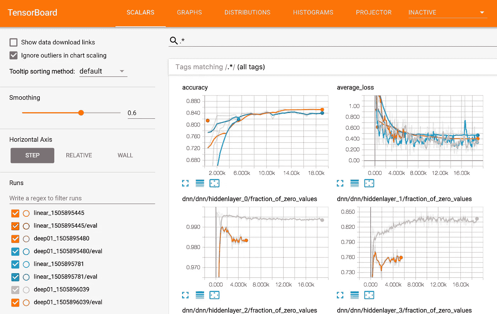
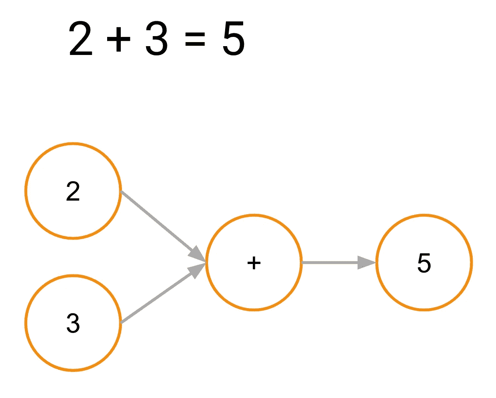
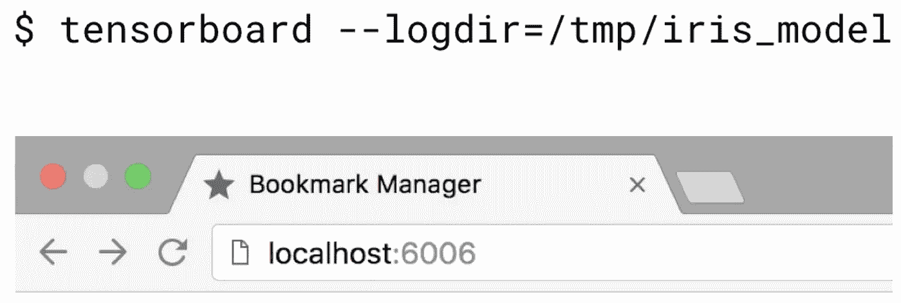
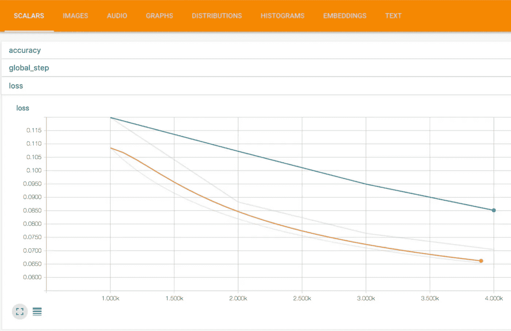
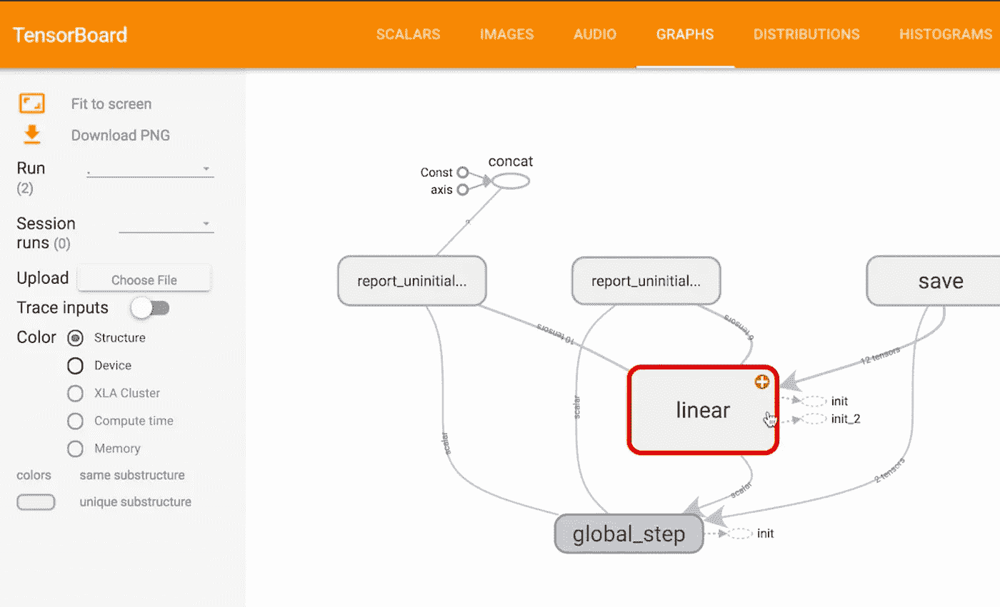
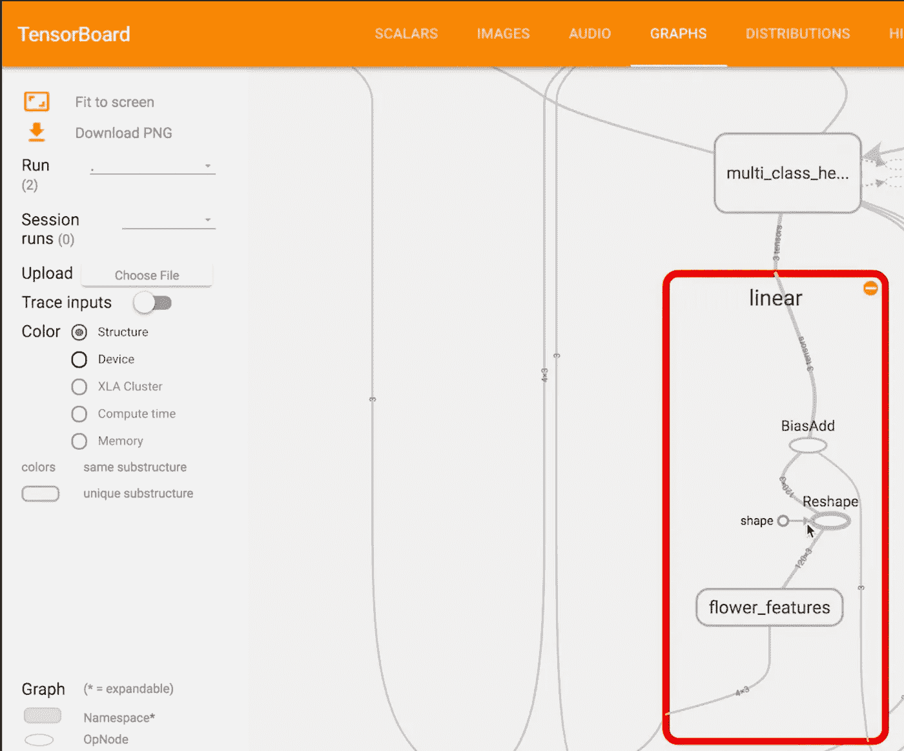

# 使用 TensorBoard 可视化您的模型

> 原文：<https://towardsdatascience.com/visualizing-your-model-using-tensorboard-796ebb73e98d?source=collection_archive---------1----------------------->

在这一集的云人工智能冒险中，了解如何使用 TensorBoard 可视化您的模型并调试问题！

当您可以看到问题是什么时，调试问题就容易多了。但是随着大量的训练数据被输入到一个复杂的模型中，情况会变得…复杂。谢天谢地，TensorBoard 让这变得容易多了。

与传统编程不同，机器学习通常非常不可预测。您的数据质量，以及我们模型的细微差别，包括必须选择的许多参数，都对培训过程的成败有着广泛的影响。

Use TensorBoard to find the gaps

如果有*某种*方法来跟踪训练过程中的一些指标，并查看我们创建的模型的结构，那将使我们能够调整模型并调试我们看到的任何问题。

现在，这个抽象的过程可能很难可视化，但幸运的是，TensorFlow 有一个内置的解决方案！

见见 TensorBoard，TensorFlow 的内置可视化工具，它使您能够做各种事情，从查看您的模型结构到查看训练进度。

TensorFlow 在引擎盖下使用了计算图的思想。

这意味着它不是传统意义上的两个数相加，而是构造一个加法运算符，并将相加后的值作为输入传递给。

因此，当我们考虑 TensorFlow 训练您的模型时，它实际上是作为其“图形”的一部分执行一切。TensorBoard 可以可视化这些模型图，这样你就可以看到它们的样子，更重要的是，确保你已经按照你想要的方式连接了所有的部件。

这是一个由 TensorFlow 可视化的模型图的更复杂版本的例子。TensorBoard 允许我们缩放、平移和扩展元素以查看更多细节。这意味着我们可以在不同的抽象层查看模型，这有助于降低视觉复杂性。

然而，TensorBoard 不仅仅是显示模型结构。它还可以在一个漂亮的图表上绘制度量的进展。通常情况下，我们会绘制诸如准确性、损失、交叉熵等东西。根据不同的模型，不同的指标可能很重要。TensorFlow 的固定估值器附带了许多预配置的值，将在 TensorBoard 中显示，因此这是一个很好的起点。

TensorBoard 可以显示各种其他信息，包括直方图、分布、嵌入以及音频、图片和文本数据。但那是为了以后的视频。

让我们来看一个 TensorBoard 的例子，它带有我们目前为止一直使用的线性模型。首先，我们将启动 TensorBoard，并通过运行以下命令将其指向保存模型结构和检查点文件的目录:

`tensorboard --logdir=”/tmp/iris_model/”`

这将在端口 6006 启动一个本地服务器。没错，就是 GOOG:)前往 localhost:6006 查看本地机器上的 TensorBoard。

我们可以看到线性分类器默认提供的一些标量指标。我们还可以扩展和放大这些图表。

双击允许我们缩小。你可以看到我们的训练进展顺利，损失减少。同样清楚的是，培训尚未完全完成，因为损失仍在以很好的速度减少，所以这将提示我们可能需要运行更长时间的培训过程，以从该模型中获得最大收益。

现在让我们转到图表选项卡。请注意，从表面上看，图表非常简单。

我们可以通过单击加号来展开每个模块，以查看更多详细信息。例如，如果我展开“线性”块，我们会看到它由许多子组件组成。我们可以滚动来放大和缩小，点击并拖动来平移**。**

还要注意，我们给特征列的名称“flower_features”显示为命名的图形组件。

这有助于调试和识别图形是如何连接的。TensorFlow 的大多数操作都可以命名，因此这可以是阐明您的模型的一个很好的方法。

今天，我们了解到，当您可以将模型与重要的训练指标一起可视化时，机器学习会更加容易和有趣。TensorBoard 让你轻松做到这一点，它内置在 TensorFlow 中！

下次你需要可视化你的机器学习时，使用 TensorBoard 来看看引擎盖下发生了什么！

如果你想要更多的机器学习动作，一定要[订阅频道](https://goo.gl/S0AS51)来观看未来的剧集！

此外，TensorBoard 的创作者在今年早些时候的 TensorFlow 开发峰会上给了[这个精彩的演讲](https://www.youtube.com/watch?v=eBbEDRsCmv4)，请查看它以获得更深入的了解。