# 使用 Python 中的 Seaborn 和 WordCloud 可视化 YouTube 视频

> 原文：<https://towardsdatascience.com/visualizing-youtube-videos-using-seaborn-and-wordcloud-in-python-b24247f70228?source=collection_archive---------11----------------------->


Courtesy: Pexels.com

我是一个狂热的 Youtube 用户，喜欢在空闲时间用它看视频。我决定对在美国播放的 youtube 视频做一些探索性的数据分析。我在这个链接上找到了 Kaggle 上的数据集

[](https://www.kaggle.com/datasnaek/youtube-new) [## 趋势 YouTube 视频统计

### 热门 YouTube 视频的每日统计数据

www.kaggle.com](https://www.kaggle.com/datasnaek/youtube-new) 

我下载了所有可用的地理数据集的 csv 文件“USvidoes.csv”和 json 文件“US_category_id.json”。我用 Jupyter 笔记本进行了分析。

# 我们开始吧！

加载必要的库

```
**import** **pandas** **as** **pd**
**import** **numpy** **as** **np**
**import** **seaborn** **as** **sns**
**import** **matplotlib.pyplot** **as** **plt**
**import** **os**
**from** **subprocess** **import** check_output
**from** **wordcloud** **import** WordCloud, STOPWORDS
**import** **string**
**import** **re** 
**import** **nltk**
**from** **nltk.corpus** **import** stopwords
**from** **nltk** **import** pos_tag
**from** **nltk.stem.wordnet** **import** WordNetLemmatizer 
**from** **nltk.tokenize** **import** word_tokenize
**from** **nltk.tokenize** **import** TweetTokenizer
```

我创建了一个名为“df_you”的数据帧，它将在整个分析过程中使用。

```
df_you = pd.read_csv(r"...\Projects\US Youtube - Python\USvideos.csv")
```

最重要的一步是了解数据的长度、宽度和带宽。

```
print(df_you.shape)
print(df_you.nunique())
```

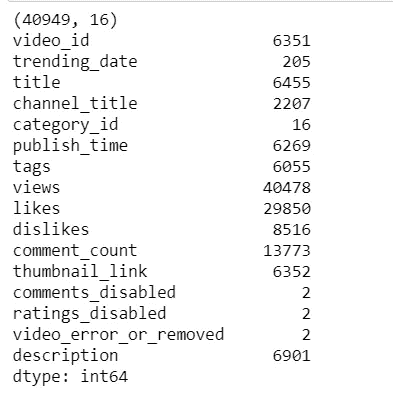

数据集中似乎有大约 40949 个观察值和 16 个变量。如果有必要，下一步将是清除数据。我检查了是否有需要删除或操作的空值。

```
df_you.info()
```

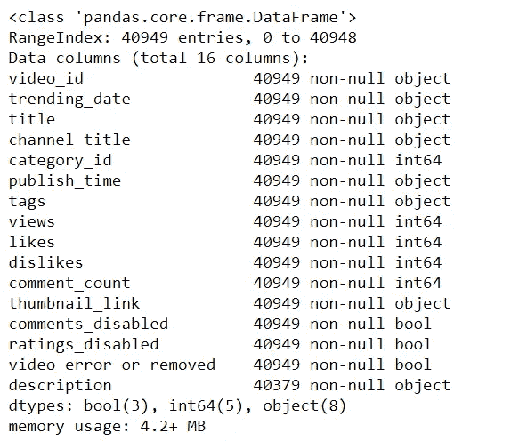

我们看到总共有 16 列没有空值。对我们有好处:)现在让我们通过查看最上面的几行来了解一下数据。

```
df_you.head(n=5)
```

现在是可视化令人兴奋的部分！为了可视化变量中的数据，如“喜欢”、“不喜欢”、“视图”和“评论数”，我首先使用对数分布对数据进行归一化。数据的标准化对于确保这些变量被适当地缩放而不让一个主导变量扭曲最终结果是必不可少的。

```
df_you['likes_log'] = np.log(df_you['likes']+1)
df_you['views_log'] = np.log(df_you['views'] +1)
df_you['dislikes_log'] = np.log(df_you['dislikes'] +1)
df_you['comment_count_log'] = np.log(df_you['comment_count']+1)
```

让我们现在绘制这些！

```
plt.figure(figsize = (12,6))
plt.subplot(221)
g1 = sns.distplot(df_you['likes_log'], color = 'green')
g1.set_title("LIKES LOG DISTRIBUTION", fontsize = 16)

plt.subplot(222)
g2 = sns.distplot(df_you['views_log'])
g2.set_title("VIEWS LOG DISTRIBUTION", fontsize = 16)

plt.subplot(223)
g3 = sns.distplot(df_you['dislikes_log'], color = 'r')
g3.set_title("DISLIKES LOG DISTRIBUTION", fontsize=16)

plt.subplot(224)
g4 = sns.distplot(df_you['comment_count_log'])
g4.set_title("COMMENT COUNT LOG DISTRIBUTION", fontsize=16)

plt.subplots_adjust(wspace = 0.2, hspace = 0.4, top = 0.9)

plt.show()
```

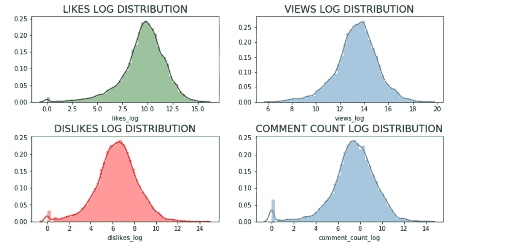

现在让我们找出数据集中存在的唯一类别 id，以便在数据帧中分配适当的类别名称。

```
np.unique(df_you["category_id"])
```


我们看到有 16 个独特的类别。让我们使用之前下载的 json 文件‘US _ category _ id . JSON’中的信息为这些类别命名。

```
df_you['category_name'] = np.nan

df_you.loc[(df_you["category_id"]== 1),"category_name"] = 'Film and Animation'
df_you.loc[(df_you["category_id"] == 2), "category_name"] = 'Cars and Vehicles'
df_you.loc[(df_you["category_id"] == 10), "category_name"] = 'Music'
df_you.loc[(df_you["category_id"] == 15), "category_name"] = 'Pet and Animals'
df_you.loc[(df_you["category_id"] == 17), "category_name"] = 'Sports'
df_you.loc[(df_you["category_id"] == 19), "category_name"] = 'Travel and Events'
df_you.loc[(df_you["category_id"] == 20), "category_name"] = 'Gaming'
df_you.loc[(df_you["category_id"] == 22), "category_name"] = 'People and Blogs'
df_you.loc[(df_you["category_id"] == 23), "category_name"] = 'Comedy'
df_you.loc[(df_you["category_id"] == 24), "category_name"] = 'Entertainment'
df_you.loc[(df_you["category_id"] == 25), "category_name"] = 'News and Politics'
df_you.loc[(df_you["category_id"] == 26), "category_name"] = 'How to and Style'
df_you.loc[(df_you["category_id"] == 27), "category_name"] = 'Education'
df_you.loc[(df_you["category_id"] == 28), "category_name"] = 'Science and Technology'
df_you.loc[(df_you["category_id"] == 29), "category_name"] = 'Non-profits and Activism'
df_you.loc[(df_you["category_id"] == 43), "category_name"] = 'Shows'
```

现在让我们画出这些来识别流行的视频类别！

```
plt.figure(figsize = (14,10))
g = sns.countplot('category_name', data = df_you, palette="Set1", order = df_you['category_name'].value_counts().index)
g.set_xticklabels(g.get_xticklabels(),rotation=45, ha="right")
g.set_title("Count of the Video Categories", fontsize=15)
g.set_xlabel("", fontsize=12)
g.set_ylabel("Count", fontsize=12)
plt.subplots_adjust(wspace = 0.9, hspace = 0.9, top = 0.9)
plt.show()
```

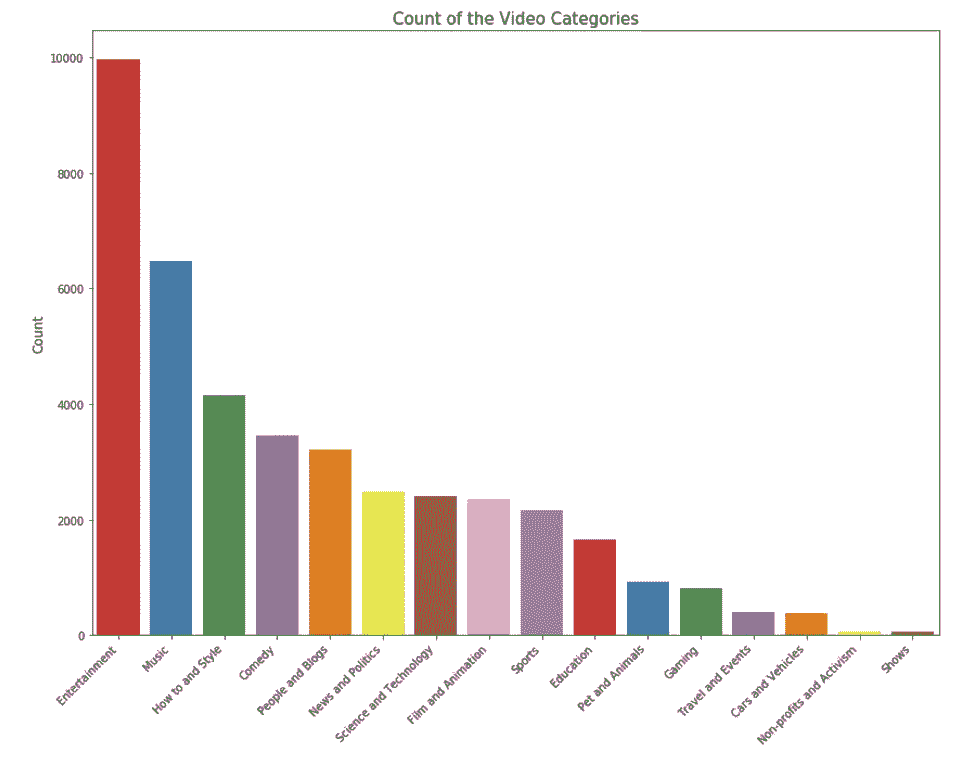

我们看到前 5 个被浏览的类别是“娱乐”、“音乐”、“如何和风格”、“喜剧”和“人物和博客”。因此，如果你正在考虑开办自己的 youtube 频道，你最好先考虑这些类别！

现在让我们用箱线图来看看不同类别的观点、喜欢、不喜欢和评论的情况。

```
plt.figure(figsize = (14,10))
g = sns.boxplot(x = 'category_name', y = 'views_log', data = df_you, palette="winter_r")
g.set_xticklabels(g.get_xticklabels(),rotation=45, ha="right")
g.set_title("Views across different categories", fontsize=15)
g.set_xlabel("", fontsize=12)
g.set_ylabel("Views(log)", fontsize=12)
plt.subplots_adjust(wspace = 0.9, hspace = 0.9, top = 0.9)
plt.show()
```

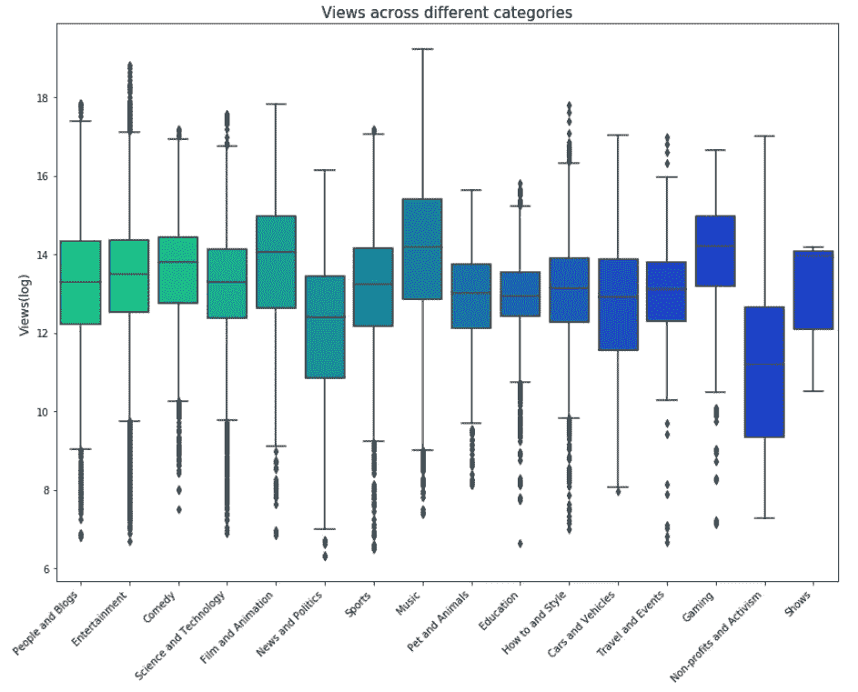

```
plt.figure(figsize = (14,10))
g = sns.boxplot(x = 'category_name', y = 'likes_log', data = df_you, palette="spring_r")
g.set_xticklabels(g.get_xticklabels(),rotation=45, ha="right")
g.set_title("Likes across different categories", fontsize=15)
g.set_xlabel("", fontsize=12)
g.set_ylabel("Likes(log)", fontsize=12)
plt.subplots_adjust(wspace = 0.9, hspace = 0.9, top = 0.9)
plt.show()
```

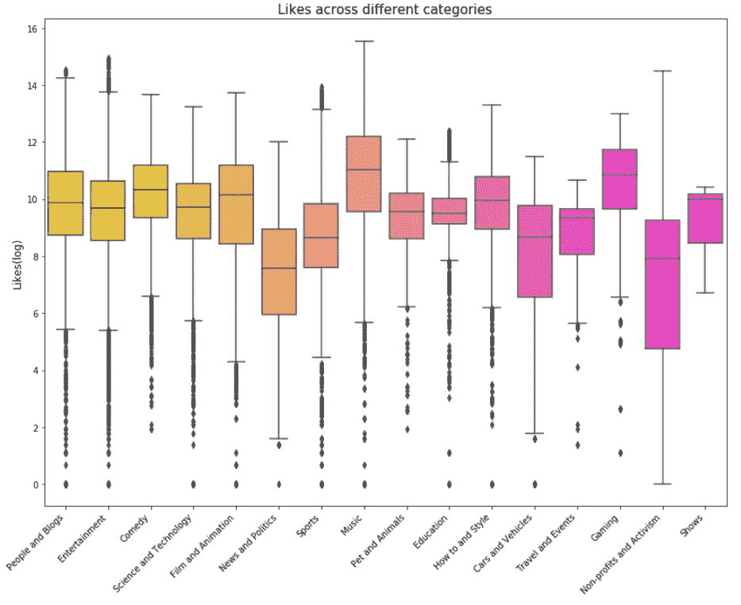

```
plt.figure(figsize = (14,10))
g = sns.boxplot(x = 'category_name', y = 'dislikes_log', data = df_you, palette="summer_r")
g.set_xticklabels(g.get_xticklabels(),rotation=45, ha="right")
g.set_title("Dislikes across different categories", fontsize=15)
g.set_xlabel("", fontsize=12)
g.set_ylabel("Dislikes(log)", fontsize=12)
plt.subplots_adjust(wspace = 0.9, hspace = 0.9, top = 0.9)
plt.show()
```

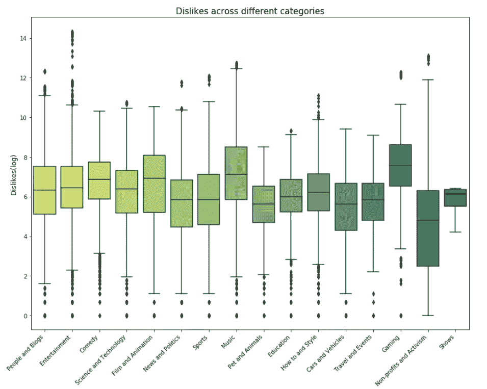

```
plt.figure(figsize = (14,10))
g = sns.boxplot(x = 'category_name', y = 'comment_count_log', data = df_you, palette="plasma")
g.set_xticklabels(g.get_xticklabels(),rotation=45, ha="right")
g.set_title("Comments count across different categories", fontsize=15)
g.set_xlabel("", fontsize=12)
g.set_ylabel("Comment_count(log)", fontsize=12)
plt.subplots_adjust(wspace = 0.9, hspace = 0.9, top = 0.9)
plt.show()
```

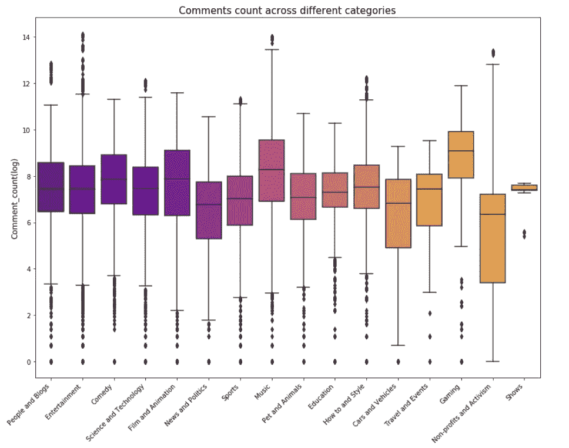

接下来，我计算了参与度指标，如喜欢率、不喜欢率和评论率。

```
df_you['like_rate'] = df_you['likes']/df_you['views']
df_you['dislike_rate'] = df_you['dislikes']/df_you['views']
df_you['comment_rate'] = df_you['comment_count']/df_you['views']
```

使用参与度热图构建关联矩阵。

```
plt.figure(figsize = (10,8))
sns.heatmap(df_you[['like_rate', 'dislike_rate', 'comment_rate']].corr(), annot=**True**)
plt.show()
```

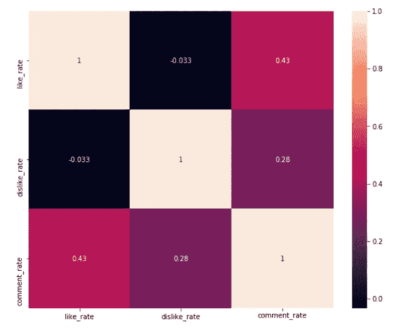

从上面的热图可以看出，如果观众喜欢某个视频，他/她有 43%的机会对其进行评论，而如果观众不喜欢该视频，则有 28%的机会进行评论。这是一个很好的见解，这意味着如果观众喜欢任何视频，他们更有可能对它们进行评论，以显示他们的欣赏/反馈。

接下来，我试着分析“标题”和“标签”栏中的**字数**、**唯一字数、标点数和单词的平均长度**

```
*#Word count* 
df_you['count_word']=df_you['title'].apply(**lambda** x: len(str(x).split()))
df_you['count_word_tags']=df_you['tags'].apply(**lambda** x: len(str(x).split()))

*#Unique word count*
df_you['count_unique_word'] = df_you['title'].apply(**lambda** x: len(set(str(x).split())))
df_you['count_unique_word_tags'] = df_you['tags'].apply(**lambda** x: len(set(str(x).split())))

*#Punctutation count*
df_you['count_punctuation'] = df_you['title'].apply(**lambda** x: len([c **for** c **in** str(x) **if** c **in** string.punctuation]))
df_you['count_punctuation_tags'] = df_you['tags'].apply(**lambda** x: len([c **for** c **in** str(x) **if** c **in** string.punctuation]))

*#Average length of the words*
df_you['mean_word_len'] = df_you['title'].apply(**lambda** x : np.mean([len(x) **for** x **in** str(x).split()]))
df_you['mean_word_len_tags'] = df_you['tags'].apply(**lambda** x: np.mean([len(x) **for** x **in** str(x).split()]))
```

绘制这些…

```
plt.figure(figsize = (12,18))

plt.subplot(421)
g1 = sns.distplot(df_you['count_word'],
                 hist = **False**, label = 'Text')
g1 = sns.distplot(df_you['count_word_tags'],
                 hist = **False**, label = 'Tags')
g1.set_title('Word count distribution', fontsize = 14)
g1.set(xlabel='Word Count')

plt.subplot(422)
g2 = sns.distplot(df_you['count_unique_word'],
                 hist = **False**, label = 'Text')
g2 = sns.distplot(df_you['count_unique_word_tags'],
                 hist = **False**, label = 'Tags')
g2.set_title('Unique word count distribution', fontsize = 14)
g2.set(xlabel='Unique Word Count')

plt.subplot(423)
g3 = sns.distplot(df_you['count_punctuation'],
                 hist = **False**, label = 'Text')
g3 = sns.distplot(df_you['count_punctuation_tags'],
                 hist = **False**, label = 'Tags')
g3.set_title('Punctuation count distribution', fontsize =14)
g3.set(xlabel='Punctuation Count')

plt.subplot(424)
g4 = sns.distplot(df_you['mean_word_len'],
                 hist = **False**, label = 'Text')
g4 = sns.distplot(df_you['mean_word_len_tags'],
                 hist = **False**, label = 'Tags')
g4.set_title('Average word length distribution', fontsize = 14)
g4.set(xlabel = 'Average Word Length')

plt.subplots_adjust(wspace = 0.2, hspace = 0.4, top = 0.9)
plt.legend()
plt.show()
```


现在，让我们将视频标题、视频描述和视频标签的单词 cloud 可视化。这样我们就能发现标题、描述和标签中哪些词比较流行。创建一个词云是在博客世界中寻找热门词的一种流行方式。

1.  **视频标题的文字云**

```
plt.figure(figsize = (20,20))
stopwords = set(STOPWORDS)
wordcloud = WordCloud(
                      background_color = 'black',
                      stopwords=stopwords,
                      max_words = 1000,
                      max_font_size = 120,
                      random_state = 42
                    ).generate(str(df_you['title']))

*#Plotting the word cloud*
plt.imshow(wordcloud)
plt.title("WORD CLOUD for Titles", fontsize = 20)
plt.axis('off')
plt.show()
```


从上面的词云可以明显看出，最常用的标题词是“官方”、“视频”、“谈话”、“SNL”、“VS”和“星期”等等。

**2。标题描述的文字云**

```
plt.figure(figsize = (20,20))

stopwords = set(STOPWORDS)

wordcloud = WordCloud(
                      background_color = 'black',
                      stopwords = stopwords,
                      max_words = 1000,
                      max_font_size = 120,
                      random_state = 42
                    ).generate(str(df_you['description']))

plt.imshow(wordcloud)
plt.title('WORD CLOUD for Title Description', fontsize = 20)
plt.axis('off')
plt.show()
```

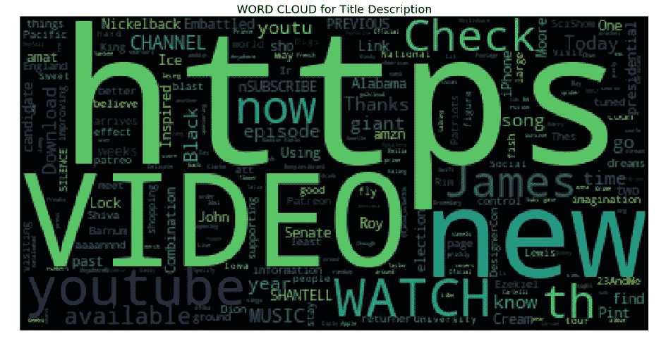

我发现描述视频最流行的词是“https”、“video”、“new”、“watch”等等。

**3。标签的文字云**

```
plt.figure(figsize = (20,20))

stopwords = set(STOPWORDS)

wordcloud = WordCloud(
                      background_color = 'black',
                      stopwords = stopwords,
                      max_words = 1000,
                      max_font_size = 120,
                      random_state = 42
                    ).generate(str(df_you['tags']))

plt.imshow(wordcloud)
plt.title('WORD CLOUD for Tags', fontsize = 20)
plt.axis('off')
plt.show()
```

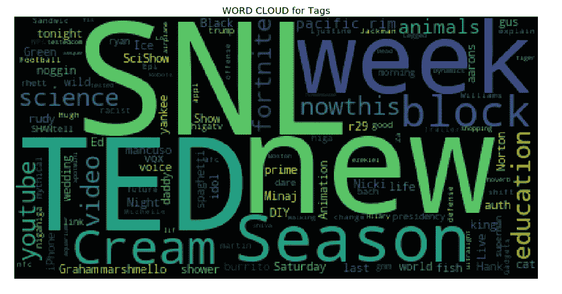

热门标签似乎是' SNL '，' TED '，' new '，' Season '，' week '，' Cream '，' youtube '从词云分析来看，看起来 youtube 上有很多周六夜现场的粉丝！

我第一次使用 word cloud library，它产生了漂亮而有用的视觉效果！如果你有兴趣了解更多关于这个库以及如何使用它，那么你一定要看看这个

[](https://www.datacamp.com/community/tutorials/wordcloud-python) [## 用 Python 生成单词云

### 很多时候，你可能会看到一朵云，里面充满了不同大小的单词，它们代表频率或…

www.datacamp.com](https://www.datacamp.com/community/tutorials/wordcloud-python) 

这个分析在我的 Github 页面上。

[](https://github.com/tanmayeewaghmare/Exploratory-Data-Analysis/blob/master/Youtube%20videos%20analysis_%20US%20Market.ipynb) [## 探索性数据分析

### 通过在 GitHub 上创建帐户，为 tanmayeewaghmare/探索性数据分析开发做出贡献。

github.com](https://github.com/tanmayeewaghmare/Exploratory-Data-Analysis/blob/master/Youtube%20videos%20analysis_%20US%20Market.ipynb) 

感谢阅读！