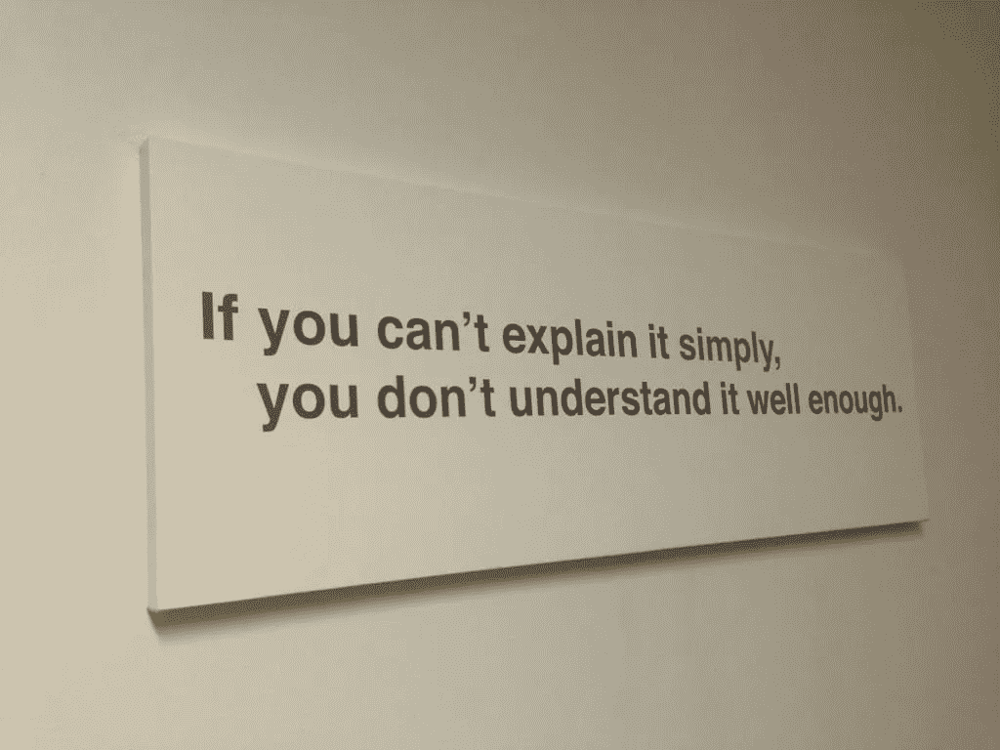
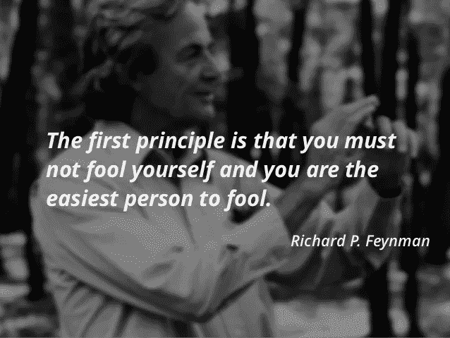

# 想成为数据科学家？试试费曼技术。

> 原文：<https://towardsdatascience.com/want-to-become-a-data-scientist-try-feynman-technique-2ea010da1c54?source=collection_archive---------2----------------------->

Source : [Pixabay](https://pixabay.com/en/financial-analytics-blur-business-2860753/)

许多博客和文章都是关于如何成为数据科学家的。这个列表通常是这样的

学习描述统计学、假设检验、概率

学习机器学习算法的类型——有监督的、无监督的

学习 Python，R，SAS，SQL

使用 Python、R、SAS 应用机器学习技术

学习数据可视化

虽然上述方法没有错，但这并不是成为高效数据科学家的充分途径。现在你可能会问为什么？在回答这个问题之前，我想先谈谈“费曼技术”。

## 为什么这项技术被称为“费曼技术”？

这项技术以伟大的理论物理学家[理查德·费曼](https://en.wikipedia.org/wiki/Richard_Feynman)的名字命名。他被戏称为“伟大的解释者”,因为他用通俗易懂的语言解释甚至最复杂的科学问题的非凡技能。

## **费曼技巧:**

第一步:缩小你觉得难以理解的话题的范围。了解主题。

第二步:用非常简单的术语解释这个话题，就好像你在教别人一样

Image Source : [Geminthinking](https://geminithinking.wordpress.com/2014/10/02/if-you-cant-explain-it-simply-you-dont-understand-it-well-enough/)

**第三步:**通过例子或演示它是如何工作的

**步骤 4:** 评估你对该主题的了解，如果仍有一些概念不清楚，了解更多，重复步骤 2-4

在适当的时候，你会对这个话题有比开始时更好的理解。这就是“费曼技巧”的魔力

## **成为“伟大的解释者”成为伟大的数据科学家**

数据科学领域需要不断学习。有些概念可能太难理解了。费曼技巧可以帮助一个人理解原本认为难以置信的话题。

## **需要向老板、客户或风投解释**

只有当关键决策者看到其中的价值时，分析行业才能生存下去。决策者是

**你的老板**——如果你正在进行内部分析

**客户**——如果你从事分析咨询/服务行业

**VC(风险投资家)**——如果你正在为你的“人工智能初创企业”寻求投资(*称之为人工智能是获得资金的第一步:P* )

通常情况下，你的老板/客户/风投可能没有分析背景，或者对最新的分析主题没有深刻的理解。你有责任用尽可能简单的语言解释分析概念，让他们看到你的提议的价值。

所以，底线是— **练习你的费曼技巧**,否则你可能会面临和呆伯特每天面对他的老板一样的折磨，如下图所示

Source : [Dilbert Comic](http://dilbert.com/strip/2000-11-13)

Image Source : [Dilbert Comic](http://dilbert.com/strip/2013-01-09)

## **我如何成为一名数据科学家**

在我的 MBA 课程中，我是唯一一个有统计学背景的人，当我向我的朋友解释时，我总觉得我对统计学概念的理解有所提高。他们肯定我很容易就学会了这个概念，这给了我鼓励，也增加了我自己彻底学习这个概念的责任，这样我就不会教错了。

彻底学到一些东西的信心让我进入了数据科学领域。即使是现在，我仍然遵循费曼技巧来更好地理解最初看起来不可理解的话题。

## **实践费曼技巧——写文章**

我必须承认，我写了第一篇关于“[推荐引擎](/recommender-engine-under-the-hood-7869d5eab072)的文章，是为了更好地理解推荐系统是如何工作的。虽然我不自称在推荐系统方面有专长，但我可以肯定地说，我凭直觉学到了一些东西。

类似地，在我的上一篇文章“如何将一个闪亮的应用程序分类——第一部分”中。我试过通过乐高来解释码头工人！！

**费曼技术——治疗冒名顶替综合症的方法**

Image source : [Pinterest](https://www.pinterest.com/pin/387731849148296241/)

随着数据科学领域变得有利可图，许多人都想进入这个领域。那些成功进入(没有统计/数学)背景的人，有时会患上冒名顶替综合症。如上图所描绘的，“你是最容易被忽悠的”。**克服冒名顶替综合症的唯一方法是真正深入了解各种数据科学主题**，以及有什么比费曼技术更好的方式来深入了解主题。

# **记住:成为‘伟大的解释者’才能成为‘伟大的数据科学家’！！**

如果你喜欢我的文章，给它一些掌声，你也可以在下面评论你对这篇文章的看法。

你可以联系我

[领英](http://www.linkedin.com/in/venkat-raman-Analytics)

[推特](https://twitter.com/venksaiyan)

我的博客:分析洛卡