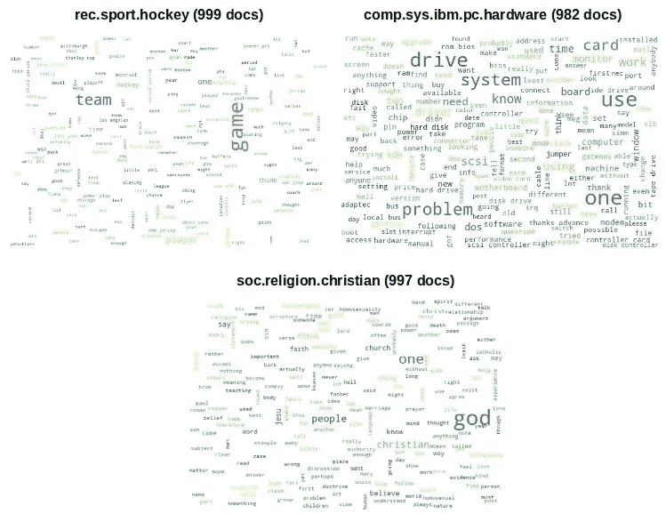
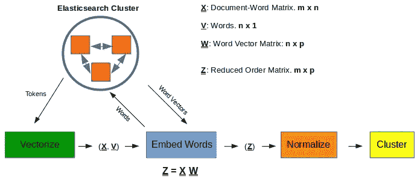
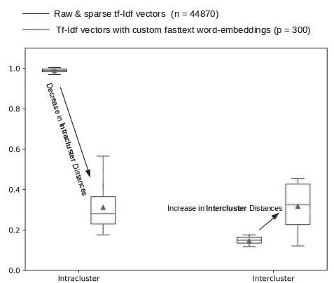
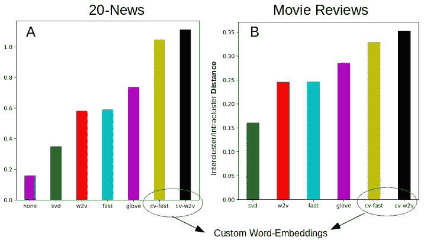
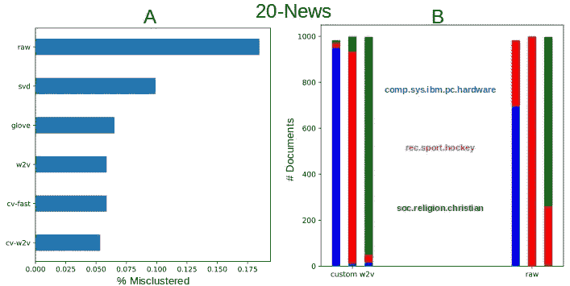
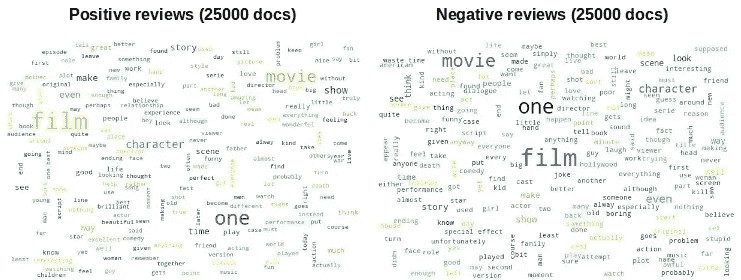
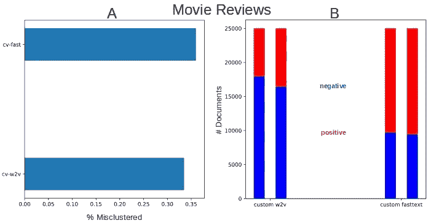

# 想要对文本进行聚类？尝试自定义单词嵌入！

> 原文：<https://towardsdatascience.com/want-to-cluster-text-try-custom-word-embeddings-615526cbef7a?source=collection_archive---------23----------------------->

## 分析具有单词嵌入的 Tf-idf 向量的聚类有效性。本文考虑的文本语料库实例表明，自定义单词嵌入可以帮助提高语料库的聚类能力

在我们使用单词嵌入的文本分类结果之后，这是一个受欢迎的消息。在分类的上下文中，我们得出结论，用朴素贝叶斯和 tf-idf 向量保持简单是一个很好的起点。虽然我们不能一概而论，但是在构建文档+单词向量时所做的额外工作并没有为分类质量带来相应的收益。在这篇文章中，我们继续前面为文本聚类打下的基础，特别是两篇文章——[想要聚类？你要几个？](http://xplordat.com/2018/11/05/want-clusters-how-many-will-you-have/)和[用转换后的文档向量聚类文本。](http://xplordat.com/2018/11/26/clustering-text-with-transformed-document-vectors/)我们从[分类练习](http://xplordat.com/2018/10/09/word-embeddings-and-document-vectors-part-2-classification/)中选择我们熟悉的 [20 新闻](http://scikit-learn.org/stable/datasets/twenty_newsgroups.html)和[影评](http://ai.stanford.edu/~amaas/data/sentiment/)文本语料库。我们评估了不同的降阶变换的聚类效果。重现这些结果的代码可以从 [github](https://github.com/ashokc/Evaluating-Document-Transformations-for-Clustering-Text) 下载。

**为什么降阶转换有助于聚类？**

在我们深入细节之前，让我们停下来考虑一下，是否有任何理由期待应用单词嵌入会带来一些好处。除了计算性能的明显优势之外，如果我们得不到高质量的集群，这当然是没有用的！

从 [VSM](https://pdfs.semanticscholar.org/4008/d78a584102086f2641bcb0dab51aff0d353b.pdf) 模型产生的文档向量是长且稀疏的。不幸的是，每个文档簇的质心都接近原点。也就是说，所有的文档簇几乎都有一个共同的质心！另外，由于我们将文档向量归一化为具有单位长度，所以一个簇中的每个文档离这个公共质心的距离大约相同。我们的情况是，集群间距离接近于零，集群内距离接近于 1！这不是划分集群的好时机。

*如果*我们可以在不破坏文档向量的内容/意义的情况下减少文档向量的顺序，我们当然可以期待更高质量的结果。这正是这篇文章的重点，下面是我的计划。

*   将文档归入已知的组/群，并将它们混合在一起
*   应用降阶变换并构建文档向量
*   聚集文档向量，看看我们是否已经*完整地恢复了*原始组
*   评估不同转换在恢复纯净完整的文档群集方面的能力

## 1.用于聚类的文档向量

从有/没有单词嵌入的文本语料库中构建文档向量的准备工作已经在前面的文章中完成了— [单词嵌入和文档向量:第 2 部分。分类](http://xplordat.com/2018/10/09/word-embeddings-and-document-vectors-part-2-classification/)。我们在弹性搜索索引中有 20 个新闻和电影评论文本语料库。从不同算法(FastText、Word2Vec 和 Glove)构建的预训练和定制单词向量也在索引中。将 K-Means 应用于降阶的文档向量是简单的。

*   从 elasticsearch 索引中获取(停止的令牌)稀疏的 *n* 长文档向量。 *n* 是文本语料库的词汇量大小。通过应用单词嵌入，将这些 *n* 长的稀疏向量转换成密集的 *p* 长的向量。
*   应用 K-Means 聚类(对于 20 条新闻，K=3，对于电影评论，K = 2 ),并找出所获得的聚类的纯度。

下图说明了其中的机制。设置与我们的分类类似，只是我们在这里对向量进行聚类。关于[分类的早期文章](http://xplordat.com/2018/10/09/word-embeddings-and-document-vectors-part-2-classification/)对图中的每个步骤都有详细的描述，代码也在它的 [github](https://github.com/ashokc/Word-Embeddings-and-Document-Vectors) 中。

Figure 1\. The mechanics of the text clustering exercise. The document (row) vectors X and pre-trained/custom (column) word-vectors W are fetched from the elasticsearch index to build dense (row) vectors Z that are then normalized to have unit length before clustering with K-Means

## 2.变换空间中的距离

为了说明降阶变换对集群内和集群间距离的典型影响，让我们从 20 个新闻语料库中挑选“alt .无神论”组，并计算如下。

*   *簇间距离*:20 个组中每个组的质心，以及从“alt.athiesm”的质心到其他 19 个组的质心的 19 个距离
*   *簇内距离*:备选无神论组中 799 个文档的每一个到其质心的距离。

图 2 中的盒须图(5%和 95%的须)显示了转换前后的距离分布。对于稀疏和长( *n* = 44870，20 个新闻的停止词汇的大小)原始文档向量，簇内的距离都在预期的 1.0 左右，并且簇间距离接近 0.1。使用定制的 fasttext 单词嵌入(使用 *p* = 300，即转换后的向量长度为 300)，我们得到了一个有利的距离分布，其中聚类本身被处理(聚类内中值距离*从 1.0 降低*到 0.27)，而不同的聚类被推开(与其他聚类的中值距离*从 0.1 左右增加*到 0.28)。

Figure 2\. The order reduced document vectors in a known cluster show larger compaction among themselves and greater separation from other clusters. Such transformations are better for the clustering task.

## 3.评估转换

我们从上一篇文章[用转换后的文档向量聚类文本](http://xplordat.com/2018/11/26/clustering-text-with-transformed-document-vectors/)中知道，

*   我们需要将文档向量标准化为单位长度，并且
*   不同变换之间的变换向量之间的距离不能直接比较，并且
*   可以比较每个空间中簇间距离与簇内距离的比率，以获得关于变换的有用性的一些线索。

此外，我们还概述了计算该比率的以下程序。

1.  计算每个簇的质心，以及簇中每个文档与该质心之间的距离。找出这些距离的中间值。
2.  取 1 中获得的所有聚类的中间值的平均值。这是该空间的“代表性”距离 A。
3.  计算质心之间的平均距离 B。
4.  比率 B/A 是我们可以跨转换比较的

为了获得更好的集群能力，我们希望 B/A 更大。也就是说，最大化 B/A 的转换应该在聚类方面做得更好。下面的图 3 让我们看到了 at 的前景。所有情况下的文档都使用停止标记(但没有词干)通过 Scikit 的 [tf-idf 矢量器](https://scikit-learn.org/stable/modules/generated/sklearn.feature_extraction.text.TfidfVectorizer.html)进行了矢量化。然后对这些向量应用不同的降阶变换。我们选择 *p* 为 300，即转换后的文档向量在所有情况下都具有 300 的长度。尝试的转换包括以下内容。

*   [奇异值分解](https://scikit-learn.org/stable/modules/generated/sklearn.decomposition.TruncatedSVD.html)
*   [手套](https://github.com/stanfordnlp/GloVe)(带[手套. 840B.300d](http://nlp.stanford.edu/data/wordvecs/glove.840B.300d.zip) )
*   [FastText](https://fasttext.cc/) (带[crawl-300d-2M-subword . vec](https://s3-us-west-1.amazonaws.com/fasttext-vectors/crawl-300d-2M-subword.zip)
*   [Word2Vec](https://arxiv.org/abs/1301.3781) (带[Google news-vectors-negative 300 . bin](https://drive.google.com/file/d/0B7XkCwpI5KDYNlNUTTlSS21pQmM/edit?usp=sharing))
*   使用 FastText 定制矢量(使用 [Gensim](https://radimrehurek.com/gensim/index.html) )
*   使用 Word2Vec 定制矢量(使用 [Gensim](https://radimrehurek.com/gensim/index.html)

根据步骤 1-4 处理每次转换中获得的文档向量，以计算簇间/簇内距离比率 B/A。图 3A 显示了考虑所有 20 个组/簇的 [20-news](http://scikit-learn.org/stable/datasets/twenty_newsgroups.html) 文档向量的比率。图 3B 用于[电影评论](http://ai.stanford.edu/~amaas/data/sentiment/)数据集。

Figure 3\. Order reducing transformations seem to improve the intercluster/intracluster distance ratio, boding well for the clustering task.

从图 3 中可以看出，降阶转换，尤其是自定义单词嵌入，似乎可以为 B/A 产生较大的值，因此有助于提高聚类能力。是时候验证事实是否如此了。

## 4.K-均值聚类

现在我们开始实际的集群任务，如图 1 所示，以验证图 3 所显示的内容。我们将使用相同的变换列表，并检查所获得的簇有多纯。也就是说，在任何获得的聚类中，我们希望找到单个组/类的文章。我们的立场是，那些具有较大 B/A 值的转换应该产生更纯的集群。

在每种情况下，我们给 K-Means 模拟已知的聚类数。假设我们在这里通过给出精确的 K 来帮助 K-Means，我们希望它至少能够将文章按组分开，并将它们放在不同的簇中。但不幸的是，这种情况并不总是发生，在某些情况下，文章会一边倒地聚集在一两个集群中。从我们的角度来看，这是一次失败的集群行动。

> 如果聚类任务是成功的，我们应该最终得到这样的聚类，每个聚类都有一个主要部分的文章来自其中一个组，这样我们就可以用那个组来识别那个聚类。

然后，通过不属于该聚类/组的文章的数量来测量所获得的聚类的“纯度”。

## 4.1 二十篇新闻文章

在 20 个新闻数据集的情况下，我们从 3 个组中挑选文章进行这个练习——这样我们就可以很容易地绘制结果。然而，请注意，图 3A 中的结果是通过考虑所有 20 个组/簇而获得的。词云图提供了我们正在处理的内容的鸟瞰图。

Figure 4\. The dominant words in these three groups are mostly different. This enhances dissimilarity and so we expect to be successful at clustering

下面的图 5A 显示，使用自定义单词嵌入时，放错位置的文章数量最少，而原始文档向量的情况最差。具有定制 word2vec 嵌入的文档向量产生最纯的集群，每个集群标识一个特定的组。不同变换的性能与图 3A 所示的很好地匹配。

Figure 5\. (A) Six of the 7 attempted transformations were successful at clustering. Order reducing transformations seem to have helped with clistering (B) Several articles about hockey seem to have found their way into hardware & religion based content when using the raw document vectors.

## 4.2 电影评论

电影评论数据集只有两个类，所以很容易设计，我们考虑所有的文档。这里再一次出现了两个组的单词云。

Figure 6\. The positive & negative reviews share a lot of common words that are dominant. We can expect to have some difficulty with clustering.

图 7A 仅标识了两个成功的转换，并且它们与图 3B 中具有最大 B/A 比率的两个相一致。显然，正如图 6 中的单词云所表明的，电影评论更难聚类。总的来说，与 20 条新闻相比，我们可以做出以下观察。

*   在群集任务中，7 次尝试转换中只有 2 次成功(相比之下，7 次尝试转换中有 6 次成功)。其他的则很不平衡，只有一个集群拥有大部分文档。
*   即使在这两个成功的转化中，获得的簇的纯度/质量较差，有超过 30%的错簇。

Figure 7\. Of the 7 attempted transformations, only 2 make the grade in reasonably segregating the positive and negative reviews as separate clusters. And they both of them involve custom word-embeddings.

## 5.结论

至此，我们结束了另一篇文章。我们已经在这里展示了降阶转换可以帮助文档聚类。在这些转换中，自定义单词嵌入似乎有优势——因此它进入了标题。至于为什么自定义单词嵌入比其他降阶转换做得更好，以及这个结论是否超出了本文研究的文本存储库，还有待进一步研究。

…

*原载于 2018 年 12 月 14 日*[*【xplordat.com】*](http://xplordat.com/2018/09/27/word-embeddings-and-document-vectors-part-1-similarity/)*。*