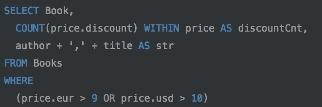
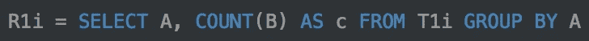

# 想用 BigQuery？读读这个

> 原文：<https://towardsdatascience.com/want-to-use-bigquery-read-this-fab36822830?source=collection_archive---------7----------------------->


Photo by [Stephen Dawson](https://unsplash.com/photos/qwtCeJ5cLYs?utm_source=unsplash&utm_medium=referral&utm_content=creditCopyText) on [Unsplash](https://unsplash.com/search/photos/data-warehouse?utm_source=unsplash&utm_medium=referral&utm_content=creditCopyText)

我最近开始使用 BigQuery，我必须承认我爱上了 DB…
本文试图解释它背后的技术，这是在成本和性能方面有效利用 DB 的一个要求。

BigQuery 是谷歌发布的 Dremel 的公开实现。

Dremel 是 Google 的查询引擎，它能够将 SQL 查询转换成从 Google 的分布式文件系统中读取数据的执行树。Dremel 具有很高的可伸缩性，无论数据集有多大，它都能够在几秒(或几十秒)内返回查询结果。

BigQuery 通过 REST API、命令行界面和 Web UI 向第三方提供 Dremel 的核心特性。

但是 BigQuery 不仅仅是 Dremel…

事实上，BigQuery 利用了谷歌开发的多种技术。

首先，它使用 Borg (Google 的集群管理系统)为 Dremel 作业分配计算能力。Dremel jobs 使用 Jupiter 从谷歌的文件系统中读取数据，Jupiter 是谷歌的高速网络，以 10 Gbps 的速度交换数据。

由于其架构，BigQuery 不需要索引，数据以一种专有的列格式存储在 Colossus (Google 的文件系统)上，每个查询对目标表进行全扫描。

负载的增加主要通过添加服务器来管理。这对于用户来说是透明的，用户不会像使用 Redshift 或 Postgres 那样“添加服务器”或“使用更大的机器”。

术语“无索引”和“全扫描”通常不是“快”的同义词，那么 BigQuery 为什么这么快呢？

主要得益于两个因素:

*   **列存储**:**数据按列存储，这样可以实现很高的压缩比和扫描吞吐量。**
*   ****树形架构**:树形执行架构用于在数千台机器上分发查询和聚合结果。**

# **柱状存储**

**作为一个分析数据库，BigQuery 存储格式针对访问大量行的少数几列进行了优化。由于这个原因，存储是按列执行的，因此您只能访问更少的不同存储卷(由于可以并行访问它们，所以速度更快)。**

**数据模型与协议缓冲区紧密相关，具有必填、重复和可选字段。
为了以连续的方式存储信息，让我们引入**重复级别**和**定义级别**的概念。**

*   ****重复级别**:重复发生的场路径中嵌套的级别。**
*   ****定义级别**:字段路径中定义了多少个可选/重复字段。**

**让我们举个例子，假设我们有下面的表定义:**

```
message Book {
 required string title,
 repeated string author,
 repeated group price {
   optional int64 discount,
   optional int64 usd,
   optional int64 eur,
 }
}
```

**我们有三项记录:**

```
Book1:
 author: "AAA"
 title: "firstTitle"
 price:
  discount: 0
  eur: 11
  usd: 12Book2:
 author: "BBB"
 author: "CCC"
 author: "DDD"
 title: "secondTitle"Book3:
 title: "thirdTitle"
 price:
  discount: 0
  eur: 11
 price:
  discount: 1
  eur: 11
```

**让我们计算每个值的重复和定义级别。我还将为缺失的可选字段添加显式的空值。**

```
Book1:
 author: "AAA"          R: 0, D: 1
 title: "firstTitle"    R: 0, D: 1
 price:
  discount: 0           R: 0, D: 2
  eur: 11               R: 0, D: 2
  usd: 12               R: 0, D: 2Book2:
 author: "BBB"          R: 0, D: 1
 author: "CCC"          R: 1, D: 1
 author: "DDD"          R: 1, D: 1
 title: "secondTitle"   R: 0, D: 1
 (price):
  (discount: null)      R: 0, D: 0
  (eur: null)           R: 0, D: 0
  (usd: null)           R: 0, D: 0Book3:
 title: "thirdTitle"   R: 0, D: 1
 (author: null)        R: 0, D: 0
 price:
  discount: 0          R: 0, D: 2
  eur: 11              R: 0, D: 2
  (usd: null)          R: 0, D: 1
 price:
  discount: 1          R: 1, D: 2
  eur: 11              R: 1, D: 2
  (usd: null)          R: 1, D: 1
```

**当没有重复时，重复级别总是零，当字段重复时，例如第二个记录中的 *author* ，R 是 1，因为重复发生在第一个重复级别，第三个记录中的 price 也是如此。**

**定义级别非常简单，例如在第一条记录中*价格.折扣*为 2，因为*价格*和*折扣*都已定义。另一方面，在记录 3 中，最后一个空值 *price.usd* 的 D 等于 1，因为 *price* 被定义，而 *price.usd* 没有被定义。**

**每列存储为一组块，如下所示:**

```
compressed value, R, D
```

**r 和 D 仅在必要时存储，不能推断。空值可以推断为，对它们来说，D 始终是一个小于字段路径中重复字段和可选字段之和的数字(从示例中可以看出)。
根据存储的信息，可以很容易地为每个查询列并行重建每个记录。**

**例如，让我们考虑一下 *price.eur* 列。在磁盘上，我们将有:**

```
11 R: 0, D: 2
NULL R: 0, D: 0
11 R: 0, D: 2
11 R: 1, D: 2
```

**扫描该列，每当 R 为 0 时，我们就遇到一个新记录，而当 R 大于 0 时，我们在同一记录中有重复。如前所述，D 可用于空值。因此，遍历该列，我们得到:**

```
Book1:
 price:
  eur: 11Book2:
 price:
  eur: nullBook2:
 price:
  eur: 11
 price:
  eur: 11
```

**列存储也带来了存储优势，因为它允许您压缩每一列。两个经典的解决方案是**位图**和**游程编码** (RLE)。**

**假设您有一个由 *n* 行组成的列，其中有 *k* 个不同的值。使用前面的示例，您有一个包含以下值的 *price.eur* 列( *n* = 10， *k* = 5)**

```
[10.0, 10.0, 8.99, 8.99, 7.0, 6.0, 7.0, 6.0, 2.0, 2.0]
```

**这个列可以很容易地用长度为 *n* (行长度)的 *k* 位图(一个位图对应一个不同的值)来压缩，其中如果某个值在行中，那么在该值的位置有一个设置位。**

```
price.eur: 10.0 [1, 1, 0, 0, 0, 0, 0, 0, 0, 0]
price.eur: 8.99 [0, 0, 1, 1, 0, 0, 0, 0, 0, 0]
price.eur: 7.0  [0, 0, 0, 0, 1, 0, 1, 0, 0, 0]
price.eur: 6.0  [0, 0, 0, 0, 0, 1, 0, 1, 0, 0]
price.eur: 2.0  [0, 0, 1, 1, 0, 0, 0, 0, 1, 1]
```

**可以存储位图而不是实际的列。如果考虑选择、聚合和投影模式，优势甚至更大。在分析数据库中，查询(如下所示)**

****

**可以直接执行加载值= 4.0 和< 3.0 的位图，并执行逐位 and。**

**使用 RLE 可以进一步提高压缩率。在这种情况下，你要做的是表示 0 和 1 的序列。例如，前三个位图将变成:**

```
price.eur: 10.0 – 0,2 (0 0s, 2 1s, rest 0s)
price.eur: 8.99 – 2,2 (2 0s, 2 1s, rest 0s)
price.eur: 7.0 – 4,1,1,1 (4 0s, 1 one, 1 zero, 1 one, rest 0s)
```

**可以想象，这种技术的效率很大程度上取决于不同的因素，比如行的顺序、列的类型和用法。电容器所做的是试图找到一种智能的行重新排序，目的是优化(或至少次优化)数据存储和检索。**

**这种选择也有一些缺点。例如，它在更新方面表现不佳。Dremel 通过不支持任何更新操作来解决这个问题。**

****

**Coffee break (Photo by [rawpixel](https://unsplash.com/photos/5Z398JOmCKw?utm_source=unsplash&utm_medium=referral&utm_content=creditCopyText) on [Unsplash](https://unsplash.com/search/photos/coffee-break?utm_source=unsplash&utm_medium=referral&utm_content=creditCopyText))**

# **用于查询执行的树形结构**

**每个 SQL 语句将一个或多个嵌套表及其模式作为输入，并生成一个嵌套表及其输出模式。
嵌套数据结构的思想用于减少阻抗不匹配(也就是应用程序代码和 DBs 数据表示中对象之间的不匹配)。**

**即使查询中没有指定记录构造函数，也总是会产生嵌套结果。**

**让我们以一个 SQL 查询为例，它执行:**投影** (AS)、**选择** (SELECT/FROM/WHERE)和**记录内聚合** (COUNT — WITHIN)。**

****

**该查询将返回如下内容:**

```
Book: Book1
price:
 discountCnt: 1
 str: "AAA,firstTitle"
```

**如果您将嵌套记录视为一棵带标签的树，那么:**

*   ****选择:** WHERE 删除不符合条件的分支，而 SELECT 生成的值与表达式中使用的重复次数最多的字段级别相同。**
*   ****聚合:** COUNT/WITHIN 执行记录内聚合，计算价格字段中折扣的出现次数。**

**但是查询是如何执行的呢？
答案是:**使用树执行方法**。**

**根节点接收查询，读取表元数据，并将查询重新路由到下一级。在底部，叶节点是与分布式文件系统交互的节点，它检索实际的数据，并将其传播回树中。**

**例如，假设您执行:**

****

**根节点获取组成 T 的所有分区(可能你们中的一些人更熟悉术语*碎片*),而不是将查询重写为**

****

**其中 *R1i* … *R1n* 是发送到第一级节点的查询的结果。特别是:**

****

**其中 *T1i* 是在执行树的第一级中由服务器 I 处理的平板(T 的碎片)。**

**查询在下一级被修改和推送，直到到达叶子。树叶从分区中读取实际的列数据，然后一切都传播回根。**

**需要注意的是，树叶扫描的数据量是影响查询费用的数据量。**

**关于分区，BigQuery 在加载数据时确定表的最佳分区数，然后根据数据访问和查询模式调整分区数。**

# **查询调度程序**

**通常，几个查询同时执行，查询调度器调度查询并平衡负载。**

**每个查询中处理的数据量通常大于
可供执行的处理单元(槽)的数量。一个槽对应于叶服务器上的一个执行线程。通常情况下，每个插槽会被分配给多个平板电脑。
执行查询时，dispatcher 会计算药片处理时间的直方图，并决定重新安排处理时间过长的药片。**

**就复制而言，每台平板电脑通常都是三向复制，因此如果其中一台不可访问，则叶服务器会访问另一台副本。**

**让我们用一些数学知识来理解这种机制在执行查询时为何如此之快。**

**假设您有一个包含 50TB 数据、10 列和 1000 个分区的表，考虑到前面讨论的列存储，您有 10 个文件乘以 1000 个平板电脑。**

**让我们假设你在桌子上执行了一个`SELECT *`。
如果有 2000 个插槽，每个插槽必须读取 5 个文件(10x1000/2000 ),每个文件的大小为 5GB，总共 25GB，可以并行读取。考虑到木星网络的速度，这些数据可以在 20 秒左右送达。**

# **实际问题**

**让我们通过理解 BigQuery 背后的技术得出一些实际的考虑。**

1.  ****最小化扫描数据量**:永远不要运行`SELECT *`，如果这对于一般的分析数据库来说是真的，那么对于 BigQuery 及其*按查询付费*策略来说更是如此。仔细选择您需要的列。除此之外，您可以应用几种策略来减少数据量，比如使用分区表。**
2.  ****不删除**:如果你犯了一个错误，你不能删除或重命名一个列…你只能从`REQUIRED`到`NULLABLE`增加或放松一个列的模式。但是，您仍然可以删除或重命名列。例如，您可以执行一个查询，选择除了要删除的列之外的所有列，并将查询结果作为新表的目标。或者，您可以将现有的表转储到*Google Cloud Storage*(GCS)中，然后重新导入它，不包含您想要删除或重命名的列。这些都会带来成本的下降(扫描整个表，创建新表，因此需要额外的存储)。**
3.  ****外部数据源** : BigQuery 也可以使用它的查询来定位外部数据源。支持的来源有 *Bigtable* 、 *Google 云存储*和 *Google Drive* 。数据被动态加载到 Dremel 引擎中。例如，如果您想直接查询存储在 GCS 上的日志，这可能非常有用。另一方面，与定位本地表相比，定位外部数据会导致性能降低。**

***结论:我们深入了解了 BigQuery 的工作原理。特别是，它的存储格式和查询执行机制如何对大量数据执行快速分析查询。然后，根据我们对 BigQuery 架构的了解，我们得出了一些关于如何优化成本和查询性能的实际考虑。***

**如果您喜欢这篇文章，并且觉得它很有用，请随意👏或者分享。**

**干杯！**