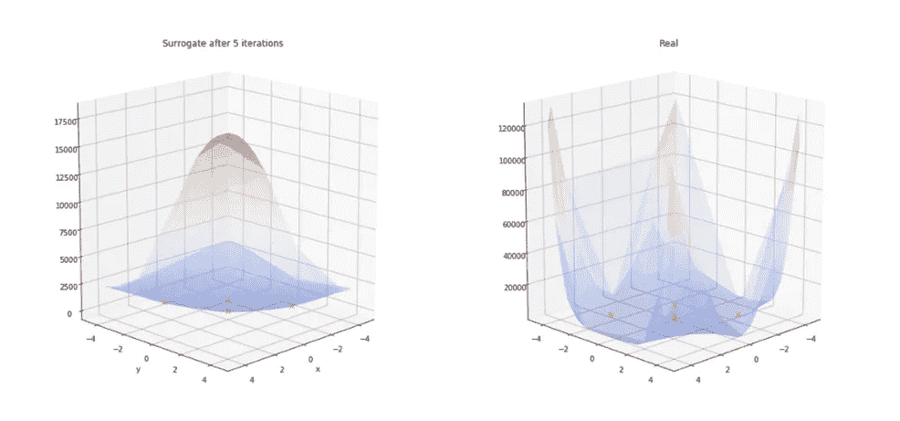
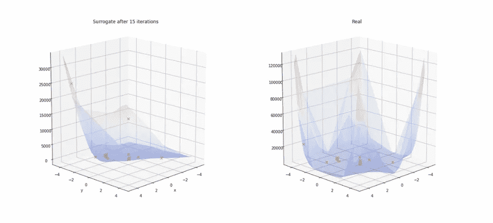
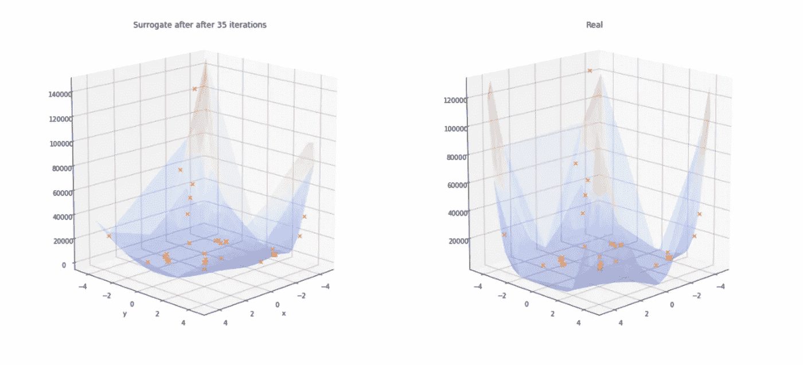
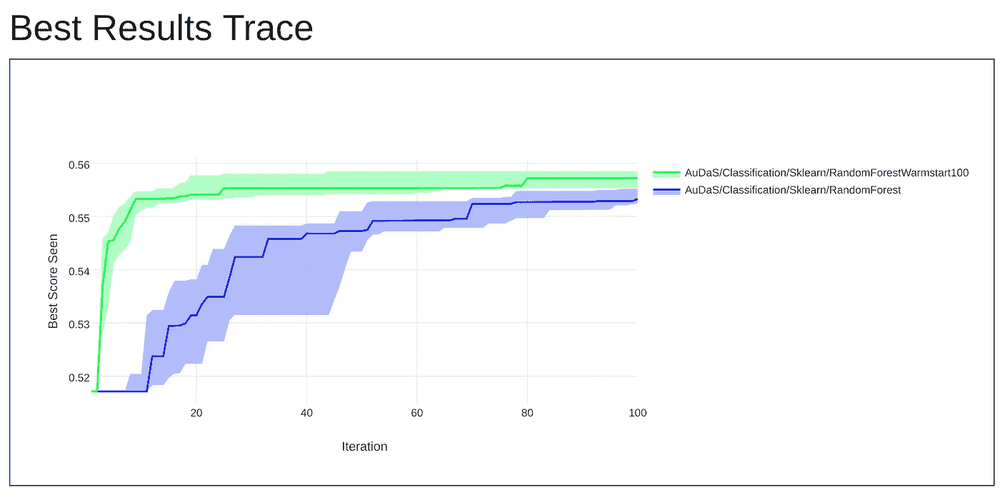
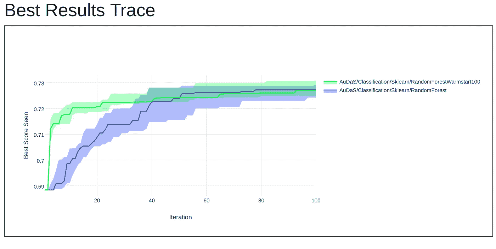
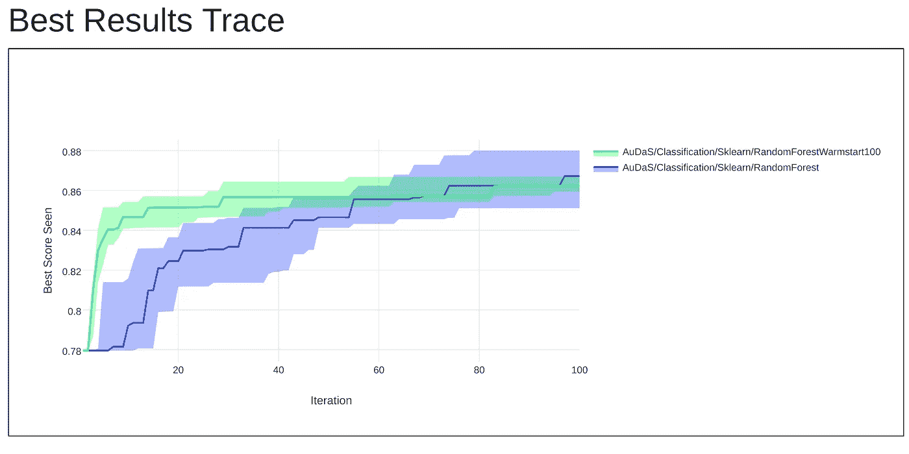

# 热启动贝叶斯优化

> 原文：<https://towardsdatascience.com/warm-starting-bayesian-optimization-674312bfcd7?source=collection_archive---------16----------------------->

每当在新数据集上训练机器学习模型时，都需要超参数调整。然而，它经常被放弃，因为它缺乏一个理论框架，我以前曾试图在这里解开:

 [## 揭开超参数调谐的神秘面纱

### 它是什么，为什么是自然的

towardsdatascience.com](/demystifying-hyper-parameter-tuning-acb83af0258f) 

一种将智能和高效的超参数调整系统化的方法是[贝叶斯优化](/the-intuitions-behind-bayesian-optimization-with-gaussian-processes-7e00fcc898a0),它构建了可调整问题的概率代理，以推荐最佳参数。它通过在每次迭代后更新代理来逐步建立对问题的理解。下图说明了由 [OPTaaS](https://mindfoundry.ai/optaas) 生成的代理模型的演变，以最小化 [Beale 函数](https://www.sfu.ca/~ssurjano/beale.html)。

Evolution of the surrogate model generated for mimizing the Beale function

正如我们在第一个图(5 次迭代)中看到的，贝叶斯优化面临冷启动问题，因为先验最初是平坦的，需要在提供“有意义的”建议之前建立底层函数的表示。经过 35 次迭代，对 Beale 函数有了更好的理解；代孕妈妈看起来很像。在本文中，我们将看到热启动代理模型如何显著提高性能。

## 为什么要暖启动？

从前面的示例中，我们了解到，如果贝叶斯优化器有一些关于函数或其类型的整体形状的先验信息，那么在早期的推荐可能会更好，因为它不需要花费太多的时间来初始化代理。

此外，在超参数调整的背景下，机器学习模型的某些超参数配置可能是合法的，但在实践中没有意义。例如，具有少量树的随机森林将具有较低的准确性，因此可能不值得在这样的区域中探索超参数配置，而不管它正在被训练的基础数据集如何。

## 随机森林的热启动

我们将研究随机森林的热启动贝叶斯优化的性能改进。通过对许多数据集和具有不同超参数配置的随机森林进行搜索，我们能够了解随机森林的性能如何随每个超参数平均变化。

利用这些测试中的知识，我们可以指导优化器在模型历史上表现良好的区域进行搜索，避免尝试历史上较差的配置，例如使用少量的树。

## 结果

为了进行性能比较，我们将使用 [OPTaaS](https://optaas.mindfoundry.ai) ，这是一种通用贝叶斯优化器，我们将在全新的数据集上将它与热启动版本进行比较。我们对 30 个全新的数据集进行了测试，下面的图显示了在 [CMC](https://archive.ics.uci.edu/ml/machine-learning-databases/cmc/cmc.data) 数据集、[德国信用](https://archive.ics.uci.edu/ml/datasets/statlog+(german+credit+data))数据集和[声纳](http://archive.ics.uci.edu/ml/datasets/connectionist+bench+(sonar,+mines+vs.+rocks))数据集上的结果。

Warm (green) vs Cold (blue) started OPTaaS for training a RF on the [CMC](https://archive.ics.uci.edu/ml/machine-learning-databases/cmc/cmc.data) data set

Warm (green) vs Cold (blue) started OPTaaS for training a RF on the [German credit](https://archive.ics.uci.edu/ml/datasets/statlog+(german+credit+data)) data

Warm (green) vs Cold (blue) started OPTaaS for training a RF on the [Sonar](http://archive.ics.uci.edu/ml/datasets/connectionist+bench+(sonar,+mines+vs.+rocks)) data

正如我们所见，热启动 [OPTaaS](https://optaas.mindfoundry.ai) 有助于识别更好的超参数配置，比冷启动版本快得多。后者确实赶上了(令人放心),但是需要更多的迭代来建立对底层问题的理解。可以理解的是，需要采取预防措施来确保热启动配置不会过度适应训练数据集，以保证普遍的性能改进。

【**更新**:我开了一家科技公司。您可以在此了解更多

## 扩展ˌ扩张

热启动代理通过提供首先尝试的“合理”配置，在初始迭代中表现出竞争优势。然而，在初始迭代之后，有许多扩展可以帮助提高性能。我将在下一篇文章中详细介绍它们。

同时，如果您有任何问题或者是否想尝试[optas](https://optaas.mindfoundry.ai)，请不要犹豫[联系](http://Charles.brecque@mindfoundry.ai)。