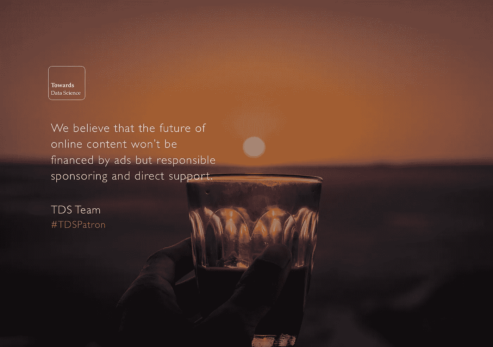

# 致以最热烈的问候和新年最美好的祝愿

> 原文：<https://towardsdatascience.com/warmest-greetings-and-best-wishes-for-the-new-year-c905f4b375a5?source=collection_archive---------5----------------------->

## 我们希望你的假期在新的一年里充满欢乐和笑声。✨🎄

非常感谢您的支持、评论、互动和反馈。我们感谢您的贡献，并将努力为我们的数据科学社区带来更多价值。我们相信**数据相关知识对于让世界变得更美好至关重要**，因此我们认真对待这项任务。

为了结束这一年，请在这里找到我们最大的里程碑的[集合](https://www.instagram.com/explore/tags/towardsdatasciencejournal/)。我们希望你喜欢它😀。

感谢我们所有的第一批支持者。🦋

[2017 年 12 月 23 日。](https://www.instagram.com/p/BdDaTdWjA0t/)

**根据 Smedian 上的**[**@ Lincoln Daniel**](https://twitter.com/LincolnWDaniel)**排名第二增长最快的出版物！超出了我们的预期——感谢我们所有的读者！**

[2017 年 12 月 19 日](https://twitter.com/TDataScience/status/943116459978391553)

我们在 30 天内收到了超过 100 万次的浏览👩‍💻。感谢您阅读和[撰写](/questions-96667b06af5)✨数据科学

[2017 年 11 月 23 日。](https://www.instagram.com/p/Bb19CmtDJn6/)

我们的团队正在成长，我们现在已经为 2018 年做好了准备！我们有 10 个人:4 名编辑和 6 名编辑助理✨

2017 年 11 月 2 日。

**我们一岁了！我们现在已经发展成为一个社区，在脸书、LinkedIn 和 Twitter 上拥有超过 30，000 名粉丝。谢谢你。**

[2017 年 10 月 20 日](https://www.instagram.com/p/BaeZSTUjMMO/)

[**入门指南**](https://medium.com/towards-data-science/beginner/home)[# data science](https://twitter.com/hashtag/Datascience?src=hash)[# machine learning](https://twitter.com/hashtag/Machinelearning?src=hash)with[@ dpatil](https://twitter.com/dpatil)[@ robd Thomas](https://twitter.com/robdthomas)[@ Rama 100](https://twitter.com/rama100)[@ balazskegl](https://twitter.com/balazskegl)[@ bnj _ cooley](https://twitter.com/bnj_cooley)等。

[2017 年 7 月 16 日。](https://twitter.com/TDataScience/status/886589810277851136)

我们的第一次每周精选😀

在这里，我们选择了几个突出的职位，值得一读，如果你错过了他们…我们希望你会发现他们像我们一样翔实和愉快！

2017 年 3 月 11 日。

祝一切顺利，