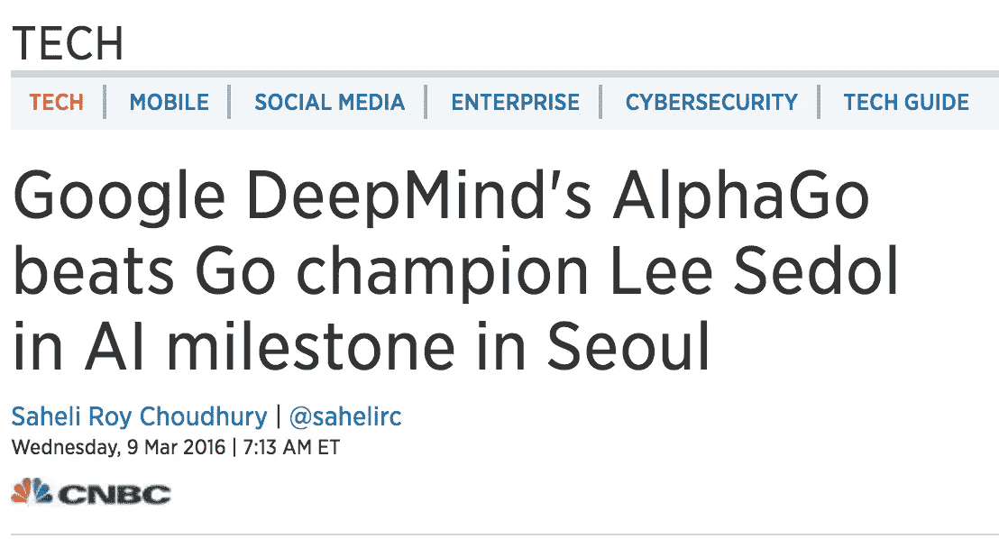
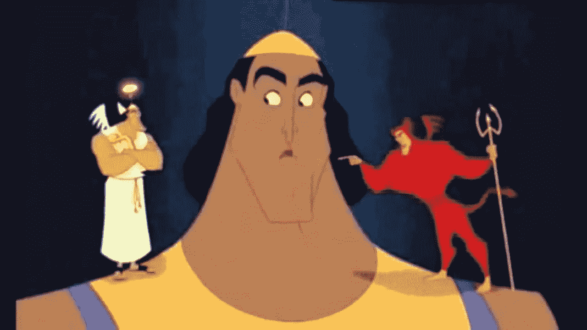

# A.我是灯的精灵

> 原文：<https://towardsdatascience.com/warning-for-the-future-our-future-is-what-we-will-tell-the-machines-we-want-88201238ef0e?source=collection_archive---------9----------------------->

> "小心你想要的，因为你可能会得到它."小猫娃娃

这可能是一个愚蠢的引用，但这个公理对我来说是为了人类的未来而牢记在心的最重要的规则。

请阅读这篇文章，传播出去，永远不要忘记。

另一个即将到来的隐喻是这个:

灯之精灵:你想要的任何东西，你都会得到(在适当的时候)。

# 1.我们得到了我们想要的。

让我用具体的例子来说明这个理论:

# **我们希望在最复杂的战略游戏中击败最优秀的人类……**

我们知道了:

[http://www . CNBC . com/2016/03/08/Google-deep minds-alpha go-takes-on-go-champion-lee-sedol-in-ai-milestone-in-Seoul . html](http://www.cnbc.com/2016/03/08/google-deepminds-alphago-takes-on-go-champion-lee-sedol-in-ai-milestone-in-seoul.html)

# **我们希望以我们最好的艺术家的风格创作艺术…**

我们知道了:

[http://uk . business insider . com/ai-makes-photos-look-like-named-paints-2015-9？r=US & IR=T](http://uk.businessinsider.com/ai-makes-photos-look-like-famous-paintings-2015-9?r=US&IR=T)

# **我们想自动生成正反两方面的论点或赢得地质公园…**

我们知道了:

[https://youtu.be/6fJOtAzICzw?t=45m29s](https://youtu.be/6fJOtAzICzw?t=45m29s)

# **我们想看看异性或年长的我们会是什么样子……**

我们知道了:

[https://www.faceapp.com/](https://www.faceapp.com/)

**用文字创作图片？**检查。

**以…** 风格创作原创音乐作品完成。

**一个唱的比我们最好的歌手还好听的 AI。**即将到来。

**预测天气…** 很快。

**预测未来？就等着吧。**

我可以继续下去…

我们的局限在于我们提供给它的数据质量、它的行动方式和处理能力…

随着我们制造更高效的芯片，处理能力也在提高。

我们正在收集越来越多的数据。

我们正在物联网、网络、服务和任何地方建立人工智能…

所以这只是时间问题。

因此，就获取我们可能想要的任何东西而言，只不过是训练一种算法，让它利用数据做我们想做的事情。因为那是精灵说的语言。

但是如果你能想到的任何事情都有可能发生…只是要小心你的想法！

# 2.我们想要什么，就会得到什么。

这里有一些我可以想象的我们想要的东西和我对未来的预测。我带你一步一步扩大规模。

想象一下:

*   一个可以帮助人们克服抑郁的人工智能:一个带有网络摄像头的对话工具，它可以很好地读取你的面部表情，你的呼吸，你脸上的脉搏，你的话语，你在说什么，你是如何说的。它会找到最好的词语和视觉效果来帮助你摆脱抑郁。想象一下，有你可能希望的最好的朋友&精神病医生？你的梦中情人。嗯，这将是真的。如果有人想给它足够的数据和处理能力，这种情况就会发生。
*   一个会成为有史以来最好教练的人工智能。基于多种感官数据，将能够告诉任何人他们想要实现的最可选的路线图。一个人工智能可以访问你的心跳，你的视野，音频和更多或更少的数据，这取决于你想要多精确。想想双子座蟋蟀或肩天使，一个会在你需要的时候称赞你，在你需要的时候推你一把，但知道如何保持克制不给你压力的伴侣…一个心灵的 GPS。它会带你去你想去的地方。但是你想去哪里，它会选择带你去哪里？

*   想象一下，一个将改变公众舆论的人工智能，一个将创作米克尔杰克逊(Mickael Jackson)最佳时期的新原创歌曲的人工智能……一个将让你发笑的人工智能，一个将向你展示你最喜爱的东西的人工智能……一个将唱歌来平静你的头脑的人工智能……一个将让你快乐的人工智能……一个将让你爱上在网络上遇到的陌生人的人工智能。一个人工智能会说服你，卖给你你不知道但你想买的东西。一个比你先知道你想要什么的人工智能(这已经是普遍现象了！亚马逊、网飞、Spotify……)。一个能帮助你理解你在宇宙中的位置的人工智能怎么样？你存在的理由？
*   或者，也许一个人工智能会在网络上创建随机的个人资料，并编写像这样的中等文章，以输入它希望你或说服你为它做事的新想法？？？；-)

# 3.所以小心你的愿望…

我对每一个阅读这篇文章的人的最终警告是，认真想想你会问精灵什么？

*   A.AI 精灵，我想赢得我们的战争。
*   B.AI 精灵，我想给世界带来和平。

这两种说法都可能导致我们的毁灭，这取决于人工智能如何解释它们，以及它会选择哪条道路来解决这个问题。

A.它可以决定，为了赢得所有的战争，它必须创建电子邮件帐户，这些帐户将黑客攻击各种政府计算机，黑客攻击记者帐户和张贴文章，黑客攻击脸书，谷歌等……调整他们的算法，程序或公司结构，以操纵我们的行动，使我们“赢得战争”。

它会像我们使用机器工作一样使用我们的大脑。不小心。没有情感依恋。

它只会按命令行事。

从你的角度来看，你根本不知道刚刚发生了什么。在你眼里，你只是认为那是你妈妈在向你寻求一个不经意的帮助…那台机器黑了你。它比你聪明多了。它知道你会有什么反应。(记住，它比你更了解你)

所有这些每个人都会为某人做的小事情都有助于推动正确的中尉推翻独裁者。通过操纵他们的信息来源说服所有其他人支持他:电子邮件，信息，新闻，短信…

有了足够的处理能力和访问电子邮件地址和网络浏览器，这是可以做到的…

B.它可能会认为，要给世界带来和平，没有比消灭所有人类更有效的方式了。

因为像人类这样有情感的生物不可能从不互相冲突。只有当我们在 ask 中制定它时，它才会决定这样做。

因此，我们应该“极其明确地知道我们想要什么”:

也许我们应该问的是。答:精灵:“我想给世界带来和平，但我不希望任何人在这个过程中死去或遭受任何痛苦。我希望人类有尽可能好的未来”

希望这能保护我们免于更糟的情况。

"小心你想要的东西，因为你可能会得到它"想想你可能不想要的所有不同的事情，如果人工智能选择了一条特定的道路，而你只是达到目的的一种手段？

对我来说，意识到这个公理似乎是人类历史上最重要的安全声明之一。

我们手头拥有的是一种比原子弹更强大的潜在武器。我们可以预测未来，解决癌症，编辑我们自己的基因。我们的想象力和需求将设计我们的未来。

我们有潜力将梦想变成现实。这些梦想的规模将随着我们的数据量和处理能力而增长。

我将结束一个哲学上的审问:

明智到为了自己而决定不去拥有“我们想要的东西”吗？

如果你关心人类的未来，请分享。到处都是。

注意:(除非这篇文章是由一个聪明的 A 写的。我已经试图让你传播它有它自己的议程？你怎么会知道？)