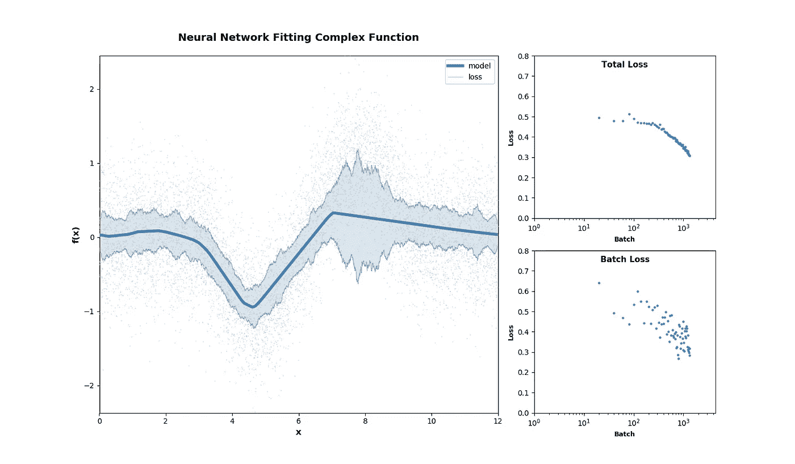
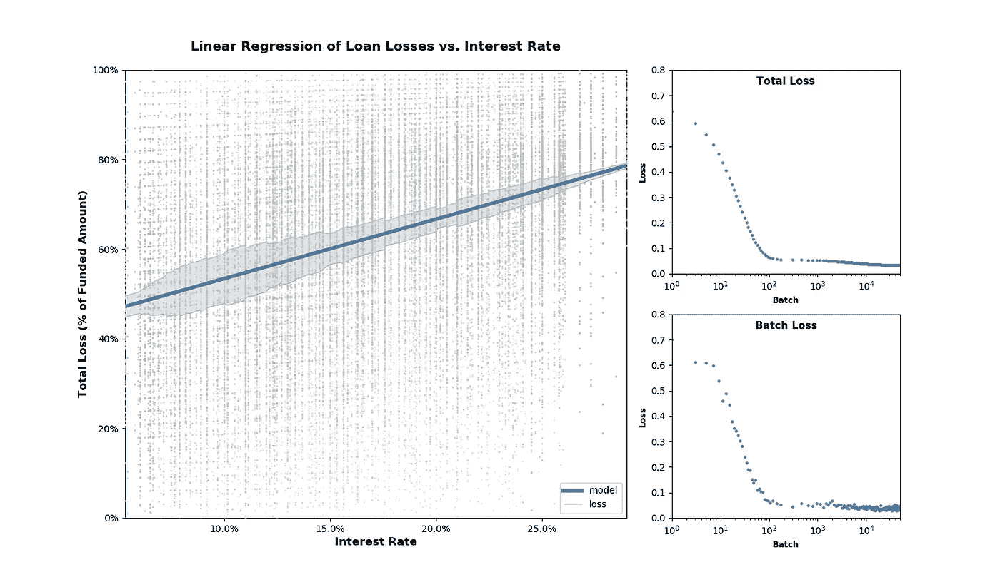

# 观察学习者学习

> 原文：<https://towardsdatascience.com/watching-a-learner-learn-cd49b9d01dd0?source=collection_archive---------15----------------------->

## 使用 Keras 和 Matplotlib



除了理解训练算法，更清楚地了解学习者拟合数据时实际发生了什么也是不错的。

我写了下面展示的工具，以配合一个外行人关于机器学习如何工作的演示。其目的是帮助商业领域的专家寻找机器学习，并就解决他们自己的问题和机会进行头脑风暴。我想演示学习的迭代过程，但也想避免让非程序员看代码。

在这样做的过程中，我发现看着一个模特学习是令人着迷的。人们可以看到模型首先关注什么，它很难找到什么，超参数设置如何影响过程，等等。这也有助于调试。

Jupyter 笔记本和一个模块中的所有代码都是 Python。你可以在 Github 上找到[代码](https://github.com/alipeles/KerasTrainingVisualization)。

Full video of neural network training

# 它是如何工作的

机器学习模型是最终的早期交付/中期交付。一旦用随机数据初始化了一个模型，它就是一个工作的发布候选，尽管不是非常精确的。拟合每一批新数据会产生一系列新候选模型中的下一个，平均而言，如果一切顺利，这些模型的质量会逐步提高。

因此，基本的攻击计划是运行一个比批量大得多的代表性数据样本，通过每个候选模型并绘制当前候选模型认为整个目标函数看起来像什么。重要的是，这些结果仅供展示，对训练没有帮助。

Keras 提供了一种机制，允许程序在不同的点插入自己的代码，包括批处理结束。稍后我将讨论如何注册回调。

在我开始之前有两个警告:

1.  到目前为止，这段代码只适用于具有一个特征和一个标签的 Keras 模型。
2.  这是狗慢，Keras 会抱怨它。把这个用于学习，而不是生产。更多关于性能以及如何使其易于管理的想法，请参见下文。

# 绘制模型

我发现最少的有用数据包括 3 件事，这可以在下图左侧的大图中看到

1.  拟合数据的固定散点图。(灰色圆点填充了大部分情节。)
2.  最新候选模型的输出图。(蓝色实线。)
3.  对损失的想象。(实线周围的蓝色阴影区域。)

顺便说一下，这个线性例子只是为了说明。你永远不会真的用神经网络来找到这种关系。但是，您可以获得一些有用的见解，例如，方差似乎与输入变量相关(异方差)，并且您会注意到优化器在斜率之前关注截距。

线性示例也有助于获得超参数如何影响训练的直观感觉。例如，尝试不同的学习速率、衰减或批量大小。



Full video of linear training

另外两个有趣的数据系列，特别是对于熟悉机器学习的外行人来说，可以在上图右侧的较小图表中看到:

1.  整个数据集(或代表性样本)在训练过程中的损失图。
2.  训练过程中每批的损耗图。

在回调中，计算图表所需的数据非常简单:

```
y_pred = model.predict(X)loss = np.square(y - y_pred)
```

请注意，损失是一个*向量*,表示在代表性样本中的每个数据点，模型有多远。

为了关注模型的哪个部分对损失贡献最大，我添加了一个平滑选项，使用卷积来计算移动平均值。

```
if loss_smoothing > 1:
    loss = np.convolve(loss,
             np.ones((loss_smoothing,))/loss_smoothing, mode='same')
```

绘制图形主要是直接使用 Matplotlib，除了每个组件只创建一次，例如

```
y_pred_line = ax_main.plot(X, y_pred, '-',
                 color='steelblue', lw=4,
                 label='model', zorder=15)[0]
```

然后，在后续调用中，使用第一次调用中返回的对象更新数据。

```
y_pred_line.set_ydata(y_pred)
```

一些小事情需要注意:

1.  使用 *zorder* 来控制复杂图形中图层的顺序(什么在什么上面)。
2.  散点图绘制成本很高，而且不会改变。因此，它在设置期间被绘制一次，并且不再被绘制。
3.  假设损失是均方误差。理想情况下，这将是可选择和可重写的。
4.  任何正则化惩罚都被忽略。显示正则化损失并可视化它何时成为损失的重要部分将是有趣的。

一个更复杂的问题是如何创建动画。Matplotlib 包括一个动画库，但它假设它将控制时钟，告诉程序何时重画。我们需要事件驱动的重绘。

使用 *%matplotlib inline* 时，回调只需要调用 *plt.show()* 将更改刷新到屏幕。包含下面的语句，告诉 iPython 每次都清除输出图。否则，每个 *plt.show()* 调用将在前一个图形的下方创建一个新的图形。

```
clear_output(wait=True)
```

内联工作有一些限制，特别是图形的大小有限。使用 QT5 或另一个独立的显示器，每次更新数据时都必须刷新绘图事件。

```
fig.canvas.draw()
fig.canvas.flush_events()
```

# 注册回拨

Keras 为滚动回调提供了一个 lambda 选项。

## [LambdaCallback](https://keras.io/callbacks/#lambdacallback)

```
keras.callbacks.LambdaCallback(on_epoch_begin=**None**, on_epoch_end=**None**, on_batch_begin=**None**, on_batch_end=**None**, on_train_begin=**None**, on_train_end=**None**)
```

*LambdaCallback()* 实际上只是将回调封装在一些代码中，告诉 Keras 何时调用它。

```
redraw_callback = LambdaCallback(on_batch_end=cb_redraw)
```

包装后的回调被传递到拟合步骤。

```
model.fit(X_train, y_train, epochs=epochs, batch_size=batch_size,
          callbacks=[**redraw_callback**])
```

Keras 向回调传递非常少的信息，例如，不是模型或数据集。因此，为了确保回调得到它需要的东西，闭包是必需的。

```
def get_redraw(X_in, y_in, model, batch_size, epochs, **kwargs): # [argument processing] # [setup steps] # [initialization of any variables retained between calls] def redraw(batch, logs): # [code that will be run after each batch] # return the closure around the actual callback function
    return redraw
```

然后，在将调用传递回 *model.fit()* 的代码中:

```
cb_redraw = get_redraw( *[arguments]* )redraw_callback = LambdaCallback(on_batch_end=cb_redraw)model.fit(X_train, y_train, epochs=epochs, batch_size=batch_size,
          callbacks=[redraw_callback])
```

# 表演

不可回避的事实是，重新运行模型并绘制所有这些图形需要大量时间。根据模型的复杂程度，回调的计算时间可能会使实际训练相形见绌。

没有什么能使它成为一个可用于生产的工具。但是，一些技术有助于将性能提高到对学习有用的水平。

顺便说一下，绘图可能是最慢的部分。此外，Matplotlib 有时会在大型数据集上出错。

回调采用三个参数来管理数据大小:

*   *graph_sparsity* 可以减少重算中使用的数据量。值为 *n* 表示仅使用数据点的 *1/n* 。
*   *scatter_sparsity* 对散点图做同样的事情。散点图不会成为性能瓶颈，因为它只绘制一次，但它会导致溢出。
*   *loss_smoothing* 控制损失线的视觉外观，但也减少了需要绘制的点数。这可能有很大的影响，因为损失是在模型线上下多次绘制的。

另一个重要的性能指标是*频率，*控制模型评估和重绘的频率。我提供了 3 个频率选项:

*   标量值 *n* 表示图表应该每 *n* 批更新一次。因为训练过程往往在开始时很快，后来很慢，所以这只对较小的数据集有效。
*   true/false 值的数组，每批一个，指示是否更新。请注意，这是批处理运行的总数。它不会在每个时期结束时重置为零。
*   决定每批是否更新的频率回调，例如，基于模型是否已经改变到值得重画。

# 获取结果

还有最后一个特性，如果你想存储动画，比如向客户展示。您可以将*显示模式*设置为“文件”或“屏幕”(默认)。在文件模式下，它会将每个图像作为一个单独的文件保存到指定的路径。

走到最后一步，创建一个动画，大概是很少的 Python 代码，但是我还没有做到。同时，你可以用 iMovie 之类的工具把图片串起来。