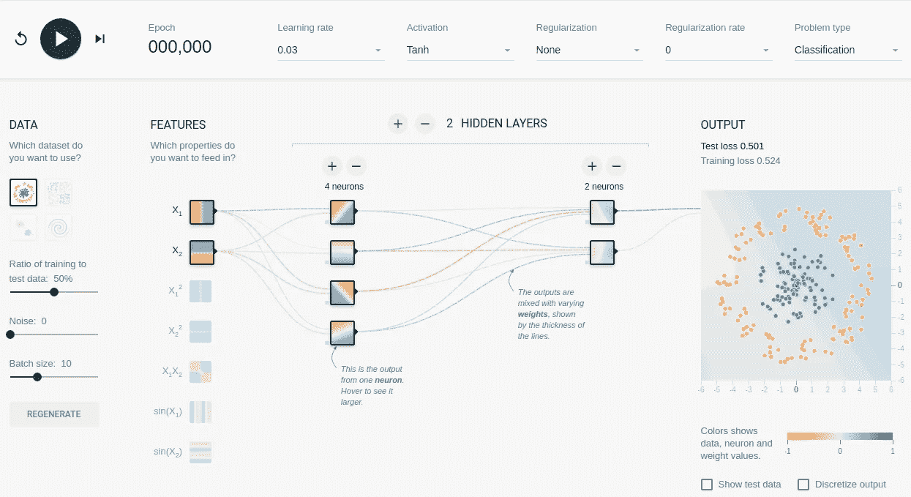
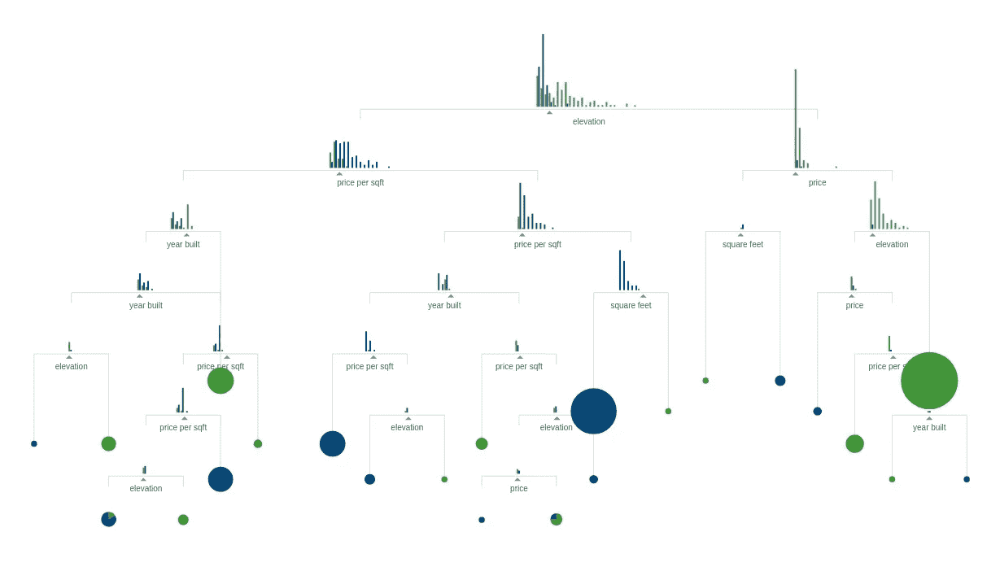
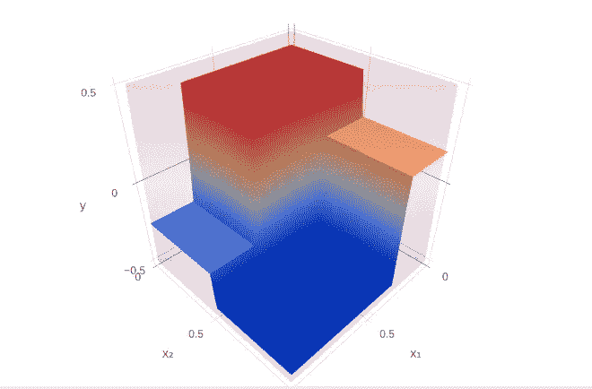
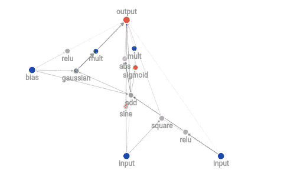
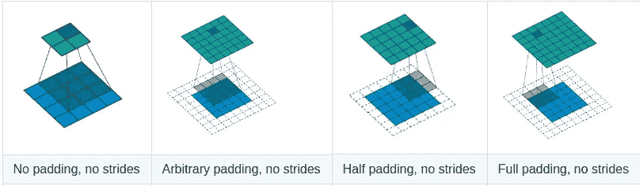

# 观看现代人工智能方法的应用

> 原文：<https://towardsdatascience.com/watching-modern-ai-methods-in-action-929e106d6a7c?source=collection_archive---------6----------------------->

在学习不同的人工智能方法时，我非常有兴趣了解这些方法是如何工作的。不是他们描述内在数学的公式或论文，而是真正的**见**他们。所以，我搜索了一些有趣的例子，并把它们收藏起来，现在我想分享其中最值得注意的例子。

## 张量流游乐场

这是一个具有许多不同参数的交互式神经网络。您可以选择问题类型，尝试不同的架构，并立即看到培训结果。适合初学者的简单神经网络的完美例子。

[链接到 TF 游乐场](https://playground.tensorflow.org/)

## 逐步构建决策树的直观示例

直观和交互式的决策树介绍。只要继续滚动，一切都会显示出来。有英语、法语、俄语和 10 多种语言版本。

[链接开始](http://www.r2d3.us/visual-intro-to-machine-learning-part-1/)

如果你对更高级的决策树例子感兴趣，请查看[这个](http://arogozhnikov.github.io/2016/06/24/gradient_boosting_explained.html)。美丽的可视化决策树集成(包括数学)。你也可以在这里玩梯度提升训练[。](http://arogozhnikov.github.io/2016/07/05/gradient_boosting_playground.html)

## 遗传算法

进化不仅仅是一些生物理论，也是一个伟大的灵感如何与试验。检查进化中的[汽车](http://rednuht.org/genetic_cars_2/)或[僵尸](http://rednuht.org/genetic_walkers/)。

## 进化神经网络

构建神经网络可能非常耗时，但遗传算法可以自动完成这一过程。

本页将向你展示进化中的神经网络。

## 回旋

卷积是许多现代神经网络的非常重要的构件。[在这里](https://github.com/vdumoulin/conv_arithmetic)你可以找到动画，展示这个操作是如何工作的。如果你想看它的运行，请访问 [keras-js](https://transcranial.github.io/keras-js/#/) 。

只要画任何东西，你的浏览器内部的神经网络就会试图识别数字，显示下面所有的中间计算。你也应该看看卷积 VAE 演示，这个网络可以产生许多不同的手写数字只有 2 个输入！用类似的方法，你甚至可以[生成面](https://carpedm20.github.io/faces/)。

## 强化学习

让我们从高度抽象环境中的简单代理开始。[链接](https://cs.stanford.edu/people/karpathy/reinforcejs/puckworld.html)

他的目标——尽可能靠近绿点，避免接触红点。通过调整参数，你可以改变他的行为和学习动力。您还可以在上层菜单中找到更多样品。

又一个有很多 RL 技术和简单可视化的网站:

您可以尝试不同设置，看看这些算法如何解决同一任务。此外，你可能会发现每一项都有详细的数学描述。

这些点和网格非常好，但我们需要一些更真实的东西。边浏览边训练自动驾驶汽车怎么样？你可以先试试简化版的 [DeepTraffic](https://selfdrivingcars.mit.edu/deeptraffic/) 。如果你想要一个真正的挑战，去 [DeepTesla](https://selfdrivingcars.mit.edu/deeptesla/) 。

*警告:这些例子可能需要一些编码技巧来调整*

## 数学

现代人工智能背后有相当多的数学知识，很好地理解这些原理对设计这样的系统非常有用。 [Setosa.io](http://setosa.io/#/) 对一些底层概念有很好的可视化，比如条件概率、回归、PCA 和马尔可夫链。[这里](http://arogozhnikov.github.io/2016/12/19/markov_chain_monte_carlo.html)和[这里](http://chi-feng.github.io/mcmc-demo/)你可以找到马尔可夫链蒙特卡罗方法的交互例子。要获得更多关于机器学习背后的数学的详细信息，请查看[distilt . pub](https://distill.pub/)。

请分享你最喜欢的可视化！