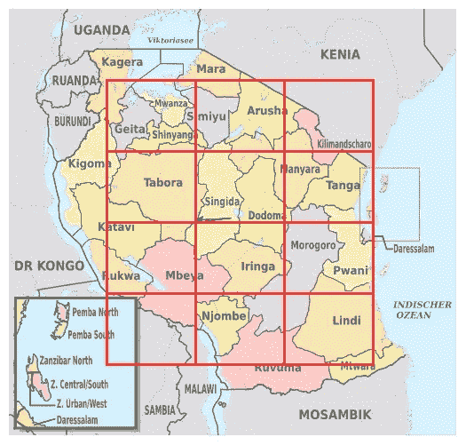

# 水泵维护预测:数据-科学图解

> 原文：<https://towardsdatascience.com/water-pumps-maintenance-prediction-data-science-illustrated-20c7100017c5?source=collection_archive---------1----------------------->

Photo by [Jainath Ponnala](https://unsplash.com/@jainath?utm_source=medium&utm_medium=referral) on [Unsplash](https://unsplash.com?utm_source=medium&utm_medium=referral)

这篇文章有两个目标:

*   专注于可以通过机器学习解决的真实(即物理)世界问题
*   解释机器学习食谱的主要成分

虽然数据分析是一个相当“古老”的话题，但毫无疑问，是最近的数字化浪潮使它成为一个“热门”话题。预测网页点击和在线欺诈的迫切需要尚未对预测模型库产生巨大影响，但它肯定有助于使它们更容易被更多的受众使用。仅 Coursera 上涵盖该主题的 MOOCs 数量就令人印象深刻。反过来，这对非数字化的问题也非常有益:我们在现实世界中面临的问题。

在这篇文章中，我将讨论坦桑尼亚水泵维护的优化。数据集和问题描述可以在 DrivenData.org 的[这一页](https://www.drivendata.org/competitions/7/pump-it-up-data-mining-the-water-table/)上找到。如果你对预测分析的类似“高社会影响力”应用感兴趣，我在这里整理了一份公开挑战列表:

 [## 高影响力数据科学挑战

### 数据科学是一个相对廉价的实验领域，但它不是免费的:你需要获得大量的数据源…

becominghuman.ai](https://becominghuman.ai/high-impact-data-science-challenges-381e812770e4) 

**备注**:这篇文章使用 **Python** 作为代码片段，但是在 **R** 和许多其他编程语言中语法非常相似。

这个数据集的完整 Python 笔记本在这个 [GitHub repo](https://github.com/mzaradzki/hft-statistical-learning/tree/master/pump_it_up) 上。

## 关于非数字变量，先说一句

作为高中生，至少在我这一代，我们可能会在数学/科学课上遇到我们的第一个数据分析问题。因为这些课程着重于数字变量，我们倾向于觉得更符合数字数据建模。然而，许多最具信息性的数据属性是分类的:国家、星期几、职业……此外，总是可以使用“范围”将数字变量转化为离散的类别，而反之则不成立。因此，对于数据科学专业的学生来说，掌握分类变量真的是一件头等大事:它们往往信息量很大，使用起来非常方便。

# 入门指南

## Python 中必需的数据工具包

*   为了执行常见的数据操作，比如过滤和分组，我们使用了 **Pandas** 包。Pandas DataFrame 对象保存数据集。
*   为了构建数据的标准预测模型，我们使用了 **scikit-learn** 软件包。
*   *【可选】*使用 Python 最便捷的方法大概就是使用 [**conda**](https://conda.io/docs/) 包管理器。它允许您用不同的包创建不同的环境，以避免配置冲突。

## 导入数据

将 CSV 数据集加载到 Pandas DataFrame 对象就像这样简单:

请注意，数据集有两个文件，一个用于预测变量(模型中的 X ),另一个用于目标变量(模型中的 Y)。这在数据挑战数据集上很常见，因为模型的目的是预测 Y，所以在现实生活中你不知道 Y。

# 处理缺失值和默认值

丰富的数据集包含许多解释变量。候选解释变量越多，我们就越有可能建立一个好的预测模型。

不幸的是，通常每个变量只为记录的子集正确填充，并且跨所有特征指定的记录集太小。为了处理完整的数据集，我们必须提供适当的“虚构”值，而不是缺失的值。

至少有两种方法可以找到丢失的值。

最简单的情况是数据文件中没有值。这是 Pandas 用“ **dataframe.isnull** ”方法标记的“清除缺失值”场景:

需要仔细目视检查的困难情况，以及缺省值隐藏丢失值的情况，缺省值通常是“0”或“无”。要发现它们，我们需要找到在给定列中出现频率非常高的值。Pandas 通过" **dataframe.value_counts** "方法向我们提供这些信息:

## 处理缺失的分类值和布尔值

缺失分类值是最容易处理的:我们认为它们自己形成了一个“缺失”类别。我们使用" **dataframe.loc[selector，field] = value** "语法重写相关记录，如下所示:

对于布尔字段，我们注意到它们只是二进制类别的一种特殊情况，因此我们将它们转换为字符串编码并用“MISSING”替换空值:

## 处理缺失的数值和日期值

为了填补一个缺失的日期(对于连续的数字也是如此)，我们通常使用平均值或中间值。也有这样的情况(这取决于数据收集的方式),使用一个极值，例如最早的日期可能更合适:例如，我们可以假设没有数据是已知的，因为“那时”的数据收集不正确。

在任何情况下，我们都应该保留现有的信息，即“数据集中缺少的数据”。我们通过在覆盖数据之前添加 0/1 缺失标志列来做到这一点。

## 处理丢失的 GPS 数据

使用“ **dataframe.describe** ”方法，我们识别 GPS 坐标的奇怪极值:

*   最低高度是-90 米，而坦桑尼亚的最低水平是海平面
*   最小经度是 0 度，而坦桑尼亚在 30/40 范围内
*   最大纬度是-2.e-08(实际上是 0°)，而坦桑尼亚在-1/-11°范围内

我们可以用它们的场平均值来代替这些极值，但我们可以更精确。相反，我们选择正确坐标框中的所有坐标，并计算每个“流域”的平均值，流域是一个很大的地理单位，将国家分为 9 个区域。通过这种方式，我们用局部平均值代替所有不正确的值，而不是用普通的替代值。

与日期和数字空值一样，在覆盖不正确的值之前，我们创建二进制标志来跟踪它们在原始数据集中的存在。

**备注**:这样的**条件平均**并不针对地理数据，但这个案例非常适合说明。

# 编码

## 修剪高基数分类变量

为了使分类变量具有可靠的预测能力，需要对其进行大量的观察；否则，我们无法对其影响有信心。当然，许多机器学习算法可以自己丢弃不可靠的预测器，以确保鲁棒性，但如果我们能够在上游处理它，它仍然有所帮助。

在下面的代码片段中，我将所有稀有(*即*在包含> 50，000 条记录的数据集中出现的次数少于 40 次)分类值分组为一个“稀有”值。我们使用“ **dataframe.value_counts** ”方法来实现这一点，我们以前曾使用该方法来查找非常高的频率值。

**备注**:要深入了解稳健估计的主题，您可以阅读关于[套索](https://onlinecourses.science.psu.edu/stat857/node/158)和[脊](https://onlinecourses.science.psu.edu/stat857/node/155)正则化技术的内容。

## 编码分类变量

一旦我们完成了对分类列的清理/整理，我们就可以将它们转换成数字，以便将它们输入到我们选择的预测模型中。

我们如何将美国、西班牙、俄罗斯、澳大利亚等数值转化为数字？我们没有！实际上，我们将分类值转化为向量。这可以通过**显式编码**或**隐式编码**来完成。因为这篇文章的目标是呈现机器学习食谱的一般成分，所以我只呈现一个明确的方法；**一键编码**。

One-hot-encoding 首先将每个值映射到一个索引整数，然后将该整数映射到一个向量，该向量在相应的索引上等于 1，在其他地方等于 0。以美国、西班牙、俄罗斯、澳大利亚为例，我们可以:

*   USA => 0 => (1，0，0，0)
*   西班牙=> 1 => (0，1，0，0)
*   俄罗斯=> 2 =>(0，0，1，0)
*   澳大利亚=> 3 =>(0，0，0，1)

在 Pandas 中，我们使用" **pandas.get_dummies** "函数执行这种转换，如下所示:

**备注**:如果你有大量可能的唯一值，向量空间将会非常大并且非常稀疏，但是我们之前已经注意到修剪稀有值。

**备注**:隐式编码让训练算法确定每个值的最佳向量表示，这通常被称为**嵌入**，这在文本的神经网络建模中非常常见。要了解更多信息，你可以从这篇博客文章开始。

## 编码数字变量

在这一阶段，不是绝对有必要进一步转换数值变量，但它可以帮助模型估计阶段(进一步向下)重新调整它们。事实上，根据经验观察(以及理论上理解),如果所有的预测变量都被缩放到一个共同的值范围，那么对数据的模型校准的优化阶段工作得最好。给定的分类变量被编码为 0/1，我们在几个单位的尺度上缩放一切。常用的缩放方法有:

*   正常:(X[I]-均值(X))/标准偏差(X)
*   min/Max:(X[I]-min(X))/(Max(X)-min(X))
*   分位数:百分位数(X[i]，X)

以下是使用“ **pandas.qcut** ”函数的分位数编码示例:

## 编码日期变量

通过使用" **dataframe.apply** "方法和自定义 Python " **lambda** "函数拆分日期戳，为年、月、星期添加新功能:

## [更高级]编码 GPS 数据

相对于区域划分，GPS 坐标有一个优势:它们考虑了空间顺序，而这在区域名称中是没有的。此外，区域名称并不重要，适当的表示是靠近区域边界的所有区域。然而，区域名有一个优点:稀疏。

充分利用坐标和区域聚类的一种方法是:

*   在地图上覆盖一个网格
*   “衡量”每个记录的每个网格节点的相关性

在下面的例子中，我覆盖了一个 4x5=20 个节点的网格。让我们将节点标记为 N(1)，…，N(20)(顺序无关紧要)。然后，我们向数据集添加 20 个额外的“权重”特征/列，定义如下:

*   权重(GPS[i]，N(1)) =核(距离(GPS[i]，N(1)))
*   …
*   权重(GPS[i]，N(20)) =核(距离(GPS[i]，N(20)))

这里,**核**函数表示高斯函数(具有适当的标准偏差),使得权函数在接近节点时达到最大值。

Image source : https://commons.wikimedia.org/wiki/User:TUBS

**备注**:由于只有网格节点重要，网格甚至不必是方形的，例如可以由区域中心坐标组成，因为它们可能反映关键位置。

# 建模

## 识别高度相关的特征

当数据集中收集了许多信息时，很可能成对的列是高度“相关”的。

在这种情况下，为了避免模型估计过程中的“共线性”问题并减少模型优化问题的维度，我们应该删除一些近似等效的列。

当特征是连续变量时，我们使用简单的相关性度量来识别它们。在分类值的更一般的情况下(记住我们可以将数字转化为分位数)，我们使用 [**克莱姆的 V 统计量**](https://en.wikipedia.org/wiki/Cram%C3%A9r%27s_V) 来测量“相关”程度，一个介于 0 和 1 之间的数字，1 表示完全相关。

在本例中，我们看到 3 个地理要素携带相似的信息，因此我们应该删除其中的 2 个。

## 识别关键预测特征

识别对目标变量有显著预测能力的变量类似于识别“相关”变量。因此，我们可以通过重新使用 [**列联表**](https://en.wikipedia.org/wiki/Contingency_table) 和**克莱姆的 V 统计量:**来执行这项任务

## 逻辑回归:瞧！

经过所有这些细致的数据准备工作，我们终于可以估算出一个预测模型。由于这一切都是由令人敬畏的 scikit-learn 库为我们完成的，因此这可能是最容易的一步！只有一个微妙的问题需要考虑(不是自动化的):将数据集分成两部分。为了避免夸大我们模型的性能，我们应该:

*   在数据集的一部分进行校准
*   在数据集的另一部分上测量其性能

我们通过在拆分桌面之前重新调整数据集行的顺序来实现这一点:

## 进一步建模

虽然逻辑回归是最标准的分类方法，但它很少是表现最好的方法。尽管如此，它仍然提供了一个非常好的基础性能，您可以从中进行迭代。

如果你的数据集预测变量有很多有用的相互作用(参见笔记本)，这些模型很可能会优于逻辑回归精度:**随机森林**(笔记本中有介绍)和 **XGBoost** 。

祝你好运！

## 我们使用的熊猫和 scikit-learn 函数列表

*   熊猫:功能 **read_csv**
*   熊猫:方法**数据帧. isnull**
*   熊猫:方法**数据帧.值计数**
*   熊猫:方法**数据框架. loc**
*   熊猫:功能**获取 _ 假人**
*   熊猫:方法**数据框架.应用**
*   熊猫:功能 **qcut**
*   熊猫:函数**交叉表**
*   熊猫:方法**数据框架.示例**
*   scikit-learn:模型**物流回归**

# 1 最后一句话

如果你喜欢读这篇文章，你可以用下面(在左手边)的绿色心形小按钮来提高它的可见度。

谢谢！