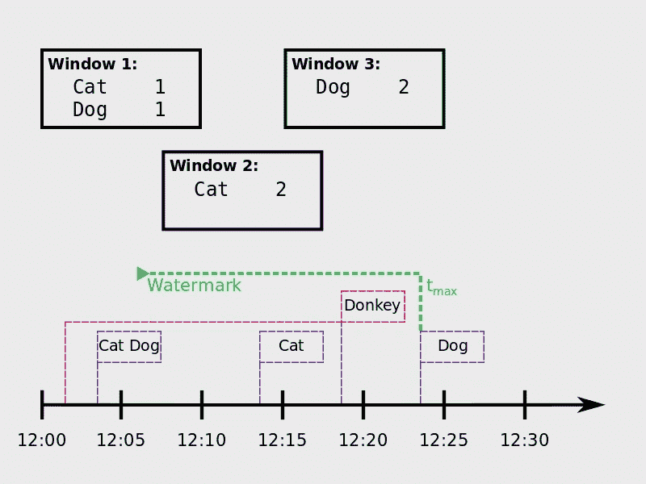
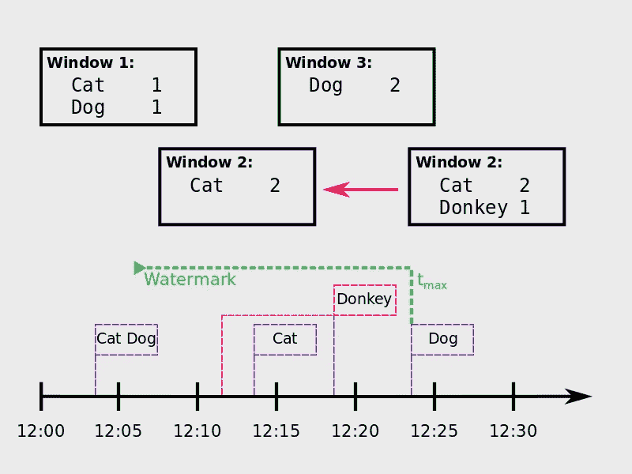

# Spark 结构化流中的水印技术

> 原文：<https://towardsdatascience.com/watermarking-in-spark-structured-streaming-9e164f373e9?source=collection_archive---------4----------------------->

处理迟到事件是*流处理引擎*的一个关键功能。这个问题的一个解决方案是*水印*的概念。并且从 [Spark 2.1](https://spark.apache.org/releases/spark-release-2-1-0.html) 开始支持结构化流 API。

# 什么是水印？

*水印*是帮助*流处理引擎*处理*延迟*的有用方法。基本上，一个**水印**是一个**阈值**，用于指定系统等待**延迟事件**多长时间。如果到达的事件位于水印内，它被用来更新查询。否则，如果它比水印旧，它将被丢弃，并且不会被*流媒体引擎*进一步处理。

Flooding watermarks

# 但是，我为什么要在乎呢？

在分布式和网络化系统中，总有可能发生中断——节点故障、传感器失去连接等等。因此，不能保证数据会按照创建的顺序到达*流处理引擎*。为了*容错*，因此有必要处理此类*无序*数据。

为了解决这个问题，必须保留聚合的状态。如果发生延迟事件，可以重新处理查询。但是这意味着所有聚集的状态必须无限期地保持，这导致内存使用也无限期地增长。这在现实世界中是不实际的，除非系统有无限的资源(例如无限制的预算)。因此*水印*对于**通过设计约束系统**并防止其在运行时爆炸是一个有用的概念。

# 怎么用？

自从 [Spark 2.1](https://spark.apache.org/releases/spark-release-2-1-0.html) ，*水印*被引入结构化流 API。您可以通过简单地将`**withWatermark**`**-操作符**添加到查询中来启用它:

`withWatermark(eventTime: String, delayThreshold: String): Dataset[T]`

它使用**两个参数**，a)一个**事件时间列**(必须与聚合正在处理的相同)和 b)一个**阈值**来指定延迟数据应该被处理多长时间(以事件时间为单位)。然后，Spark 将维持一个集合的状态，直到`max eventTime — delayThreshold > T`，其中`max eventTime`是引擎看到的最新事件时间，`T`是窗口的开始时间。如果延迟数据在此阈值范围内，查询最终会得到更新(下图中的*右侧*图像)。否则，它将被丢弃，不会触发重新处理(下图中的*左图*)。

Late donkey in structured word count: event dropped (left), event within watermark updates Window 2 (right).

值得一提的是，查询的**输出模式**必须设置为`"append"`(默认设置)或`"update”`。`Complete`-根据设计，模式不能与*水印*一起使用，因为它要求保存所有数据，以便将整个结果表输出到接收器。

一个快速演示，如何在一个简单的 *Spark 结构化流*应用程序中使用这个概念，可以在这里找到**——这是一个**字数**(有一些小的 NLP 增强)**还有什么:D****

## **参考**

**[结构化流媒体编程指南](https://spark.apache.org/docs/latest/structured-streaming-programming-guide.html)、 [Spark 结构化流媒体书籍](https://jaceklaskowski.gitbooks.io/spark-structured-streaming/spark-sql-streaming-Dataset-withWatermark.html)作者[亚采克·拉斯科夫斯基](https://medium.com/u/df186e1cd0c2?source=post_page-----9e164f373e9--------------------------------)、 [databricks](https://databricks.com/blog/2017/05/08/event-time-aggregation-watermarking-apache-sparks-structured-streaming.html) 博客、 [post](http://blog.madhukaraphatak.com/introduction-to-spark-structured-streaming-part-12/) 作者[马杜](https://medium.com/u/6e43969d2f6e?source=post_page-----9e164f373e9--------------------------------)、 [post](https://vishnuviswanath.com/spark_structured_streaming.html#watermark) 作者 [vishnu viswanath](https://medium.com/u/81a1d7913fbb?source=post_page-----9e164f373e9--------------------------------) 、waitingforcode 上的 [post](http://www.waitingforcode.com/apache-spark-structured-streaming/apache-spark-structured-streaming-watermarks/read) 、 [Knoldus](https://blog.knoldus.com/exploring-spark-structured-streaming/) 博客、 [SoftwareMill 【T21](https://softwaremill.com/windowing-in-big-data-streams-spark-flink-kafka-akka/)**