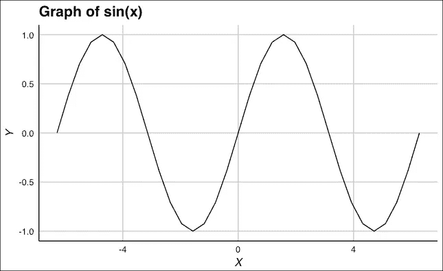
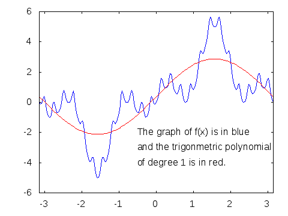
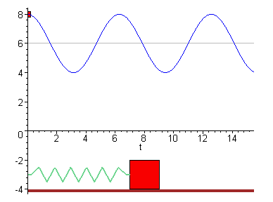
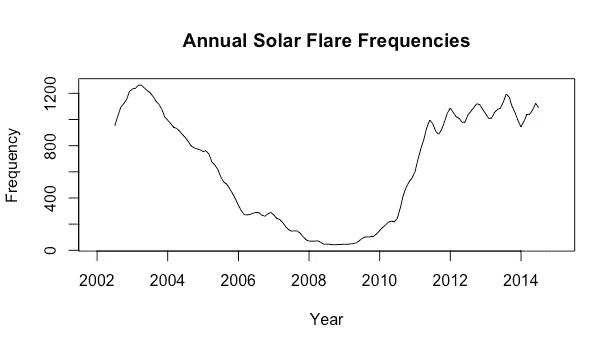
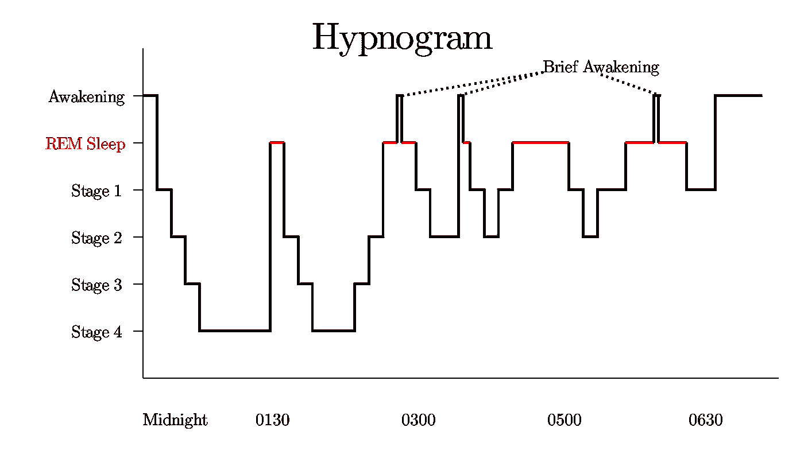
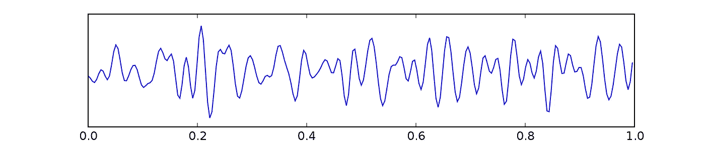
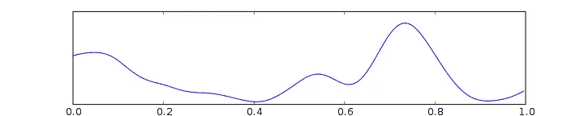
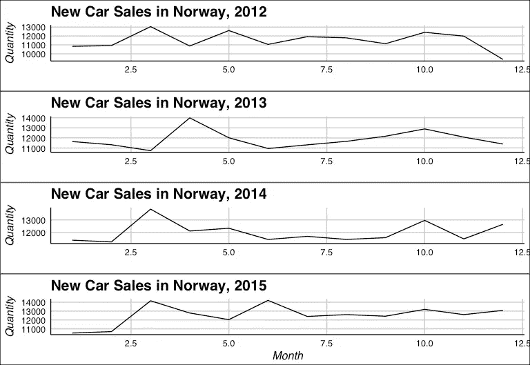
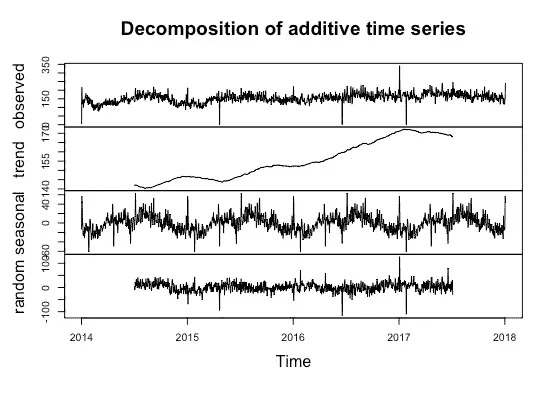
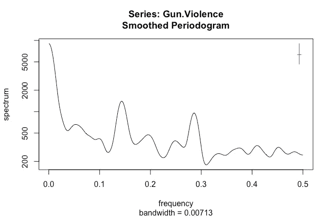

# 婴儿的名字和太阳耀斑有什么共同点

> 原文：<https://towardsdatascience.com/wave-cycles-the-pattern-that-rules-the-universe-270e4af0078b?source=collection_archive---------6----------------------->


The ripple effect in water, Pexels

最近，我遇到了“永恒循环”，这是一个古老的印度/埃及/希腊观点，认为宇宙中的一切都是一个循环，过程无限重复。起初，这对我来说是一个荒谬的想法——我肯定能想到几个非循环的例子。尽管我很想驳回这种说法，但是，我很快就开始看到它背后的价值，我无法停止思考这个想法。很快，我到处寻找，发现了循环过程的证据。

这篇文章是我对无所不在的永恒轮回的思考和发现的延伸。我的工作试图为以下关键问题提供证据:

> **任何看似“随机”的事件可以用循环模式来解释吗？**

如果答案是肯定的，我们人类可能会有一种看待宇宙的新方式。我请求你，读者，在阅读这篇文章的时候，保持开放的心态，试着用一种不同的方式来观察这个世界。

# 波浪周期介绍

本文的前提基于“波浪周期”，这个术语代表一种模式化的行为，从波谷循环到波峰，然后再返回——很像波浪。波浪周期最常见的表示是 *f(x) = sin(x)的图形。*



Graph of the sine function, created by Abhinav Raghunathan

波动周期是大自然的美丽创造，有可能解释我们在宇宙中观察到的许多现象——人造的和自然的。

这篇文章并不完全是数学性的——相反，它是一项旨在尝试和诊断宇宙在多大程度上受这些波支配的调查。周期行为的应用是无止境的，但是这篇文章的目的是告诉你一些最有趣的，甚至是最奇特的波周期占主导地位的例子。

# 波的数学导论

波浪的区别因素之一是它们的波峰和波谷——代表最大值和最小值的高点和低点。古埃及、希腊和印度的数学家认识到了这个概念的力量，并发展了三角函数(正弦、余弦、正切等)。).让·巴普蒂斯特·约瑟夫·傅立叶和丹尼尔·伯努利等有影响力的思想家的发展导致了 1807 年“傅立叶级数”的发现，这是一个革命性的概念，表明任何函数都可以表示为这些“波”函数(特别是正弦)的总和。



Fourier Series approximation [3]

本质上，傅立叶引入了逻辑证明，即自然界或宇宙中发生的任何函数都可以表示为波周期的总和。

# 科学中的循环行为

重复行为与英国物理学家罗伯特·胡克提出的胡克物理学关系最为密切。虎克因发现虎克定律而出名，虎克定律从本质上解释了当弹簧被压缩或拉伸时，膨胀力或收缩力的增加。他的发现彻底改变了经典物理学，但也(令人惊讶地)对科学家模拟量子相互作用的方式产生了深远的影响。他在 17 世纪 60 年代的发现为亨得里克·安顿·洛伦兹等其他科学家发表他的“洛伦兹振荡器模型”铺平了道路这个模型允许物理学家近似电子的运动，就像它被系在弹簧上一样。这种电子的运动反映了简谐振子的运动，它具有轮廓分明的波状模式。



Simple harmonic oscillator [5]

由周期支配的另一个有趣的领域是太阳学，研究太阳及其各种组成部分。感兴趣的具体课题是太阳活动周期。众所周知，这是 11 年一次的重复，这些图案由太阳极小期和太阳极大期组成[8]。像美国宇航局这样的机构利用这种循环模式来预测和识别危险的太阳事件，如日冕物质抛射(CMEs)和太阳耀斑。使用美国宇航局 RHESSI 任务的数据，以下分析表明，2002-2015 年太阳耀斑的总体趋势可以解释为正弦函数的一个周期[6]。



Solar Flares 2002–2015 [14], created by Abhinav Raghunathan

# 神经科学和心理学中的循环行为

从我们早上起床到晚上睡觉，所有的事情都是由某种类型的波动模式控制的。我们的睡眠周期具有很强的周期性，从急剧下降到“阶段 4”睡眠开始，然后是浅睡眠(REM)和部分觉醒。



Hypnogram of a normal sleep cycle [4]

睡眠之外，甚至我们正常的大脑活动也是波浪式的。当处于警戒状态时，我们的β波看起来像这样:



Beta brain waves [1]

放松或睡觉时，我们的 delta 波看起来像这样:



Delta brain waves [2]

我们的幸福也像波浪一样起伏。心理学和神经科学规定了多巴胺、血清素和内啡肽等神经递质的一部分“兴奋感”，这些神经递质都以类似的重复模式激活神经受体。考虑波动周期的净效应当然很有趣——它们不仅让我们感受情感，还让我们活着。

本节最后一个(可能也是最有趣的)波动周期应用是汽车销售。在美国，众所周知，汽车销售是季节性的——夏季较高，冬季较低。对此的解释是，汽车制造商在夏季左右发布下一代车型，因此经销商经常被迫清理现有库存。还有一种理论认为，在春天，温暖的天气会鼓励消费者购买汽车。事实上，芝加哥大学行为科学系的 Devin G. Pope 进行的一项研究发现，“气温上升 20 度会导致某些汽车的销量显著增加”[7]。虽然这的确很有趣，但这种周期性行为甚至在气候更稳定的地方也存在吗？

下一个合乎逻辑的步骤是在另一个国家测试汽车销售。挪威的季节模式与美国相似，但其温度范围从冬季的约 27 华氏度到夏季的约 64 华氏度。Veitrafikken AS 的[opplysningsrdet(一个报告挪威汽车销售统计数据和数字的政治独立组织)的数据用于执行以下分析【13】。](http://www.ofvas.no/bilsalget/category404.html)



New car sales in Norway 2012–2015 [13], created by Abhinav Raghunathan

似乎汽车销售在一段时间内的分布有两个高峰——一个在早春，另一个在初夏。数据显示，挪威的汽车销售趋势与美国相似，7 月气温最高，1 月最低。即使在这里，波动周期也与季节性一致——这是一个重复的周期，年与年之间没有太大的差异。

# 其他波浪周期现象

这一节将讲述看似不相关的领域，在这些领域中波动周期以某种方式占主导地位。大多数人只有关于为什么这些现象是波动周期的理论，但它们绝不是随机的产物。

特殊波动周期模式的第一个例子是枪支暴力。Pierre Alexis Geoffroy 博士和 Ali Amad 博士在《美国公共卫生杂志》发表的一篇关于“大规模枪击事件的季节性影响”的论文中，研究了美国大规模枪击事件可能存在的季节性[13]。通过使用一种叫做 [*余弦模型*](https://rdrr.io/cran/season/man/cosinor.html)*的先进统计方法，研究人员在 2013 年、2014 年和 2015 年发现了强烈的季节相关性。*

*下一步是将这一发现扩展到所有形式的枪支暴力。[枪支暴力档案馆(GVA)](http://www.gunviolencearchive.org/) ，一家旨在传播美国枪支暴力相关准确信息的非营利公司，为接下来的探索提供了必要的关键数据[12]。*

**

*Gun violence time series decomposition 2014–2018 [12], created by Abhinav Raghunathan*

*通过时间序列分解，观察到的图被分解成趋势线、季节性成分和随机噪声。这种分解的前提是:*

*`Observed Data = Trend Line + Seasonality + Random Noise`*

*利用这一点，时间序列的季节性成分似乎代表了数据的一个非常重要的部分，表明枪支暴力与季节性密切相关。为了加强这一观点，相同数据的周期图如下所示。*

**

*Periodogram for gun violence in the US [12], created by Abhinav Raghunathan*

*周期图有几个峰值，其中最有意义的位于大约 0.12813 的频率处，这与大约 7.8 个月的波浪周期相关。这表明枪支暴力的模式大约每八个月重复一次。这是一个相当奇特的结果，但仍然是一个有趣的结果——关于为什么这个波动周期以它似乎逃避这个简短研究的方式重复的明确解释。*

*本文的最后一个例子涵盖了历史上婴儿名字中波周期的存在。一些有趣的文章，如《时代》杂志的“婴儿名字预测者”和对“英国婴儿中心”编辑的采访，发现美国婴儿的名字在某种程度上是周期性的[9][10]。虽然没有对这一现象给出解释，但 Data.gov 发布并托管在 Kaggle 上的美国社会保障应用程序的数据被用来更深入地研究这一波周期[11]。*

**

*Baby names over time [9], created by Abhinav Raghunathan*

*从数据看，这三个名字确实显示出周期性的迹象(尽管如果它们是波周期，它们的周期跨度约为 80 或 90 年)，但并非所有名字都是如此。当然，如果这些名字真的需要 80 年才能重新出现，只有时间才能证明新的婴儿名字是否真的是波动周期(至少在美国是如此)。*

# *结论*

*很明显，周期性行为支配着自然和生活的许多方面。波动周期可能决定一切，从行星运动和太阳活动到我们的睡眠周期，但我们仍然不知道它们的力量。尽管科学和技术尽了最大的努力，模式化行为优越性的真实程度也许永远不会完全为人所知，因为它的影响遍及微观、中观和宏观。周期性是一个如此强大的概念，以至于许多来自印度、埃及和希腊的古老宗教都相信死后轮回的概念。随着技术的进步，越来越多的波动周期和模式化行为的联系变得显而易见(如最近科学新闻中的引力波)——也许有一天我们将能够认识到并充分利用宇宙节律性的力量。*

*我邀请你，读者，从这篇文章中汲取灵感，用真实世界的数据为自己进行调查。模式统治着我们的世界——要识别它们，关键是你要睁大你的眼睛，打开你的思维！*

*如果你喜欢这篇文章，请鼓掌并跟随 [Delta 理论](https://medium.com/delta-theory)来到 Medium！*

# *编后记*

*我在本文中创建的图表和执行的数据科学是用 [R](https://www.r-project.org/) 制作的，这是一种因其功能和速度而备受青睐的统计编程语言。我要感谢 R 及其相关库背后的开发人员，没有他们，我的这个小项目就不可能实现。*

*图书馆:*

*   *ggplot2，ggthemes*
*   *预测，tseries，TSA*
*   *dplyr，plyr*
*   *润滑剂*

*我用 R 写的数据分析可以在[这里](https://github.com/ar59854/Wave_Cycles)找到——如果你想和我讨论这篇文章中的任何信息，你可以在 [LinkedIn](https://linkedin.com/in/abhinavraghunathan) 上联系我。*

# *引用和免责声明*

*所有图片均根据[知识共享署名-相同分享 3.0 未授权](https://creativecommons.org/licenses/by-sa/3.0/deed.en)获得许可。*

```
****Images*:*** *[1] Eeg beta* [Image]. (2005, December 22). Retrieved from [https://commons.wikimedia.org/wiki/File:Eeg_beta.svg](https://commons.wikimedia.org/wiki/File:Eeg_beta.svg)*[2] Eeg delta* [Image]. (2005, December 22). Retrieved from [https://commons.wikimedia.org/wiki/File:Eeg_delta.svg](https://commons.wikimedia.org/wiki/File:Eeg_delta.svg)*[3] Fourier series for trig poly high degree* [Image]. (2010, November 15). Retrieved from [https://commons.wikimedia.org/wiki/File:Fourier_series_for_trig_poly_high_degree.gif](https://commons.wikimedia.org/wiki/File:Fourier_series_for_trig_poly_high_degree.gif)*[4] Sleep Hypnogram* [Image]. (2011, December 20). Retrieved from [https://commons.wikimedia.org/wiki/File:Sleep_Hypnogram.svg](https://commons.wikimedia.org/wiki/File:Sleep_Hypnogram.svg)[5] *The Simple Harmonic Oscillator* [Image]. (n.d.). Retrieved July 21, 2018, from The University of Texas at Austin Department of Physics website: [https://web2.ph.utexas.edu%2F~coker2%2Findex.files%2Fsho3.html](https://web2.ph.utexas.edu%2F~coker2%2Findex.files%2Fsho3.html)**Web Pages:**
[6] HESSI Scientific Objectives. (n.d.). Retrieved July 21, 2018, from NASA website: [https://hesperia.gsfc.nasa.gov/hessi/objectives.htm](https://hesperia.gsfc.nasa.gov/hessi/objectives.htm)[7] The Seduction of a Sunny Day: How Weather Biases Car Buying Behavior. (2015, May 14). Retrieved July 22, 2018, from Association for Psychological Science website: [https://www.psychologicalscience.org/news/motr/the-seduction-of-a-sunny-day-how-weather-biases-car-buying-behavior.html](https://www.psychologicalscience.org/news/motr/the-seduction-of-a-sunny-day-how-weather-biases-car-buying-behavior.html)[8] [Solar cycles]. (n.d.). Retrieved July 21, 2018, from NASA StarChild website: [https://starchild.gsfc.nasa.gov/docs/StarChild/questions/question17.html](https://starchild.gsfc.nasa.gov/docs/StarChild/questions/question17.html)[9] Williams, L. (2015, February 2). What's in a Baby's Name? The Cyclical Trends and Spread of Unusual Names. Retrieved July 22, 2018, from Independent website: [https://www.independent.co.uk/life-style/health-and-families/features/baby-names-the-most-popular-cyclical-trends-and-spread-of-unusual-names-10018000.html](https://www.independent.co.uk/life-style/health-and-families/features/baby-names-the-most-popular-cyclical-trends-and-spread-of-unusual-names-10018000.html)[10] Wilson, C. (2014, May 11). How Popular Will Your Name Be in 25 Years? Retrieved July 22, 2018, from TIME website: [http://time.com/93911/baby-name-predictor/](http://time.com/93911/baby-name-predictor/)**Reviewed and Published Datasets:** [11] Kaggle. (2017). *US Baby Names* [data file]. Retrieved from [https://www.kaggle.com/kaggle/us-baby-names/home](https://www.kaggle.com/kaggle/us-baby-names/home)[12] Ko, James. (2018). *Gun Violence Data* [data file]. Retrieved from [https://www.kaggle.com/jameslko/gun-violence-data/home](https://www.kaggle.com/jameslko/gun-violence-data/home)[13] Opplysningsrådet for Veitrafikken AS, “dmi3kno”. (2018). New Car Sales in Norway [data file]. Retrieved from [https://www.kaggle.com/dmi3kno/newcarsalesnorway](https://www.kaggle.com/dmi3kno/newcarsalesnorway)[14] Samaha, Kheiralla. (2017). *Solar Flares from RHESSI Mission* [data file]. Retrieved from [https://www.kaggle.com/khsamaha/solar-flares-rhessi/home](https://www.kaggle.com/khsamaha/solar-flares-rhessi/home)**Scientific Papers:** [15] Geoffroy, P. A., & Amad, A. (2016). Seasonal Influence on Mass Shootings. *American Journal of Public Health*, *106*(5), e15\. [http://doi.org/10.2105/AJPH.2016.303065](http://doi.org/10.2105/AJPH.2016.303065)*
```

*使用外部来源的所有数据和图像从未打算用于商业目的，也没有以任何方式修改。*