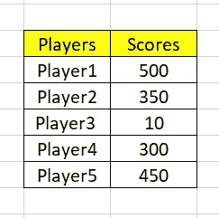
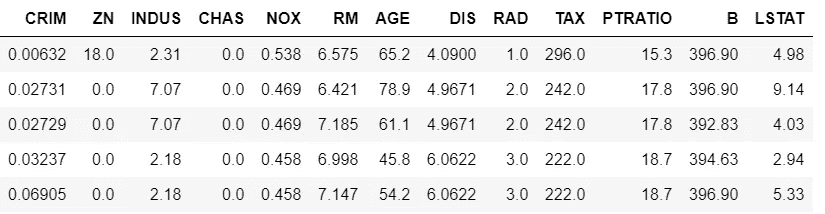
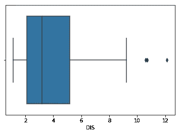
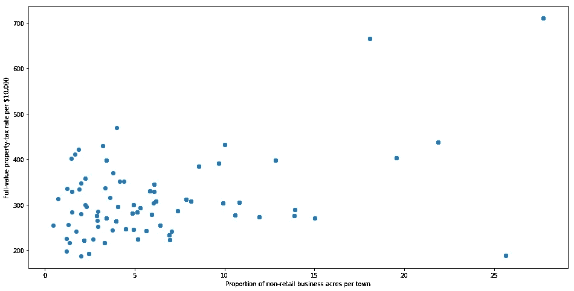
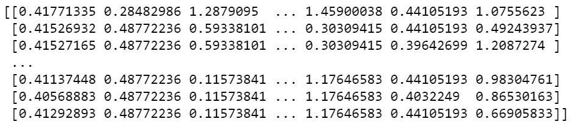
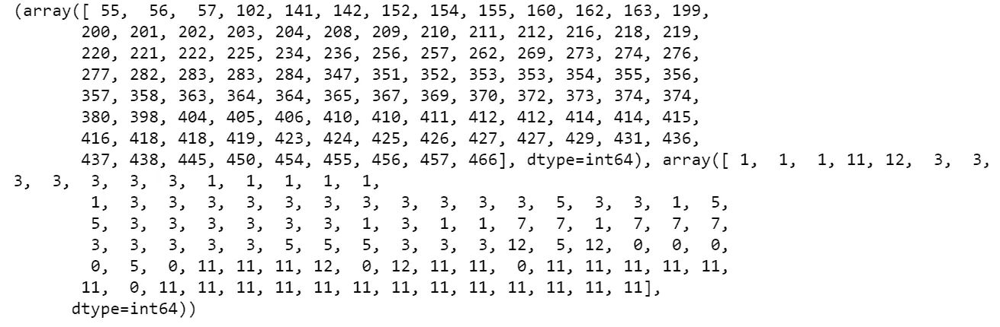
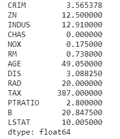
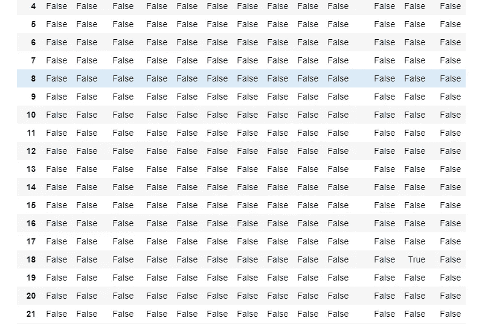
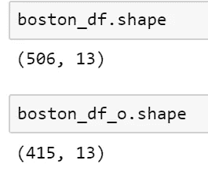

# 检测和移除异常值的方法

> 原文：<https://towardsdatascience.com/ways-to-detect-and-remove-the-outliers-404d16608dba?source=collection_archive---------0----------------------->


Unsplash — A small lone mushroom on moss

在从事数据科学项目时，你在寻找什么？EDA 阶段最重要的部分是什么？有些事情如果不在 EDA 阶段完成，会影响进一步的统计/机器学习建模。其中之一就是寻找“离群值”。在这篇文章中，我们将试着理解什么是离群值？为什么识别异常值很重要？有哪些剔除异常值的方法？不要担心，我们不会只讨论理论部分，我们还会对数据进行编码和绘图。

# 遇见异数

维基百科的定义，

> 在统计学中，**异常值**是指远离其他观察值的观察点。

上述定义表明，离群值是与人群分离/不同的东西。很多激励视频建议与众不同，尤其是马尔科姆·格拉德威尔。从统计学的角度来看，这是否也是一件好事？我们将通过这篇文章找到答案。

# 数据收集和异常值

我们现在知道什么是异常值，但是，您是否也想知道异常值是如何引入到人群中的？

数据科学项目从收集数据开始，这也是离群值首次引入人群的时候。但是，在收集阶段，您根本不知道异常值。异常值可能是数据收集过程中出现错误的结果，也可能只是数据中出现偏差的迹象。

让我们来看一些例子。假设你被要求观察印度板球队的表现，即每个球员的跑动并收集数据。



Collected data

从上面收集的数据可以看出，除了 10 分的 Player3，其他玩家都是 300+。这个数字可能只是一个键入的**错误**，或者它显示了你的数据中的**差异**，表明 Player3 表现非常差，因此需要改进。

现在我们知道异常值可能是一个错误或者仅仅是一个方差，你将如何决定它们是否重要。如果它们是错误的结果，那就很简单了，我们可以忽略它们，但是如果它只是数据中的一个差异，我们就需要想得更远一些。在我们试图理解是否忽略离群值之前，我们需要知道识别它们的方法。

# 寻找异常值

你们大多数人可能会想，哦！我只需要一个峰值数据就可以找到异常值，就像我们在前面提到的 cricket 例子中所做的那样。让我们考虑一个有 500+列和 10k+行的文件，你还认为可以手工找到离群值吗？为了便于发现异常值，我们有大量的统计方法，但我们将只讨论其中的几个。大多数情况下，我们会试图看到可视化方法(最简单的方法)而不是数学方法。

那么，让我们开始吧。我们将使用包含在 sklearn 数据集 API 中的波士顿房价数据集。我们将加载数据集，并分离出特征和目标。

```
boston = load_boston()
x = boston.data
y = boston.target
columns = boston.feature_names#create the dataframe
boston_df = pd.DataFrame(boston.data)
boston_df.columns = columns
boston_df.head()
```



Boston Housing Data

特征/独立变量将用于寻找任何异常值。看上面的数据，似乎我们只有数值，也就是说，我们不需要做任何数据格式化。(叹气！)

我们将遵循两种类型的分析来发现异常值-单变量(单变量异常值分析)和多变量(两个或多个变量异常值分析)。不要搞混了，当你开始编码和绘制数据时，你会发现发现异常值是多么容易。为了简单起见，我们将从检测异常值的基本方法开始，然后慢慢转向高级方法。

## **使用可视化工具发现异常值**

**盒子剧情-**

维基百科的定义，

> 在描述统计学中，**箱线图**是一种通过四分位数图形化描述数字数据组的方法。盒状图也可以有从盒状图垂直延伸的**线(*须状图* ) **表示上下四分位数之外的** **可变性**，因此有盒须图和盒须图之称。**异常值**可能被**标绘**为**单个**点。**

上述定义表明，如果有一个异常值，它将被绘制为箱线图中的点，但其他群体将被分组在一起，并显示为方框。让我们自己试试看。

```
import seaborn as sns
sns.boxplot(x=boston_df['DIS'])
```



Boxplot — Distance to Employment Center

上图显示了 10 到 12 之间的三个点，这些是异常值，因为没有包括在其他观察值的框中，即没有靠近四分位数的地方。

这里我们分析了单变量异常值，即我们仅使用 DIS 列来检查异常值。但是我们也可以做多元异常分析。我们能用箱线图做多元分析吗？视情况而定，如果您有一个分类值，那么您可以将它用于任何连续变量，并进行多元异常值分析。由于我们在波士顿住房数据集中没有分类值，我们可能需要忘记使用箱线图进行多元异常值分析。

**散点图-**

维基百科定义

> **散点图**，是一种使用笛卡尔坐标显示一组数据的典型两个变量的值的图表或数学图。数据显示为点的**集合，每个点具有确定水平**轴上**位置的**变量**的值和确定垂直**轴上**位置的**其他**变量**的值。****

顾名思义，散点图是显示两个变量的值的点的集合。我们可以试着从我们的住房数据中画出两个变量的散点图。

```
fig, ax = plt.subplots(figsize=(16,8))
ax.scatter(boston_df['INDUS'], boston_df['TAX'])
ax.set_xlabel('Proportion of non-retail business acres per town')
ax.set_ylabel('Full-value property-tax rate per $10,000')
plt.show()
```



Scatter plot — Proportion of non-retail business acres per town v/s Full value property tax

看上面的图，我们可以发现大部分数据点位于左下角，但也有一些点远离人群，如右上角。

## 用数学函数发现异常值

**Z 值-**

维基百科定义

> **Z 值**是一个观察值或数据点高于所观察或测量的平均值的标准偏差的有符号数。

Z-score 背后的直觉是通过找到它们与数据点组的标准差和均值的关系来描述任何数据点。Z-score 是寻找平均值为 0 且标准差为 1 的数据分布，即正态分布。

您一定想知道，这对识别异常值有什么帮助？嗯，在计算 Z 分数时，我们重新调整数据的比例并将其居中，寻找离零太远的数据点。这些离零太远的数据点将被视为异常值。在大多数情况下，使用阈值 3 或-3，即如果 Z 分值分别大于或小于 3 或-3，则该数据点将被识别为异常值。

我们将使用 scipy 库中定义的 Z 分数函数来检测异常值。

```
from scipy import stats
import numpy as npz = np.abs(stats.zscore(boston_df))
print(z)
```



Z-score of Boston Housing Data

看看上面的代码和输出，很难说哪个数据点是异常值。让我们尝试定义一个阈值来识别异常值。

```
threshold = 3
print(np.where(z > 3))
```

这将产生如下结果-



Data points where Z-scores is greater than 3

不要被结果迷惑。第一个数组包含行号列表，第二个数组包含相应的列号，这意味着 z[55][1]的 Z 得分高于 3。

```
print(z[55][1])3.375038763517309
```

因此，ZN 列上的数据点—第 55 条记录是异常值。

**IQR 得分-**

箱线图使用 IQR 方法来显示数据和异常值(数据的形状),但为了获得已识别异常值的列表，我们需要使用数学公式并检索异常值数据。

维基百科定义

> **四分位数间距** ( **IQR** )，也称为**中间分布**或**中间 50%** ，或技术上的 **H 分布**，是统计离差的度量，等于第 75 个和第 25 个百分位数之间的差值，或上下四分位数之间的差值，IQR =*Q*3—*Q*1。
> 
> 换句话说，IQR 是第三个四分位数减去第一个四分位数；这些四分位数可以在数据的箱线图上清楚地看到。
> 
> 它是离差的一种度量，类似于标准差或方差，但对异常值更稳健。

在寻找数据的分布，然后保留一些阈值来识别异常值方面，IQR 有点类似于 Z-score。

让我们看看我们可以使用 IQR 来绘制箱线图，以及如何使用它来查找异常值列表，就像我们使用 Z 得分计算一样。首先我们将计算 IQR，

```
Q1 = boston_df_o1.quantile(0.25)
Q3 = boston_df_o1.quantile(0.75)
IQR = Q3 - Q1
print(IQR)
```

这里我们将得到每列的 IQR。



IQR for each column

现在我们有了 IQR 分数，是时候抓住异常值了。下面的代码将给出一个包含真值和假值的输出。False 表示这些值有效的数据点，而 True 表示存在异常值。

```
print(boston_df_o1 < (Q1 - 1.5 * IQR)) |(boston_df_o1 > (Q3 + 1.5 * IQR))
```



Detecting outlier with IQR

既然我们知道了如何检测异常值，那么了解它们是否需要被删除或纠正就很重要了。在下一节中，我们将考虑一些去除异常值的方法，如果需要，还可以输入新值。

# 使用异常值:更正，删除

在数据分析过程中，当您发现异常值时，最困难的决策之一可能是如何处理异常值。他们应该删除它们还是纠正它们？在讨论这个问题之前，我们先来看看去除异常值的几种方法。

**Z 分数**

在上一节中，我们看到了如何使用 Z 分数来检测异常值，但现在我们想要移除或过滤异常值并获得干净的数据。这可以用一行代码来完成，因为我们已经计算了 Z 值。

```
boston_df_o = boston_df_o[(z < 3).all(axis=1)]
```



With and without outlier size of the dataset

因此，上述代码从数据集中删除了大约 90+行，即离群值已被删除。

**IQR 得分-**

就像 Z-score 一样，我们可以使用之前计算的 IQR 分数，通过只保留有效值来过滤出异常值。

```
boston_df_out = boston_df_o1[~((boston_df_o1 < (Q1 - 1.5 * IQR)) |(boston_df_o1 > (Q3 + 1.5 * IQR))).any(axis=1)]boston_df_out.shape
```

上述代码将从数据集中删除离群值。

有多种方法可以检测和移除异常值[但是我们在本练习中使用的方法被广泛使用并且易于理解。](http://haridas.in/outlier-removal-clustering.html)

是否应该移除异常值。每个数据分析师/数据科学家可能在他们处理的每个问题中都有一次这样的想法。我发现了一些很好的解释-

> [https://www . research gate . net/post/When _ is _ it _ justificial _ to _ exclude _ outlier _ data _ points _ from _ statistical _ analyses](https://www.researchgate.net/post/When_is_it_justifiable_to_exclude_outlier_data_points_from_statistical_analyses)
> 
> [https://www . research gate . net/post/Which _ is _ the _ best _ method _ for _ removal _ outliers _ in _ a _ data _ set](https://www.researchgate.net/post/Which_is_the_best_method_for_removing_outliers_in_a_data_set)
> 
> [https://www . the analysis factor . com/outliers-to-drop-or-not-to-drop/](https://www.theanalysisfactor.com/outliers-to-drop-or-not-to-drop/)

总结他们的解释-坏数据，错误的计算，这些可以被确定为异常值，应该被删除，但同时你可能也想纠正它们，因为它们改变了数据的级别，即意味着当你建模你的数据时会导致问题。前 5 名员工的工资分别是 10K、20K、30K、40K 和 50K，突然其中一人开始拿到 100K 的工资。考虑这种情况，因为你是雇主，新的工资更新可能会被视为有偏见的，你可能需要增加其他员工的工资，以保持平衡。因此，您可能有多种原因想要了解并纠正异常值。

# 摘要

在整个练习中，我们看到了在数据分析阶段如何遇到一些不寻常的数据，即异常值。我们了解了可以用来检测和消除这些异常值的技术。但是有一个问题是关于保证是否可以移除异常值。为了回答这些问题，我们找到了进一步的阅读材料(这些链接在前一节中提到过)。希望这篇文章能帮助读者了解异常值。

**注意-** 在本练习中，使用了以下工具和库。

**框架-** Jupyter 笔记本，**语言-** Python，**库** - sklearn 库，Numpy，Panda 和 Scipy， **Plot Lib-** Seaborn 和 Matplot。

# 参考文献

1.  [波士顿数据集](http://scikit-learn.org/stable/modules/generated/sklearn.datasets.load_boston.html)
2.  [Github 回购](https://github.com/SharmaNatasha/Machine-Learning-using-Python/blob/master/Simple%20projects/Detecting_Removing_Outliers.ipynb)
3.  [KDNuggets 离群值](https://www.kdnuggets.com/2017/02/removing-outliers-standard-deviation-python.html)
4.  [检测异常值](http://colingorrie.github.io/outlier-detection.html)