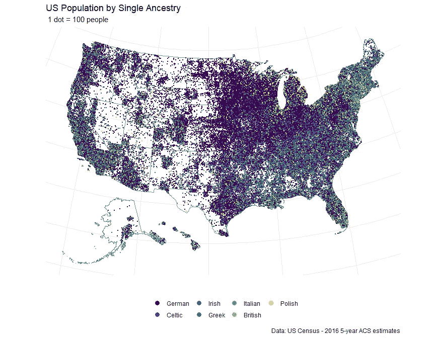
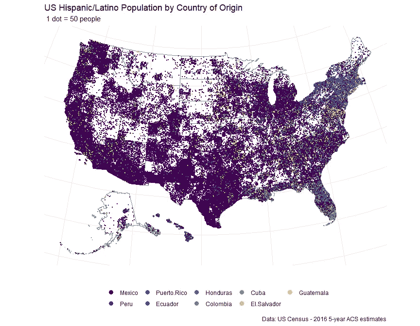

# 我们是美国

> 原文：<https://towardsdatascience.com/we-are-america-ebc58a0d1d61?source=collection_archive---------13----------------------->

谁组成了我们这个国家？

“American flag” by [Thomas Ashlock](https://unsplash.com/@thomas_ashlock?utm_source=medium&utm_medium=referral) on [Unsplash](https://unsplash.com?utm_source=medium&utm_medium=referral)

我偶然看到这篇关于如何在 R 中创建[点密度图的教程帖子，它非常详细，所以我决定用美国人口普查数据试一试。每年都要收集全国的人口构成数据。在这里，我使用在县一级收集的特定种族和民族的人口普查估计数。所有提取和绘制数据的代码都贴在](https://www.cultureofinsight.com/blog/2018/05/02/2018-04-08-multivariate-dot-density-maps-in-r-with-sf-ggplot2/)[这里](https://github.com/iecastro/census-origins)。

本教程提供了一些将县估计值转换为点数据的函数。在收集数据并转换成点之后，使用 ggplot2 对其进行映射就非常简单了。

## 按种族和民族划分的美国人口地理分布

我错误判断了最终会得到的数据点的数量，所以地图有点拥挤。然后，我认为这作为一个互动的情节会更好，并决定我将创建一个闪亮的应用程序——尽管这被证明是一个令人沮丧的过程。所以，我选择了画面…是的，我知道你在想什么:

在我的辩护中，我以前从未建立过一个闪亮的应用程序，我会用一个更简单的项目再试一次。Tableau 相对简单，但需要一些数据准备。在连接到仪表板之前，我必须将点数据提取到 shapefile 中，然后在 QGIS 中编辑该文件(必须删除夏威夷和阿拉斯加)。

当我写这篇文章的时候，我知道你不能在媒体中嵌入画面。这里可以找到互动剧情[。](https://public.tableau.com/profile/ivan.castro2220#!/vizhome/Censusorigins/Story1)

更好的是，我留给你这个…