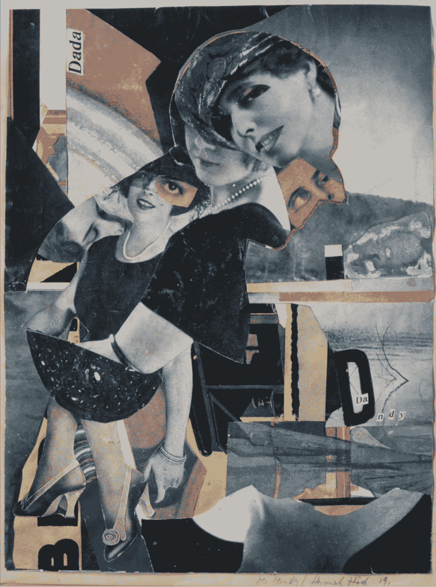
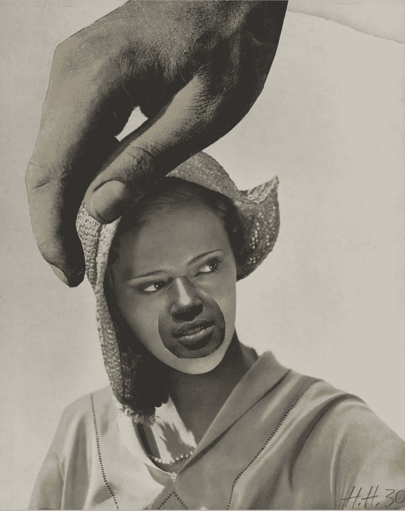
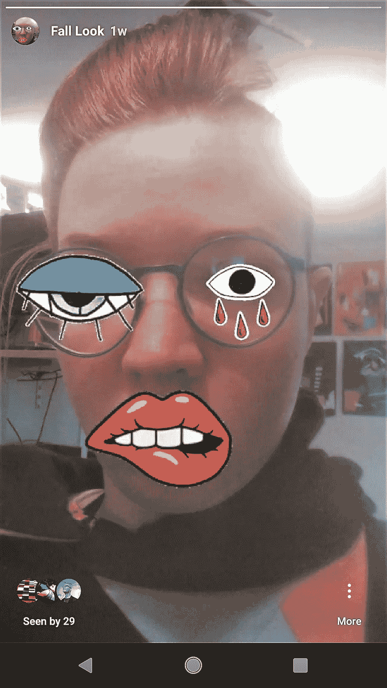
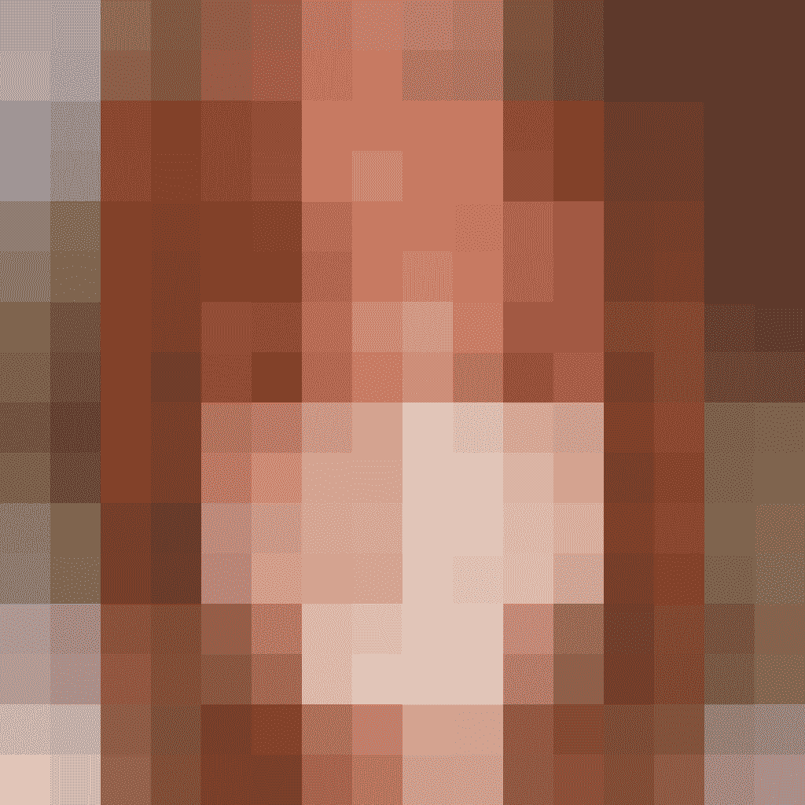

# 我们是拼贴

> 原文：<https://towardsdatascience.com/we-are-collage-e2c27a6198b2?source=collection_archive---------10----------------------->

“Unpaired Image-to-Image Translation using Cycle-Consistent Adversarial Networks” [Published in ICCV 2017](https://junyanz.github.io/CycleGAN/)

## 达达、Instagram 和人工智能的未来

拼贴是当下的语言，但已经有 100 多年了。让我们来看看它从哪里来(达达)，它现在怎么样(Instagram)，以及为什么它对人工智能的未来不可或缺(深度假货，GANS 和根深蒂固的副本)。

# 昨天:达达

虽然最简单形式的剪切和粘贴技术可以追溯到公元前 200 年左右中国发明纸张的时候，但是直到 20 世纪初现代主义的早期阶段，艺术家们采用大规模生产的印刷媒体作为材料，拼贴才成为一种不可或缺的交流方式。入场，舞台左边汉娜·霍奇。

Hannah Höch, [Da-Dandy](https://www.artsy.net/artwork/hannah-hoch-da-dandy), 1919

霍赫是一位德国达达主义者，在两次大战之间的威玛时期一直工作到二战结束。她的作品对魏玛政府的失败、她那个时代的社会约束和对女性角色的规定，以及日益泛滥的流行文化进行了超现实主义的探索。在一段支离破碎、混乱不堪的时间里，霍奇用时尚杂志、报纸和照片的碎片来构建她的作品，声称“绘画拼贴的材料没有限制——首先，它们可以在摄影中找到，也可以在文字和印刷品中找到，甚至可以在废品中找到。”(1)她的作品拥抱矛盾，揉合了当时的性别、种族、政治和物质紧张关系，包括一头扎进今天仍然普遍存在的艺术与工艺部落主义。

> *“[刺绣]是一种艺术，应该像艺术一样对待……你们，女工匠，现代女性，你们觉得你们的精神在你们的作品中，你们决心要求你们的权利(经济和道德)，你们相信你们的脚在现实中牢牢地扎根，至少你们应该知道你们的刺绣作品是你们自己时代的记录。”*
> 
> —汉娜·霍奇，刺绣和蕾丝，1918 年

Hannah Höch, [Untitled](https://www.artsy.net/artwork/hannah-hoch-untitled-large-hand-over-womans-head) (Large hand over woman’s head), 1930

但是霍奇，这也是我选择和她一起开始的原因之一，她不仅粉碎了这些珍贵的印刷材料，她还制作了它们。十多年来，正如 Artsy.net 的 Madeleine Boucher 所写的，“白天，hoch 为女性爱好期刊和插图日报设计刺绣图案，而到了晚上，她就在自己的作品中把这些图像撕成碎片。她的作品经常猛烈抨击那些杂志重新包装并作为时尚推广的女性和美化家庭生活的理想。(2)

拼贴重视这种与无所不在的文化材料的双重关系，但这种立场是一把双刃剑。《拼贴文化》(Collage Culture)的作者大卫·巴纳什(David Banash)认为，使用现成的组件是 20 世纪艺术创作的核心，因为尽管它凸显了“不可避免的消费文化的可能性和局限性”，并且“有能力批评[它的]意识形态”，但拼贴也“依赖于消费文化的材料，并且毫不夸张地**重现了大规模生产和消费的确切过程。”(3)**

所有物质形式的拼贴美学不仅有助于激发现代主义，它还通过后现代主义和超越后现代主义获得了巨大的文化相关性。让我们快速回顾一下这段历史,这样我们就能在这些概念和时期上达成共识。

时代有点像**刻板的青少年拒绝他们父母的方式**。现代主义需要启蒙运动来对抗。大约从 1620 年到 1800 年的启蒙运动，主要描述了发生在欧洲的早期科学和反君主制活动。开始于 19 世纪晚期的现代主义，拒绝了启蒙运动的**确定性和还原论**。二战后出现的后现代主义抛弃了现代主义的客观性和普遍性。今天，在一个我喜欢称之为过渡时代的时期，我们正在抛弃后现代主义的讽刺和无所不能的态度。

> 在考虑“后现代主义”之后的新时代的名字时，人们发现前缀“trans”以一种特殊的方式突出出来。20 世纪的后三分之一是在“后”的标志下发展起来的，这标志着“真实”、“客观”、“原创”、“真诚”等现代性概念的消亡，所有这些概念现在都以“跨主体性”、“跨原创”、“跨抒情”、“跨感伤”等形式获得新生
> 
> 米哈伊尔·爱泼斯坦，俄罗斯文学批评家，后现代主义在后现代性中的地位(4)

在所有这些剧变中，拼贴以其对混合、界限和交叉的专注，成为艺术和交流的重要而持久的工具。“好吧，好吧，所以拼贴是伟大和有用的，有这整个血统或什么的。你想说什么？**你答应了迷因和 AI！”**

# 今日:Instagram

Instagram Story post by the author

因此，尽管生产者-消费者混合体诞生于照片拼贴的熔炉中，但在过去的 100 年里，它已经进入了社会、政治和艺术生活的每一个角落。甚至写作这件作品的过程也是由拼贴美学促成的。我正在从网上资源中剪辑引文，即时重组我的文字，并将产品粘贴到发布平台上。**想想嘻哈和采样**，想想*傲慢与偏见和僵尸*，想想[励志演讲 supercuts](https://www.youtube.com/watch?time_continue=70&v=d6wRkzCW5qI) ，想想你参与过的每一个 meme，想想社交媒体平台界面设计与开发。

如果这是一个播客，我会在这里插入录音草稿。

因为不仅仅是我们用来在 Instagram 上宣传我们的虚拟形象的图像，甚至是应用程序中提供的具有剪切粘贴美学的功能和界面，而是用来制作软件本身的技术。Instagram 最初是一个相当简单的照片源，但直到它开始直接复制粘贴其竞争对手 Snapchat 的功能后才火了起来。发送给个人或朋友群体的消失的照片和视频，后来成为公开的“故事”，面部滤镜和动画贴纸装饰都源于 Snapchat。(5)

这并不一定是对 Instagram 设计实践的价值判断，(我对他们有意包含习惯形成功能的选择非常不满，但不是对竞争对手的复制)，而是旨在指出**拼贴是当今所有技术交流规模的组成部分**。不仅仅是大型平台从其他地方获取零碎的东西来构建自己。如今的软件开发从来都不是从空白的画布开始的。几乎总是有一个库、API 或组件系统被 zee interonets 或内部遗留代码窃取。当然，是的，也许我延伸了拼贴的概念，远远超出了它最初的含义，但事实证明语言是由使用它的人创造的。离开我的烟雾弥漫的人行道语言警察！(当我写这篇文章时，营火仍在燃烧。今天旧金山的空气质量指数是 265。)

就像进化不能从现有的身体形式直接跳到完美的理想状态，而是必须盲目地穿过错综复杂的微小突变一样，技术变革也倾向于逐步改进。但是后来，我们发明了一种叫做基因工程的东西，它使得基因结构发生了巨大的变化，这种变化仅仅通过进化是不可能的。**拼贴是技术创新的基因工程。**就像在不同的人群中工作一样，拼贴将他们不同的背景和思维方式重新组合成更广泛的可能结果，通过接触不同来源和类型的材料，拼贴扩展了可能创造的边界

我在 SAP、Y-Combinator Research 和现在的微软专门从事的基于艺术的技术探索研究，这种研究风格严重依赖拼贴作为一种探究技术。基于艺术的研究试图跳到遥远的、不稳定的、目前通常不可行的睡莲叶子上，而不是专注于渐进的改进，以拓宽我们创新途径的菜单。拼贴是一种技能，一种艺术，也是未来人工智能民主化的关键。

# 明天:艾

纽约现代艺术博物馆的前馆长劳拉·霍普特曼说，拼贴让我们“同时体验信息……就像一朵水平的云。”(6)对今天的人工智能来说，这似乎是一个恰当的描述:工具本质上允许我们通过浓缩和表现来把握我们不断增长的信息海洋。人工智能是大规模的拼贴。它的预测和世代是人类知识的集合，如癌症筛查的标签集，以及物质文化，如图像的宝库，切碎成大量的值，仔细检查并重组为新的知识和材料。

随着人工智能变得越来越普遍，它将变得类似于霍赫时代的那些业余爱好期刊和插图日报，就像今天的 gif 和 memes 一样，本身也受到材料重组的影响。这已经发生了。以谷歌大脑研究员伊恩·古德菲勒(7)于 2016 年提出的生殖对抗网络为例。**甘的算法是两种已经存在的算法的拼贴。**这是一种用于从一组原始声音中创建新版本的技术，例如从人类语音库中创建人工声音，或者从一组人脸中创建新的人脸。把甘想成一个很有耐心的艺术家，一个很有眼光的买家。这位艺术家被委托画一幅肖像，并得到了一大堆原始资料。艺术家每完成一幅画像，买家就会给他们打分。起初，这是一个非常糟糕的分数，但很快，在经过一百万次尝试后，分数变得更好(不完美，但非常接近，头发和虹膜仍然很难)。

Image Source: [NVIDIA via NYT](https://www.nytimes.com/interactive/2018/01/02/technology/ai-generated-photos.html)

Image Source: [NVIDIA via NYT](https://www.nytimes.com/interactive/2018/01/02/technology/ai-generated-photos.html)

Image Source: [NVIDIA via NYT](https://www.nytimes.com/interactive/2018/01/02/technology/ai-generated-photos.html)

现在，因为我们在谈论人工智能，我们必须记住，无论是“艺术家”还是“购买者”都不知道什么是脸，甚至什么是图像。两者都将像素颜色分解成数值数组，然后进行统计比较并进行调整。一个 AI，至少按照目前的定义，是无法理解设置给它的问题的。它只能非常快速地聚合成千上万个“数据化”的人类行为，比如给一幅图像贴标签，或者为它提供的集合创建统计上相似的示例，比如创建一幅图像。癌症筛查人工智能可能比任何一个医生都更容易做到，但这不是因为它“更聪明”，而是因为它使用了数千名医生的知识。(我是不是把这些成堆的微积分工作原理过于简单化了？是的。网上至少有 1 万亿篇文章可以教你基础知识。往前走！)

现在 Goodfellow 是一个超级专家，目前这是制作一个好的人工智能拼贴画所需要的。但是，如果不把我们所有的努力集中在创造更容易的方式让人们编写他们自己版本的人工智能(生成器，分类器，异常检测器等)上，会怎么样呢？)，相反，我们促进广泛的人工智能拼贴。**胶水！剪刀！工具丰富！**为了让大量的人，每个人，面包店老板，数字艺术家，中学生，能够制作有用的和有意义的人工智能，我们不应该只专注于让编码小说模型更加平易近人的方法。拼贴的血统向我们展示了这样一种界面，它可以访问现有的人工智能算法，并让人们以奇怪和反直觉的方式重新组合它们，这将导致谁在创造人工智能，以及它被要求做什么有趣、怪异甚至可能是革命性的事情。这就是我们如何通过自动化来避免混淆。**这就是我们如何深度伪造迷因战争。**这就是我们取胜的方式！

哇哦。原来美术技能就像…有用？谁想到它…

# 支持

感谢杰伦·拉尼尔和微软一直以来的支持和指导。

# 笔记

1.  汉娜·霍赫，“拼贴，”在汉娜·霍赫，编辑。道恩·阿德斯，丹尼尔·赫尔曼(伦敦:白教堂画廊，2014 年)
2.  马德琳·鲍彻，“艺术还是工艺？:汉娜·霍奇的拼贴画拥抱了艺术与工艺、达达与商业主义之间的冲突”，artsy.net，2014 年 10 月 14 日出版，2018 年 11 月 12 日访问，[https://www . artsy . net/article/madeleineb-Art-or-Craft-Hannah-hochs-Collages-enchanted](https://www.artsy.net/article/madeleineb-art-or-craft-hannah-hochs-collages-embraced)
3.  David Banash 接受 Rick Poynor 采访，“拼贴文化:怀旧与批判”，《设计观察家》，2013 年 11 月 11 日出版，2018 年 11 月 17 日访问[https://Design Observer . com/feature/Collage-Culture-怀旧与批判/38187](https://designobserver.com/feature/collage-culture-nostalgia-and-critique/38187)
4.  米哈伊尔·爱泼斯坦，“后现代主义在后现代性中的位置”，出版于 1998 年，访问于 2018 年 11 月 17 日，[http://www.focusing.org/apm_papers/epstein.html](http://www.focusing.org/apm_papers/epstein.html)
5.  卡丽莎·贝尔，“Instagram 证明无耻的复制是有回报的”，Mashable，2018 年 5 月 12 日发布，2018 年 11 月 17 日访问[https://Mashable . com/2018/06/12/insta gram-proves-copy-is-the-best-strategy/# NysItTmXfaqo](https://mashable.com/2018/06/12/instagram-proves-copying-is-the-best-strategy/#NysItTmXfaqo)
6.  瑞秋·沃尔夫，“剪切粘贴文化:新拼贴”，Artnews.com，2013 年 12 月 12 日出版，2018 年 11 月 18 日访问，[http://www.artnews.com/2013/12/12/the-new-collage/](http://www.artnews.com/2013/12/12/the-new-collage/)
7.  维基百科，2018 年 11 月 19 日访问[https://en . Wikipedia . org/wiki/Generative _ adversarial _ network](https://en.wikipedia.org/wiki/Generative_adversarial_network)
8.  Tero Karras、Timo Aila、Samuli Laine、Jaakko Lehtinen，“Gans 的渐进增长，以提高质量、稳定性和变化性”，发表于 2018 年【https://arxiv.org/pdf/1710.10196.pdf】ICLR