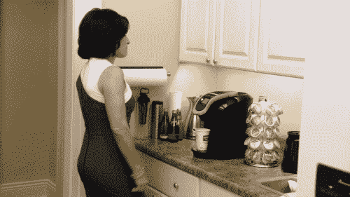

# “我想，我们从头开始吧。”

> 原文：<https://towardsdatascience.com/we-begin-by-beginning-i-guess-8a62beec84f5?source=collection_archive---------1----------------------->

作为一个在脸书、Twitter、Tumblr 和类似网站时代的 20 多岁的人，我冒险写博客只是时间问题。实际上，在之前，我曾经尝试过一次博客，最终它变成了一个不经常更新的总统辩论饮酒游戏库——配有 gif。

Out with the old and in with the new, I suppose!

鉴于我正在尝试一个新的博客，它回避了这个问题:我应该写些什么？我对很多事情都充满热情——数据科学、教育、政治、法律、定量扫盲——尤其是当这些兴趣重叠的时候。将自己归入一个领域似乎很傻，但收集一些不相关的散漫内容似乎更傻。

> 幸运的是，如果我在过去几年中学到了什么，数据科学几乎与所有东西都有重叠。

所以这就是我要开始的地方:将数据科学应用于一些*(希望如此)*酷问题。但是*我该如何开始呢？正如乔治·奥威尔在 1984 年的*中所说，“在纸上做记号是决定性的行为。”感觉就像带着新买的笔记本开始了新的学年。一旦你动笔，事情就有了定论。然而，在那一刻之前，可能性是无限的。**

*我最近重读了《华氏 451 度》*，下面这段话在我的记忆中尤为突出:**

> **蒙塔格从地板上拿起一本小册子。“我们从哪里开始？”他把书打开一半，仔细看了看。“我想，我们从头开始吧。”**

**所以，我想这是开始。在接下来的几天和几周内，将会有关于使用信息和证据解决问题的帖子，但目前，欢迎！**