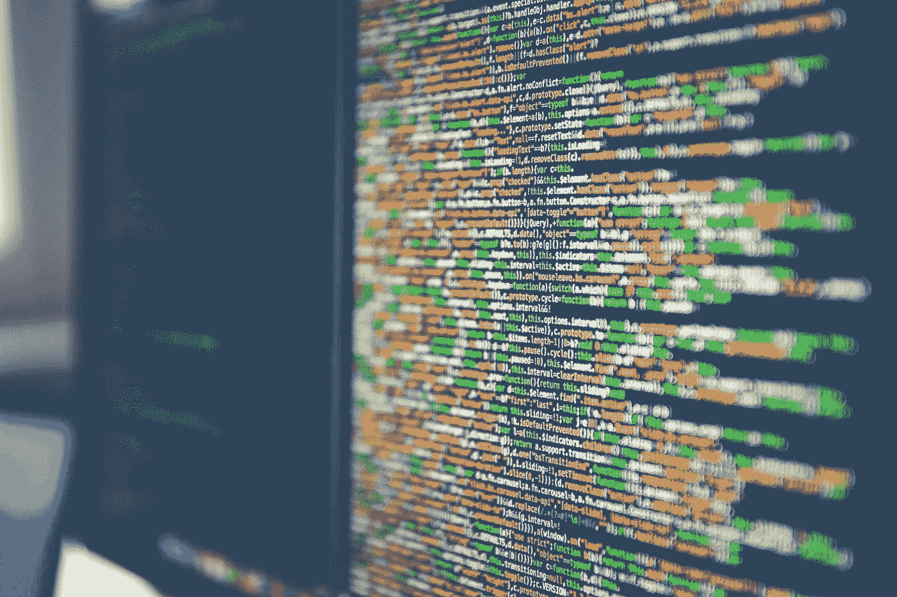
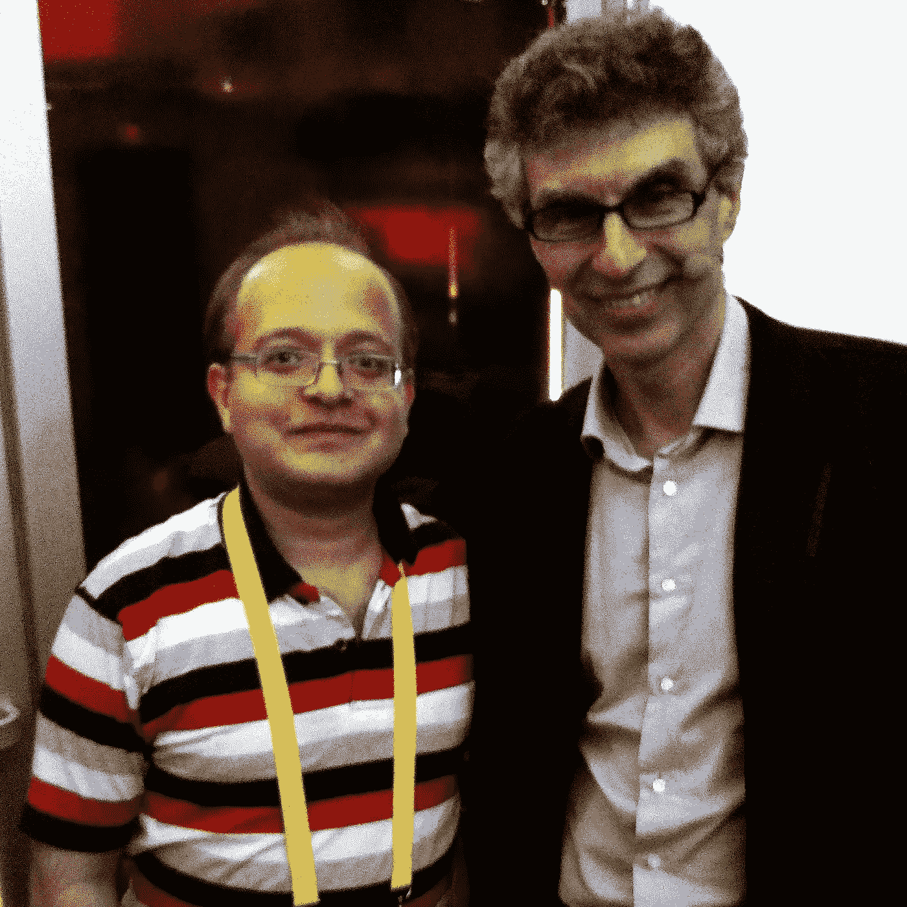
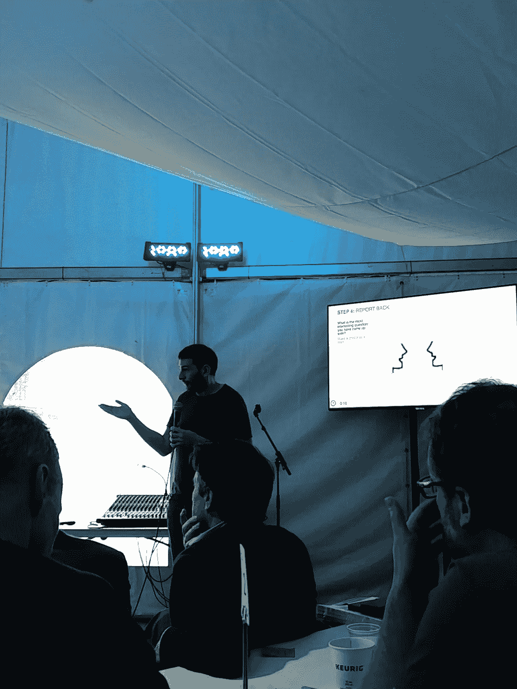

# 我们知道你也想去 C2

> 原文：<https://towardsdatascience.com/we-know-you-wanted-see-c2-too-72d1617c2a9?source=collection_archive---------7----------------------->

在为期三天的令人难以置信的 [C2 MTL 会议人工智能论坛](https://www.c2montreal.com/post/new-the-ai-forum-at-c2-montreal-2017/)中，研究和创业领域的创新者分享了他们关于人工智能(AI)的知识和经验，激发了关于这些技术的应用和潜力的富有成效的讨论。演讲范围从机器学习将在医疗保健中发挥的关键作用，到成功的人工智能创业公司的关键特征，再到该领域伦理问题的思考。展示了令人难以置信的洞察力，来自各种人工智能应用的不同观点的碰撞为未来的行动带来了兴奋感。[魁北克 MESI](https://www.economie.gouv.qc.ca/) 和[蒙特利尔国际](http://www.montrealinternational.com/en/)在促成这一切的过程中发挥了关键作用。

Montreal: an electric feeling in the air. Source: [Jonathan Denney](https://unsplash.com/@jdenney), Unsplash.com

一个深思熟虑的早餐小组讨论了媒体和人工智能的成熟度，提到了与更琐碎的应用程序相比，人工智能技术的通信和翻译应用程序的重要性；例如，文本到语音技术消除了对转录语言信息的需要，从而释放了大量以前难以访问和共享的知识。随着开源研究和创造的令人钦佩的扩张，数据预计将成为开发人工智能技术的关键因素，正如 aifred 的数据驱动的医疗预测一样。

在小组讨论期间，创业的一个有趣优势浮出水面；在失败和随后的调整方面，初创公司与大公司相比的敏捷性。失败是任何创新努力的核心组成部分，成功努力的定义特征(不仅限于人工智能初创公司)是基于失误调整计划和愿望的能力，以便打造更强大的竞争对手。

Data is the Atlas of the AI world. Source: [Markus Spiske](https://unsplash.com/@markusspiske), Unsplash.com

通用电气首席营销官琳达·博夫(Linda Boff)谈到了创造力的重要性，这是将卑微和危险的劳动转移到人工智能技术运行的机器上的结果；这意味着创新和创新思想在世界舞台上扮演着重要而令人垂涎的角色。这个想法是利用人工智能的力量，作为可以产生最大影响的学科中开创性应用的基础，例如 3D 打印器官为医疗保健专业人员提供更好的诊断提供了潜力。

加拿大人工智能“生态系统”的现状和未来潜力是根据当代作为基于认知能力扩展的工业革命来探索的，与扩展人类机械能力的经典工业革命相反。丰富的数据、灵活的模型和可用的计算能力推动了人工智能革命；这些因素为人工智能在不同行业中的指数级影响提供了基础。

From mechanical revolution to cognitive revelation: The Canadian AI Ecosystem sparks justified excitement. Source: Unsplash.com

[乔尔·贝克曼](http://joelbeckerman.com/)，作曲家和*人造音乐的创始人*讨论了一个经常被忽视的声音对人类认知和体验的影响的有趣演示，他提出声音是设计的一个方面，分享了视觉设计的相同原则。对声音的生物反应比其他感官快得多，因此这种感官形式在构建其他感官的感知和输入中起着作用。他的想法是一个完美的例子，说明如何以创新的方式应用人工智能，在未探索的领域用创造性的方法解决问题。例如，医疗保健中的警报疲劳可以通过医疗保健专业人员的习惯化来消除，这违背了警报本身的目的；可以通过分析声音来诊断自然生态系统的健康状况。声音是人工智能研究领域的一个主要例子，它充满了创新的潜力，有许多应用等待被解锁，也许是在前面提到的通信环境中。

关于艺术和文化意义，[长野健](http://kentnagano.com/)也提到了声音的未实现的潜在影响；声音在传输过程中会因流式传输而损失很多质量，而重点是通过流式传输来提高视觉质量。视觉媒体质量的这种偏见可能在当今世界视觉图像优于声音的优势中发挥作用，人工智能拥有潜在的调整这种焦点不平衡的能力。

Kent Nagano, Music Director of Orchestre symphonique de *Montréal, presents a wonderful performance.*

aifred 团队特别感兴趣的是江泽龙·拉瓦莱和[乔纳森·卡内夫斯基](https://medium.com/@jonathankay_66237)通过“人工智能优先”的镜头重新想象医疗保健的想法；这一领域的注意力集中在诊断上，因为这是目前最精确和相应最有价值的数据所在。未来的研究和创新可以使用听觉数据和视觉数据，从分析生物功能模式来检测健康问题(如血栓)的风险，到分析医生行动和互动的视频。人工智能的魅力在于它可以提供可访问性，通过消除不重要的、机器可控的细节的干扰，并允许人类的创造力和高级思维出现。例如，从结肠镜检查中获取视频图像并应用人工智能，以便经验较少的医生可以在专家的水平上进行操作，或者应用人工智能来分析生活方式因素，以查看哪些因素在人类疾病的背景下可能是重要的。这与 aifred 背后的价值观和灵感极其相关，特别是在精神保健方面。

当然，伟大的 [Yoshua Bengio](http://www.iro.umontreal.ca/~bengioy/yoshua_en/index.html) ，Element AI*的联合创始人兼蒙特利尔学习算法研究所所长，分享了他对人工智能及其应用的想法，特别是自然语言理解和生成、医疗保健和机器人技术的成功和障碍。关于语言理解和生成，在这一领域进行了大量投资，包括微调虚拟个人助理、语音识别、文件检索(这可能会使有能力轻松负担法律服务的人更容易获得服务，并改变司法系统中的偏见)和教育对话系统。*

Pictured: Internally excited yet outwardly calm aifred Project Leader Abhishek Gupta and Yoshua Bengio.

深度学习再一次被讨论到它在医学上的潜力。人工智能可以处理医生没有时间自己筛选的高维数据；来自患者数据和医生笔记的信息可以用来预测未来的结果和估计未来事件的概率，但只有足够的训练数据才能用于机器学习模型。医学中可用于训练机器学习模型的数据的当前状态相当分散，这是我们在寻求生物数据以用作心理健康治疗的预测器时亲身经历的，但一个积极的趋势表明，这种数据的集中化正在上升；这对于人工智能在医疗保健领域的进步至关重要。必须面对的挑战围绕着可供分析和分类为相关或不相关的大量数据，必须进一步考虑其收集与各种形式的研究不一致的问题。

此外，在大踏步前进的过程中，走出去并思考创新可能带来的问题总是很重要的，特别是在人工智能领域等快速增长的努力。来自 *Google* 的 Blaise Agüera y Arcas 讨论了在 AI 技术中引入人类偏见(将人类价值观注入具有预测偏差的机器学习模型)、在没有充分预见的情况下将 AI 盲目应用于现实世界问题、失业影响、安全考虑以及与这些日益复杂的技术(如机器人)的发展相关的法律权利方面必须做出的重要考虑。随着人工智能应用的出现，这些主题将变得越来越多地被讨论和相关，在思想发展和人工智能进化的整个过程中讨论它们是重要的。

Blaise-ing new trails in the consideration of AI ethics.

关于人工智能技术的各种观点和深思熟虑的思考由许多激动人心和深刻的演讲者组成。 [Ben Boyd](https://www.c2montreal.com/speaker/ben-boyd/) 强调了在“不信任时代”具体体验和真实客户意见的重要性。[的迈克尔·斯拉比](https://www.c2montreal.com/speaker/michael-slaby/)展示了技术在政治中的作用，包括脸书在圈定新闻来源方面的影响，这些新闻来源通常会被忽视，以努力使民主更知情和更有效，以及技术应该旨在改善政治的方向；参与的民主化和集中精确的开源数据可访问性。视觉驱动的设计实践也是 Drod Benstrit 的谈话主题，他谈到了人类对有意义的联系的热情，以及我们的经历对我们如何感知现在和塑造未来的影响，以及合作创新和投资实验的重要性。Amanda Hill[介绍了当今世界中内容创作者与消费者之间的不平衡(估计为 2000:1 ),在这个世界中，注意力是一种稀缺商品。这是一个重要的考虑因素，尤其是在一个无数信息不断争夺注意力的世界里，选择什么样的内容最强大、最有意义。穆罕默德·尤努斯(Muhammed Yunus)详细讨论了全球财富不平等及其伴随的问题，他建议对年轻人进行再教育，让他们成为企业家，并将社会焦点转向个人创造力的价值。](https://www.c2montreal.com/speaker/amanda-hill/)

最后，医疗保健和人工智能再次与 *Dialogue、*的联合创始人兼首席执行官亚历克西斯·斯米尔诺夫(Alexis Smirnov)发生了碰撞，他谈到了通过可穿戴设备进行慢性病管理，消除了定期去看医生的需要，或者在整个怀孕期间持续跟踪胎儿健康。持续健康跟踪的更主动性质可以是关于生活方式的数据收集，例如运动胸罩跟踪呼吸模式并推荐相应的锻炼方案，通过言语模式识别精神病，或通过跟踪眼球运动检测自闭症。人工智能的可能性似乎是无限的，即使在医学领域，其应用也在不断涌现，并以越来越实用和有影响力的想法为基础。aifred 团队很高兴能够成为这个人工智能时代的一部分，我们非常感激能够在今年的 C2 MTL 会议上有机会向这些才华横溢的人学习。我们非常感谢[蒙特利尔国际](http://www.montrealinternational.com/en/)让 aifred 有可能体验这个非凡的 AI 论坛。对于人工智能技术来说，这是一个令人兴奋的时代，置身其中就像站在一场思想和创新的龙卷风中，有可能解决世界问题；我们已经不在堪萨斯了，但我们肯定会去旅行。

The future is in our hands. Source: [Oliver Thomas Klein](https://unsplash.com/@oliverthomasklein), Unsplash.com