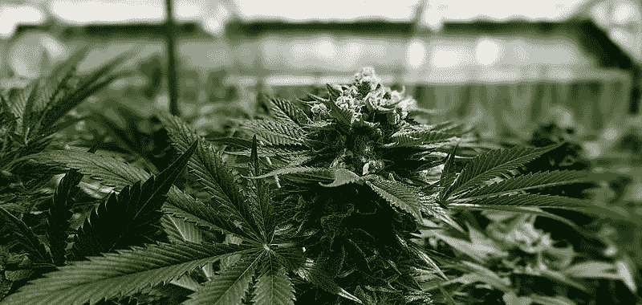
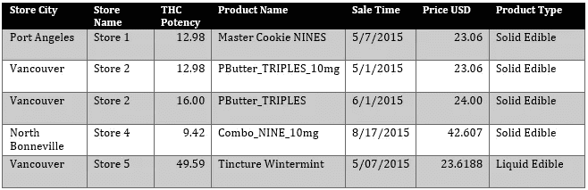
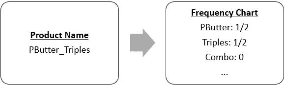
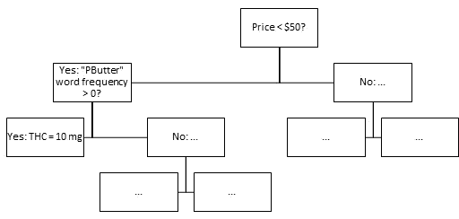
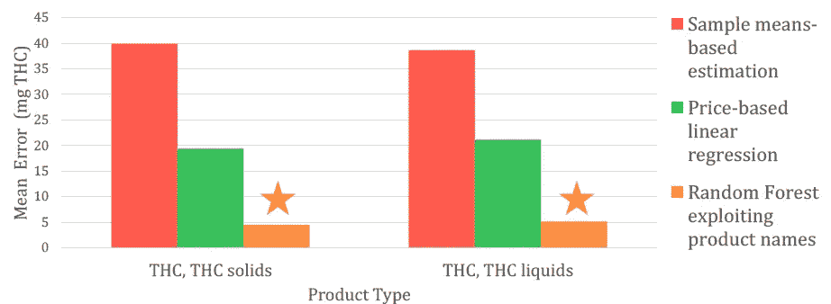

# 我们用人工智能评估了华盛顿的食用大麻市场

> 原文：<https://towardsdatascience.com/we-sized-washingtons-edible-marijuana-market-using-ai-4fbf3d9f1ebf?source=collection_archive---------27----------------------->

Image sourced from Wikimedia Commons

随着加拿大成为 G7 国家中第一个将娱乐用大麻合法化的国家，它可能会向美国华盛顿州寻求暗示。2012 年，华盛顿州和科罗拉多州成为[第一个这样做的州](https://www.reuters.com/article/us-usa-marijuana-washington/marijuana-goes-legal-in-washington-state-amid-mixed-messages-idUSBRE8B506L20121206)，尽管面临联邦政府的禁令。然而，即使美国有机会观察，我们国家对该行业的了解仍不完善。华盛顿到底卖了多少 THC 这种让使用者兴奋的化学物质——仍然不得而知。

这一数字对于回答美国和加拿大决策者的问题至关重要:我们能否将整个社会的 THC 消费与公共卫生结果联系起来？大麻的精神作用和麻醉作用主要是由于四氢大麻酚，而且由于植物的效力千差万别，理解四氢大麻酚背景下的行业规模是有意义的，而不仅仅是植物的质量。

我是卡耐基梅隆大学海因茨学院学生团队的一员，支持兰德公司对这一行业的分析，在我们的工作中，我们使用人工智能来估计食用大麻产品中合法销售的四氢大麻酚*的数量。我们的团队首次对西澳大利亚进行了此类评估。*

# **我们的数据杂乱无章，缺少信息**

我们得到了一个 60gb 的从种子到销售交易的数据集，其中包括 1000 万份可食用大麻产品的销售。我们需要估计所有这些产品中销售的四氢大麻酚的数量，但是所有食物中四氢大麻酚含量的数值都丢失了。我们收到的信息看起来有点像这样[1]:

Data provided includes some numeric variables (sale time, price, potency, etc.), categorical variables, and unstructured text (product names).

我们需要以某种方式获得这些 THC 值。

兰德研究人员[史蒂文·达文波特](https://www.rand.org/about/people/d/davenport_steven_s.html)注意到，一些产品，比如上面的“PButter_TRIPLES_10mg”，在其名称中提到了重量。他判断这些重量指的是产品中 THC 的数量[2]。这些重量可能显示为“10 毫克”、“10 毫克”、“0.01 克”或其他多种形式，但对人眼来说，其含义很清楚:带有这种标签的产品含有 10 毫克四氢大麻酚。

利用这些信息，他编写了一个脚本来识别这些模式[3]，并从 44%的交易中提取这些权重。

# **计算 THC 销售额的第一种方法表现不佳:**平均值和价格回归

对于另外 560 万的销售，产品名称并没有给我们一个拐杖。例如，“主曲奇 9”没有提到重量。处理这个问题的最简单的方法是假设这些其他交易的每笔销售的 THC 与之前的 44%相同。如果我们可以从 200 万份固体食物中提取 THC 估计值，其中每份食物含有 1 毫克 THC，还剩下 100 万份固体食物，那么我们可以说固体食物与 300 万毫克 THC 有关(200 万 x 1 毫克+100 万 x 1 毫克)。

这是我们的第一个“模型”。

但是当然，这是一个可怕的假设。如果这些交易因为人们购买更多的 THC 而变得更加昂贵呢？或者后 56%中的产品类型是否与给我们提供有用产品名称的 44%不同？我们可以想出一百万种出错的方式，所以我们必须做得比基于这种假设的计算更好。

你可以通过在他们没有见过的数据上使用模型来测试你的模型有多好。我们通过[交叉验证](https://en.wikipedia.org/wiki/Cross-validation_(statistics))来判断我们的方法工作得有多好，这是对这一基本思想的一个更稳健的应用。每笔交易的平均误差为 40 毫克 THC，我们的第一个模型并不好。

因此，我们认为我们可以通过利用价格和数据中的其他数字做得更好。更贵的产品可能含有更多的主要活性化学物质，包括四氢大麻酚。通过考虑每家商店周围的销售时间和家庭收入，我们控制了两个关键趋势:THC 价格如何随着时间的推移而下降，以及高收入消费者如何抬高价格。这种基于回归的模型做得更好——每笔交易的误差为 20 毫克 THC 但仍有很多不确定性。

# **机器学习/人工智能极大地改善了预测**

这促使我们更进一步:利用非结构化文本数据来预测 THC 的数量。

在上面的数据表中，猜测“PButter_Triples_10mg”和“PButter_Triples”很可能是相似的产品，可能具有相似的 THC 含量是合理的。他们有许多相同的名字。同样，“PButter_Triples”可能与“酊剂 Wintermint”有很大不同——它们没有相似的名字。为了利用这些信息，我们计算了所有交易中每个单词的每个唯一单词的[频率。[4]有了这个庞大的频率表，我们将文本转换成了定量信息，以训练人工智能对 THC 含量进行预测。](https://en.wikipedia.org/wiki/Document-term_matrix)

Converting text into a “bag of words” model gives us usable data for machine learning.

我们选择的机器学习算法是“[随机森林](https://en.wikipedia.org/wiki/Random_forest)”，它使用来自数百棵决策树的预测。这些树中的每一个都不断地将数据分成许多类别来进行预测。我们数据的一个简化树可能如下所示:

Decision trees partition data into many categories according to rules. Here, in this toy, if a transaction’s price is less than $50 and its product name contains “PButter”, then we believe it has 10 mg of THC.

使用所有可用的信息——价格、销售时间、当地收入、产品名称、效力和所有其他变量——我们的 AI 创建了一个“随机森林”,试图最小化预测每笔销售的 THC 数量的误差。每笔交易的交叉验证误差仅为 5 毫克 THC，其性能远远超过所有以前的模型。事实证明，这是估算其余 560 万笔交易中每笔交易的 THC 含量的最佳方法。

**跨车型的交叉验证性能**

# **新能力，新答案**

虽然我们的算法是熟悉的，但它们在这里的应用在药物政策领域开启了全新的机会。

我们对出售的四氢大麻酚含量的估计表明，华盛顿的大麻合法市场在不断扩大。我们不确定这是因为更多的人在消费大麻，还是合法市场正在蚕食黑市。

但是根据我们的估计，他们让决策者有能力回答更深层次的问题，即 THC 如何合法地到达消费者手中。到底是哪些产品让消费者兴奋？我们看到固体食物支配着液体食物。然而，从 2016 年 7 月到 2017 年 6 月，通过食品合法销售的 THC 只有 0.3 公吨，仅占同期西澳大利亚合法市场销售的 24 公吨 THC 的一小部分。

食物是获取 THC 的廉价途径吗？显然不是——它们每单位 THC 的价格大约是可用大麻产品的九倍。对大麻的需求完全由合法产品的销售来满足吗？不，差距很大。【5】如果没有，有黑市满足吗？也许吧。

这对消费者的健康有什么影响？我们的工作才刚刚开始。

我们揭示了这个行业规模和特征的另一个谜团。走出国门，我们在这里描绘的画面可能预示着加拿大市场将如何在未来几年发生变化。我相信数据科学家也会关注它。

# **脚注**

[1]这不是数据的精确复制，因为在链接不同表中的匹配记录时涉及多个数据库连接。

[2]对生物多样性产品采用了单独的程序。为了简洁起见，这里省略了这些。

[3]兰德公司的研究人员史蒂文·达文波特利用正则表达式得出这些值。

[4]实际上，我们使用了一个 [TF-IDF 矩阵](https://en.wikipedia.org/wiki/Tf%E2%80%93idf)来训练我们的模型。这些矩阵特别有用，因为它们降低了像“of”和“the”这样的非信息性单词的重要性。使用[主成分分析](https://en.wikipedia.org/wiki/Principal_component_analysis)，我们的 TF-IDF 矩阵的大小也减少了几百维，这大大加快了计算时间。

[5]我们在一个单独的项目中，通过根据抽样偏差重新加权的消费者调查，开发了我们对需求的估计——定义为消费者对大麻的消费，无论它是否是在受管制的市场上获得的。