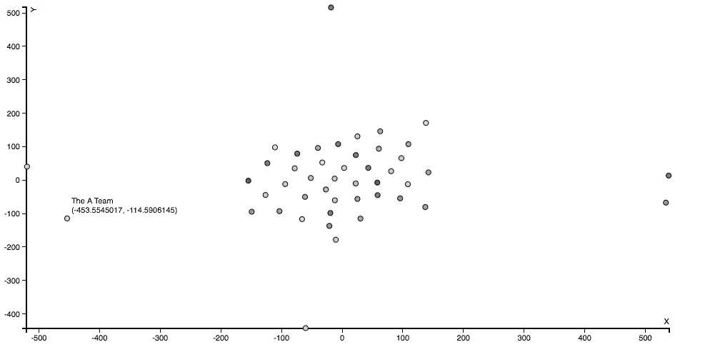
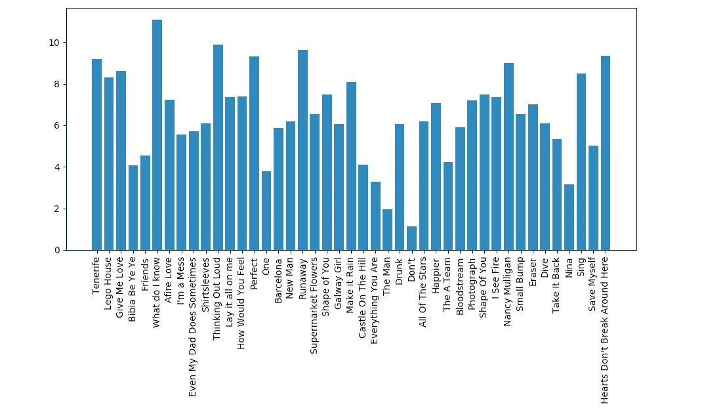

# 我们用数据科学来探索艾德·希兰的歌曲，以下是我们的发现

> 原文：<https://towardsdatascience.com/we-used-data-science-to-explore-ed-sheerans-songs-here-s-what-we-found-480b56b23517?source=collection_archive---------2----------------------->

那是星期五下午，艾德·希兰在那天早上发布了他的最新专辑。当我第一次坐着听它的时候，一个想法在我的脑海中闪过，“这张专辑听起来真的不太新鲜**。要么是我听了太多他的歌，要么是他的大部分歌曲都是如此相似，以至于我现在或多或少能猜出歌词中的下一首是什么。在我考虑周五晚上的计划时，我给里法德发了条短信，像任何一个理智的计算机科学一年级学生一样，问他，“*伙计，你愿意放弃周五晚上的计划，去听听艾德·希兰的歌吗？”令我惊讶的是，他很快就回来了，说他准备让自己经历在音乐网站上搜索歌词和在 d3.js 中创建可视化的痛苦。***

****

**Most popular words in Ed Sheeran’s songs**

**于是黑客攻击开始了。**

**这个想法是，我们将使用已知的自然语言处理技术，如词频、句子相似度和情感分析，来找出艾德·希兰歌曲的多样性。首先，我们必须从某个地方获取数据，Rifad 很快组装了一个刮刀，从互联网上众多歌词网站中的一个网站上获取歌词，后来我们才意识到我们可以使用 Genius API 来找到这些歌词。**

**尽管如此，一旦歌词保存下来，我的工作就开始了。最近，我一直在试验一种奇特的 word2vec 模型，它可以将单词转换为向量，然后人们可以使用这些向量，使用余弦相似度或欧几里德距离等现有技术，在句子、短语甚至整个文档之间找到某种程度的相似度。我想到的处理这个特定数据集的方法是，首先生成专门针对艾德·希兰歌词的单词嵌入，计算他所有歌曲的归一化向量，然后应用降维算法将向量维度从 50 个减少到 2 个，使其易于可视化。在这个过程中，我希望在他的歌曲中找到流行词，以及他的词汇是多么的丰富多彩。**

**点燃一个 Jupyter 笔记本，我开始工作。我使用了 gensim 的 word2vec 模型来生成单词嵌入。word2vec 模型的工作方式是将一个大型文本语料库作为输入，然后从中生成一个几维的向量空间。在相似的上下文中使用的单词在这个空间中彼此放置得更近。这里要注意的一点是，它需要大量的文本。我的文本语料库由 40 多首歌曲组成，词汇长度大约为 2500 个单词，虽然不完全是最好的输入源，但因为我们只是出于好奇才这样做的，所以我决定继续。我想我可以通过询问一些“粉丝”对他音乐的看法来评估这位模特的表现。现在，由于我使用的是微不足道的 4gb MacBook Air，我只使用了 50 维。最好的模型使用接近 300 个维度。单词的上下文窗口是 7，并且对频繁出现的单词进行子采样。在训练结束时，我有了一个 1.5 mb 的模型，其中他的歌曲中使用的每个单词现在都是一个 50 维的向量。**

**下一步是将他的歌曲作为向量构建一个相当特别的表示。为了做到这一点，我计算了每首歌的矢量和，然后将矢量归一化。标准化这些向量背后的原因是它有助于找到各对向量之间的相似性。事后看来，人们可能会认为，更公平的表示可能会利用某种方法，这种方法利用了一个词的 tf-idf 得分等指标。**

**有了这些向量，我决定快速构建一个单词云。毫不奇怪，使用最多的词是**爱**，紧随其后的是**知**和**来**。(边注:如果你足够用心的看上面的云字，你可以在云字里看到艾德·希兰的剪影；) )**

**现在更有趣的部分来了，把我的 50 维向量空间投影到 2。从文献来看，有两种方法可以做到这一点，如果维度太高，主成分分析可以很好地将其减少到更易于管理的程度，然后可以使用 t 分布随机邻居嵌入算法再次将其减少到 2-3 个维度，然后可以可视化。另一种方法是直接使用 t-sne，这就是我所做的，因为它可以在 500 次迭代中轻松处理 50 个维度。**

**一旦尘埃落定，这就是我们得到的。**

****

**像**A 队**(最左边)和**形状的你**(最右边，绿点)这样的歌和他其他的歌很不一样。我们对此的一个解释是，他的大部分歌曲在某些方面都是怀旧的，因此在中间有一簇。集群中的一些歌曲是**山上的城堡**和**照片**。这有某种直观的意义，因为 word2vec 模型将相似上下文中的单词放得更近。这也是一个被艾德·希兰的青少年粉丝证实的观点，他们玩着观想游戏。**

**随着星期五的到来，我结束了一天的工作，把数据交给了里法德，这样他就可以计算歌曲的情感分数。他想利用谷歌情感分析 API 和 Spotify API，这样他就可以找到最悲伤/最快乐的歌曲。Google 情感 API 返回两个高度相关的分数，一个是情感分数，另一个是代表不同长度文本中情感的量级。因此，较长的文本将具有较高的量级。另一方面，Spotify API 返回了一堆有趣的指标，比如可跳舞性、语速和效价。我们想出了一个非常粗略的、背在纸上的公式来计算最终的歌情。因为效价和情感分数是相似的值，我们把它们加在一起，然后乘以数量级。然后，我们将结果按语速划分，认为对于包含更多单词的歌曲，结果应该是正常的。然后，我们对结果进行平方，并计算结果的对数值。我们当然认为这个公式没有最好地代表歌曲中的情感，然而，它有一些坚持人类对歌曲的判断的外表，这可能是对的，也可能是错的。**

****

**分数越高的歌曲越积极。不出所料，**不要**是最悲观的，或者说可能是使用了最多带有负面含义的词语的人。**我知道什么**真的让我们觉得我们知道什么，它有一个不自然的高分。我想我们可以把这部分归因于他歌词的模糊性。**

**总的来说，这是一个很好的星期五到星期六，用来编写相当业余的文本挖掘脚本。更重要的是，我们学到了很多关于这个过程的知识，获得了一些真正的乐趣，偶尔还会遇到令人惊讶的结果。**

***我们制作了一个快捷的网站，在那里我们所有的互动可视化都是——*[*https://r1fad.github.io/edSheeran/*](https://r1fad.github.io/edSheeran/)**

***我们所有的代码都可以在这里找到——*[【https://github.com/r1fad/edSheeran】T21](https://github.com/r1fad/edSheeran)**