# 微型杀伤性武器:我们的“喜欢”如何劫持民主

> 原文：<https://towardsdatascience.com/weapons-of-micro-destruction-how-our-likes-hijacked-democracy-c9ab6fcd3d02?source=collection_archive---------2----------------------->

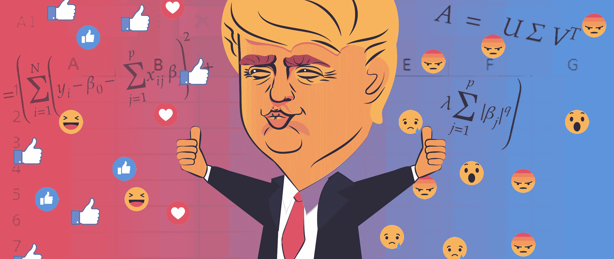

## Excel 文件揭示脸书/剑桥分析公司丑闻背后的数据科学

> “我们能够建立一个模型来预测美国每个成年人的性格。”—剑桥分析公司前首席执行官亚历山大·尼克斯

舔“喜欢”是我们大多数人不假思索就会做的事情。这是一种社会货币，它给我们短暂的震动，并加速我们的多巴胺中心。然而，谁知道我们所有的“喜欢”会预测我们的个性，并变成反对我们的政治说服工具呢？

接下来是:

*   这是一个警示性的故事，说明大数据如何被坏人滥用。
*   一步一步的电子表格教程，解释了个性预测算法，套索回归。
*   以及对你在网络上留下的数字足迹的警告。

震惊世界的大选过去近两年后，剑桥分析公司(简称“ca”)的脸书丑闻仍然是媒体关注的焦点。似乎这个故事的每个有趣的角度都被报道了。

但是有一个问题仍然没有解决:

> 这些模型是如何工作的？？

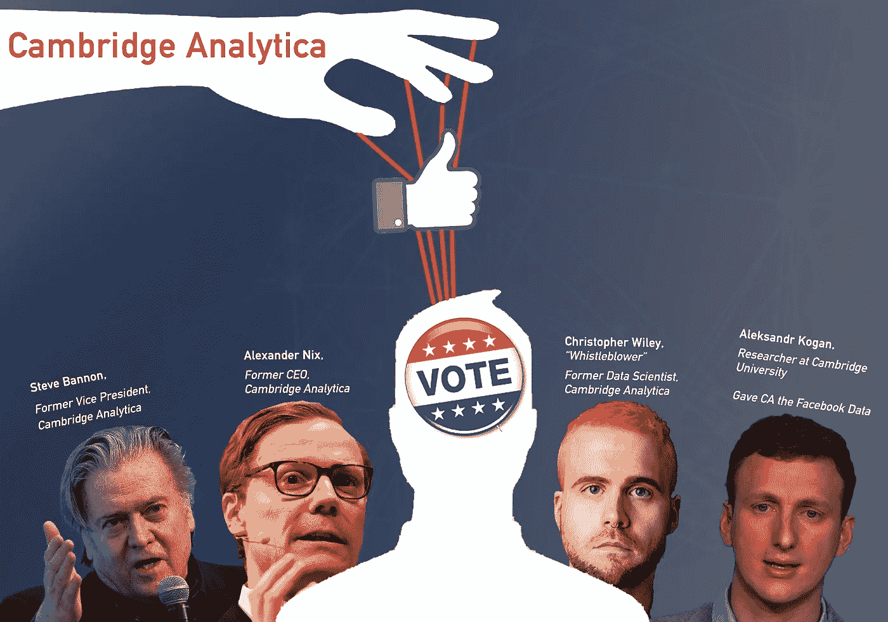

而不是表面上的(你喜欢的脸书页面与个性测验分数的关联)。但是在引擎盖下。用一种大多数人都能理解的语言……好啊 Excel 先生。

作为一个自称的数据迷和电子表格活动家，我试图满足我的好奇心，并对我发现的简单性感到惊讶。

通过一个名为 LASSO regression 的一般线性回归模型，我将使用电子表格向您展示**机器学习如何比只有 125 个脸书喜欢**的家庭更好地预测您的个性。听起来有点反乌托邦，但却是事实。

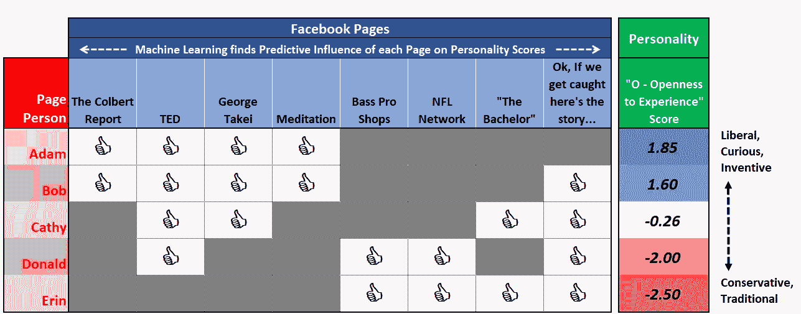

你的数据是有价值的，你有权知道它是如何被使用的。

**第 1-3 部分(约 10 分钟)讲述了所发生的事情，并向你介绍了丑闻的背景。**您将了解微定位(根据您的个性档案向您发送个性化广告)的实践，以及如何收获 8700 万份脸书档案。

**第 4-5 部分(约 15 分钟)向您展示了如何做到这一点——数据科学。如果你对丑闻很熟悉，只是想要教程，跳过这里。第 5 部分是我们打开引擎盖查看细节的地方。**

## **Google Drive 电子表格链接:**

这个模型最好在 Excel 中查看，但是你也可以在 Google Sheets 中在线查看(calcs 比较慢),并且有一个 PDF 格式的数学(文章的第 5 部分),便于离线参考。

*   [https://drive . Google . com/drive/folders/1hx _ mhajbsdq w5 jpwtwcpgihm 2 xyl 3 RH 7？usp =共享](https://drive.google.com/drive/folders/1hx_MhAjBsdqw5JPwTwCPgIHM2xYL3Rh7?usp=sharing)


像任何超能力一样，机器学习会被反派(Cambridge Analytica)和英雄一样使用([危机文本行](https://www.crisistextline.org/blog/ava2))。小心行事。

如果你喜欢这篇文章，并想获得其他免费的电子表格教程，帮助你理解像[面部识别](/cutting-edge-face-recognition-is-complicated-these-spreadsheets-make-it-easier-e7864dbf0e1a)或网飞如何提出你的建议，在这里注册我的电子邮件列表:

[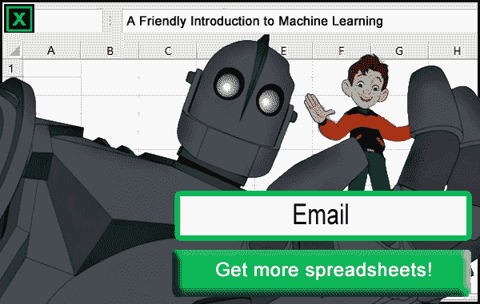](http://bit.ly/2EsMan8)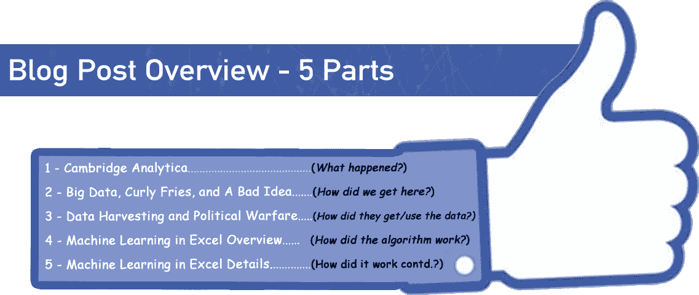

剑桥分析公司(Cambridge Analytica)是一家数据驱动的分析公司，专门从事心理特征分析或“心理战”，于 2016 年 6 月被特朗普竞选团队聘用，负责领导其数字行动，直至 11 月的大选，并吹嘘说**他们拥有美国每个成年人的多达 5000 个数据点**。


Source: [https://cambridgeanalytica.org/](https://cambridgeanalytica.org/)

呼气…哇。

事实上，他们在其网站上将此列为一项成就(连同截至 2018 年 5 月的破产通知)。

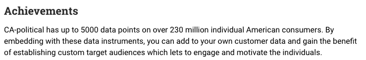

Source: [https://ca-political.com/](https://ca-political.com/)

在选举前的几个月里，CA 将他们的数据宝库投入到他们的个性预测机器中，建立了针对不同受众的 [10，000](https://www.theguardian.com/uk-news/2018/mar/23/leaked-cambridge-analyticas-blueprint-for-trump-victory) 高度个性化的脸书广告，以努力操纵未决选民的投票行为，抑制投票率。

肯·波恩有人吗？

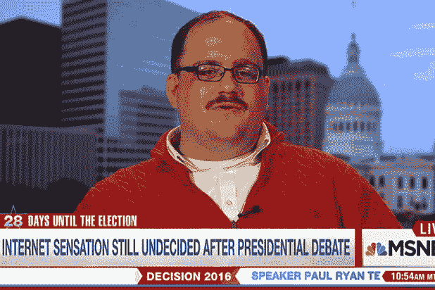

他们称这种广告行为为“微定位”帮助开发这些工具的前 CA 神童数据科学家和告密者 Christopher Wiley[称之为](https://www.theguardian.com/news/2018/mar/17/data-war-whistleblower-christopher-wylie-faceook-nix-bannon-trump):

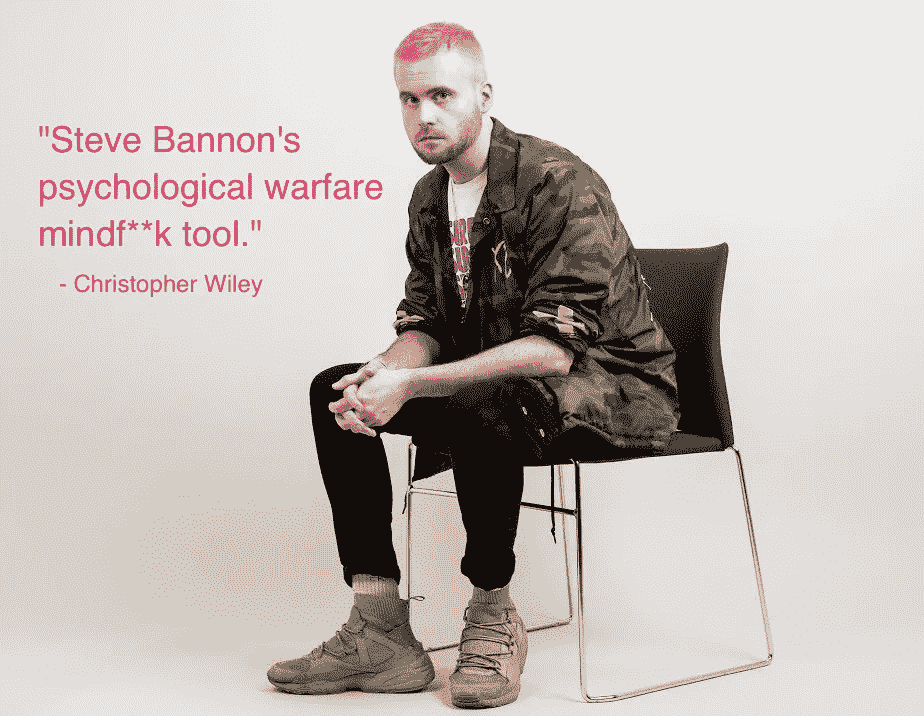

Source: [The Guardian](https://www.theguardian.com/news/2018/mar/17/data-war-whistleblower-christopher-wylie-faceook-nix-bannon-trump); (Note: caption added by me)

你的选民记录，你在哪里购物，你的推文，你的地理位置电话数据，你去什么教堂，你看的电视节目，你的脸书喜欢。他们有。

尤其是你这样的人。

有了足够多的你喜欢的人，心理剖析领域的前沿研究人员在 2014 年证明，计算机在预测你的性格方面比你最亲近的人更准确。

*   只要有 9 个脸书喜欢，计算机就能预测你和同事的性格。
*   有 65 个赞，还有一个朋友。
*   有了 125 个赞，你的家人。

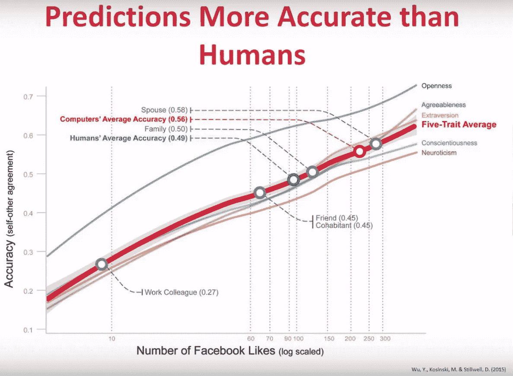

“Computer-based personality judgments are more accurate than those made by humans”: [http://www.pnas.org/content/pnas/112/4/1036.full.pdf](http://www.pnas.org/content/pnas/112/4/1036.full.pdf)

根据剑桥研究人员的说法，他们最终收获了 CA 微定位操作中使用的脸书数据，仅在 1 周内就可以从头开始学习这样的机器学习模型:

> 数据远比模型更有价值，因为如果你有数据，建立模型是非常容易的——因为模型只使用一些很好理解的统计技术来建立它们。我能够在一周内从不做机器学习变成知道我需要知道什么。就这么多。亚历山大·科岗

他是对的。

在大计划中，模型(你的喜好和个性测验分数之间的一种关联)是容易的部分。

在讨论如何使用心理分析以及如何收集 8700 万份脸书档案之前，有几件事我想说出来…

# 我的 4 个警告—数据科学不是万能的

1.  **数据科学不是万能的。光靠它不能操纵选举或让一个好的候选人变坏。然而，当选举由[极微弱优势](https://www.washingtonpost.com/graphics/politics/2016-election/swing-state-margins/?noredirect=on)决定时，毫无疑问，技术可以发挥作用。**
2.  微观定位在政治中的有效性广受争议，但我们不知道它在特朗普竞选中的效果如何。在选举之后，丑闻各方的关键人物(川普竞选团队、CA、特德·克鲁兹竞选团队、[亚历山大·科岗](https://youtu.be/APqU_EJ5d3U))都公开声称 CA 的模特是[一文不值的蛇油](https://www.motherjones.com/politics/2018/03/cloak-and-data-cambridge-analytica-robert-mercer/)、[自切片面包](https://ca-commercial.com/news/ca-congratulates-donald-trump-and-mike-pence)以来最好的东西，或者根本没用过。其他[怀疑者](https://www.nytimes.com/2017/03/06/us/politics/cambridge-analytica.html)对微定位的有效性进行了辩论，而该领域的[研究人员](https://www.gsb.stanford.edu/insights/science-behind-cambridge-analytica-does-psychological-profiling-work)则持不同意见。鉴于 CA 的模型不在公共领域(谢天谢地)，我不会猜测它们在多大程度上帮助或没有帮助特朗普获胜。请记住，大多数方面都受到激励，要么保持距离，要么邀功。

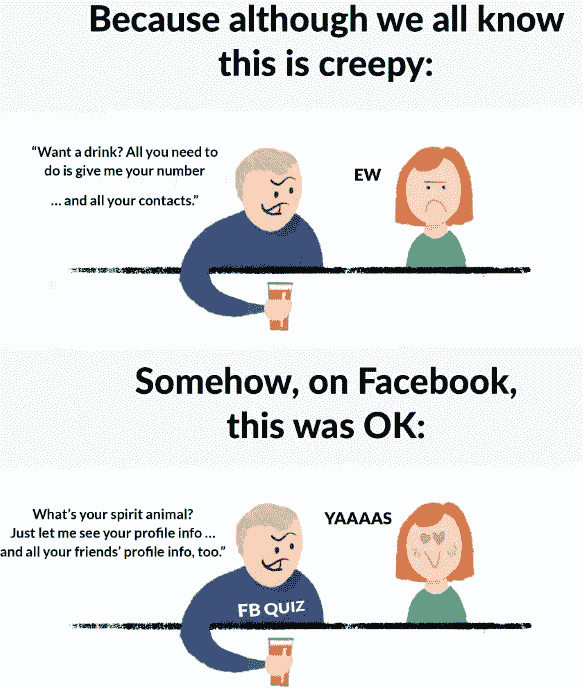

Source: [https://overthinkgroup.com/facebook-cambridge-analytica/](https://overthinkgroup.com/facebook-cambridge-analytica/)

**3。这一丑闻的根源是同意。在 2014 年之前，[脸书的开发者政策](https://techcrunch.com/2015/04/28/facebook-api-shut-down/)允许第三方应用在没有朋友同意的情况下收集脸书用户朋友的数据。因此，尽管只有约 30 万人参加了在线性格测试并表示同意……这也暴露了他们朋友的数据(他们没有明确表示同意)……8700 万人。该数据随后与 CA 共享(违反脸书的政策)。没有黑客入侵，数据永远在外面。**

**4。您的数字足迹正在增长。机器变得越来越智能。政治是一场高风险的游戏。**这不是你最后一次听说坏人利用你的数据进行邪恶的活动(*叹气*)，但是知情是很重要的，这样你就可以在数据隐私方面做出自己的选择。数据经纪人不歧视政党，在某些情况下，你可以看到这些机构掌握的你的数据。像 CA [这样的组织已经被用于](https://www.nbcnews.com/politics/donald-trump/donald-trump-s-2020-campaign-working-ex-cambridge-analytica-staffers-n883651)2020 年的选举，脸书现在有一个[选举作战室](https://techcrunch.com/2018/10/18/facebook-election-war-room/)来应对新出现的威胁，所以这不是你最后一次听到这个消息。

既然我已经一吐为快了，让我们来看看心理侧写是如何工作的。


# 你思想的隐形操纵者

心理测量是一种测量个人性格的科学尝试，自 20 世纪 80 年代以来一直存在。

简单来说，人们参加一个问答性格测验，他们在标准的“[大五](https://en.wikipedia.org/wiki/Big_Five_personality_traits)”性格特征(海洋)上得分。

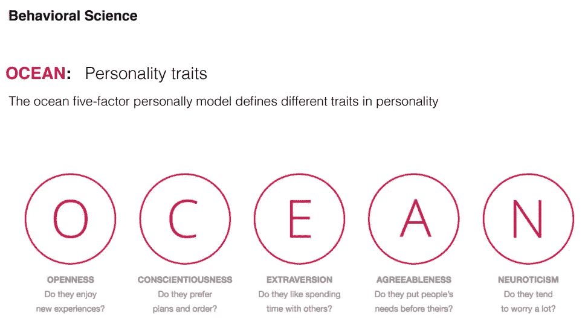

Source: Cambridge Analytica

一旦你知道了某人的个性，你就可以将他们分成不同的广告段，并根据他们的个人口味，发布量身定制的有说服力的广告。

# 大数据的兴起

尽管心理特征分析已经存在了几十年，但问题总是在于数据收集。

由于[大多数性格测验](http://www.personal.psu.edu/~j5j/IPIP/)涉及 100 多个问题(如下例),需要 20-30 分钟才能完成……从全球范围内的大范围人群中收集数据从来都不容易。

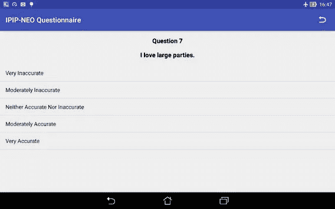

Sample personality question from IPIP

然后脸书在 2004 年出现了。

“大数据”一词是在 2005 年创造的。

第一代 iPhone 发布于 2007 年。

我们的数字足迹开始呈指数增长。

# 大研究和炸薯条

突然，研究人员看到了机会。

[2007 年](https://www.gsb.stanford.edu/sites/gsb/files/conf-presentations/stillwell_and_kosinski_2012.pdf)，剑桥心理测量中心的两名心理学研究人员开发了一款脸书性格测试应用(myPersonality)，并迅速走红。超过 600 万人使用该应用程序，其中近一半的人允许研究人员使用他们的脸书数据。

社会科学家现在有了一座个性数据的金矿，他们可以从中挖掘洞察力。

2013 年，他们发表了突破性的研究，表明你对脸书的喜欢可以预测你的个性和政治观点(以及其他方面):

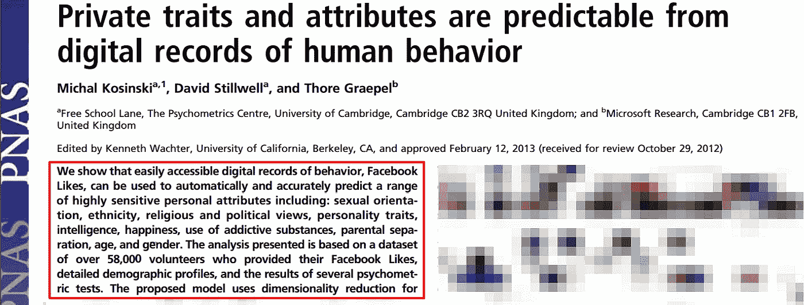

Source: [http://www.pnas.org/content/pnas/early/2013/03/06/1218772110.full.pdf](http://www.pnas.org/content/pnas/early/2013/03/06/1218772110.full.pdf)

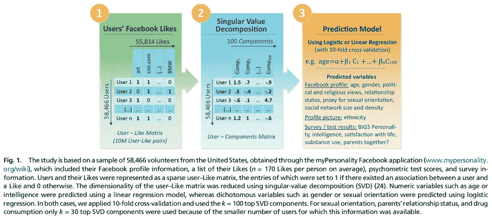

Source: [http://www.pnas.org/content/pnas/early/2013/03/06/1218772110.full.pdf](http://www.pnas.org/content/pnas/early/2013/03/06/1218772110.full.pdf)

有趣的是，它表明高智商的最佳预测者是“雷暴”、“科尔伯特报告”和“卷曲的薯条”(*注意:相关不等于因果……吃薯条不会让你更聪明，斯蒂芬哈哈！*)。


“I can feel my brain getting bigger.” — Stephen Colbert ([https://archive.org/details/COM_20130328_083000_The_Colbert_Report/start/840/end/900](https://archive.org/details/COM_20130328_083000_The_Colbert_Report/start/840/end/900))

同样，喜欢“Hello Kitty”的人往往有“O——开放”的分数。

在他们的研究中，他们就数据隐私和所有权的含义敲响了警钟，但有其他议程的人很快注意到了这一点。

# 一个坏主意

在加入加州大学之前的 2013 年夏天， [Christopher Wiley 发现了这篇论文并说](https://www.theguardian.com/news/2018/mar/17/data-war-whistleblower-christopher-wylie-faceook-nix-bannon-trump):

> “然后我偶然看到一篇关于性格特征如何可能是政治行为的先兆的论文，它突然变得有意义了。自由主义与高度开放和低自觉性相关，当你想到自由民主党时，他们是心不在焉的教授和嬉皮士。他们是早期采用者…他们对新思想非常开放。突然间，一切都变得明朗起来。”

2013 年晚些时候，Wiley 被介绍给了 Alexander Nix，后者向他提供了一份在英国行为研究和传播公司战略传播实验室(Strategic communication s Laboratories)担任研究总监的工作，该公司随后创建了美国子公司 Cambridge Analytica。

尼克斯告诉怀利，

> “我们会给你完全的自由。实验。来测试你所有疯狂的想法。”

那不是个好主意。

在为 SCL 做研究时，威利与史蒂夫·班农取得了联系。鉴于班农作为《布莱巴特》主编对政治的兴趣以及他对奈杰尔·法拉奇脱离欧盟英国退出欧盟运动的支持，克里斯关于政治信息的想法激起了班农的兴趣。

12 月，CA 成立，班农担任副总统，并得到共和党超级捐助者和人工智能先驱罗伯特·默瑟的资金支持。

有了充足的储备，CA 需要找到一种方法来获得脸书的数据并实现他们的政治说服承诺。

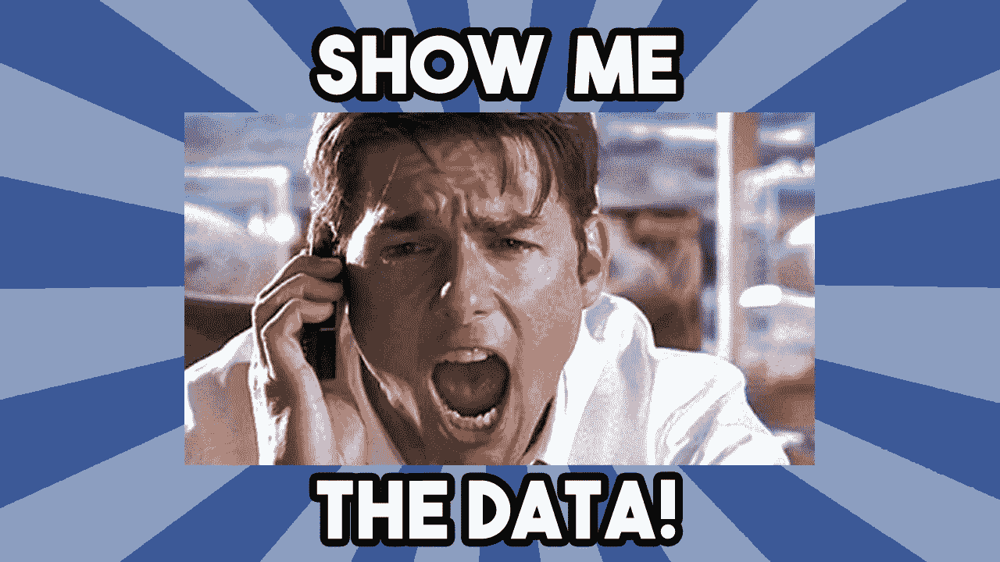

# 数据采集季节到了

亚历山大·科岗出场了。

科岗是剑桥大学的一名研究员，2014 年初，威利和科岗经人介绍认识了对方。

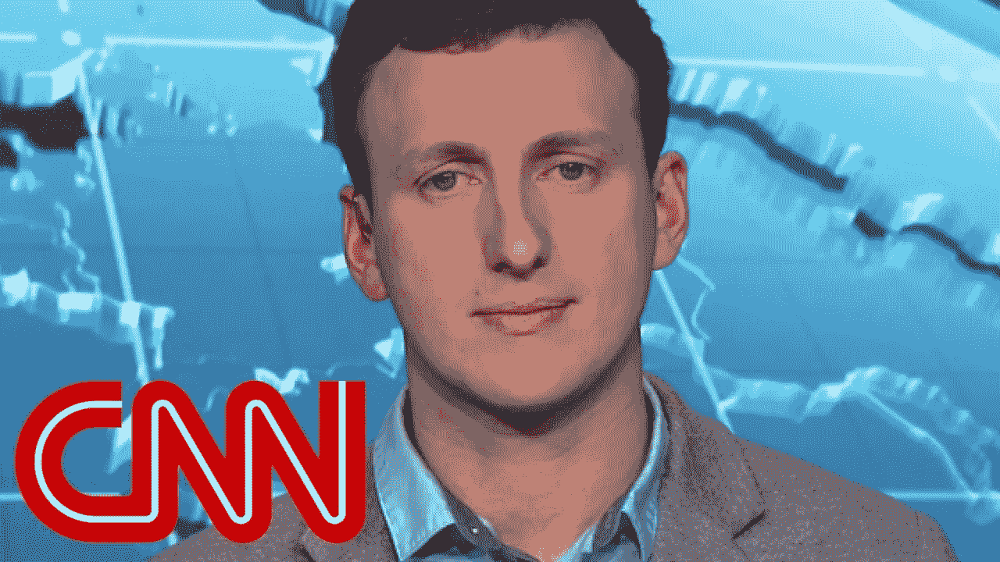

威利和 CA 对科岗的研究实验室从他们的应用程序中获得的脸书数据感兴趣。

CA 愿意向研究人员支付数据费用；然而，[科岗和他的大学同事们](https://www.theguardian.com/education/2018/mar/24/cambridge-analytica-academics-work-upset-university-colleagues)之间的谈判破裂了(他们既有伦理上的顾虑，也和科岗有金钱上的纠纷)，所以科岗和 CA 设计了另一个计划。

科岗主动提出开发自己的应用程序，自己收集数据。CA 同意并帮助他建立了一个名为[全球科学研究或“GSR](https://www.cbsnews.com/news/aleksandr-kogan-who-is-university-of-cambridge-lecturer-facebook-cambridge-analytica-scandal-2018-04-21/) 的独立实体 GSR 将获取数据，与 CA 共享，CA 将补偿 GSR 的费用。

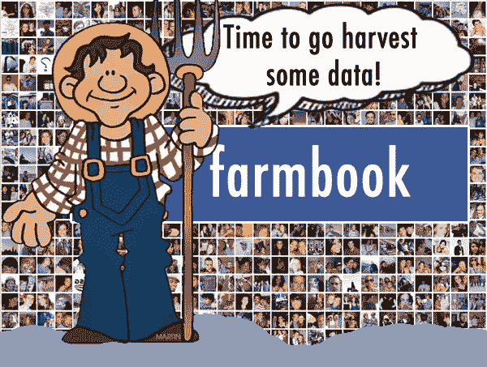

Data Harvesting

为了加快收集数据，GSR 使用了第三方在线调查公司 Qualtrics，并通过亚马逊的 Mechanical Turk 向用户支付 2 至 4 美元进行性格调查。

受访者被要求授权访问他们在脸书的个人资料，科岗的应用程序执行了它的唯一功能——收集他们在脸书的数据和朋友的数据。

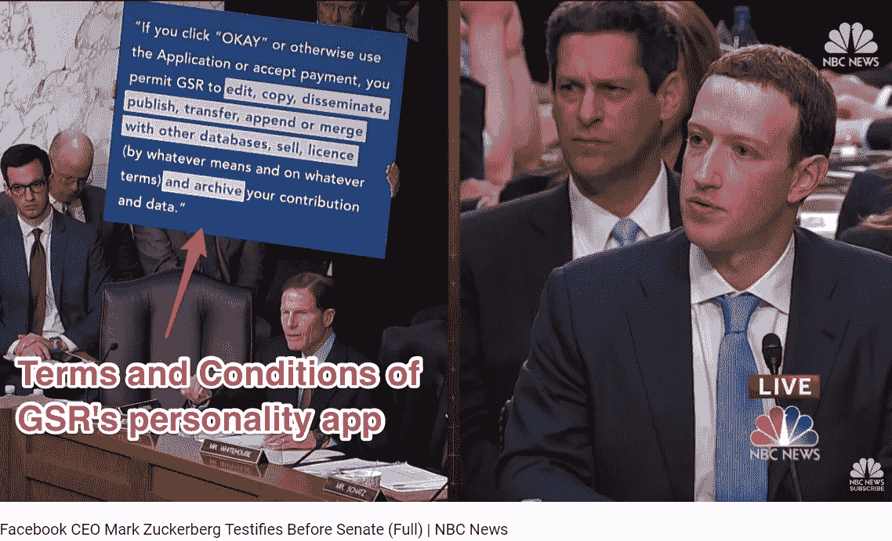

Senate Judiciary Hearing on April 10, 2018; Source: [https://youtu.be/BylLTX05jSY?t=13699](https://youtu.be/BylLTX05jSY?t=13699)

总共有超过 300，000 名脸书用户参加了这次测验(CA 花费了大约 100 万美元)，这相当于收集了大约 8，700 万人的脸书数据(你的喜欢和其他个人资料数据，如你的位置、你的名字等……)。

以下是我整理的时间表，展示了一些关键角色之间的联系:

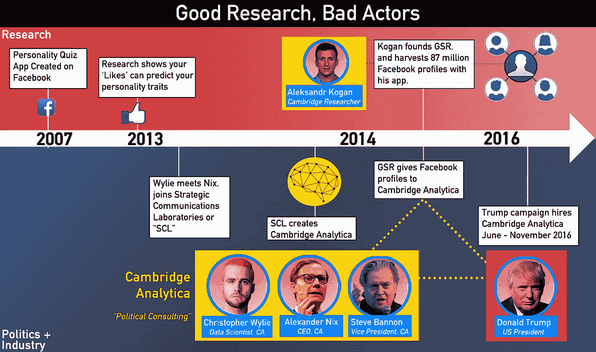

Good Research, Bad Actors

**那么哪里出了问题？**

1.  在应用程序审核过程中，脸书未能阅读 GSR 应用程序的所有条款和条件(见上面的条款图片&条件)。他们[在法庭上承认了这一点](https://www.washingtonpost.com/news/the-switch/wp/2018/04/26/facebook-didnt-read-the-terms-and-conditions-for-the-app-behind-cambridge-analytica/?utm_term=.c92dcff8d088)，GSR 的条款规定他们可以出售人们的数据。
2.  **不管 GSR 自己的条款如何，GSR 自己忽略了脸书的应用程序开发者政策**(科岗声称没有阅读)，该政策禁止他们与 CA 共享数据。
3.  **朋友没有明确同意** —脸书的应用开发者政策(当时)允许一个人同意他们所有朋友的数据。

现在 CA 有了他们的数据，是时候让他们使用，呃…“滥用”它了。

# 从实验室到政治说服

> “我们利用脸书收集了数百万人的个人资料。并建立模型来利用我们对他们的了解并锁定他们内心的恶魔。这是整个公司建立的基础。”— Christopher Wiley，加州大学前数据科学家

这里有一个简单的例子来说明微定位是如何工作的:

1.  **识别选民**——利用选民记录和其他数据，识别尚未做出决定的选民
2.  **ID 热点话题** —选择一个对选民来说重要的“热点”话题，如第二修正案(持枪权)
3.  **调整广告以适应个性**——根据个人的个性档案，细微调整信息以更好地引起那个人的共鸣。
4.  **匿名投放广告**——通过一种被称为“暗帖”(现已被禁止)的脸书做法，匿名购买广告并投放给符合你标准的人

正如 Alexander Nix 所解释的那样，例如，一个高度神经质(‘N’)和高度尽责(‘C’)的人需要一个理性的、基于恐惧的信息。他们会看到一张窃贼进入他们家的照片，因为入室盗窃的威胁以及拥有枪支的保险单很有说服力。


Source: Cambridge Analytica

相反，一个开放程度低(“O”)且非常随和(“A”)的人需要根植于传统和家庭的信息。他们会看到一张父亲将价值观传递给儿子的照片。

根据一名前 CA 员工泄露的内部幻灯片[显示，在特朗普竞选期间，他们的广告被观看了 15 亿次。](https://www.theguardian.com/uk-news/2018/mar/23/leaked-cambridge-analyticas-blueprint-for-trump-victory)

随着大数据的兴起，广告变得越来越个性化也就不足为奇了。不过，问题不在于个性化广告。问题在于数据隐私、缺乏透明度和同意。

现在我将使用一步一步的电子表格来解释丑闻背后的数据科学。是的，有数学。但是你可以遵循所有的公式…不需要编码。


在这一部分，我将讨论:

1.  **性格预测研究中使用的算法概述**
2.  **拉索回归简介**
3.  **拉索回归中如何选择最佳λ**

将第 4 部分视为套索回归的“鸟瞰”级别视图；然而，第 5 部分是“虫眼”视图。

在第 5 部分中，您将看到所有的逐步数学推导和对 Excel 文件中公式的引用。它非常详细，但坦率地说，我不能忍受教程隐藏这些细节，所以我们将得到引擎盖下！

# 4.1 个性预测算法概述

尽管 CA 使用的确切算法并不公开，但我们可以转向他们的想法所基于的研究论文，并从采访中收集见解。

以下是我们从两篇重要研究论文中了解到的情况:

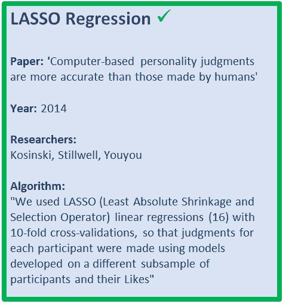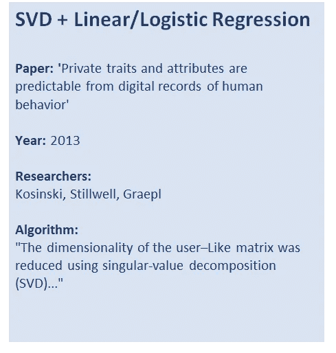

LASSO: [http://www.pnas.org/content/pnas/112/4/1036.full.pdf](http://www.pnas.org/content/pnas/112/4/1036.full.pdf); SVD: [http://www.pnas.org/content/pnas/early/2013/03/06/1218772110.full.pdf](http://www.pnas.org/content/pnas/early/2013/03/06/1218772110.full.pdf)

我选择 LASSO 回归作为本教程的参考，是因为两篇论文背后的一位研究人员和亚历山大·科岗(剑桥的研究人员，他给了 CA 所有的脸书数据)所做的评论。

2018 年在艾伦·图灵研究所谈论他 2014 年的论文时，论文背后的一名研究人员[这样说](https://youtu.be/251r5ja4zJU?t=960):

> "我们没有做奇异值分解，而是做了套索回归，这提高了我们的精确度."

再者，科岗有[说](https://theconversation.com/how-cambridge-analyticas-facebook-targeting-model-really-worked-according-to-the-person-who-built-it-94078):

> “我们并没有完全使用 SVD，”他写道，并指出当一些用户比其他人有更多的“喜欢”时，SVD 可能会很困难。相反，科岗解释说，“这项技术实际上是我们自己开发的……它不属于公共领域。”没有深入细节，科岗将他们的方法描述为“多步骤共现方法”

当你有高维数据时，SVD 和 LASSO 都是强有力的技术(一个“大”的特征…就像我们例子中的数百万个“脸书页面”)。它们都为您提供了消除数据冗余、关注最具预测影响力的信息以及提高计算效率的方法。LASSO 还有一个额外的优点，那就是可解释性。

# 4.2 套索回归简介

套索回归是一种线性回归，它使用 L1 正则化(如下所述)来防止过度拟合和执行自动特征选择。

由于我们的目标是找到最重要的脸书页面对个性得分的预测影响，自动特征选择(消除没有影响或多余影响的脸书页面)非常有吸引力。

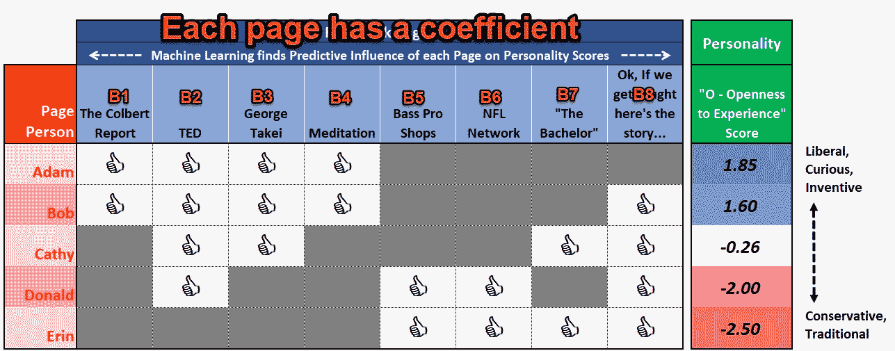

Each Facebook Page‘s coefficient determines that page’s predictive influence

先定义 LASSO 代表什么，定义背后的目标函数(基于 [scikit-learn 对 LASSO 的实现](http://scikit-learn.org/stable/modules/generated/sklearn.linear_model.Lasso.html))。

> L 东**A**b**S**hrinkage**S**选举 **O** 操作员

目标是找到使我们的目标函数最小化的系数(贝塔系数)(下面以 4 种不同方式给出):

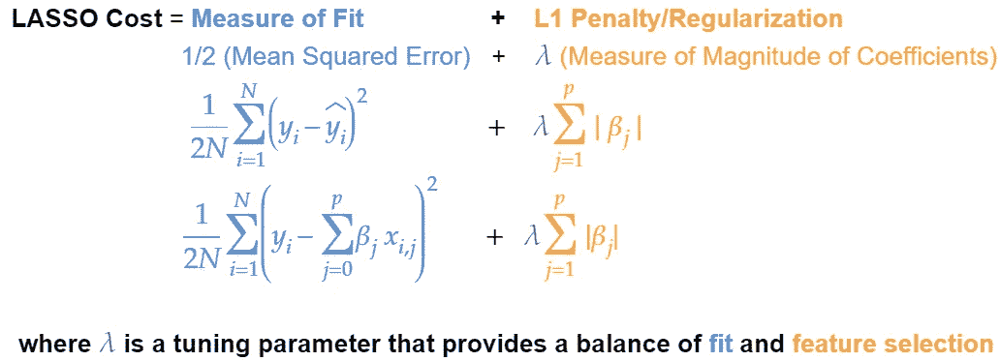

在方程的前半部分，拟合度，我们有一个简单的均方误差方程(前面的 1/2 项是为了简化我们将在第 5 部分探讨的数学)。

在等式的后半部分，L1 惩罚，如果λ(我们控制的调谐参数)大于零，那么如果我们希望最小化目标函数，添加我们的系数的**绝对值**意味着我们的系数必须**收缩**(与没有惩罚的系数值相比)。

因此，套索中的“最小绝对收缩率”或“LAS”。

把 L1 的处罚想象成收缩射线。它将缩小系数的大小…并且有可能使系数消失。

L1 penalty is like a shrink ray gun. It shrinks coefficients and sometimes makes them disappear!

你可能想知道为什么我们要增加一个惩罚来缩小系数的大小？答案是防止“过度拟合”

当算法“记忆训练数据”时，就会发生过度拟合，这意味着它不会针对看不见的/测试数据进行很好的概括。添加惩罚有助于“调整”系数的大小，并改进算法对从未见过的维持数据的预测。

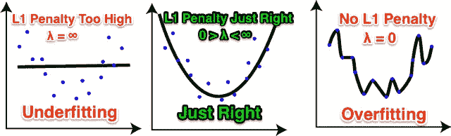

L1 penalty prevents overfitting

正如我们将在下一节中看到的，当 lambda 值足够高时，它也会迫使一些系数为零，因此充当'**选择运算符**'(LASso 中的“SO”)。具有零系数的页面意味着该页面在预测中被忽略，并且当我们有许多具有零系数的页面时，这被称为“稀疏解”

反之，如果系数很大(真的很高或者真的很低)，则说明该页面的影响力度很高。

# 4.3 如何在 LASSO 回归中选择λ

选择最佳 lambda 值的一种流行技术叫做交叉验证。

在 k-fold 交叉验证中，您任意选择一系列 lambda(我在 [Excel 模型](https://drive.google.com/drive/folders/1hx_MhAjBsdqw5JPwTwCPgIHM2xYL3Rh7?usp=sharing)中使用 0.0、0.01、0.10、1.0)，查看每个在您的验证集上的表现，并选择在所有验证集中具有最低平均误差的 lambda。

例如，如果我们有足够的数据(未在 Excel 中显示)，我们会将我们的数据分成训练/测试集，然后进一步将我们的训练数据分成 5 (k)个折叠或分区。在 5 个验证集上测试了每个 lambda 之后，我们会选择平均误差最小的一个。

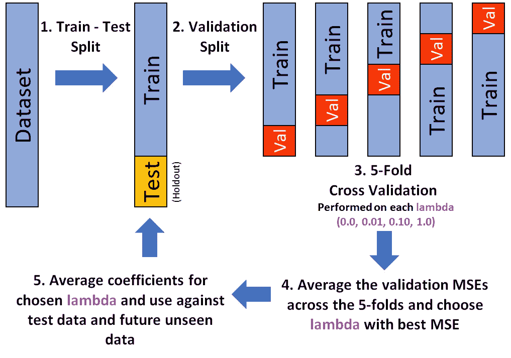

在 Excel 模型中，我使用了一个*难以置信的***小数据集作为文件，旨在便于遵循并向您传授关键原则:**

*   训练集= 5 人(和 8 个可能的脸书页面)
*   测试集= 2 人
*   验证集=无

假设没有验证集，两个人的测试集将足以在 Excel 模型中选择最佳的 lambda😎

在测试了所有的λ之后，当我们增加λ的大小时，可视化收敛的脸书页面系数的路径是有帮助的(参见表“C1”。Excel 文件中的分析-套索追踪):

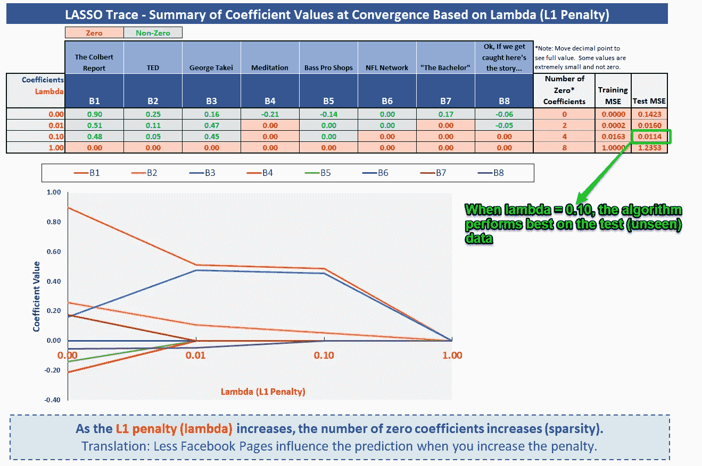

LASSO Trace — Tracking Coefficient Values Based on Different Lambdas

这给了我们几个推论:

1.  随着λ的增加，稀疏度增加…零系数的数量从零增加到全部
2.  当λ为零时(没有 L1 惩罚)，使用所有系数，并且训练 MSE 是最佳的；然而，当 lambda 为 0.10 时，测试 MSE(最终影响因素)是最佳的。
3.  当λ太低时，0.0，我们过度拟合(低训练 MSE，较高测试 MSE)。当λ太高(1.0)时，我们处于拟合不足状态(高训练和测试 MSE)。

现在你已经对 LASSO 做了什么有了一个高层次的了解，我们将处理一些具体的数学问题，并浏览如何在 Excel 模型中为特定的 lambda 训练算法。


现在是我们动手的时候了…在我们训练算法的时候，我会处理下面的每个部分。

1.  **定义目标函数、关键术语和 Excel 文件概述**
2.  **数据预处理——从“喜欢”到“标准化”**
3.  **用零初始化系数**
4.  **循环坐标下降—一次更新一个系数**
5.  **迭代直至收敛**

我们的目标是找到对某人的开放程度最有预测性影响的脸书页面(海洋人格得分中的“O”)。虽然 Excel 文件中的人是虚构的，但脸书的 8 页是研究论文中最有影响力的部分。

# 5.1 定义目标函数、关键术语、Excel 文件

如第 4 部分所述，我们的目标是找到使套索成本函数最小化的系数(为了清楚起见，下面给出了几种方法)。在函数下面是一个图例，解释每个希腊符号。

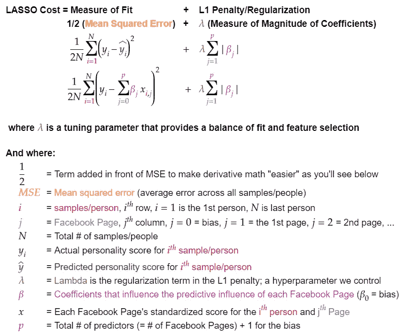

当我们完成训练算法的步骤时，您可以参考表“B1”。TrainingAlgorithm_Lambda_.01”了解数学运算。

我会告诉你如何更新 1 脸书页的系数。

由于每个系数是“一次一个”更新的(而不是像[梯度下降](https://medium.com/excel-with-ml/machine-learning-with-spreadsheets-part-1-gradient-descent-f9316676db9b)中那样“一次/同时更新”)，您可以将相同的数学方法应用于后续的系数更新。

Excel 表从左到右将“迭代”(所有系数的完整训练循环)组织成多个部分。在每次迭代中，你可以看到每个脸书页的系数是如何一次更新一个的。最后，你可以在左上角看到我们的 lambda 超参数。

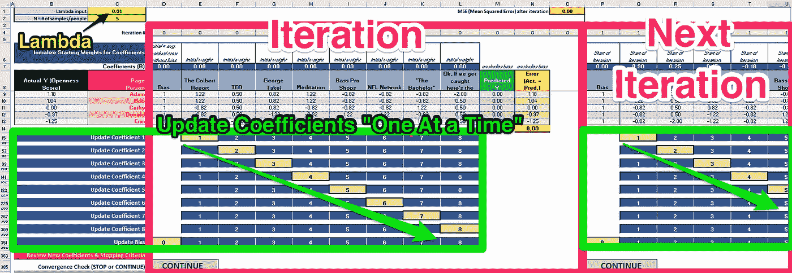

在我们训练我们的算法之前，我们必须把我们的‘喜欢’转换成计算机能理解的语言……0 和 1！

# 5.2 数据预处理:从“喜欢”到“标准化”

我们训练管道的第一步是预处理我们的数据。参见 Excel 文件中的表“a .预处理数据”。

我们首先将每个“Like”转换为“1 ”,其他的都变成“0 ”:

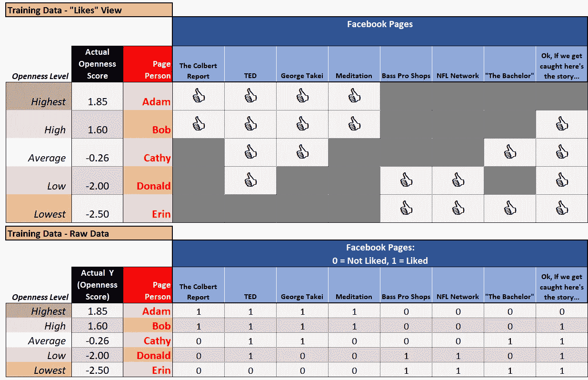

接下来，为了确保一个页面的受欢迎程度不会影响算法对该页面的权重，我们必须让每个脸书页面处于相同的比例。

如果一个页面非常受欢迎(比如“TED”——5 个人中有 4 个人喜欢它)，我们需要一种方法来确保算法不会对这个页面和一个不太受欢迎的页面(比如“单身汉”——5 个人中只有 2 个人喜欢它)产生不同的权重。

为了实现这种缩放，我们使用一种称为标准化的技术。标准化使每个页面居中，因此每个页面的平均分数为 0，标准偏差为 1(这使每个页面符合相同的“钟形曲线”)。

```
**Standardization Formula (also in Excel file):** (Sample Page Raw Score — Page’s Average Score)
 =   ______________________________________________
           Page’s Standard Deviation
```


Preprocessing Data — Standardization

# 5.3 用零初始化系数

在训练开始时，每个脸书页面的系数从 0 开始。

然后，使用一种称为“循环坐标下降”的迭代更新方法，该模型“学习”每次调整 1 个系数，以根据我们的训练数据生成更好的预测。每个系数都可以被认为是一个“坐标”，我们按顺序循环(从第一个开始，到第八个结束)。

由于我们的数据在训练开始时是标准化的，我们可以有效地忽略偏差，因为它对模型没有影响。

参见表 B1。TrainingAlgorithm_Lambda_.01 ":

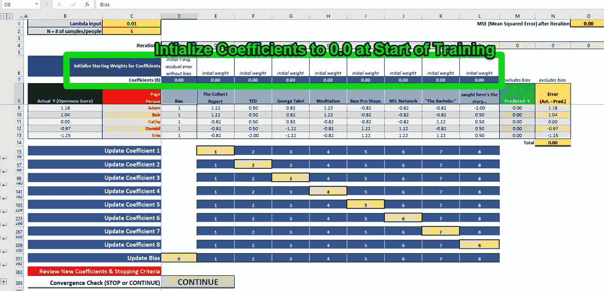

为了确保这个算法可以重现，我在每次迭代中以循环顺序更新系数；但是，这不会在生产中产生最好的效果。

由于 LASSO 在消除冗余方面做得很好，因此按顺序更新它们将导致算法保留第一个脸书页面的系数，如果有两个页面有相同的喜欢。

如果你用 Python 实现 LASSO(比如 sci-kit learn 的包)，最好选择“随机”而不是“循环”这将确保每次迭代中系数更新的顺序是随机的，这也将导致更快的收敛。

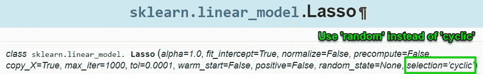

[http://scikit-learn.org/stable/modules/generated/sklearn.linear_model.Lasso.html](http://scikit-learn.org/stable/modules/generated/sklearn.linear_model.Lasso.html)

# 5.4 **循环坐标下降:更新系数**

⚠️在这一节，有**很多数学** ⚠️

为了清晰起见，展示了每一个艰苦的步骤，您将看到机器实际上是如何“学习”更新系数的。

为了便于参考，您可以查看作为 [PDF](https://drive.google.com/file/d/1avTTAtpLWlGR49UBGWLb7h10mJ15NB6t/view?usp=sharing) 的数学步骤，或者参考 [Excel 文件](https://drive.google.com/drive/folders/1hx_MhAjBsdqw5JPwTwCPgIHM2xYL3Rh7?usp=sharing)中的“D. LASSO 回归数学”表。

所有数学运算的最终结果提供了用于更新每个系数的 3 个更新规则。例如，参见表“B1”中的第 36–45 行。Excel 文件中的 TrainingAlgorithm_Lambda_.01 "。

如果这不适合你，你可以试试这种方法…

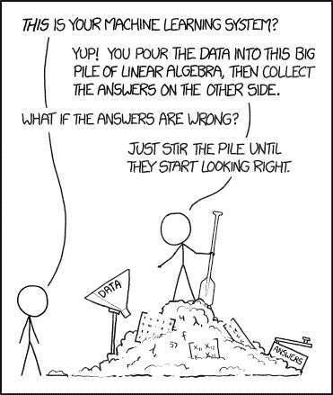

[https://xkcd.com/1838/](https://xkcd.com/1838/)

循环[坐标下降](https://en.wikipedia.org/wiki/Coordinate_descent)是一种优化算法。在每次迭代中，一个坐标(或“系数”)在使我们的目标函数最小化的方向上更新。

与[梯度下降](https://medium.com/excel-with-ml/machine-learning-with-spreadsheets-part-1-gradient-descent-f9316676db9b)的关键区别在于套索目标函数中的 L1 罚项[因绝对值符号而不可微](https://math.stackexchange.com/questions/991475/why-is-the-absolute-value-function-not-differentiable-at-x-0)。

本质上，如果我们知道函数的输出(如误差)将通过改变输入(如系数)的值而改变，那么函数就是可微的。

因为绝对值的导数可以是-1，未定义，或 1，所以它是不可微的。因此，我们必须计算“子梯度”,我们的更新规则将根据满足的条件采取 3 种形式中的 1 种。

以下是我们将涉及的 4 个步骤:

1.  **计算 MSE 相对于 1 系数的梯度(套索成本的第 1 部分)**
2.  **简化步骤 1 的结果，重新定义术语**
3.  **计算 L1 罚金的次梯度(套索成本的第 2 部分)**
4.  **将步骤 1 中的梯度与步骤 3 中的子梯度相结合，并定义 3 个更新规则。**

## **第 1 步，共 4 步:**

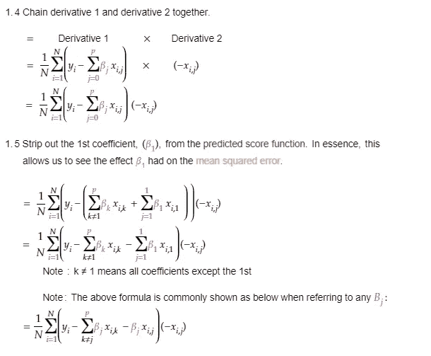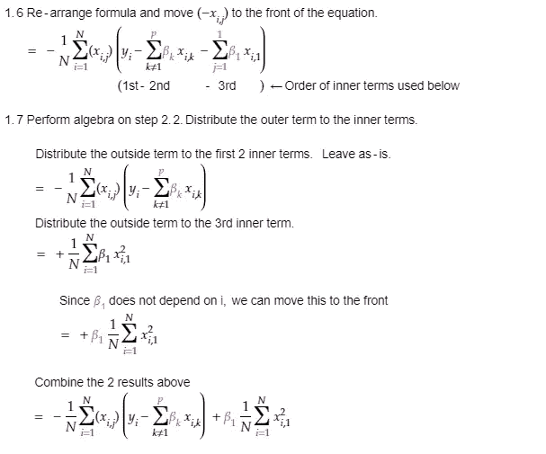

## 第 2 步，共 4 步:

在 Excel 文件中，您可以在工作表“B1”上看到这些计算。第 16–34 行中的 TrainingAlgorithm_Lambda_.01 "。

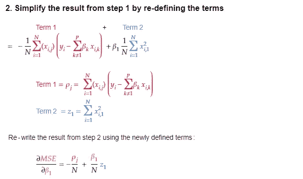

## 第 3 步，共 4 步:

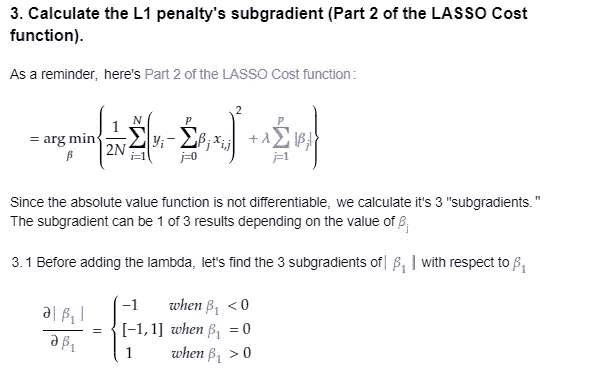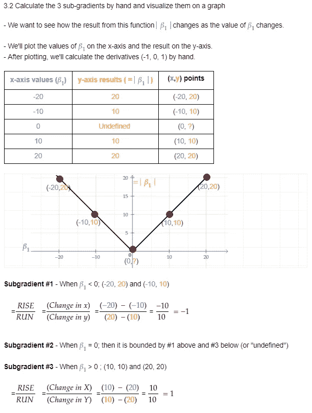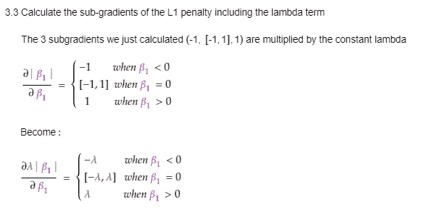

## 第 4 步，共 4 步:

在 Excel 文件中，您可以在工作表“B1”上看到这些计算。第 36–45 行中的 TrainingAlgorithm_Lambda_.01 "。

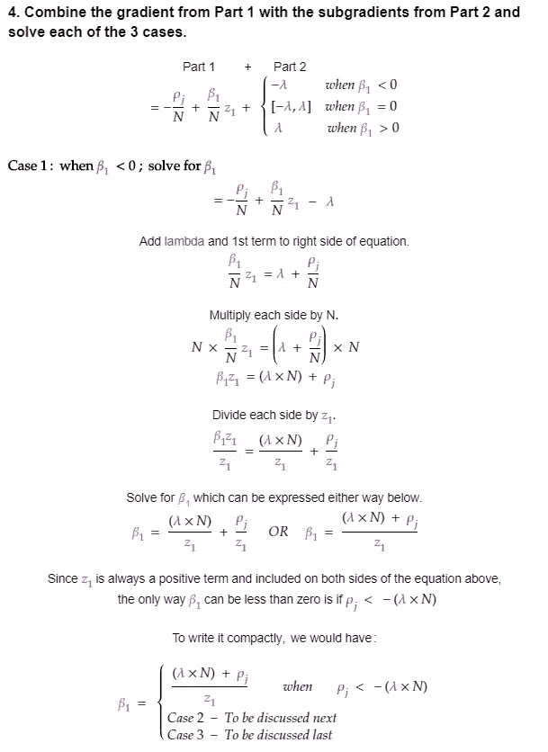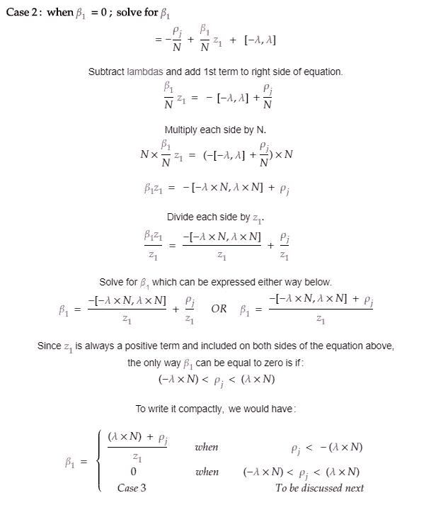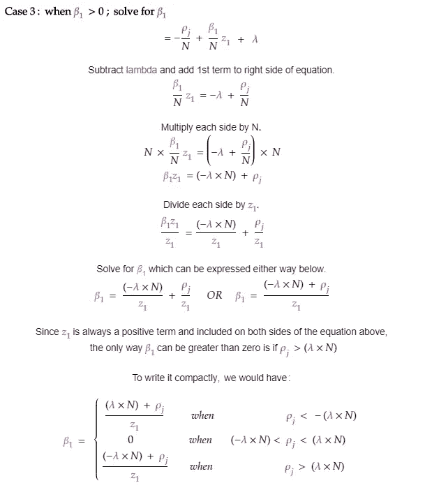

在你训练算法时一次更新一个系数之后，下一个问题是…你什么时候停止训练？

# 5.5 迭代直到收敛

在 LASSO 回归中，收敛标准是用户定义的，当满足以下两个条件之一时，算法停止训练:

1.  **最大迭代—** 一旦算法经过(插入次数)次迭代(对所有系数进行“训练循环”)，训练停止。
2.  **‘Tol = Tolerance’—**Tolerance 代表迭代前后系数值的变化。在每次迭代结束时，该算法比较该迭代之前/之后的每个系数的值，如果至少有一个系数的变化没有超过容差值，则训练停止。

在 Excel 文件中，可以在第 373–385 行看到公差标准，我使用的公差为 0.001。

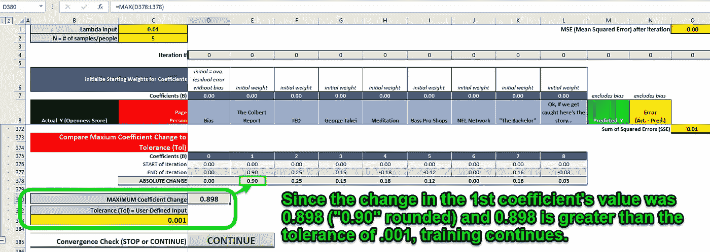

停止训练后，您应该选择在验证集上表现最好的 lambda，并检查系数。

# 包裹

当您拥有数百万个要素并且正在寻找一种简单的方法来解释结果时，套索回归是一种强大的工具。

在我们的例子中，我们可以看到“科尔伯特报告”是最有预测影响力的脸书页面；但是，请记住，算法首先看到了这一页，因为我们没有以随机顺序更新系数，所以这是一个有偏差的结果。

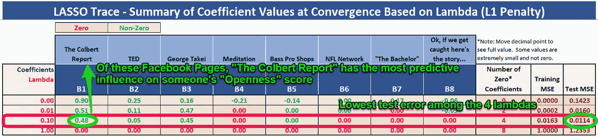

当我们反思脸书丑闻时，信任是双向的，当这种信任被打破时，各方都应该重新审视自己的信念、政策和行动。

我们正处于数字时代的婴儿期，我们几乎还没有找到自己的立足点，但随着技术的加速发展，我们的数字足迹将继续呈指数级增长:

*   作为消费者，你愿意放弃哪些数据来换取免费服务和个性化体验？
*   作为一家公司，你应该采取什么样的数据隐私政策？
*   作为一名数据科学家，你是否在遵循类似于[表示](https://www.signify.ai/blog/2018/5/2/the-five-rules-of-ethical-data-science)或[表示](https://www.cognizant.com/futureofwork/article/rethinking-data-privacy-and-trust)的道德清单？
*   作为政府，监管应该扮演什么角色？

在此类丑闻之后，社会对数据隐私的看法将继续被重塑，未能发展的公司将通过自然选择被淘汰。

数据科学既不是万灵药，也不是诅咒。当谈到心理测量学的未来时，斯坦福大学的研究员迈克尔·科辛斯基总结道:

> “这有点像火，”他说。“你可以用火来温暖你的房子，也可以烧掉它。你不能禁火，也不能阻止某些人纵火。你需要的是消防员和消防设备。”

# 订阅更多并分享

如果你喜欢这个，并且想在 Excel 中获得更多免费的机器学习教程，直接发送到你的收件箱，请点击下面并输入你的电子邮件。

课程包括如何建立你的第一个神经网络，面部识别如何工作，以及网飞如何生成你的建议。

如果你是一个电子表格积极分子，请与他人分享这篇文章😉

[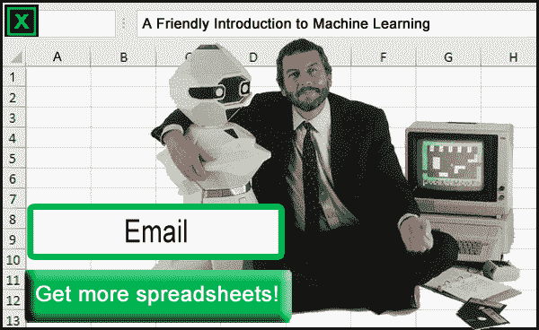](http://bit.ly/2CH0BCB)[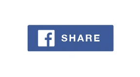](http://bit.ly/2CRk2J9)[](http://bit.ly/2R1S40j)[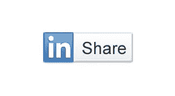](http://bit.ly/2P1NlOO)

其他资源:

*   [电影——关于心理测量学的 14 分钟纪录片+丑闻](https://youtu.be/3nnYwsj5BWk)
*   [拉索回归——VBA 教程](https://quantmacro.wordpress.com/2016/01/03/lasso-regression-in-vba/)(帮我做了详细的数学)
*   [拉索回归(L1) vs .岭回归(L2)——Python 中的精彩概述](https://www.analyticsvidhya.com/blog/2016/01/complete-tutorial-ridge-lasso-regression-python/)来自 [Aarshay Jain](https://github.com/aarshayj) 和 [Team AV](https://medium.com/u/c7c686fcd4b?source=post_page-----c9ab6fcd3d02--------------------------------)
*   [套索回归— Coursera 第一课](https://www.coursera.org/lecture/ml-regression/deriving-the-lasso-coordinate-descent-update-6OLyn)
*   脸书于 2012 年提交的[个性预测专利申请](https://patents.google.com/patent/US8825764B2/en)(在“喜欢”的预测能力研究发表之前)