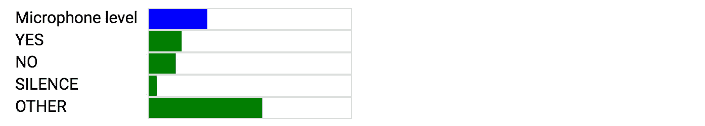
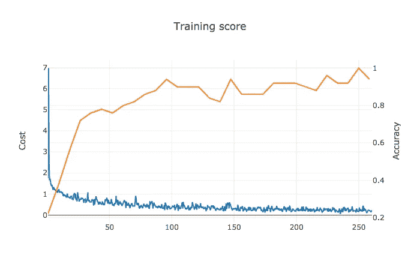

# 基于网络的语音命令识别

> 原文：<https://towardsdatascience.com/web-based-voice-command-recognition-58a9bb1ec8db?source=collection_archive---------8----------------------->

[上次](http://smus.com/web-audio-ml-features)我们将音频缓冲区转换成图像。这次我们将拍摄这些图像，并使用 [deeplearn.js](https://deeplearnjs.org/) 训练一个神经网络。结果是[一个基于浏览器的演示](https://google.github.io/web-audio-recognition/inference-demo/?model=yesno)，让你说出一个命令(“是”或“否”)，并实时查看分类器的输出，就像这样:

很好奇想玩玩它，看看它除了识别*是*和*否*之外，是否还识别*耶*或*否*？[现场试用](https://google.github.io/web-audio-recognition/inference-demo/?model=yesno)。你会很快发现表演远非完美。但这对我来说没问题:这个例子是为了成为在网络上进行各种音频识别的合理起点。现在，让我们深入了解这是如何工作的。

# 快速入门:训练和测试命令识别器

以下是你如何训练自己的是/否分类器:

1.进入[车型培训页面](https://google.github.io/web-audio-recognition/train-model/?data_url=https://storage.googleapis.com/audio-recognition-data&data_extension=mp3)。从服务器下载[训练](https://storage.googleapis.com/audio-recognition-data/yes.mp3) [数据](https://storage.googleapis.com/audio-recognition-data/no.mp3)需要一点时间。

2.单击训练按钮，您将看到一个显示训练进度的图表。一旦你准备好了(这将需要一段时间，可能 500 次迭代或 2 分钟，取决于你的硬件)，停止训练，并按下保存重量(文件)按钮。这将下载一个 JSON 文件。

3.然后进入[推理演示页面](https://google.github.io/web-audio-recognition/inference-demo/?model=yesno)，按下 load weights (file)按钮，选择下载的 JSON 文件，加载训练好的模型。

4.翻转开关，允许使用麦克风，并尝试说“是”或“否”。您将在页面底部看到麦克风和置信度。

以上是对训练示例如何工作的机械描述。如果你有兴趣了解血淋淋的(和有趣的)细节，请继续阅读。

# 数据预处理和加载

训练一个神经网络需要大量的训练数据。在实践中，可能需要数百万个样本，但我们将使用的数据集按照现代标准来看是很小的，*只有* 65，000 个标记样本。每个示例都是一个单独的 wav 文件，文件名中带有标签。

将每一个训练 wav 作为一个单独的请求来加载被证明是非常慢的。每个请求的开销很小，但是当超过几千次时，就真的开始感觉到了。为了更快地加载数据，一个简单的优化方法是将带有相同标签的所有示例放入一个长音频文件中。解码音频文件非常快，把它们分成一秒钟长的缓冲区也是如此。进一步的优化是使用压缩音频格式，例如 mp3。`[scripts/preprocess.py](https://github.com/google/web-audio-recognition/blob/master/train-model/scripts/preprocess.py)`会为你做这个连接，产生这个[迷人的结果](https://storage.googleapis.com/audio-recognition-data/yes.mp3)。

在我们“再水合”我们的原始音频示例之后，我们将原始数据的缓冲区处理成特征。我们使用我在[上一篇文章](http://smus.com/web-audio-ml-features)中提到的[音频特征提取器](http://smus.com/web-audio-ml-features)来完成这项工作，它接收原始音频，并生成 log-mel 声谱图。这相对较慢，并且占据了加载数据集的大部分时间。

# 模型培训注意事项

对于是/否识别器，我们只关心两个命令:“是”和“否”。但是我们也想发现任何这样的话语的缺乏，以及沉默。我们包括一组随机话语[作为“其他”类别(没有一个是或不是)。这个例子也是由](https://storage.googleapis.com/audio-recognition-data/other.mp3)[预处理脚本](https://github.com/google/web-audio-recognition/blob/master/train-model/scripts/preprocess.py)生成的。

因为我们面对的是真正的麦克风，我们从来没有期望听到纯粹的寂静。相反，“静音”是某种程度的环境噪音加上糟糕的麦克风质量。幸运的是，训练数据还包括背景噪声，我们将它与不同音量的训练样本混合在一起。我们还生成了一组无声示例，其中仅包括背景音频。一旦我们准备好样品，我们就生成最终的光谱图作为我们的输入。

为了生成这些最终的频谱图，我们需要决定缓冲区和跳跃长度。合理的缓冲长度是 1024，跳长是 512。由于我们处理的是 16000 Hz 的采样速率，因此计算出的窗口持续时间约为 60ms，每 30ms 采样一次。

一旦我们标记了光谱图，我们需要将输入和标签转换为 deeplearn 数组。标签字符串“是”、“否”、“其他”、“沉默”会被[一键](https://en.wikipedia.org/wiki/One-hot)编码为四个整数的`Array1D` s，意思是“是”对应`[1, 0, 0, 0]`,“否”对应`[0, 1, 0, 0]`。来自特征提取器的光谱图需要转换成一个`Array3D`，作为模型的输入。

我们正在训练的模型由两个卷积层和一个完全连接的层组成。我直接从 deeplearn.js 的 MNIST 示例中获得了这个架构，并且根本没有为处理 spectrograms 进行定制。结果，性能与最先进的语音识别相差甚远。要查看更多的错误分类，请尝试音频的[MNIST](https://google.github.io/web-audio-recognition/inference-demo/?model=number)，它可以识别语音数字(例如“0”到“10”)。我相信，通过遵循本文[我们可以做得更好。现实世界的语音识别器可能根本不使用卷积，而是选择更适合处理时间序列数据的](http://www.isca-speech.org/archive/interspeech_2015/papers/i15_1478.pdf) [LSTM](https://en.wikipedia.org/wiki/Long_short-term_memory) 。

最后，我们想告诉机器学习框架如何训练模型。用 ML 的说法，我们需要设置[超参数](https://en.wikipedia.org/wiki/Hyperparameter_(machine_learning))，包括设置学习率(每步跟随梯度多少)和批量大小(一次摄取多少个例子)。我们出发去比赛:

在训练过程中，梯度下降算法试图最小化成本，你可以看到蓝色。我们还用橙色绘制了准确性，这是偶尔通过在测试集上运行推理来计算的。我们使用测试集的随机子集，因为推理需要时间，我们希望尽可能快地训练。

一旦我们对测试的准确性感到满意，我们就可以保存模型权重并用它们来推断结果。

# 保存和加载模型权重

一个模型由它的架构和它的承重节点的重量来定义。权重是在模型训练过程中学习的值，并且不是所有节点都具有权重。ReLUs 和 flatten 节点不会。但是卷积和全连接节点既有权重也有偏差。这些重量是任意形状的张量。为了保存和加载模型，我们需要能够保存图**和**的权重。

保存和加载模型很重要，原因如下:

1.  模特训练需要时间，所以你可能想训练一下，减肥，休息一下，然后从你停下的地方继续。这称为检查点。
2.  从推论上来说，拥有一个可以加载和运行的自包含模型是很有用的。

在撰写本文时，deeplearn.js 还没有序列化模型和模型权重的工具。对于这个例子，我实现了一种加载和保存权重的方法，假设模型架构本身是硬编码的。`[GraphSaverLoader](https://github.com/google/web-audio-recognition/blob/master/train-model/src/GraphSaverLoader.ts)`类可以保存来自本地存储(IndexedDB)或文件的&负载。最终，我们将需要一种非黑客的方式来保存和加载模型及其相应的权重，我对 ML 开发人员工效学的改进感到兴奋。

# 包扎

非常感谢 [Nikhil](https://twitter.com/nsthorat) 和 [Daniel](https://twitter.com/dsmilkov) 在 deeplearn.js 上的辛勤工作，以及愿意回答我一连串愚蠢的小问题。另外，还要感谢[皮特](https://twitter.com/petewarden)，他负责创建和发布我在这篇文章中使用的[数据集](https://storage.cloud.google.com/download.tensorflow.org/data/speech_commands_v0.01.tar.gz)。亲爱的读者，谢谢你读到这里。

我很高兴看到这种基于浏览器的音频识别技术如何应用于令人兴奋的教育 ML 项目，如[可教机器](https://teachablemachine.withgoogle.com/)。如果你能制造一个自我改进的系统，对每一个额外的口语进行训练，那该有多酷？在浏览器中训练这些类型的模型的能力允许我们以保护隐私的方式考虑这样的可能性，而不用向任何服务器发送任何东西。

所以你有它！这是对网络上语音命令识别的解释。我们在[的上一篇文章](http://smus.com/web-audio-ml-features)中讨论了特征提取，而这一次，我们稍微探讨了一下完全在浏览器中进行的[模型训练](https://google.github.io/web-audio-recognition/train-model/?data_url=https://storage.googleapis.com/audio-recognition-data&data_extension=mp3)和[实时推理](https://google.github.io/web-audio-recognition/inference-demo/?model=yesno)。

如果你以这个例子为基础，请在 twitter 上给我留言。

*最初发表于*[*smus.com*](http://smus.com/web-voice-command-recognition/)*。*