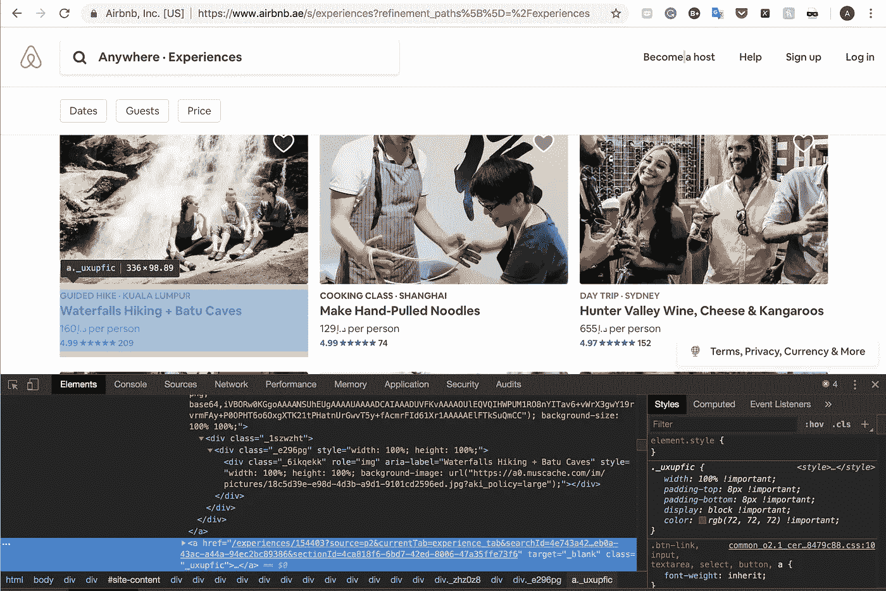
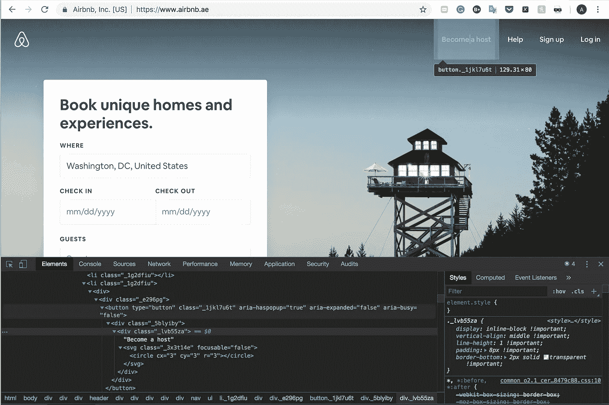
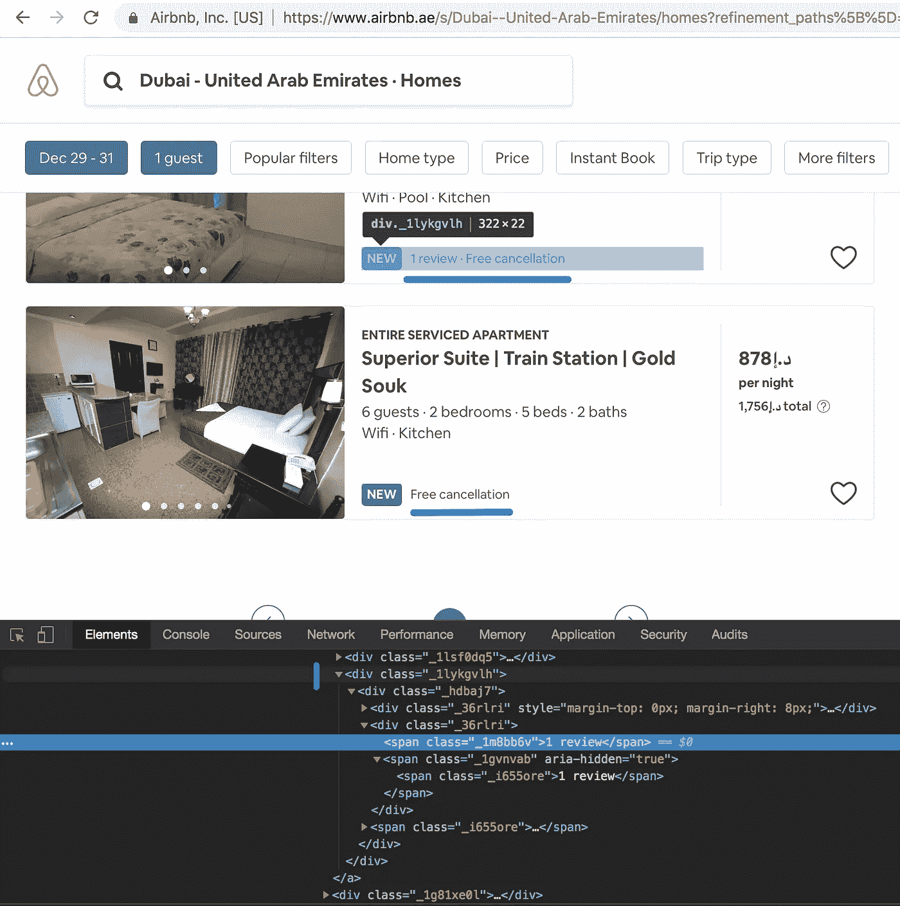
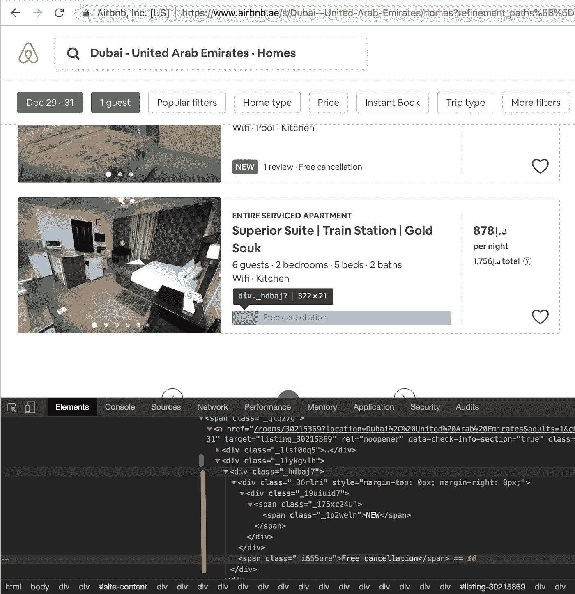
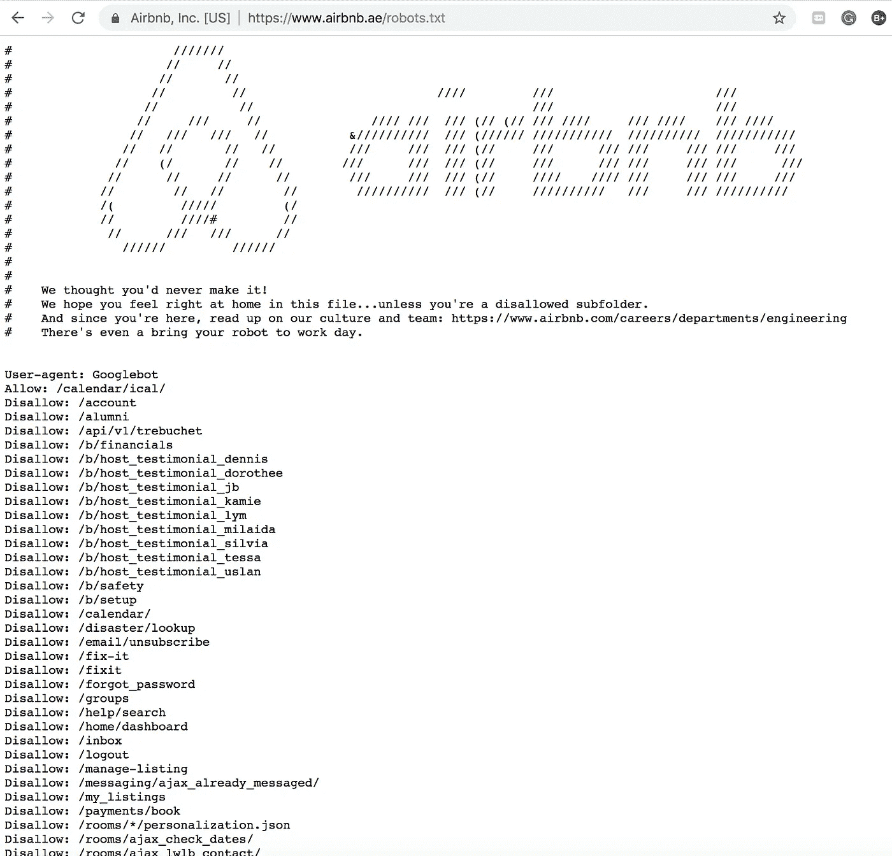

# Web 抓取:Scrapy 和 Selenium 概述，第一部分

> 原文：<https://towardsdatascience.com/web-scraping-a-simple-way-to-start-scrapy-and-selenium-part-i-10367164c6c0?source=collection_archive---------7----------------------->

kaggle.com

## *关于可以节省您时间的铲运机设计的想法*

在这篇文章中，我分享了我第一次使用网络抓取的经验和我用过的工具( [Scrapy](https://scrapy.org/) 和 [Selenium](https://docs.seleniumhq.org/) )。我希望这篇文章能对那些寻求普遍指导的人有所帮助，因为我涵盖了我认为有价值的知识和我希望在第一次想到刮擦时就知道的事情。具体来说，我想强调一起使用这两个工具的特点以及何时使用什么，因为我在网上找到的许多解释都集中在其中一个上。我不会讨论代码的细节，我会在另一篇文章中讨论，但我会通过 Airbnb 的例子来回顾我随着时间的推移而形成的概念理解，我发现 Airbnb 是这个主题的一个很好的榜样。作为旁注，我将使用术语网络抓取，抓取和网络爬行作为同义词。

F ***首先，这不是火箭科学。可以说，开始这种项目的最好方法是边做边学，对于某些网站，你可以用 Python 的基础知识和手头的教程在几天内构建一个工作的 scraper。我开始从[学习这种【真正有用】的零碎课程](https://www.udemy.com/share/100h3yA0QaeF5TRHQ=/)，打折时大约 10 美元。在很大程度上，本课程涵盖了 Scrapy 在网络爬行中的使用，但也涉及到了 Selenium 的使用。这两个可以单独使用，并合并在一个刮刀。如果您是 Python / JavaScript 初学者，合并它们可能需要一些额外的研究，但这是完全值得的。就我个人而言，我发现 Corey 的 YouTube 频道[在学习 Python 基础知识方面很有帮助，因为他有很好的方法来分解概念。](https://www.youtube.com/channel/UCCezIgC97PvUuR4_gbFUs5g)***

D ***不同网站——不同工具*。** 虽然 *Scrapy* 是一个专门为 web 爬行而设计的 Python 框架，但它最适合正确呈现的 *XML 和 HTML* 页面，可能不适用于 JavaScript 驱动的页面，这些页面使用 React 和 Angular 等框架。实际上，这意味着您将向 Scrapy 传递一个有效的元素选择器，但将得到一个空输出。这方面的一个例子是不同种类的定时器和交互元素。Scrapy 的另一个特点是，它通过访问页面的 URL 来浏览页面，然而，当您检查元素或获取源代码(通过`xpath`或`css`)时，您会发现一些按钮没有任何链接到它们的 URL。例如，这个导游有一个`href`(网址)，所以你可以重定向到旅游信息。

airbnb.ae

另一方面，这个 Airbnb 的“成为主机”按钮在你检查源代码的时候是没有 href (=URL)的。

airbnb.ae

最后一种情况的另一个例子是无限加载页面，以及在某些情况下的“加载更多”或“下一步”按钮。比如这个“显示全部”按钮:

airbnb.ae

在这些情况下，如果你想使用 Python，你会求助于其他工具，比如 *Selenium* ，我发现这是一个对初学者相当友好但优化程度较低的抓取工具。具体来说，Selenium 使得*与网站*互动变得容易，或者简单地点击页面，同时获得我感兴趣的元素。

同时， *Selenium* 在处理某些 Scrapy 优雅处理的异常时显得笨拙。其中一个例子是`NoSuchElementException`，Scrapy 返回一个空列表，而 Selenium 不能返回特定页面的所有元素。例如，考虑 Airbnb 上房屋的评论计数，如果一个物业有评论，计数器就会显示，你可以在跨度内的`class="_1lykgvlh"`中看到它。

airbnb.ae

然而，下面的属性没有 reviews，计数器也不是源代码的一个元素，在同一个`class="_1lykgvlh"`中没有什么可以“检查”的:

airbnb.ae

因此，如果您遍历所有这些类以从中获取所有元素，比如“new”标签、评论计数和“free cancel”标签，Selenium 将为第一个属性返回所有这些元素，并为第二个属性删除这些元素(即使只找到 1 个元素会触发 NoSuchElementException)。出于这个原因，在 Selenium 中处理这个异常和所有其他异常是非常重要的，因此您的 scraper 是健壮的和功能性的。

Selenium 的一个特性是，它必须为每个请求打开一个浏览器来`get`URL。这意味着 Selenium 是一个内存密集型工具，您可能会遇到内存利用问题。出于这个原因，我选择只在必要的时候使用硒，而不是过度使用。在 Airbnb 的例子中，如果我可以选择，我会从目录页面中抓取所有属性的详细信息，而不是进入每个属性配置文件，从那里抓取详细信息并返回到目录。

S ***scrapers 不通用*** 不用说，不同的网站会要求构建不同的 scraper，除非它们有相同的源代码。也就是说，一旦网站发生变化，为特定网站编写的 scraper 可能需要更改，因此您可能需要调整脚本。例如，开发人员可能会更改某个元素的类名或 id，这将导致异常或空结果。因此，有必要在浏览器、终端中监控抓取过程，或者只是查看输出文件。

B ***e 好听。并且避免被堵*** 一般来说，态度好一点，温柔的接近服务器。如果网站有 API，就使用它，如果没有，你真的需要它们，小心不要让他们的服务器崩溃，避免你的 IP 被封锁，所以要掌握 [DOWNLOAD_DELAY](https://doc.scrapy.org/en/latest/topics/settings.html) ， [sleep()](http://www.tutorialspoint.com/python/time_sleep.htm) 的窍门，设置并发请求的限制或其他暂停你的刮板的方法。一个好主意是避免从你的主工作站启动铲运机，至少在你开始熟悉它的行为时。因为如果 IP 地址被屏蔽或被标记为可疑，这不仅对你来说是痛苦的，对你的同事、家人和任何使用同一网络的人来说也是痛苦的。这意味着，要特别留意具有重要战略意义的网站，比如 google.com(它不会屏蔽你，但会邀请你参加 CAPCHAs 会议)。

我喜欢熟悉该网站的机器人政策，阅读 robots.txt 以大致了解他们更喜欢允许和不允许机器人做什么，并搜索他们的网站以了解他们是否允许机器人出现在他们的网站上。

robots.txt for airbnb.ae

仅仅看一下限制列表就会让你感觉到他们对 crawler 有多严格。网站可以区别对待机器人，抓取工具通常会被自动屏蔽。如果您的日志中有 500 的请求状态，并带有`Request denied`或`HTTP status is not handled or not allowed`等，您就可以识别出这种行为。

如果没有 API，并且在设置延迟后你一直得到 500 个，你可以为你的 scraper 设置一个`USER_AGENT`，它会将它的头从`pythonX.X`或任何其他默认名称(很容易被服务器识别和过滤)更改为你指定的代理的名称，因此服务器会将你的 bot 视为浏览器。在 Scrapy 中，最简单的方法之一就是通过设置。但是请记住，您希望让用户代理与您的机器操作系统和浏览器名称保持一致。例如，这个`USER_AGENT = 'Mozilla/5.0 (Macintosh; Intel Mac OS X 10_12_6) AppleWebKit/537.36 (KHTML, like Gecko) Chrome/61.0.3163.100 Safari/537.36'`可以在 Mac 上运行，但不能在 Ubuntu 上运行。

T ***现在有很多工具可供选择*** Scrapy 和 Selenium 并不是网页抓取的唯一选择。有许多 Python 库(例如， [BeautifulSoup](https://www.crummy.com/software/BeautifulSoup/bs4/doc/) 、 [urllib](https://docs.python.org/2/library/urllib2.html) 、 [lxml](https://pypi.org/project/lxml/) 、 [Requests](http://docs.python-requests.org/en/master/) )和其他工具，如谷歌的[木偶师](https://developers.google.com/web/tools/puppeteer/)(node . js)，可以提供类似的结果。区别在于他们可以处理的框架和成本。因此，你的目标是熟悉他们的能力，并以最有效的方式使用他们。

这些是我做第一批刮擦项目时学到的主要东西。和大多数事情一样，最困难的是开始，不要迷路。因此，我建议参加在线课程，比如我发现非常有用的网上课程，如果你是初学者的话，可以逐渐加深理解。

这是这篇文章的第一部分，我将继续第二部分，在这里我将与你分享一个 Python 代码，并解释它的功能，这样你就可以复制它。

如果你有问题，请在下面评论，如果你想建立关系网，请在 LinkedIn 上与我联系。

LinkedIn:【https://www.linkedin.com/in/areusova/T2
GitHub:[https://github.com/khunreus](https://github.com/khunreus)