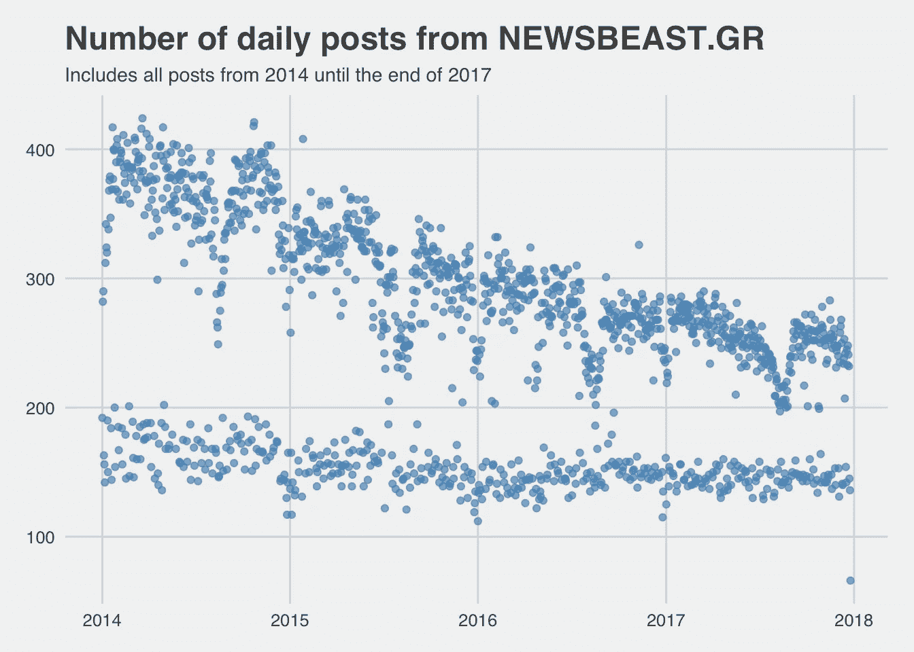
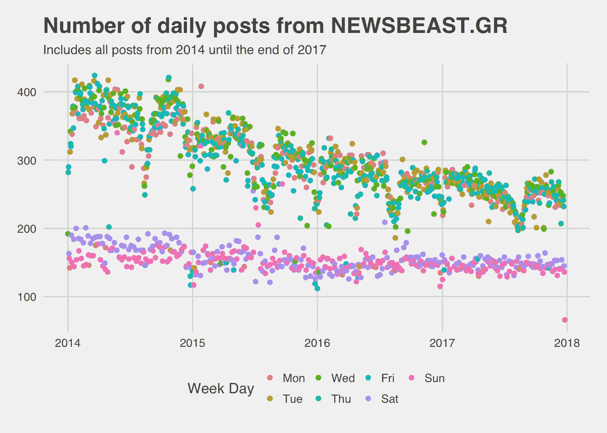
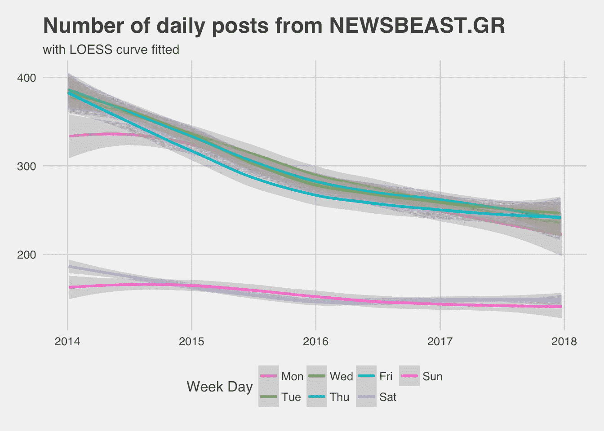
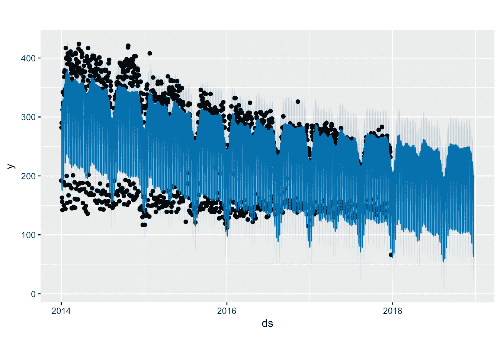
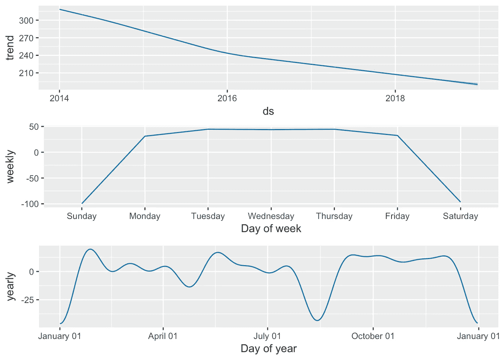

# 从新闻博客中抓取和分析 400，000 篇文章

> 原文：<https://towardsdatascience.com/web-scraping-and-analyzing-400-000-articles-1393d0e789ba?source=collection_archive---------9----------------------->

## 领先在线出版商的每日发帖频率有什么趋势&季节性吗？

在这篇文章中，我将分析由希腊领先的在线出版商之一 [NEWSBEAST](http://www.newsbeast.gr/) 发表的文章。核心问题是**“news beast 的每日发布频率有任何趋势&季节性吗？”**数据分析前的主要步骤(文末有完整 r 代码的链接可以):

*   使用 R 中的 rvest & car 库从站点(www.newsbeast.gr)抓取文章
*   数据准备(包括数据清理、转换)
*   探索性分析

让我们创建一个散点图来查看过去 4 年每天发布的文章数量。

Image by Author

我们可以清楚地发现，在每天发表的文章数量上有两种不同模式的持续趋势(在过去 4 年中)。我们怀疑在特定的工作日(可能是周末？)发表的日常文章明显少了。第二个趋势(不太明显)可能是每年发表的文章越来越少。现在让我们用不同颜色来区分每个工作日，以获得更清晰的视图。

Image by Author

所以现在很明显，周末期间的每日帖子数量比工作日少得多。
现在，让我们尝试在每个工作日建立一个模型，并创建一个图来展示这些。在下图中，每个工作日通过使用[黄土回归](https://en.wikipedia.org/wiki/Local_regression)拟合一条单独的平滑线来表示

Image by Author

周末的标准误差(95%置信水平)表明与工作日的差异是显著的。

现在让我们调查不同年份之间是否有显著差异。

Image by Author

通过查看误差线，看起来所有的差异(不同年份之间)在统计上都是显著的，除非在比较 2016 年和 2017 年时，误差线是重叠的。
这一发现可以通过在不同样本中应用非参数 Wilcoxon 符号秩检验来证实(见下表)

> ***年份:2014–2015 | P 值< 0.001***
> 
> ***年份:2015–2016 | P 值< 0.001***
> 
> ***年份:2016–2017 | P 值< 0.001***

所有的 p 值都非常低(< 0.01)，置信水平为 0.95，因此发布的每日平均文章的差异非常显著。

最后，为了研究其他不太明显的季节性趋势，我们使用了一个专用于时间序列分析的软件包。使用 prophet package for R 拟合了一个预测模型，如下所示，它揭示了更多的季节性趋势。特别是在圣诞节和暑假期间(大约在 8 月份)的日常文章中出现了两个主要的“下降”。在**复活节**期间也有一个小的“下降”。

Image by Author

另一个有用的功能是能够绘制各种成分的图表(如下图),这是一个简单的方法来得出每日/每周/每年的趋势。特别是在下面的图表中，我们可以很容易地发现周末的下降，在**圣诞节期间、暑假、复活节期间**的日常文章中的“下降”以及每年的“下降”。

Image by Author

# 结论

分析表明，这个新闻博客发布的内容越来越少。另一个有趣的发现是，在假期期间(圣诞节、复活节、夏天和周末),发布的帖子显著减少。这很奇怪，因为众所周知，人们倾向于使用这些新闻博客，尤其是在假期。他们肯定应该在假期期间试着发布更多的文章。

特别是:

*   在过去的 4 年里，每日发布的文章显著减少。总体围绕 **30%** 的文章较少。
*   周末发表的文章比平日少得多。
*   每年圣诞节和暑假期间，日常生活用品会有两次显著的“下降”。
*   每年复活节假期期间，每日发表的文章数量都有小幅“下降”。

[全 R 码](https://raw.githubusercontent.com/mantoniou/Blog/master/content/post/2018-04-04-web-scraping-and-analyzing-400-000-articles.Rmd)

*原载于*[*www.manosantoniou.com*](https://www.manosantoniou.com/post/web-scraping-and-analyzing-400-000-articles/)*。*