# 斯德哥尔摩的网络搜集公寓列表

> 原文：<https://towardsdatascience.com/web-scraping-apartment-listings-in-stockholm-3fcebacf8be6?source=collection_archive---------9----------------------->

## 使用 Python 进行抓取，使用 MS SQL server 进行存储

我和我的合伙人已经卖掉了我们的公寓，正在寻找一个新的。因为大多数人在寻找新公寓时，都要手动穿过 https://www.hemnet.se/，这对我来说似乎既乏味又累人。所以我想——为什么不利用我的 Python 知识，通过编程找到最合适的公寓呢？这就是我所做的，我做了一个非常简单的网页抓取器来找到待售的物品。


Photo by [Adam Gavlák](https://unsplash.com/@gavlak?utm_source=medium&utm_medium=referral) on [Unsplash](https://unsplash.com?utm_source=medium&utm_medium=referral)

## 目录

*   [网页抓取部分](https://medium.com/p/3fcebacf8be6#935a)
*   [刮削功能](https://medium.com/p/3fcebacf8be6#7798)
*   [数据库存储部](https://medium.com/p/3fcebacf8be6#f7a6)
*   [可视化销售对象的数据](https://medium.com/p/3fcebacf8be6#beba)
*   [备注](https://medium.com/p/3fcebacf8be6#9709)
*   [进一步工作](https://medium.com/p/3fcebacf8be6#8932)

# 1.刮网部分

下面是一对通过库 BeautifulSoup 处理 HTML 对象的函数。请记住，这些功能可以用更专业和最佳的方式编写，但这个项目的范围确实是快速获得数据，以便完成一个“最佳”公寓交易。

# 1.1 刮削功能

首先，我们需要处理 BeautifulSoup 对象，我们在一个标准的 Python 函数中处理这个对象，我选择将这个函数命名为“Booli_ScrapeObjects”。该函数有两个输入参数(page 和 object_info ),其中 **page** 是 URL,**object _ info**是一个 Pandas 数据帧，用于存储每个对象的所有有趣信息。该函数的工作前提是网站的 HTML 对象保持静态。该函数如下:

```
**def** *Booli_ScrapeObjects*(page, object_info):
 request = requests.get(page)
 soup = BeautifulSoup(request.text,'lxml')
 links = soup.select("a[href*=/annons/]")

 **for** *j, row* in enumerate(links):
  info = row.contents[5].text.split("\n")
  **while** '' in info:
   info.remove('')
  info[0] = info[0].strip(" kr")
  info[1] = info[1].strip(" kr/m²")
  info[2] = info[2].strip(" kr/mån")
  object_info.append(info)
  **try:**
   info.insert(0,"https://www.booli.se" + links[j]["href"])
  #FETCHING ADDRESS, # ROOMS AND M2
  request_apartment = requests.get(info[0])
  soup_apartment = BeautifulSoup(request_apartment.text, 'lxml')
  address = soup_apartment.findAll('span',
   class_ = 'property__header__street-address')
  address = address[0].contents[0].strip("\n\t\t")
  info.append(address)
  size = soup_apartment.findAll('span',
   class_ = 'property__base-info__title__size')
  size = size[0].contents[0].strip("\n\t").split(",")
  rooms = size[0].strip(" rum")
  m2 = size[1].strip(" m²")
  info.append(rooms)
  info.append(m2)
  **except:**
   info.insert(0, "Unknown")   #Link
   info.append("Unknown")      #Address
   info.append("Unknown")      #Rooms
   info.append("Unknown")      #m2
   info.append("Unknown")      #Estimate
   continue
**return** object_info
```

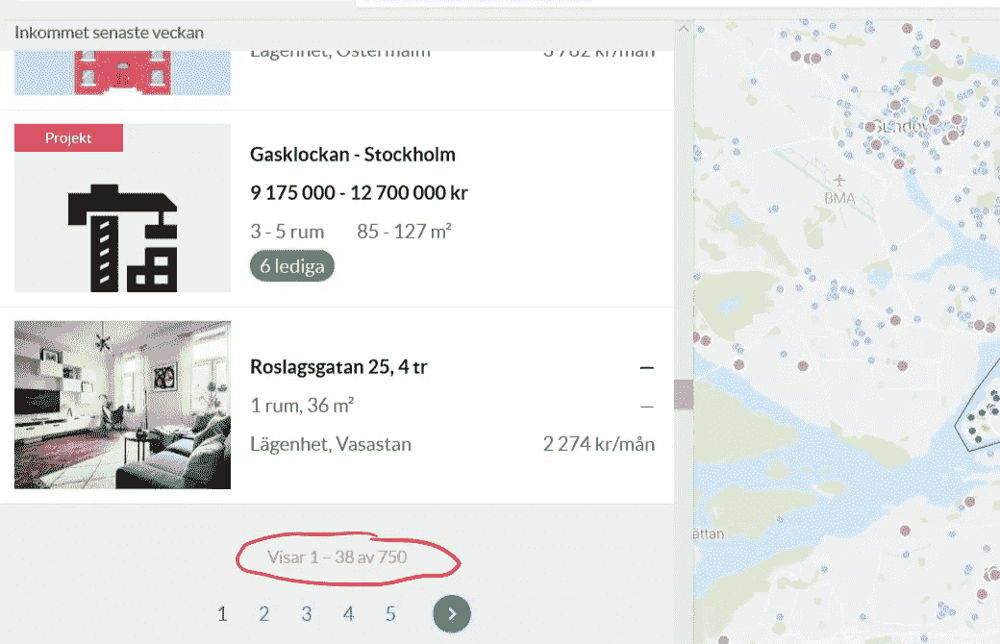

Print Screen from Boolis webpage - showing number of objects per page.

上面的函数抓取可以在给定页面上找到的对象。如果找到的对象数量大于 38 个，对象将被分割成多个页面(见左图)。这个问题在下面的函数中解决了，它采用相同的 URL 参数来计算我们有多少个页面，前提是每个页面最多包含 38 个对象。

```
**def** *Booli_findNumberOfPagesData*(url):
 request = requests.get(url)
 soup = BeautifulSoup(request.text,'lxml')
 data = soup.findAll('div',
		class_ = 'search-list__pagination-summary')
 numberOfObjectsPerPage = 38
 try:
  numberOfObjects = int(data[0].text[
		-(len(data[0].text)-3 - data[0].text.rfind("av")):])except:
  numberOfObjects = 0
  numberOfPages = int(
		np.ceil(numberOfObjects/numberOfObjectsPerPage))**return** numberOfPages, numberOfObjects
```

有了上面的两个函数，我们可以编写一个新的函数，循环遍历每个 URL，并将信息存储在 Pandas 数据帧中。该函数如下:

```
**def** *loopThroughRegions*(data_url, 
			m2_max, 
			m2_min, 
			maxListPrice, 
			minListPrice):
 object_info = []
 region = []
 length = [0]
 **for** *index, row* in data_url.iterrows():
  #Base URL
  url = "https://www.booli.se/{}/{}/?
			maxListPrice={}&
			maxLivingArea={}&
			minListPrice={}&
			minLivingArea={}&
			objectType=L%C3%A4genhet&
			page=1&
			upcomingSale=
				".format(row["Region"],
					row["RegionID"],
					maxListPrice, 
					m2_max, 
					minListPrice, 
					m2_min)
  object_info = **Booli_ScrapeObjects**(*url, object_info*)
  numberOfPages, numberOfObjects = **Booli_findNumberOfPagesData**(*url)* **for** *page* in range(2, numberOfPages):
   url = "https://www.booli.se/{}/{}/?
		maxListPrice={}&
		maxLivingArea={}&
		minListPrice={}&
		minLivingArea={}&
		objectType=L%C3%A4genhet&
		page={}&
		upcomingSale=
			".format(row["Region"],
				row["RegionID"],
				maxListPrice,
				m2_max,
				minListPrice,
				m2_min,
				page)
  object_info = **Booli_ScrapeObjects**(*url, object_info*)
 length.append(len(object_info))#Creating a simple vector containing duplicates of regions up to number of object stored for each region
 **for** *i* in range(0, length[len(length)-1] - length[len(length) - 2]):
  region.append(row["Region"])**return** object_info, region
```

为了在常规的 Microsoft SQL Server 数据库中存储 Pandas 数据框，我们需要清理数据。例如，我们想要两个重写对象，从 1 个房间到 1.5 个房间，依此类推。执行这一简单清洁过程的简单函数如下:

```
**def** *cleaningData*(object_info):
 **for** *index, row* in object_info.iterrows():**if** row["m2"].find("+") != -1:
   m2s = row["m2"].split("+")
   newM2 = int(m2s[0]) + int(m2s[1])
   object_info.set_value(index, "m2", newM2)**if** row["Number of rooms"].find("½") != -1:
    rooms = row["Number of rooms"].split("½")**if** rooms[0] == "":
     newRooms = 0.5
    **else:** newRooms = float(0.5) + float(rooms[0])object_info.set_value(index, "Number of rooms", newRooms)**if** row["Rent"].find("—") != -1:
     newRent = 0
     object_info.set_value(index, "Rent", newRent)
    **else:** newRent = "".join(row["Rent"].split())
     object_info.set_value(index, "Rent", newRent)**return** object_info
```

# 1.2 数据库存储部分

最后，我们有了结构化格式的所有数据——所以现在是时候以一种方便的方式存储它了，即存储在数据库中。我们将所有数据存储在熊猫数据框中，如下所示:

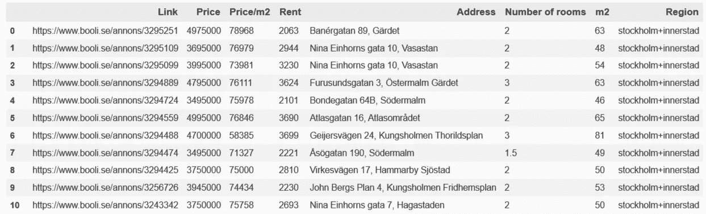

Pandas Data Frame containing apartment data.

所以我们需要构建一个可以存储每一列的数据库表。这可以通过下面的 SQL 代码轻松完成(假设您使用的是 MS SQL server，尽管语法与其他数据库类似):

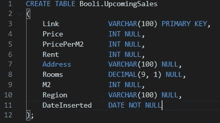

Query for creating the table “UpcomingSales”.

现在让我们编写一个简单的函数，它可以使用 pyodbc-package 连接到我的本地“本地”数据库。该函数如下:

```
**def** *mssql_connect*(server, database, driver):
    cnxn = pyodbc.connect('DRIVER='+driver+ \
                          ';SERVER='+server+ \
                          ';DATABASE='+database + \
                          ';Trusted_Connection=yes')
    cursor = cnxn.cursor()
    **return** cnxn, cursor
```

使用这个函数结合一个按行插入数据的查询，我们最终达到了我们的目标 ***(这个查询最好使用一个简单的 merge 语句来编写):***

```
#SQL INPUT PARAMETERS
pyodbc.pooling = False
server = 'server'
database = 'database'
username = 'username'
password = 'password'
driver= '{ODBC Driver 13 for SQL Server}'cnxn, cursor = mssql_connect(	server, 
				database, 
				username, 
				password, 
				driver)
data = result.values.tolist()
**for** *i, item* in enumerate(data):
 insert_query = "IF NOT EXISTS ( \
			SELECT \
				* \
			FROM \
				[Booli].[UpcomingSales] \
			WHERE \
				[Link] = '" + str(item[0]) + "' AND
				[DateInserted] = '" + 
				str(date.today()) +"') \
			BEGIN \
			INSERT INTO [Booli].[UpcomingSales] \
			VALUES ('" + str(item[0]) + \
				"'," + str(item[1]) + \
				"," + str(item[2]) + \
				"," + str(item[3]) + \
				",'" + str(item[4]) + \
				"'," + str(item[5]) + \
				"," + str(item[6]) + \
				",'" + str(item[7]) + \
				"','" + str(date.today()) +"') \
			END"cursor.execute(insert_query)#Cleanup
cnxn.commit()
cursor.close()
cnxn.close()
```

现在，我们可以通过一个简单的 select-query 与数据库对话来获得结果:

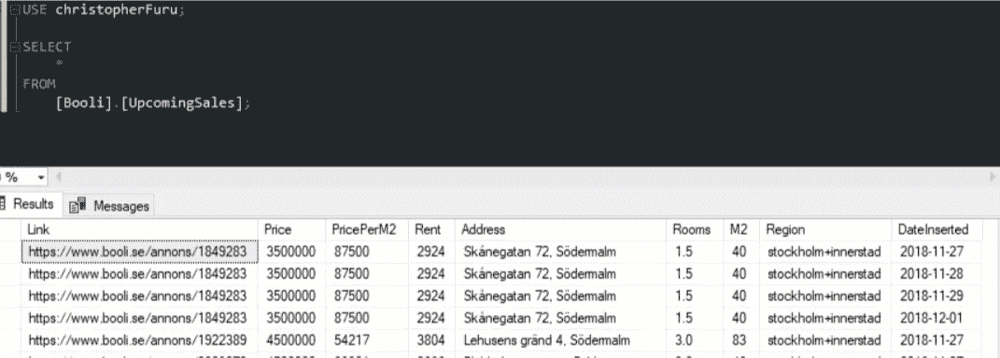

Select-query to the table that holds the object data.

# 2.可视化销售对象的数据

很容易调整代码，以抓取售出的对象，而不是待售的对象，我不会介绍如何做到这一点，而是我会显示一些简单的可视化从售出的对象抓取数据。首先，我们通过 SQL 查询调用数据库来获取数据。生成的数据将存储在名为“数据”的熊猫数据框中。获取数据的 Python 代码如下所示:

```
query = "SELECT 
             * \
         FROM \ 
             [Booli].[SoldObjects]"
data = pd.read_sql(query, cnxn)
```

输出如下所示:

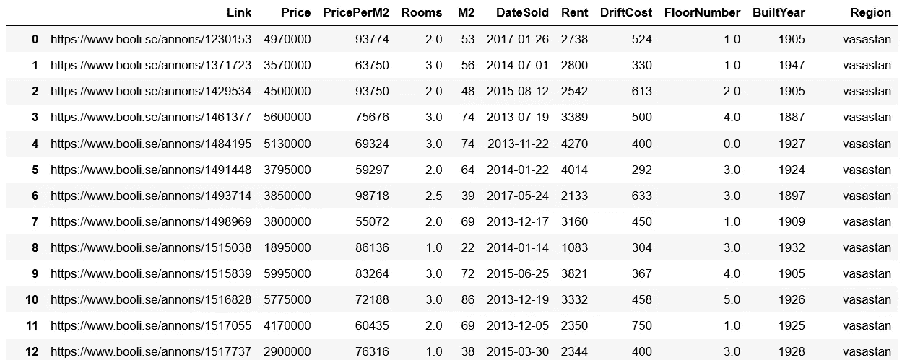

此外，我们使用内置的 pandas 功能“cut”将租金成本分成不同的价格部分:

```
bins = [0, 500, 1000, 1500, 2000, 2500, 3000, 3500, 4000, 10000]
labels = ['-500', '500-1000', '1000-1500', '1500-2000', '2000-2500', 	'2500-3000', '3000-3500', '3500-4000', '4000-10000'])data["Rent categories"] = pd.cut(
				data['Rent'], 
				bins = bins, 	
				include_lowest = True, 
				labels = labels
				)
```

现在我们可以绘制数据，以了解不同租金类别的价格随时间的变化情况

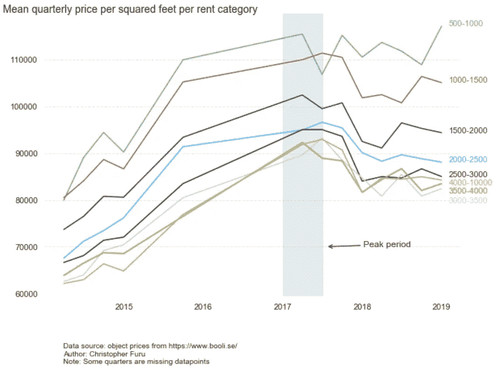

直觉告诉你——租金越低，价格越高。现在让我们仔细看看斯德哥尔摩不同地区的价格差异

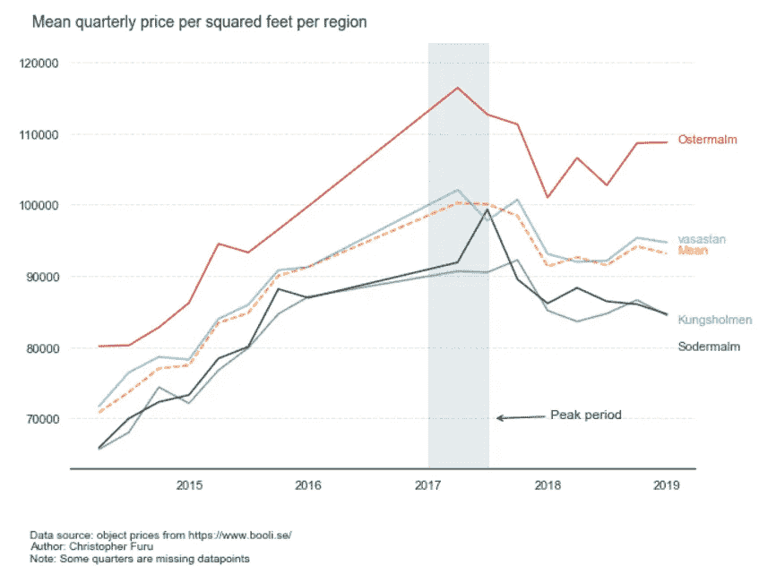

对于那些住在斯德哥尔摩的人来说，结果可能不会令人惊讶，因为奥斯特马尔姆的平均售价最高，远远高于整体平均水平。

现在，让我们来看看每个地区[价格/平方米]的分布及其各自的平均值

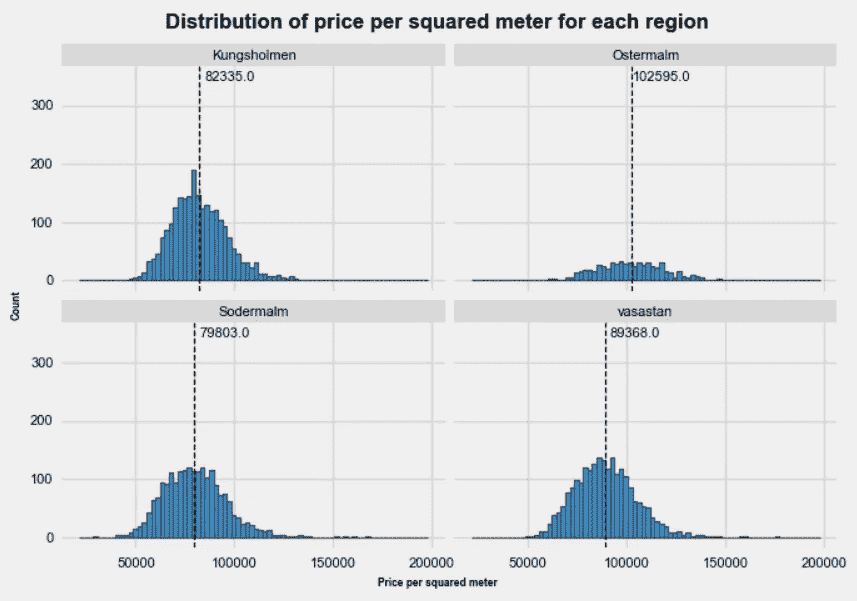

以及整个样本的[价格/平方米]的分布:

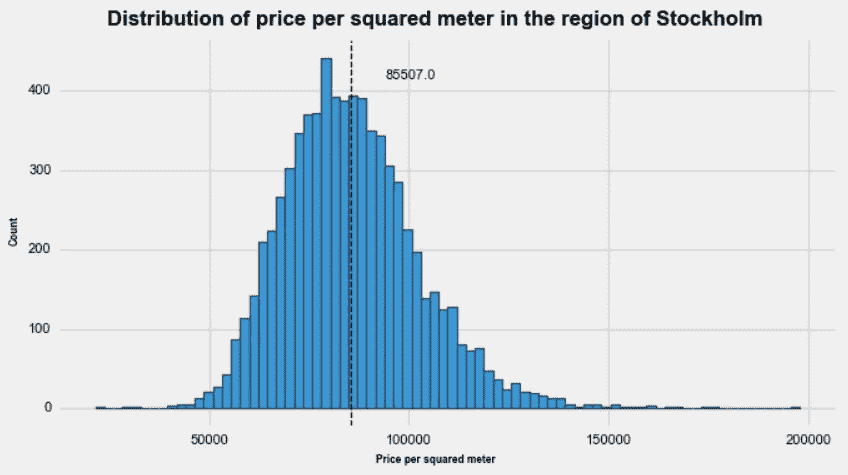

正如我们所见，整个样本的平均价格为 85000 SEK。

最后，我们来看看每个地区的平均[价格/平方米]以及这些物品的房间数量。

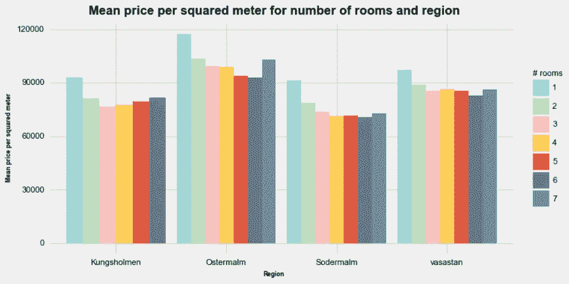

如前所述，该样本缺乏较高“#房间数”范围内公寓的数据，因此平均值不能代表实际市场价格。为了让我的观点更清楚，让我们计算每个区域的对象数和“房间数”

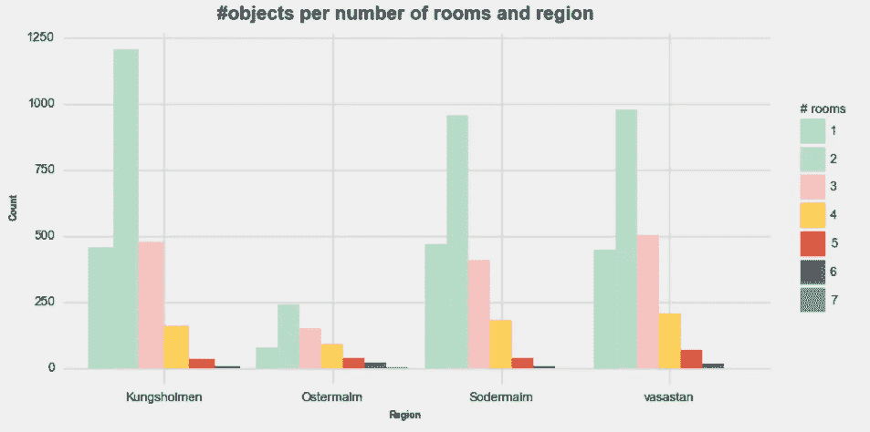

如图所示，在最好的情况下，我们可以说“# rooms”= 1、2、3 和 4 具有代表性平均值，而“# rooms”> 4 的平均值由于数据点较少而具有高度失真的平均值。

# 3.评论

首先，Python 代码肯定可以写得更有效率，但正如我指出的，这个项目的目的不是为抓取组件编写生产就绪代码，这只是一个用于特定目的的一次性项目。如上所述，刮擦部分的一个明显的优化是搜索多个区域而不是一个区域。

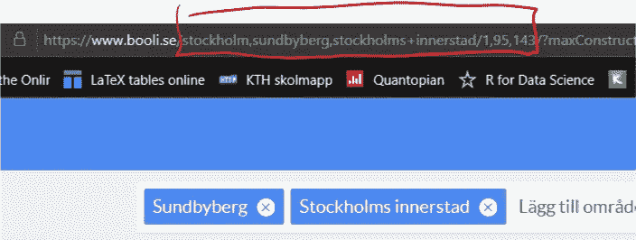

URL-structure for multiple areas.

# 4.进一步的工作

我们可以使用“每平方米价格”的响应变量 Y 实现一个简单的回归模型，以找出每个独立变量 x 的贡献。在给定一组独立变量值的情况下，该模型也可以用作价格估计器。

感谢您的阅读。如果您有任何问题，请通过 **cfuru@kth.se** 联系我，也可以在 [linkedin](https://www.linkedin.com/in/christopher-furu-402b33a4/) 加我。