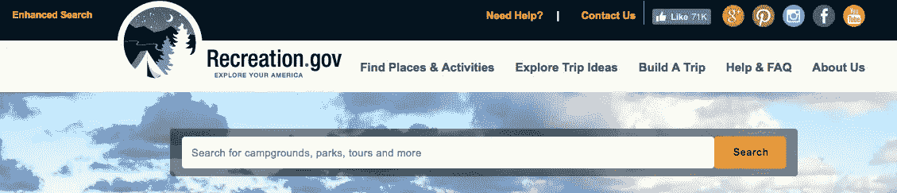
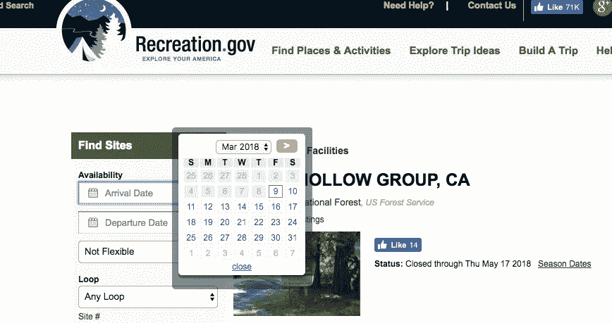
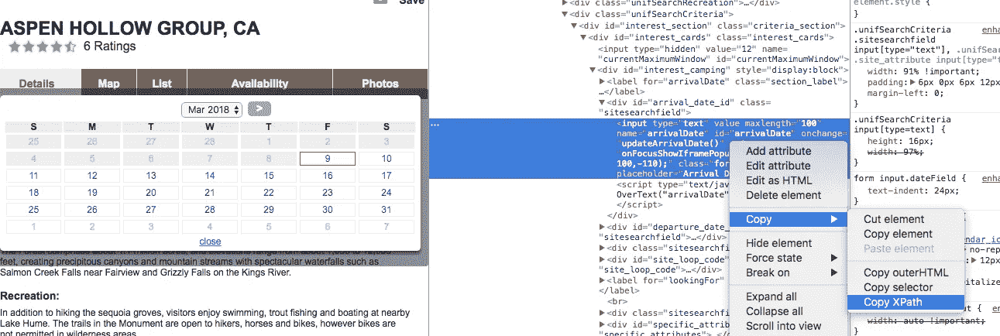

# 网页抓取基础知识——硒和美丽的汤应用于搜索营地可用性

> 原文：<https://towardsdatascience.com/web-scraping-basics-selenium-and-beautiful-soup-applied-to-searching-for-campsite-availability-4a8de1decac9?source=collection_archive---------2----------------------->


[Image[1] (Image courtesy: [https://pixabay.com](https://pixabay.com))]

对于数据科学领域的人来说，网络搜集是一项重要的基本数据收集技能。它对于收集项目和兴趣的小信息也非常有用。并不是你分析的每一个数据集都能以一种方便的格式获得，而且，如果你想做有趣和独特的分析，那么通过搜集自己编译一个数据集是做新颖和有见地的工作的一个很好的方法。

在这篇文章中，我将介绍 Python 中抓取的一些基础知识，并提供创建一个抓取器的示例代码，该抓取器将收集关于即将到来的营地预留空缺的信息。我选择这个特别的例子，是因为我想解决自己在加州营地保留地导航的问题，还因为除了促进技术素养，帮助人们走出户外享受自然对我个人来说也很有意义。

让我们开始吧——如果你从头到尾都遵循了这篇教程和文章，你应该掌握了从网络上收集易于访问的数据并用于你自己的项目的所有技能。更具体地说，您将能够:

*   了解如何导航 HTML 源代码以找到您想要捕获的信息
*   使用 Beautiful Soup 从网站收集并解析 HTML 代码
*   使用 Selenium 和 ChromeDriver 自动导航到站点，在文本框中填充信息，单击所需的下拉菜单和输入，并为多个网站地址、变量和输入返回这样做的响应
*   了解如何使用 Requests、ChromeDriver、BeautifulSoup 和 Selenium 进行网页抓取的基础知识
*   使用 Pandas 解析 HTML 表，使用 datetime 转换日期

*一些背景和基础知识:*

Web 抓取就是从互联网上自动收集和解析数据。这些数据可以构成数据科学项目的基础，用于比较各种产品或服务，用于研究或其他商业用途。

Python 中有许多对 web 抓取有用的库，一些主要的有:[请求](http://docs.python-requests.org/en/master/)、[美汤](https://www.crummy.com/software/BeautifulSoup/bs4/doc/)、[硒](http://selenium-python.readthedocs.io/)和[刺儿头](https://scrapy.org/)。本教程将只涵盖前三个，但我会鼓励你自己去看看 Scrapy。

我们将使用 Requests 向网站发送请求信息，使用 Beautiful Soup 提取和解析 HTML 组件，使用 Selenium 选择和导航网站中非静态的、需要单击或从下拉菜单中选择的组件。

如果你不熟悉 HTML——超文本标记语言，也称为 web 编码语言——你可能想尝试一下 [W3schools 基础教程](https://www.w3schools.com/html/html_basic.asp),然而对于这个例子来说，你只需要熟悉一些标题的[基本标签](https://www.w3schools.com/tags/ref_byfunc.asp)<标题>、表格<表格>以及行< tr >和数据单元格< td >、项目列表< li >和链接【就足够了

**网络抓取示例——营地预订信息教程**



[Image[2] — Recreation.gov search bar (Image courtesy: [https://recreation.](https://pixabay.com)gov)]

我们将要浏览和收集信息的网站是[www.recreation.gov](https://www.recreation.gov/)，特别是他们的[页面，用于预订阿斯彭·霍洛群营地](https://www.recreation.gov/camping/aspen-hollow-group/r/campgroundDetails.do?contractCode=NRSO&parkId=71546)。

让我们首先导入这项工作所需的库，并定义要导航到的 url:

```
from bs4 import BeautifulSoup
from selenium import webdriver
from selenium.webdriver.common.keys import Keys
from random import randint
import datetime
import os
import time
import pandas as pdurl = '[https://www.recreation.gov/camping/aspen-hollow-group/r/campgroundDetails.do?contractCode=NRSO&parkId=71546'](https://www.recreation.gov/camping/aspen-hollow-group/r/campgroundDetails.do?contractCode=NRSO&parkId=71546')
```

我对查找与我当前日期相关的预订感兴趣，所以我将使用 datetime 库来管理它。下面的代码存储今天的。现在时间戳为当前时间，时间戳的一部分为今天的日期，格式为网站可以读取的格式。

```
current_time = datetime.datetime.now()
current_time.strftime("%m/%d/%Y")
```

我可以定义我想在露营地呆多少个晚上，从现在开始我想看多远，以及我想查看多少个周末的预订，以便开始为这些日期收集信息:

```
nights_stay = 2
weeks_from_now_to_look = 13
how_many_weeks_to_check = 4
```

在查看了预订网站如何格式化输入日期后，我将检查以确保我的格式化方式看起来是正确的:

```
for week in range(0, how_many_weeks_to_check):
    start_date = current_time + datetime.timedelta(days=week*7) + datetime.timedelta(days=weeks_from_now_to_look*7)
    end_date = start_date + datetime.timedelta(days=nights_stay)
    print(start_date.strftime("%a %b %d %Y") + ' to ' + end_date.strftime("%a %b %d %Y"))
```

这给了我一个看起来正确的输出—我看到的是:

```
Sat Jun 02 2018 to Mon Jun 04 2018
Sat Jun 09 2018 to Mon Jun 11 2018
Sat Jun 16 2018 to Mon Jun 18 2018
Sat Jun 23 2018 to Mon Jun 25 2018
```

为了选择网站的元素并解析出将返回我想要的信息的源代码，我将通过右键单击并选择“inspect”来选择网站的元素，这将允许我查看页面的 HTML 源代码，并将自动突出显示我单击的元素。



[Image[3] — Inspecting source code (Image courtesy: [https://recreation.](https://pixabay.com)gov)]

从那里，我可以右键单击与我感兴趣的元素相关的代码，并复制 xpath，这样我就可以在我的抓取代码中使用它作为导航输入。



[Image[4] — Coping element XPath (Image courtesy: [https://recreation.](https://pixabay.com)gov)]

我将这样做来查找到达日期、离开日期和输出信息摘要的类路径的 xpath，以便我可以使用 chromedriver 来根据路径查找和选择这些元素。

下面的代码通过访问网站，在开始和结束日期字段中选择和输入信息，然后将它得到的汇总信息存储到我命名为`camping_availability_dictionary`的字典中来实现这一点。请注意，我在这段代码中包含了一个介于 3 和 6 之间的随机整数秒的时间延迟，这样，如果您运行这个示例，您将能够看到 chromedriver 启动、导航、输入您的开始和结束日期，以及点击。我通过类名找到站点摘要数据，并将其存储到一个列表中，然后获取该列表的文本并保存到我初始化的字典中。该字典使用文本格式的搜索开始和结束日期作为关键字，并将搜索的摘要数据存储为其值。

```
chromedriver = "/Applications/chromedriver"
os.environ["webdriver.chrome.driver"] = chromedriverdriver = webdriver.Chrome(chromedriver)time_delay = randint(3,6)
camping_availability_dictionary={}for week in range(0,how_many_weeks_to_check):
    driver.get(url)
    time.sleep(time_delay)
    start_date = current_time + datetime.timedelta(days=week*7) + datetime.timedelta(days=weeks_from_now_to_look*7)
    end_date = start_date + datetime.timedelta(days=nights_stay)
    selectElem=driver.find_element_by_xpath('//*[[@id](http://twitter.com/id)="arrivalDate"]')
    selectElem.clear()
    selectElem.send_keys(start_date.strftime("%a %b %d %Y"))
    time.sleep(time_delay)
    selectElem.submit()
    time.sleep(time_delay)
    selectElem=driver.find_element_by_xpath('//*[[@id](http://twitter.com/id)="departureDate"]')
    selectElem.clear()
    selectElem.send_keys(end_date.strftime("%a %b %d %Y"))
    time.sleep(time_delay)
    selectElem.submit()
    time.sleep(time_delay)
    site_data = driver.find_elements_by_class_name('searchSummary')
    time.sleep(time_delay)

    property_data = []for i in site_data:
        if len(i.text) != 0:
             property_data.append(i.text)

    camping_availability_dictionary[start_date.strftime("%a %b %d %Y") + ' to ' + end_date.strftime("%a %b %d %Y")] = property_data        

    time.sleep(time_delay)
```

现在，如果我查看一下`camping_availability_dictionary`存储了什么，它有以下键和值:

```
{'Sat Jun 02 2018 to Mon Jun 04 2018': ['1 site(s) available out of 1 site(s)\nALL (1)\nGROUP STANDARD NONELECTRIC (1)'],
 'Sat Jun 09 2018 to Mon Jun 11 2018': ['0 site(s) available out of 1 site(s)\nALL (0)\nGROUP STANDARD NONELECTRIC (0)'],
 'Sat Jun 16 2018 to Mon Jun 18 2018': ['0 site(s) available out of 1 site(s)\nALL (0)\nGROUP STANDARD NONELECTRIC (0)'],
 'Sat Jun 23 2018 to Mon Jun 25 2018': ['0 site(s) available out of 1 site(s)\nALL (0)\nGROUP STANDARD NONELECTRIC (0)']}
```

这对于了解这个站点的可用性来说已经足够了，但是让我们使用其他的图书馆来整理信息，并把一些露营地服务打印出来。

我们将导入我们的请求库，通过 html 文本从我们的 url 和页面请求信息，并定义我们的汤配方:

```
import requestsresponse = requests.get(url)
page = response.text
soup = BeautifulSoup(page,"lxml")
```

如果我们要打印出刚刚通过调用`print(soup.prettify())`得到的页面信息，我们会看到页面的 HTML 代码的格式化版本，比如:

```
<!DOCTYPE html>
<html lang="en" xml:lang="en"  xmlns:fb="http://www.facebook.com/2008/fbml" xmlns:og="http://opengraphprotocol.org/schema/">
 <head>
  <meta content="IE=edge" http-equiv="X-UA-Compatible"/>
  <script type="text/javascript">
   window.name="ra";
			var _brandName_ = "NRSO";
  </script>
  <script type="text/javascript">
   // Instructions: please embed this snippet directly into every page in your website template.
	    // For optimal performance, this must be embedded directly into the template, not referenced
	    // as an external file.
```

通过滚动该文本，我们可以看到我们可能想要获取<title>块，因此让我们获取该标题并将其分配给一个新变量— <code class="fe mj mk ml lw b">campsite_info=(soup.find("title"))</code>我们可以获得该新元素的文本，并看到它确实是我们的露营地标题— <code class="fe mj mk ml lw b">campsite_info.get_text()</code>返回:</title>

```
 ‘Facility Details — ASPEN HOLLOW GROUP, CA — Recreation.gov’
```

进一步查看代码，我们可以看到我们想要的内容表，并使用基于类名的 find:

`print(soup.find_all(class_='contable'))`

退货:

```
[<table class="contable" id="contenttable" name="contenttable">
<thead>
<tr style="display:none;">
<th id="th1">th1</th></tr></thead>
<tbody>
<tr>
<td class="td1" colspan="2">Within Facility</td></tr>
<tr>
<td class="td2"><ul class="detail"><li>Bike Rentals</li><li>Boat Rentals</li><li>Campfire Rings</li><li>Drinking Water</li><li>Food storage lockers</li></ul></td>
<td class="td2"><ul class="detail"><li>General Store</li><li>Laundry Facilities</li><li>Potable Water</li><li>Vault Toilets</li></ul></td></tr>
<tr class="brline">
<td class="td1" colspan="2">Within 10 Miles</td></tr>
<tr>
<td class="td2"><ul class="detail"><li>Canoeing</li><li>Fishing</li><li>Kayaking</li></ul></td>
<td class="td2"><ul class="detail"><li>Swimming</li><li>Wireless Internet</li></ul></td></tr></tbody></table>]
```

现在我们只想获取该文本，让我们使用`table_body = soup.find_all(class='contable')`将它分配给一个变量，并获取该列表的第一个元素，以便对信息进行一些格式化。

作为最终输出，我们希望打印出营地信息和可用性，以及设施内和设施附近的内容摘要:

```
print(campsite_info.get_text()+"\n")
print("Campsite availability: \n")

for key in camping_availability_dictionary:
    full_string = str(camping_availability_dictionary[key])
    parsed_string = " - " + full_string.split(" out of")[0][2::] + ", type: " + full_string.split("ALL")[1][6:-5]
    print(key, parsed_string)  
print("\n")rows = table_body[0].find_all('tr')
for row in rows:
    columns = row.find_all('td')
    for column in columns:
        string = column.get_text()
        if string == 'Within Facility':
            print("Items Within Facility: \n")
        if string == 'Within 10 Miles':
            print("\nItems Within 10 Miles: \n")   
        else:    
            items = column.find_all('li')
            for item in items:
                words = item.get_text()
                print(words)
```

上面给出了我们的最终输出:

```
Facility Details - ASPEN HOLLOW GROUP, CA - Recreation.gov

Campsite availability: 

Sat Jun 02 2018 to Mon Jun 04 2018  - 1 site(s) available, type: GROUP STANDARD NONELECTRIC 
Sat Jun 09 2018 to Mon Jun 11 2018  - 0 site(s) available, type: GROUP STANDARD NONELECTRIC 
Sat Jun 16 2018 to Mon Jun 18 2018  - 0 site(s) available, type: GROUP STANDARD NONELECTRIC 
Sat Jun 23 2018 to Mon Jun 25 2018  - 0 site(s) available, type: GROUP STANDARD NONELECTRIC 

Items Within Facility: 

Bike Rentals
Boat Rentals
Campfire Rings
Drinking Water
Food storage lockers
General Store
Laundry Facilities
Potable Water
Vault Toilets

Items Within 10 Miles: 

Canoeing
Fishing
Kayaking
Swimming
Wireless Internet
```

现在你可以去预定那个网站了——露营快乐！

**参考链接:**

*   [请求文档](http://docs.python-requests.org/en/master/)
*   [BeautifulSoup 文档](https://www.crummy.com/software/BeautifulSoup/bs4/doc/)
*   [硒文档](http://selenium-python.readthedocs.io/)
*   [Chromedriver 启动信息](https://sites.google.com/a/chromium.org/chromedriver/getting-started)