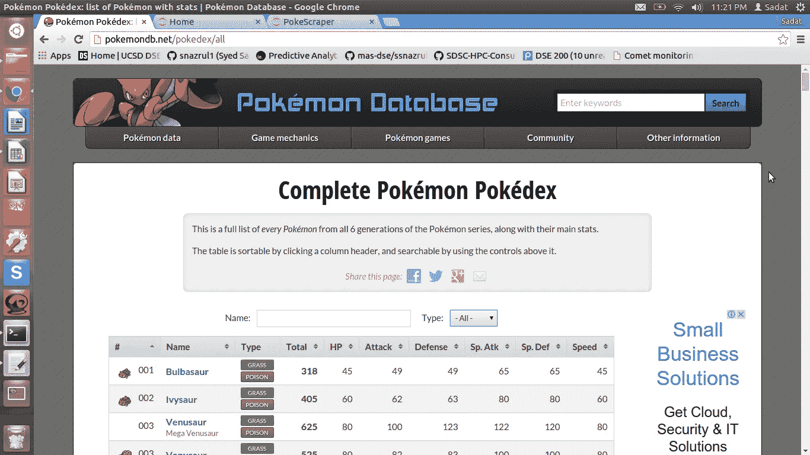
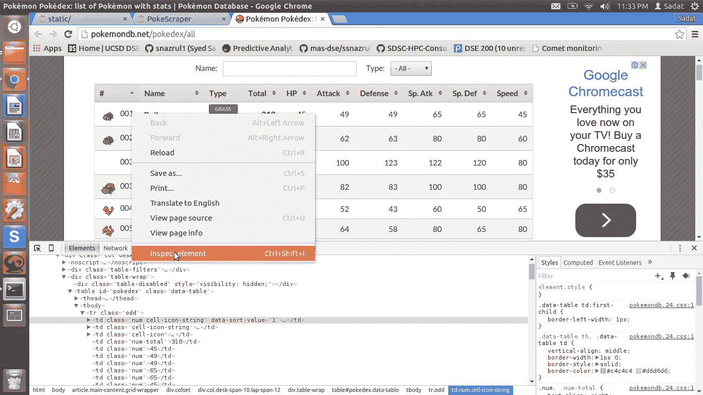
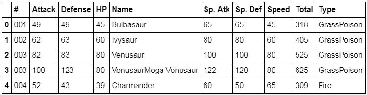

# 用 Python 对 HTML 表格进行 Web 抓取

> 原文：<https://towardsdatascience.com/web-scraping-html-tables-with-python-c9baba21059?source=collection_archive---------0----------------------->



Pokemon Database Website

首先，我们将尝试抓取在线口袋妖怪数据库([http://pokemondb.net/pokedex/all](http://pokemondb.net/pokedex/all))。

# 检查 HTML

在前进之前，我们需要了解我们希望抓取的网站的结构。这可以通过点击 ***来完成，右击我们想要刮的元素，然后点击“检查”*** *。*出于我们的目的，我们将检查表格的元素，如下所示:



Inspecting cell of HTML Table

根据 HTML 代码，数据存储在 **< tr >之后..< /tr >** 。这是行信息。每一行都有一个对应的 **< td >..</TD>/或单元格数据信息。**

# 导入库

我们需要**请求**来获取网站的 HTML 内容，需要**lxml.html**来解析相关字段。最后，我们将把数据存储在熊猫数据帧上。

```
**import** **requests**
**import** **lxml.html** **as** **lh**
**import** **pandas** **as** **pd**
```

# 刮掉表格单元格

下面的代码允许我们获得 HTML 表的 Pokemon 统计数据。

```
url='http://pokemondb.net/pokedex/all'*#Create a handle, page, to handle the contents of the website*
page = requests.get(url)*#Store the contents of the website under doc*
doc = lh.fromstring(page.content)*#Parse data that are stored between <tr>..</tr> of HTML*
tr_elements = doc.xpath('//tr')
```

为了进行健全性检查，请确保所有行都具有相同的宽度。如果没有，我们得到的可能不仅仅是桌子。

```
*#Check the length of the first 12 rows*
[len(T) **for** T **in** tr_elements[:12]]
```

输出:**【10，10，10，10，10，10，10，10，10，10，10，10】**

看起来我们所有的行正好有 10 列。这意味着在 tr_elements 上收集的所有数据都来自这个表。

# 解析表格标题

接下来，让我们将第一行解析为标题。

```
tr_elements = doc.xpath('//tr')*#Create empty list*
col=[]
i=0*#For each row, store each first element (header) and an empty list*
**for** t **in** tr_elements[0]:
    i+=1
    name=t.text_content()
    **print** '**%d**:"**%s**"'%(i,name)
    col.append((name,[]))
```

输出:
**1:“#”
2:“名”
3:“型”
4:“总”
5:“HP”
6:“攻”
7:“防”
8:“Sp。Atk"
9:"Sp。Def"
10:"速度"**

# 创建熊猫数据框架

每个头都和一个空列表一起被附加到一个元组中。

```
*#Since out first row is the header, data is stored on the second row onwards*
**for** j **in** range(1,len(tr_elements)):
    *#T is our j'th row*
    T=tr_elements[j]

    *#If row is not of size 10, the //tr data is not from our table* 
    **if** len(T)!=10:
        **break**

    *#i is the index of our column*
    i=0

    *#Iterate through each element of the row*
    **for** t **in** T.iterchildren():
        data=t.text_content() 
        *#Check if row is empty*
        **if** i>0:
        *#Convert any numerical value to integers*
            **try**:
                data=int(data)
            **except**:
                **pass**
        *#Append the data to the empty list of the i'th column*
        col[i][1].append(data)
        *#Increment i for the next column*
        i+=1
```

为了确保万无一失，让我们检查一下每列的长度。理想情况下，它们应该都相同。

```
[len(C) **for** (title,C) **in** col]
```

输出:**【800，800，800，800，800，800，800，800，800，800】**

完美！这表明我们的 10 列中的每一列正好有 800 个值。

现在，我们准备创建数据帧:

```
Dict={title:column **for** (title,column) **in** col}
df=pd.DataFrame(Dict)
```

查看数据框中的前 5 个单元格:

```
df.head()
```



你有它！现在你有了一个包含所有需要信息的熊猫数据框架！

# 附加说明

本教程是 3 部分系列的子集:

该系列包括:

*   抓取口袋妖怪网站
*   数据分析
*   构建 GUI Pokedex