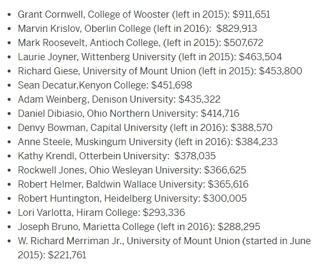
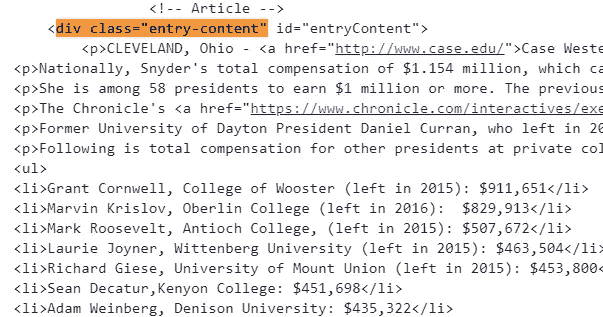
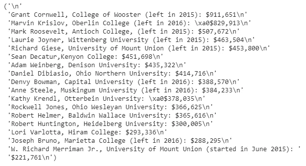
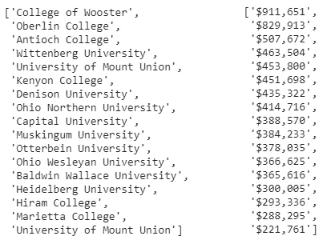
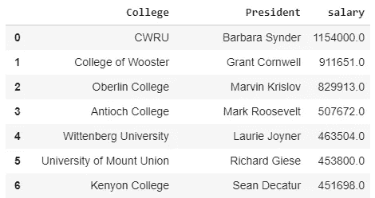
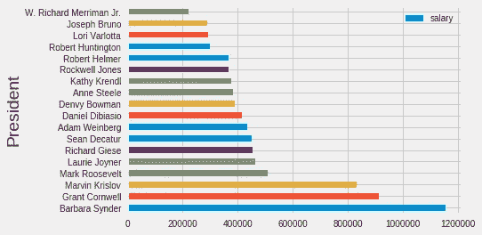
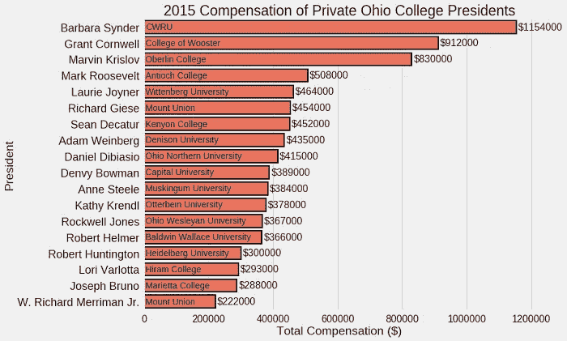
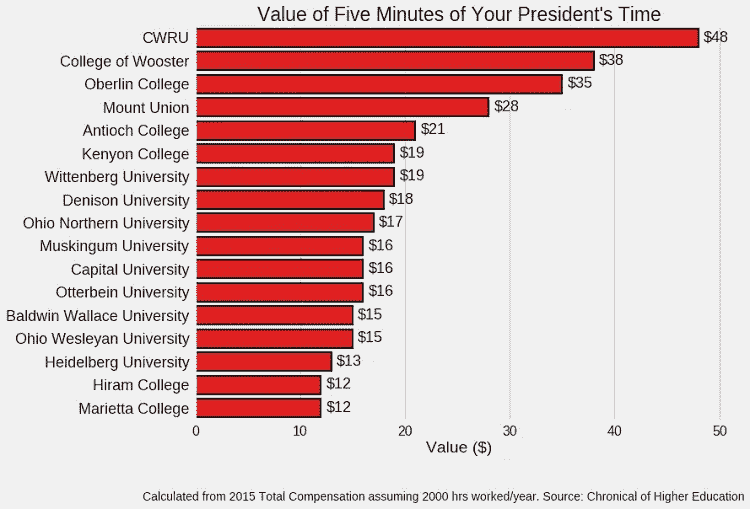

# Web 抓取、正则表达式和数据可视化:全部用 Python 完成

> 原文：<https://towardsdatascience.com/web-scraping-regular-expressions-and-data-visualization-doing-it-all-in-python-37a1aade7924?source=collection_archive---------1----------------------->


## 一个学习三种无价数据科学技能的小型真实项目

与大多数有趣的项目一样，这个项目以一个简单的问题开始，这个问题被半认真地问了一遍:我为我的大学校长的五分钟时间支付多少学费？在与我们学校的校长( [CWRU](https://en.wikipedia.org/wiki/Case_Western_Reserve_University) )进行了一次偶然而愉快的讨论后，我想知道我的谈话到底花了我多少钱。

我的搜索导致了[这篇文章](http://www.cleveland.com/metro/index.ssf/2017/12/case_western_reserve_university_president_barbara_snyders_base_salary_and_bonus_pay_tops_among_private_colleges_in_ohio.html)，它和我的校长的薪水一起，有一张显示俄亥俄州私立大学校长薪水的表格:



虽然我可以为我的总统找到答案(剧透一下，是 48 美元/五分钟)，并且感到满意，但我想利用这张桌子进一步推广这个想法。我一直在寻找机会练习 Python 中的[网页抓取](https://en.wikipedia.org/wiki/Web_scraping)和[正则表达式](https://www.regular-expressions.info/tutorial.html)，并认为这是一个很棒的短期项目。

尽管在 Excel 中手动输入数据几乎肯定会更快，但我不会有宝贵的机会来练习一些技能！数据科学是关于使用各种工具解决问题的，web 抓取和正则表达式是我需要努力的两个领域(更不用说制作图表总是很有趣)。结果是一个非常短但完整的项目，展示了我们如何将这三种技术结合起来解决数据科学问题。

这个项目的完整代码可以在谷歌联合实验室的 Jupyter 笔记本上获得(这是我正在尝试的一项新服务，你可以在云端分享和合作 Jupyter 笔记本。感觉是未来！)要编辑笔记本，在 Colaboratory 中打开它，选择文件>在驱动器中保存一份副本，然后您可以进行任何更改并运行笔记本。

# 网页抓取

虽然课堂和教科书中使用的大多数数据看起来都是现成的，格式简洁，但实际上，世界并没有这么美好。获取数据通常意味着弄脏我们的手，在这种情况下，从网上提取(也称为抓取)数据。Python 有很好的工具来完成这项工作，即用于从网页中检索内容的`requests`库，以及用于提取相关信息的`bs4` (BeautifulSoup)。

这两个库通常以下列方式一起使用:首先，我们向网站发出 GET 请求。然后，我们从返回的内容中创建一个漂亮的 Soup 对象，并使用几种方法解析它。

```
# requests for fetching html of website
import requests# Make the GET request to a url
r = requests.get('[http://www.cleveland.com/metro/index.ssf/2017/12/case_western_reserve_university_president_barbara_snyders_base_salary_and_bonus_pay_tops_among_private_colleges_in_ohio.html'](http://www.cleveland.com/metro/index.ssf/2017/12/case_western_reserve_university_president_barbara_snyders_base_salary_and_bonus_pay_tops_among_private_colleges_in_ohio.html'))# Extract the content
c = r.contentfrom bs4 import BeautifulSoup# Create a soup object
soup = BeautifulSoup(c)
```

由此产生的汤对象相当吓人:



我们的数据就在那里的某个地方，但我们需要提取它。为了从汤里选择我们的桌子，我们需要找到正确的 [CSS 选择器](https://www.w3schools.com/cssref/css_selectors.asp)。一种方法是访问网页并检查元素。在这种情况下，我们也可以只查看 soup，并看到我们的表驻留在带有属性`class = "entry-content"`的`<div>` HTML 标签下。使用这些信息和我们的 soup 对象的`.find`方法，我们可以提取文章的主要内容。

```
# Find the element on the webpage
main_content = soup.find('div', attrs = {'class': 'entry-content'})
```

这将返回另一个不够具体的 soup 对象。要选择表格，我们需要找到`<ul>`标签(见上图)。我们还想只处理表中的文本，所以我们使用了 soup 的`.text`属性。

```
# Extract the relevant information as text
content = main_content.find('ul').text
```



我们现在有了字符串形式的表的确切文本，但显然它对我们没有多大用处！为了提取文本字符串的特定部分，我们需要使用正则表达式。这篇文章我没有篇幅(也没有经验！)来完整解释正则表达式，所以这里我只做一个简单的概述，并展示结果。我自己也还在学习，我发现变得更好的唯一方法就是练习。请随意查看本笔记本[进行一些练习，并查看 Python `re`](https://colab.research.google.com/drive/1zjMHPv3H7mV5iLWapiW9IF2yUoY2Jggg) [文档](https://docs.python.org/3/library/re.html)开始(文档通常很枯燥，但*非常*有用)。

# 正则表达式

正则表达式的基本思想是我们定义一个模式(“正则表达式”或“regex”)，我们希望在一个文本字符串中进行匹配，然后在字符串中搜索以返回匹配。其中一些模式看起来非常奇怪，因为它们既包含我们想要匹配的内容，也包含改变模式解释方式的特殊字符。正则表达式在解析字符串信息时总是出现，并且是至少在基础水平上学习的重要工具！

我们需要从文本表中提取 3 条信息:

1.  总统的名字
2.  学院的名称
3.  薪水

首先是名字。在这个正则表达式中，我利用了这样一个事实，即每个名字都位于一行的开头，以逗号结尾。下面的代码创建一个正则表达式模式，然后在字符串中搜索以找到该模式的所有匹配项:

```
# Create a pattern to match names
name_pattern = re.compile(r'^([A-Z]{1}.+?)(?:,)', flags = re.M)# Find all occurrences of the pattern
names = name_pattern.findall(content)
```


就像我说的，这个模式非常复杂，但是它确实是我们想要的！不要担心模式的细节，只需要考虑大致的过程:首先定义一个模式，然后搜索一个字符串来找到模式。

我们对大学和薪水重复这个过程:

```
# Make school patttern and extract schools
school_pattern = re.compile(r'(?:,|,\s)([A-Z]{1}.*?)(?:\s\(|:|,)')
schools = school_pattern.findall(content)# Pattern to match the salaries
salary_pattern = re.compile(r'\$.+')
salaries = salary_pattern.findall(content)
```



不幸的是，薪水的格式是任何计算机都无法理解的数字。幸运的是，这给了我们一个练习使用 Python [列表理解](http://www.pythonforbeginners.com/basics/list-comprehensions-in-python)将字符串 salaries 转换成数字的机会。下面的代码说明了如何使用字符串切片、`split`和`join`，所有这些都在一个列表理解中，以获得我们想要的结果:

```
# Messy salaries
salaries = ['$876,001', '$543,903', '$2453,896']# Convert salaries to numbers in a list comprehension 
[int(''.join(s[1:].split(','))) for s in salaries] **[876001, 543903, 2453896]**
```

我们将这种转换应用到我们的工资中，最终得到我们想要的所有信息。让我们把一切都放进一个`pandas`数据框架。此时，我手动插入了我的大学(CWRU)的信息，因为它不在主表中。重要的是要知道什么时候手工做事情比编写复杂的程序更有效(尽管整篇文章有点违背这一点！).



Subset of Dataframe

# 形象化

这个项目是数据科学的象征，因为大部分时间都花在了收集和格式化数据上。然而，现在我们有了一个干净的数据集，我们可以画一些图了！我们可以使用`matplotlib`和`seaborn`来可视化数据。

如果我们不太关心美观，我们可以使用内置的数据帧绘图方法来快速显示结果:

```
# Make a horizontal bar chart
df.plot(kind='barh', x = 'President', y = 'salary')
```



Default plot using dataframe plotting method

为了得到更好的情节，我们必须做一些工作。像正则表达式一样，用 Python 绘制代码可能有点复杂，需要一些实践来适应。大多数情况下，我通过在 Stack Overflow 等网站上寻找答案或者阅读官方文档来学习。

经过一点工作，我们得到了下面的情节(详情见笔记本):



Better Plot using seaborn

好多了，但是这还是没有回答我原来的问题！为了显示学生为他们校长的 5 分钟时间支付了多少钱，我们可以将工资转换成美元/5 分钟，假设每年工作 2000 小时。



Final Figure

这不一定是值得出版的情节，但这是结束一个小项目的好方法。

# 结论

学习技能最有效的方法是实践。虽然整个项目可以通过手动将值插入 Excel 来完成，但我喜欢从长计议，思考在这里学到的技能如何在未来有所帮助。学习的过程比最终结果更重要，在这个项目中，我们能够看到如何将 3 项关键技能用于数据科学:

1.  Web 抓取:检索在线数据
2.  正则表达式:解析我们的数据以提取信息
3.  可视化:展示我们所有的辛勤工作

现在，走出去，开始你自己的项目，记住:不一定要改变世界才有价值。

我欢迎反馈和讨论，可以通过 Twitter [@koehrsen_will](https://twitter.com/koehrsen_will) 联系。