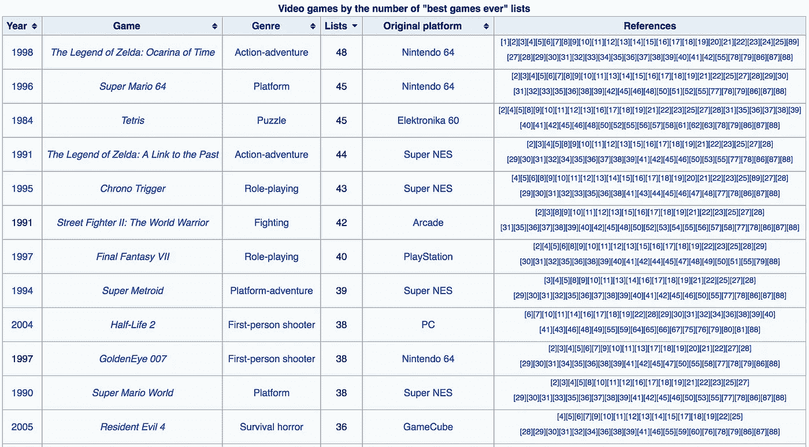

# 从维基百科上抓取最棒的视频游戏列表

> 原文：<https://towardsdatascience.com/web-scraping-the-list-of-greatest-video-games-from-wikipedia-pt-1-230c64d93e8c?source=collection_archive---------3----------------------->

嗨，欢迎来到我的博客。

博客和数据科学(以及两者的结合)是我生活中相对较新的尝试，但伟大的事情往往来自卑微的开始。

在我学习 python 及其相关库的短暂时间里，我已经被自己学到的东西震惊了。为了努力工作并展示我不断发展的技能，我希望我的每一篇博文都可以作为我不断进步的标志。

撇开序言不谈，让我们进入这篇文章的实质内容。

作为对自己的最初挑战，我想尝试使用 python 进行 web 抓取，从网页中提取数据，并以一种允许进一步检查和可视化的方式对其进行格式化。维基百科似乎非常适合这项任务，因为它非常容易访问，并且包含大量有趣的数据。

作为一个终生的电子游戏迷，我认为看看这个被认为是有史以来最好的电子游戏列表会很有趣。我正在研究的表格根据“有史以来最好的游戏”名单中的提及次数对视频游戏进行排序。

该表列出了 1978 年至 2013 年间发布的 100 款不同游戏，结构如下:



# 宝宝的第一次刮网

接近网络抓取时，我发现[这个来自分析网站 Vidhya 的指南](https://www.analyticsvidhya.com/blog/2015/10/beginner-guide-web-scraping-beautiful-soup-python/)非常有价值。我鼓励任何第一次接触网络搜索的人使用这个资源来收集他们的方位。

在 python 中，我使用了两个 python 库:Urllib2 和 BeautifulSoup。

[Urllib2](https://docs.python.org/2/library/urllib2.html) 帮助 python 获取 URL，而 [BeautifulSoup](https://www.crummy.com/software/BeautifulSoup/bs4/doc/) 使用 HTML 和 XML 文件从网页中提取信息。

随着分析 Vidhya 指南的编码，我能够利用以下代码检索网页的 HTML 数据:

```
#import library to query webpage of interest
import urllib2#specifying page of interest
wiki = “[https://en.wikipedia.org/wiki/List_of_video_games_considered_the_best](https://en.wikipedia.org/wiki/List_of_video_games_considered_the_best)"#save the HTML of the site within the page variable
page = urllib2.urlopen(wiki)#import library to parse HTML from page
from bs4 import BeautifulSoup#parse data from "page" and save to new variable "soup"
soup = BeautifulSoup(page)
```

该指南提供了一些额外的演示，说明如何检查 HTML 的结构，以及如何使用各种 HTML 标签从“soup”文件中返回感兴趣的信息。出于本文的目的，我不会深入讨论这个问题，但它有助于更好地理解如何阅读上述步骤的 HTML 输出。

为了从感兴趣的页面中提取适当的表数据，我需要确定表“class”。在 Chrome 浏览器中，我通过(右键单击-> inspect)检查了我感兴趣的表，并确定该表属于“wikitable sortable”类型。页面本身特别将其标注为“wikitable sortable jquery-table sorter”，但是，soup 文件只将其识别为“wiki table sortable”在对这个次要组件进行故障排除之后，我能够以下面的方式提取表信息:

```
#pinpointing the location of the table and its contents
first_table = soup.find(“table”, class_ = “wikitable sortable”)#creating lists for each of the columns I know to be in my table.
A=[]
B=[]
C=[]
D=[]
E=[]
F=[]#utilizing HTML tags for rows <tr> and elements <td> to iterate through each row of data and append data elements to their appropriate lists:for row in first_table.findAll(“tr”):
    cells = row.findAll(‘td’)
    if len(cells)==6: #Only extract table body not heading
        A.append(cells[0].find(text=True))
        B.append(cells[1].find(text=True))
        C.append(cells[2].find(text=True))
        D.append(cells[3].find(text=True))
        E.append(cells[4].find(text=True))
        F.append(cells[5].find(text=True))
```

当我检查输出时，我注意到数据是 unicode 格式的，这使得对其执行操作变得更加复杂。由于堆栈溢出，我利用列表理解将所有值从 unicode 转换为简单的 python 字符串值:

```
#convert all values from unicode to string
A = [x.encode(‘UTF8’) for x in A]
B = [x.encode(‘UTF8’) for x in B]
C = [x.encode(‘UTF8’) for x in C]
D = [x.encode(‘UTF8’) for x in D]
E = [x.encode(‘UTF8’) for x in E]
F = [x.encode(‘UTF8’) for x in F]
```

最后，我导入了 pandas，并将每个数据列表连接到一个数据框架中。这样做的时候，我指定了出现在维基百科页面上的列名:

```
#import pandas to convert list to data frame
import pandas as pd
df=pd.DataFrame(A,columns=[‘Year’])
df[‘Game’]=B
df[‘Genre’]=C
df[‘Lists’]=D
df[‘Original Platform’]=E
df[‘References’]=F
```

万岁。打印 dataframe 得到了以下输出。我没有拿出所有的参考信息，但这在我的后续检查中不需要。


要了解我是如何用 Tableau Public 可视化这些数据的，请查看我的另一篇博文。感谢阅读！