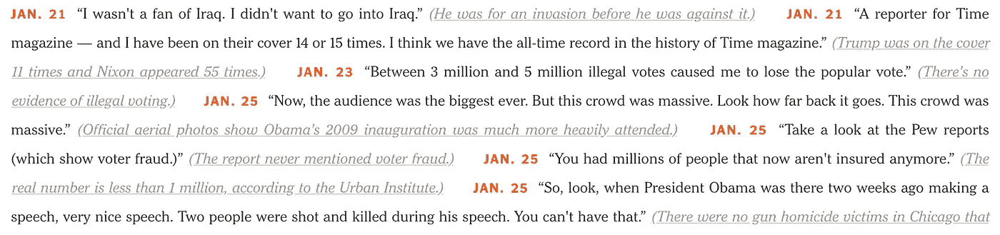

# R 中的网页抓取教程

> 原文：<https://towardsdatascience.com/web-scraping-tutorial-in-r-5e71fd107f32?source=collection_archive---------4----------------------->

几天前，[数据学校](http://www.dataschool.io/)的[凯文·马卡姆](https://twitter.com/justmarkham?lang=en)发表了一篇很好的[教程](http://www.dataschool.io/python-web-scraping-of-president-trumps-lies/)，讲述了使用 16 行 Python 代码进行网络抓取的方法。

 [## 网络抓取总统的 16 行 Python 谎言

### 注意:本教程以 Jupyter 笔记本的形式提供，谎言的数据集以 CSV 文件的形式提供，两者都…

www.dataschool.io](http://www.dataschool.io/python-web-scraping-of-president-trumps-lies/) 

教程很简单，制作精良。我强烈建议你看一看。事实上，这样的教程激励我复制结果，但这次使用 r。在 Kevin 的允许下，我将使用与他的博客帖子相似的布局。此外，我将使用同一个网站发表一篇名为[特朗普的谎言](https://www.nytimes.com/interactive/2017/06/23/opinion/trumps-lies.html)的观点文章。这将有助于对这两种方法进行比较。

# 检查纽约时报的文章

为了更好地描述我们将要学习的文章，我鼓励你看看 Kevin 的教程[。总之，我们感兴趣的数据由一个谎言记录组成，每个谎言包含 4 个部分:](http://www.dataschool.io/python-web-scraping-of-president-trumps-lies/)

*   谎言的日期
*   谎言本身
*   解释为什么这是一个谎言
*   支持解释的文章的 URL(嵌入在文本中)

The data that we want to extract from the web page.

# 将网页读入 R

要将网页读入 R，我们可以使用 R 大师 Hadley Wickham 制作的包。这个包的灵感来自于像 [Beautiful Soup](https://www.crummy.com/software/BeautifulSoup/) 这样的库，使得从 html 网页中抓取数据变得容易。要使用的第一个重要函数是`read_html()`，它返回一个包含关于网页的所有信息的 [XML](https://en.wikipedia.org/wiki/XML) 文档。

# 收集所有的记录

正如 Kevin 的教程中所解释的那样，每条记录在 HTML 代码中具有以下结构:

`<strong> DATE </strong> LIE <a href="URL"> EXPLANATION </a>`

因此，要收集所有的谎言，我们需要识别所有属于`class="short-desc"`的``标签。将帮助我们这样做的功能是`html_nodes()`。这个函数需要我们已经阅读过的 XML 文档和我们想要选择的节点。对于后者，我们鼓励使用 [SelectorGadget](http://selectorgadget.com/) ，这是一个开源工具，可以轻松地生成和发现 CSS 选择器。使用这样一个工具，我们发现所有的谎言都可以通过使用选择器`".short-desc"`来选择。

这将返回一个包含 116 个 XML 节点的列表，其中包含了网页中 116 个谎言的信息。

请注意，我使用的是 magritter[包中的`%>%`管道操作符，它可以帮助将复杂的操作表达为由简单、容易理解的部分组成的优雅管道。](http://magrittr.tidyverse.org/)

# 提取日期

让我们从简单的开始，专注于从第一个谎言中提取所有必要的细节。然后，我们可以很容易地将这种方法推广到其他领域。请记住，单个记录的一般结构是:

`<strong> **DATE** </strong> **LIE** <a href="**URL**"> **EXPLANATION** </a>`

注意，日期嵌入在`<strong>`标签中。要选择它，我们可以使用选择器`"strong"`使用`html_nodes()`功能。

然后我们需要使用`html_text()`函数只提取文本，trim 参数被激活来修剪前导和尾随空格。最后，我们利用 [stringr](http://stringr.tidyverse.org/) 包将年份添加到提取的日期中。

# 提取谎言

为了选择 lie，我们需要使用 xml2 包中的`xml_contents()`函数(这个包是 rvest 包所需要的，所以没有必要加载它)。该函数返回一个包含属于`first_result`的节点的列表。

我们感兴趣的是谎言，它是第二个节点的文本。

请注意，谎言周围多了一对引号(“…”)。为了去掉它们，我们只需使用 stringr 包中的`str_sub()`函数来选择谎言。

# 提取解释

希望现在不要太复杂，我们只需要选择属于`class=".short-truth"`的``标签中的文本就可以提取解释。这将把文本连同左括号和右括号一起提取出来，但是我们可以很容易地去掉它们。

# 正在提取 URL

最后，要获取 URL，请注意这是`<a>`标签中的一个属性。我们简单地用`html_nodes()`函数选择这个节点，然后用`html_attr()`函数选择`href`属性。

# 构建数据集

我们找到了提取第一条记录的 4 个部分的方法。我们可以使用 for 循环将这个过程扩展到所有其他地方。最后，我们想要一个有 116 行(每条记录一行)和 4 列(保存日期、谎言、解释和 URL)的数据框。一种方法是创建一个空数据框，并在处理每个新记录时简单地添加一个新行。但是，这被认为不是一个好的做法。正如这里建议的，我们将为每条记录创建一个单独的数据帧，并将它们全部存储在一个列表中。一旦我们有了 116 个数据帧，我们将使用 [dplyr](http://dplyr.tidyverse.org/) 包中的`bind_rows()`函数将它们绑定在一起。这就创建了我们想要的数据集。

注意，日期列被认为是一个字符向量。如果把它作为日期时间向量就更好了。为此，我们可以使用 [lubridate](http://lubridate.tidyverse.org/) 包并使用`mdy()`函数(月-日-年)进行转换。

# 将数据集导出到 CSV 文件

如果想导出数据集，可以使用 R 默认自带的`write.csv()`函数，或者使用 [readr](http://readr.tidyverse.org/) 包中的`write_csv()`函数，这比第一个函数快两倍，也更方便。

类似地，要检索数据集，可以使用默认函数`read.csv()`或 [readr](http://readr.tidyverse.org/) 包中的`read_csv()`函数。

# 摘要

本教程的完整代码如下所示:

我还想提一下，stringr、dplyr、lubridate 和 readr 包都是 [tidyverse](http://tidyverse.org/) 家族的一部分。这是一个 R 包的集合，它们被设计成一起工作来使[数据分析过程](http://r4ds.had.co.nz/introduction.html#what-you-will-learn)更容易。事实上，你也可以使用流行的 [purrr](http://purrr.tidyverse.org/) 包来避免 for 循环。但是，这需要创建一个函数，将每个记录映射到一个数据框。关于如何进行网络抓取的另一个例子，请看迪安·阿塔利写的这篇很棒的[博客文章](http://deanattali.com/blog/user2017/)。

希望你觉得这个教程有用。它的目的不是展示哪种编程语言更好，而是向 Python 和 R 学习，以及增加您的编程技能和工具来处理更多样化的问题。